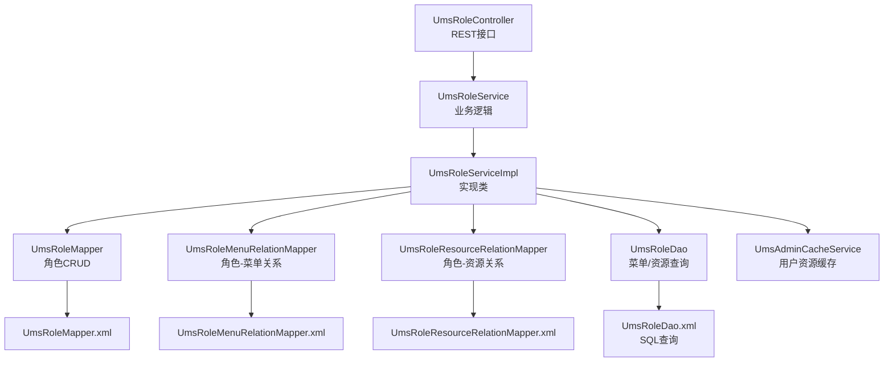
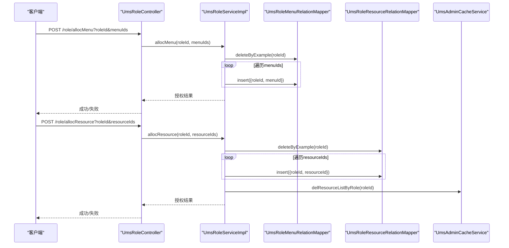
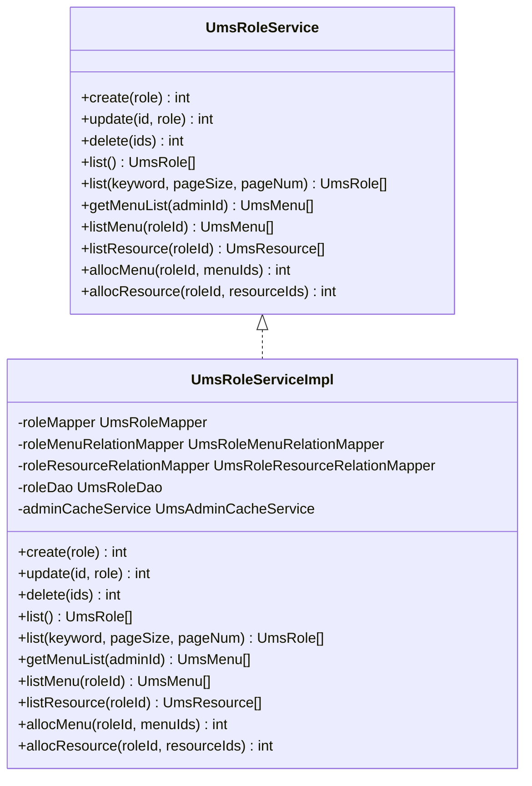
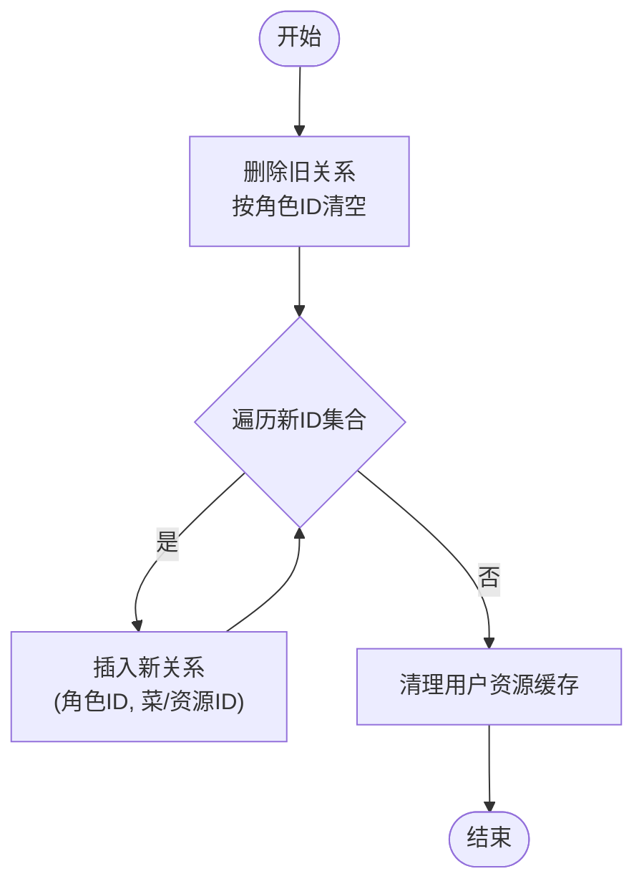
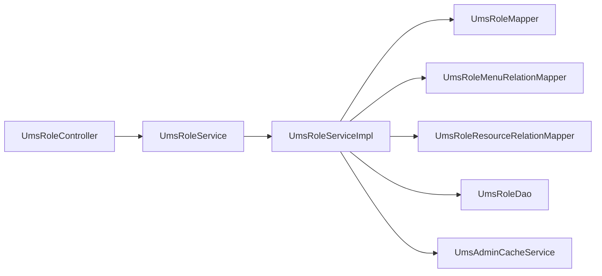

# 角色管理

<cite>
**本文引用的文件**
- [UmsRoleController.java](file://mall-admin/src/main/java/com/macro/mall/controller/UmsRoleController.java)
- [UmsRoleService.java](file://mall-admin/src/main/java/com/macro/mall/service/UmsRoleService.java)
- [UmsRoleServiceImpl.java](file://mall-admin/src/main/java/com/macro/mall/service/impl/UmsRoleServiceImpl.java)
- [UmsRoleDao.java](file://mall-admin/src/main/java/com/macro/mall/dao/UmsRoleDao.java)
- [UmsAdminCacheService.java](file://mall-admin/src/main/java/com/macro/mall/service/UmsAdminCacheService.java)
- [UmsRole.java](file://mall-mbg/src/main/java/com/macro/mall/model/UmsRole.java)
- [UmsMenu.java](file://mall-mbg/src/main/java/com/macro/mall/model/UmsMenu.java)
- [UmsResource.java](file://mall-mbg/src/main/java/com/macro/mall/model/UmsResource.java)
- [UmsRoleMapper.java](file://mall-mbg/src/main/java/com/macro/mall/mapper/UmsRoleMapper.java)
- [UmsRoleMapper.xml](file://mall-mbg/src/main/resources/com/macro/mall/mapper/UmsRoleMapper.xml)
- [UmsRoleMenuRelationMapper.java](file://mall-mbg/src/main/java/com/macro/mall/mapper/UmsRoleMenuRelationMapper.java)
- [UmsRoleMenuRelationMapper.xml](file://mall-mbg/src/main/resources/com/macro/mall/mapper/UmsRoleMenuRelationMapper.xml)
- [UmsRoleResourceRelationMapper.java](file://mall-mbg/src/main/java/com/macro/mall/mapper/UmsRoleResourceRelationMapper.java)
- [UmsRoleResourceRelationMapper.xml](file://mall-mbg/src/main/resources/com/macro/mall/mapper/UmsRoleResourceRelationMapper.xml)
- [UmsRoleDao.xml](file://mall-admin/src/main/resources/dao/UmsRoleDao.xml)
- [mall.sql](file://document/sql/mall.sql)
</cite>

## 目录
1. [简介](#简介)
2. [项目结构](#项目结构)
3. [核心组件](#核心组件)
4. [架构总览](#架构总览)
5. [详细组件分析](#详细组件分析)
6. [依赖分析](#依赖分析)
7. [性能考虑](#性能考虑)
8. [故障排查指南](#故障排查指南)
9. [结论](#结论)
10. [附录](#附录)

## 简介
本章节概述角色管理模块的目标与范围，明确其在后台管理系统中的定位与职责。该模块围绕“角色”这一核心实体，提供角色的增删改查、状态管理、菜单与资源授权、以及与用户的关系维护能力。通过清晰的接口设计与事务性授权流程，确保权限分配的准确性与一致性。

## 项目结构
角色管理模块主要由以下层次构成：
- 控制器层：对外暴露REST接口，负责请求参数解析与响应封装
- 服务层：编排业务逻辑，处理角色生命周期与授权关系变更
- 数据访问层：DAO接口与MyBatis XML映射，提供菜单/资源查询与授权关系读写
- 模型层：领域模型与Mapper映射文件，定义角色、菜单、资源及其关系表结构
- 缓存层：角色变更触发用户资源缓存失效，保证鉴权结果一致性

图表来源
- [UmsRoleController.java:1-112](file://mall-admin/src/main/java/com/macro/mall/controller/UmsRoleController.java#L1-L112)
- [UmsRoleService.java:1-67](file://mall-admin/src/main/java/com/macro/mall/service/UmsRoleService.java#L1-L67)
- [UmsRoleServiceImpl.java:1-120](file://mall-admin/src/main/java/com/macro/mall/service/impl/UmsRoleServiceImpl.java#L1-L120)
- [UmsRoleDao.java:1-27](file://mall-admin/src/main/java/com/macro/mall/dao/UmsRoleDao.java#L1-L27)
- [UmsAdminCacheService.java:1-58](file://mall-admin/src/main/java/com/macro/mall/service/UmsAdminCacheService.java#L1-L58)
- [UmsRoleMapper.xml:1-243](file://mall-mbg/src/main/resources/com/macro/mall/mapper/UmsRoleMapper.xml#L1-L243)
- [UmsRoleMenuRelationMapper.xml:1-179](file://mall-mbg/src/main/resources/com/macro/mall/mapper/UmsRoleMenuRelationMapper.xml#L1-L179)
- [UmsRoleResourceRelationMapper.xml:1-179](file://mall-mbg/src/main/resources/com/macro/mall/mapper/UmsRoleResourceRelationMapper.xml#L1-L179)
- [UmsRoleDao.xml:1-64](file://mall-admin/src/main/resources/dao/UmsRoleDao.xml#L1-L64)

章节来源
- [UmsRoleController.java:1-112](file://mall-admin/src/main/java/com/macro/mall/controller/UmsRoleController.java#L1-L112)
- [UmsRoleService.java:1-67](file://mall-admin/src/main/java/com/macro/mall/service/UmsRoleService.java#L1-L67)
- [UmsRoleServiceImpl.java:1-120](file://mall-admin/src/main/java/com/macro/mall/service/impl/UmsRoleServiceImpl.java#L1-L120)
- [UmsRoleDao.java:1-27](file://mall-admin/src/main/java/com/macro/mall/dao/UmsRoleDao.java#L1-L27)
- [UmsAdminCacheService.java:1-58](file://mall-admin/src/main/java/com/macro/mall/service/UmsAdminCacheService.java#L1-L58)

## 核心组件
- 控制器：提供角色的创建、更新、删除、分页查询、状态更新、菜单/资源列表查询、菜单/资源授权等接口
- 服务接口与实现：封装角色数据操作、分页检索、菜单/资源授权（事务性替换）、缓存清理
- DAO与XML：提供按管理员或角色维度查询菜单/资源的能力
- 模型与Mapper：定义角色、菜单、资源及授权关系的持久化结构
- 缓存服务：在角色授权变更后清理相关用户资源缓存，确保鉴权一致性

章节来源
- [UmsRoleController.java:21-112](file://mall-admin/src/main/java/com/macro/mall/controller/UmsRoleController.java#L21-L112)
- [UmsRoleService.java:14-66](file://mall-admin/src/main/java/com/macro/mall/service/UmsRoleService.java#L14-L66)
- [UmsRoleServiceImpl.java:22-119](file://mall-admin/src/main/java/com/macro/mall/service/impl/UmsRoleServiceImpl.java#L22-L119)
- [UmsRoleDao.xml:1-64](file://mall-admin/src/main/resources/dao/UmsRoleDao.xml#L1-L64)
- [UmsRoleMapper.xml:1-243](file://mall-mbg/src/main/resources/com/macro/mall/mapper/UmsRoleMapper.xml#L1-L243)

## 架构总览
角色管理采用经典的分层架构，控制器负责HTTP协议与参数绑定，服务层编排业务规则，DAO与Mapper负责数据访问，模型层承载领域对象。授权流程通过事务性地清空旧关系并批量写入新关系，确保一致性。

图表来源
- [UmsRoleController.java:97-109](file://mall-admin/src/main/java/com/macro/mall/controller/UmsRoleController.java#L97-L109)
- [UmsRoleServiceImpl.java:87-119](file://mall-admin/src/main/java/com/macro/mall/service/impl/UmsRoleServiceImpl.java#L87-L119)
- [UmsRoleMenuRelationMapper.xml:100-106](file://mall-mbg/src/main/resources/com/macro/mall/mapper/UmsRoleMenuRelationMapper.xml#L100-L106)
- [UmsRoleResourceRelationMapper.xml:100-106](file://mall-mbg/src/main/resources/com/macro/mall/mapper/UmsRoleResourceRelationMapper.xml#L100-L106)
- [UmsAdminCacheService.java:24-31](file://mall-admin/src/main/java/com/macro/mall/service/UmsAdminCacheService.java#L24-L31)

## 详细组件分析

### 控制器：UmsRoleController
- 职责：暴露REST接口，接收请求参数，调用服务层执行业务，并以统一响应包装返回
- 关键接口
  - 创建角色：POST /role/create
  - 更新角色：POST /role/update/{id}
  - 删除角色：POST /role/delete（支持批量）
  - 查询全部角色：GET /role/listAll
  - 分页查询角色：GET /role/list（支持关键词、页码、每页大小）
  - 更新角色状态：POST /role/updateStatus/{id}
  - 查询角色菜单列表：GET /role/listMenu/{roleId}
  - 查询角色资源列表：GET /role/listResource/{roleId}
  - 授权菜单：POST /role/allocMenu
  - 授权资源：POST /role/allocResource

章节来源
- [UmsRoleController.java:25-109](file://mall-admin/src/main/java/com/macro/mall/controller/UmsRoleController.java#L25-L109)

### 服务接口与实现：UmsRoleService / UmsRoleServiceImpl
- 服务接口定义了角色管理所需的核心方法，包括创建、更新、删除、查询、菜单/资源授权等
- 实现类承担具体业务逻辑
  - 创建角色：设置默认值（创建时间、管理员计数、排序），写入数据库
  - 更新角色：根据主键选择性更新
  - 删除角色：按ID集合删除，同时清理相关用户资源缓存
  - 列表查询：支持关键词模糊匹配与分页
  - 授权菜单/资源：事务性删除旧关系并批量插入新关系，资源授权后清理缓存

图表来源
- [UmsRoleService.java:14-66](file://mall-admin/src/main/java/com/macro/mall/service/UmsRoleService.java#L14-L66)
- [UmsRoleServiceImpl.java:22-119](file://mall-admin/src/main/java/com/macro/mall/service/impl/UmsRoleServiceImpl.java#L22-L119)

章节来源
- [UmsRoleService.java:14-66](file://mall-admin/src/main/java/com/macro/mall/service/UmsRoleService.java#L14-L66)
- [UmsRoleServiceImpl.java:34-119](file://mall-admin/src/main/java/com/macro/mall/service/impl/UmsRoleServiceImpl.java#L34-L119)

### DAO与查询：UmsRoleDao 与 UmsRoleDao.xml
- 提供按管理员ID获取菜单列表、按角色ID获取菜单列表、按角色ID获取资源列表的能力
- SQL通过多表连接查询，确保返回去重后的菜单/资源集合

章节来源
- [UmsRoleDao.java:13-26](file://mall-admin/src/main/java/com/macro/mall/dao/UmsRoleDao.java#L13-L26)
- [UmsRoleDao.xml:5-64](file://mall-admin/src/main/resources/dao/UmsRoleDao.xml#L5-L64)

### 模型与映射：UmsRole、UmsMenu、UmsResource 及关系映射
- 角色模型包含基础属性（名称、描述、创建时间、状态、排序）与派生属性（管理员计数）
- 菜单模型包含层级、排序、可见性等前端渲染相关字段
- 资源模型包含名称、URL、分类等用于动态鉴权的数据
- 关系映射文件定义了角色与菜单、角色与资源的多对多关系表结构

章节来源
- [UmsRole.java:6-21](file://mall-mbg/src/main/java/com/macro/mall/model/UmsRole.java#L6-L21)
- [UmsMenu.java:6-25](file://mall-mbg/src/main/java/com/macro/mall/model/UmsMenu.java#L6-L25)
- [UmsResource.java:6-19](file://mall-mbg/src/main/java/com/macro/mall/model/UmsResource.java#L6-L19)
- [UmsRoleMapper.xml:4-12](file://mall-mbg/src/main/resources/com/macro/mall/mapper/UmsRoleMapper.xml#L4-L12)
- [UmsRoleMenuRelationMapper.xml:4-8](file://mall-mbg/src/main/resources/com/macro/mall/mapper/UmsRoleMenuRelationMapper.xml#L4-L8)
- [UmsRoleResourceRelationMapper.xml:4-8](file://mall-mbg/src/main/resources/com/macro/mall/mapper/UmsRoleResourceRelationMapper.xml#L4-L8)

### 授权流程：菜单与资源授权
- 授权前先删除旧关系，再批量插入新关系，确保授权结果与输入完全一致
- 资源授权完成后，清理该角色相关的用户资源缓存，避免脏读

图表来源
- [UmsRoleServiceImpl.java:87-119](file://mall-admin/src/main/java/com/macro/mall/service/impl/UmsRoleServiceImpl.java#L87-L119)
- [UmsRoleMenuRelationMapper.xml:100-106](file://mall-mbg/src/main/resources/com/macro/mall/mapper/UmsRoleMenuRelationMapper.xml#L100-L106)
- [UmsRoleResourceRelationMapper.xml:100-106](file://mall-mbg/src/main/resources/com/macro/mall/mapper/UmsRoleResourceRelationMapper.xml#L100-L106)
- [UmsAdminCacheService.java:24-31](file://mall-admin/src/main/java/com/macro/mall/service/UmsAdminCacheService.java#L24-L31)

## 依赖分析
- 控制器依赖服务接口，服务实现依赖Mapper与DAO，DAO依赖XML映射
- 授权流程涉及关系表的删除与插入，需保证事务一致性
- 缓存服务在资源授权后被调用，确保用户侧鉴权结果及时刷新

图表来源
- [UmsRoleController.java:22-23](file://mall-admin/src/main/java/com/macro/mall/controller/UmsRoleController.java#L22-L23)
- [UmsRoleService.java:1-13](file://mall-admin/src/main/java/com/macro/mall/service/UmsRoleService.java#L1-L13)
- [UmsRoleServiceImpl.java:24-33](file://mall-admin/src/main/java/com/macro/mall/service/impl/UmsRoleServiceImpl.java#L24-L33)
- [UmsRoleDao.java:1-12](file://mall-admin/src/main/java/com/macro/mall/dao/UmsRoleDao.java#L1-L12)
- [UmsAdminCacheService.java:1-12](file://mall-admin/src/main/java/com/macro/mall/service/UmsAdminCacheService.java#L1-L12)

章节来源
- [UmsRoleController.java:22-23](file://mall-admin/src/main/java/com/macro/mall/controller/UmsRoleController.java#L22-L23)
- [UmsRoleServiceImpl.java:24-33](file://mall-admin/src/main/java/com/macro/mall/service/impl/UmsRoleServiceImpl.java#L24-L33)

## 性能考虑
- 分页查询：服务层使用分页插件进行分页，建议在高并发场景下为角色列表查询添加索引（如名称模糊查询）
- 批量授权：授权流程采用循环插入，建议在资源/菜单ID较多时评估批量插入策略或分批提交，减少事务持续时间
- 缓存一致性：授权后主动清理缓存，避免频繁全量刷新带来的压力

## 故障排查指南
- 授权无效或权限未生效
  - 检查是否正确调用了授权接口（/role/allocMenu 或 /role/allocResource）
  - 确认授权后缓存是否被清理（delResourceListByRole）
- 查询不到菜单或资源
  - 使用 /role/listMenu/{roleId} 与 /role/listResource/{roleId} 核对角色授权情况
  - 检查DAO SQL是否正确返回数据
- 删除角色后仍显示权限
  - 确认删除角色后是否清理了相关用户资源缓存
- 分页查询异常
  - 检查请求参数（keyword、pageSize、pageNum）是否合理
  - 确认数据库中是否存在匹配记录

章节来源
- [UmsRoleServiceImpl.java:53-54](file://mall-admin/src/main/java/com/macro/mall/service/impl/UmsRoleServiceImpl.java#L53-L54)
- [UmsRoleDao.xml:21-63](file://mall-admin/src/main/resources/dao/UmsRoleDao.xml#L21-L63)
- [UmsRoleController.java:83-109](file://mall-admin/src/main/java/com/macro/mall/controller/UmsRoleController.java#L83-L109)

## 结论
角色管理模块通过清晰的分层设计与严格的授权流程，实现了角色的全生命周期管理与权限分配。控制器提供完备的REST接口，服务层保证事务一致性与缓存一致性，DAO与Mapper确保数据访问的灵活性与可扩展性。建议在生产环境中结合索引优化、批量授权策略与缓存治理，进一步提升性能与稳定性。

## 附录

### 角色管理API接口文档
- 创建角色
  - 方法：POST
  - 路径：/role/create
  - 请求体：角色对象（名称、描述等）
  - 返回：通用结果对象
- 更新角色
  - 方法：POST
  - 路径：/role/update/{id}
  - 路径参数：id（角色ID）
  - 请求体：角色对象（部分字段可选）
  - 返回：通用结果对象
- 删除角色
  - 方法：POST
  - 路径：/role/delete
  - 请求参数：ids（角色ID列表）
  - 返回：通用结果对象
- 查询全部角色
  - 方法：GET
  - 路径：/role/listAll
  - 返回：角色列表
- 分页查询角色
  - 方法：GET
  - 路径：/role/list
  - 查询参数：keyword（可选）、pageSize（默认5）、pageNum（默认1）
  - 返回：分页结果对象
- 更新角色状态
  - 方法：POST
  - 路径：/role/updateStatus/{id}
  - 路径参数：id（角色ID）
  - 请求参数：status（状态值）
  - 返回：通用结果对象
- 查询角色菜单列表
  - 方法：GET
  - 路径：/role/listMenu/{roleId}
  - 路径参数：roleId（角色ID）
  - 返回：菜单列表
- 查询角色资源列表
  - 方法：GET
  - 路径：/role/listResource/{roleId}
  - 路径参数：roleId（角色ID）
  - 返回：资源列表
- 授权菜单
  - 方法：POST
  - 路径：/role/allocMenu
  - 请求参数：roleId（角色ID）、menuIds（菜单ID列表）
  - 返回：授权数量
- 授权资源
  - 方法：POST
  - 路径：/role/allocResource
  - 请求参数：roleId（角色ID）、resourceIds（资源ID列表）
  - 返回：授权数量

章节来源
- [UmsRoleController.java:25-109](file://mall-admin/src/main/java/com/macro/mall/controller/UmsRoleController.java#L25-L109)

### 数据模型与表结构
- 角色表（ums_role）
  - 字段：id、name、description、admin_count、create_time、status、sort
  - 示例数据：包含商品管理员、订单管理员、超级管理员等
- 角色-菜单关系表（ums_role_menu_relation）
  - 字段：id、role_id、menu_id
- 角色-资源关系表（ums_role_resource_relation）
  - 字段：id、role_id、resource_id

章节来源
- [mall.sql:3096-3112](file://document/sql/mall.sql#L3096-L3112)
- [UmsRoleMapper.xml:4-12](file://mall-mbg/src/main/resources/com/macro/mall/mapper/UmsRoleMapper.xml#L4-L12)
- [UmsRoleMenuRelationMapper.xml:4-8](file://mall-mbg/src/main/resources/com/macro/mall/mapper/UmsRoleMenuRelationMapper.xml#L4-L8)
- [UmsRoleResourceRelationMapper.xml:4-8](file://mall-mbg/src/main/resources/com/macro/mall/mapper/UmsRoleResourceRelationMapper.xml#L4-L8)