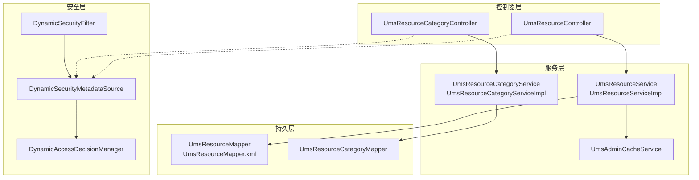
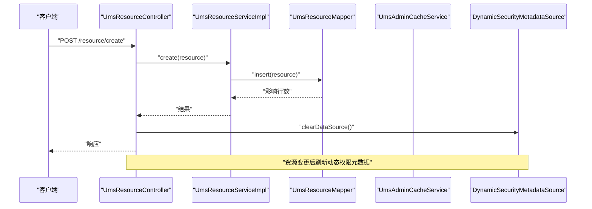
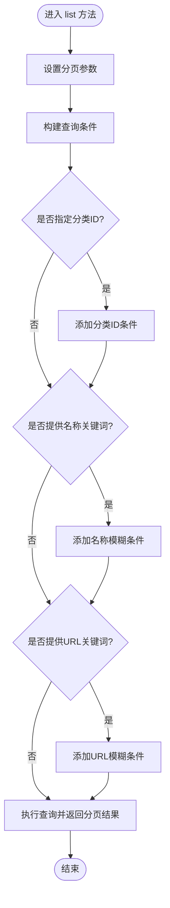
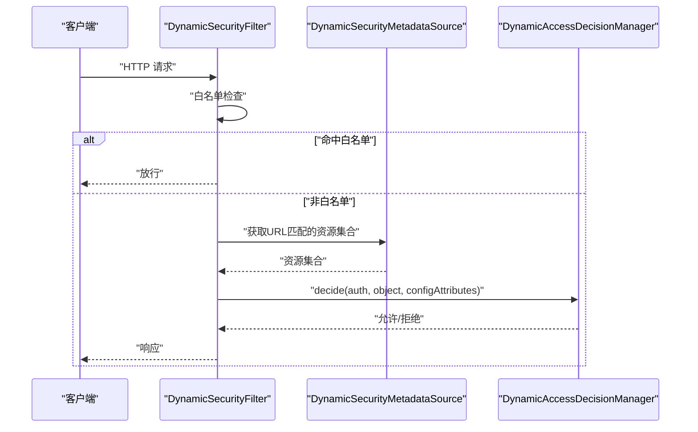
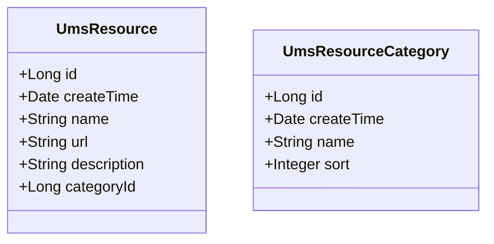
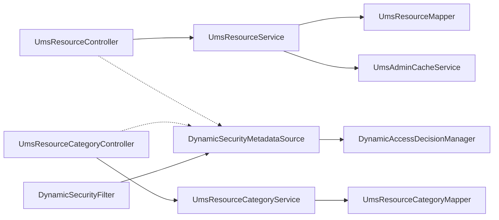

# 资源管理

<cite>
**本文引用的文件**
- [UmsResourceController.java](file://mall-admin/src/main/java/com/macro/mall/controller/UmsResourceController.java)
- [UmsResourceCategoryController.java](file://mall-admin/src/main/java/com/macro/mall/controller/UmsResourceCategoryController.java)
- [UmsResourceService.java](file://mall-admin/src/main/java/com/macro/mall/service/UmsResourceService.java)
- [UmsResourceCategoryService.java](file://mall-admin/src/main/java/com/macro/mall/service/UmsResourceCategoryService.java)
- [UmsResourceServiceImpl.java](file://mall-admin/src/main/java/com/macro/mall/service/impl/UmsResourceServiceImpl.java)
- [UmsResourceCategoryServiceImpl.java](file://mall-admin/src/main/java/com/macro/mall/service/impl/UmsResourceCategoryServiceImpl.java)
- [UmsResource.java](file://mall-mbg/src/main/java/com/macro/mall/model/UmsResource.java)
- [UmsResourceCategory.java](file://mall-mbg/src/main/java/com/macro/mall/model/UmsResourceCategory.java)
- [UmsResourceMapper.java](file://mall-mbg/src/main/java/com/macro/mall/mapper/UmsResourceMapper.java)
- [UmsResourceCategoryMapper.java](file://mall-mbg/src/main/java/com/macro/mall/mapper/UmsResourceCategoryMapper.java)
- [UmsResourceMapper.xml](file://mall-mbg/src/main/resources/com/macro/mall/mapper/UmsResourceMapper.xml)
- [DynamicSecurityMetadataSource.java](file://mall-security/src/main/java/com/macro/mall/security/component/DynamicSecurityMetadataSource.java)
- [DynamicSecurityFilter.java](file://mall-security/src/main/java/com/macro/mall/security/component/DynamicSecurityFilter.java)
- [DynamicAccessDecisionManager.java](file://mall-security/src/main/java/com/macro/mall/security/component/DynamicAccessDecisionManager.java)
- [CommonSecurityConfig.java](file://mall-security/src/main/java/com/macro/mall/security/config/CommonSecurityConfig.java)
- [UmsAdminCacheService.java](file://mall-admin/src/main/java/com/macro/mall/service/UmsAdminCacheService.java)
</cite>

## 目录
1. [简介](#简介)
2. [项目结构](#项目结构)
3. [核心组件](#核心组件)
4. [架构总览](#架构总览)
5. [详细组件分析](#详细组件分析)
6. [依赖分析](#依赖分析)
7. [性能考虑](#性能考虑)
8. [故障排查指南](#故障排查指南)
9. [结论](#结论)
10. [附录：资源管理API接口文档](#附录资源管理api接口文档)

## 简介
本章节概述资源管理模块的目标与范围，涵盖后台资源与资源分类的增删改查、权限控制、URL匹配规则以及与动态权限系统的集成方式。读者可据此快速了解模块职责与使用场景。

## 项目结构
资源管理模块主要由以下层次构成：
- 控制器层：对外暴露REST接口，负责参数接收与响应封装
- 服务层：封装业务逻辑，处理分页查询、关键字检索、缓存清理等
- 持久层：MyBatis Mapper与XML映射，完成数据库读写
- 安全层：动态权限元数据源、过滤器与决策器，实现基于URL的动态授权

图表来源
- [UmsResourceController.java:1-91](file://mall-admin/src/main/java/com/macro/mall/controller/UmsResourceController.java#L1-L91)
- [UmsResourceCategoryController.java:1-65](file://mall-admin/src/main/java/com/macro/mall/controller/UmsResourceCategoryController.java#L1-L65)
- [UmsResourceService.java:1-42](file://mall-admin/src/main/java/com/macro/mall/service/UmsResourceService.java#L1-L42)
- [UmsResourceCategoryService.java:1-33](file://mall-admin/src/main/java/com/macro/mall/service/UmsResourceCategoryService.java#L1-L33)
- [UmsResourceServiceImpl.java:1-74](file://mall-admin/src/main/java/com/macro/mall/service/impl/UmsResourceServiceImpl.java#L1-L74)
- [UmsResourceCategoryServiceImpl.java:1-46](file://mall-admin/src/main/java/com/macro/mall/service/impl/UmsResourceCategoryServiceImpl.java#L1-L46)
- [UmsResourceMapper.java:1-30](file://mall-mbg/src/main/java/com/macro/mall/mapper/UmsResourceMapper.java#L1-L30)
- [UmsResourceMapper.xml:1-226](file://mall-mbg/src/main/resources/com/macro/mall/mapper/UmsResourceMapper.xml#L1-L226)
- [UmsResourceCategoryMapper.java:1-30](file://mall-mbg/src/main/java/com/macro/mall/mapper/UmsResourceCategoryMapper.java#L1-L30)
- [DynamicSecurityMetadataSource.java:1-65](file://mall-security/src/main/java/com/macro/mall/security/component/DynamicSecurityMetadataSource.java#L1-L65)
- [DynamicSecurityFilter.java:1-78](file://mall-security/src/main/java/com/macro/mall/security/component/DynamicSecurityFilter.java#L1-L78)
- [DynamicAccessDecisionManager.java:1-52](file://mall-security/src/main/java/com/macro/mall/security/component/DynamicAccessDecisionManager.java#L1-L52)

章节来源
- [UmsResourceController.java:1-91](file://mall-admin/src/main/java/com/macro/mall/controller/UmsResourceController.java#L1-L91)
- [UmsResourceCategoryController.java:1-65](file://mall-admin/src/main/java/com/macro/mall/controller/UmsResourceCategoryController.java#L1-L65)
- [UmsResourceService.java:1-42](file://mall-admin/src/main/java/com/macro/mall/service/UmsResourceService.java#L1-L42)
- [UmsResourceCategoryService.java:1-33](file://mall-admin/src/main/java/com/macro/mall/service/UmsResourceCategoryService.java#L1-L33)
- [UmsResourceServiceImpl.java:1-74](file://mall-admin/src/main/java/com/macro/mall/service/impl/UmsResourceServiceImpl.java#L1-L74)
- [UmsResourceCategoryServiceImpl.java:1-46](file://mall-admin/src/main/java/com/macro/mall/service/impl/UmsResourceCategoryServiceImpl.java#L1-L46)
- [UmsResourceMapper.java:1-30](file://mall-mbg/src/main/java/com/macro/mall/mapper/UmsResourceMapper.java#L1-L30)
- [UmsResourceMapper.xml:1-226](file://mall-mbg/src/main/resources/com/macro/mall/mapper/UmsResourceMapper.xml#L1-L226)
- [UmsResourceCategoryMapper.java:1-30](file://mall-mbg/src/main/java/com/macro/mall/mapper/UmsResourceCategoryMapper.java#L1-L30)
- [DynamicSecurityMetadataSource.java:1-65](file://mall-security/src/main/java/com/macro/mall/security/component/DynamicSecurityMetadataSource.java#L1-L65)
- [DynamicSecurityFilter.java:1-78](file://mall-security/src/main/java/com/macro/mall/security/component/DynamicSecurityFilter.java#L1-L78)
- [DynamicAccessDecisionManager.java:1-52](file://mall-security/src/main/java/com/macro/mall/security/component/DynamicAccessDecisionManager.java#L1-L52)

## 核心组件
- 资源控制器：提供资源的创建、更新、删除、查询详情、分页查询、全量查询，并在变更后刷新动态权限数据源
- 资源分类控制器：提供资源分类的全量查询、创建、更新、删除
- 资源服务：封装资源的增删改查与分页检索逻辑
- 资源分类服务：封装资源分类的增删改查逻辑
- 动态权限组件：加载URL到资源的映射，支持Ant风格路径匹配，结合决策器实现细粒度授权
- 缓存服务：在资源变更时清理相关用户缓存，保证权限生效一致性

章节来源
- [UmsResourceController.java:29-90](file://mall-admin/src/main/java/com/macro/mall/controller/UmsResourceController.java#L29-L90)
- [UmsResourceCategoryController.java:24-63](file://mall-admin/src/main/java/com/macro/mall/controller/UmsResourceCategoryController.java#L24-L63)
- [UmsResourceService.java:11-41](file://mall-admin/src/main/java/com/macro/mall/service/UmsResourceService.java#L11-L41)
- [UmsResourceCategoryService.java:11-32](file://mall-admin/src/main/java/com/macro/mall/service/UmsResourceCategoryService.java#L11-L32)
- [UmsResourceServiceImpl.java:20-74](file://mall-admin/src/main/java/com/macro/mall/service/impl/UmsResourceServiceImpl.java#L20-L74)
- [UmsResourceCategoryServiceImpl.java:17-46](file://mall-admin/src/main/java/com/macro/mall/service/impl/UmsResourceCategoryServiceImpl.java#L17-L46)
- [DynamicSecurityMetadataSource.java:18-65](file://mall-security/src/main/java/com/macro/mall/security/component/DynamicSecurityMetadataSource.java#L18-L65)
- [DynamicSecurityFilter.java:21-78](file://mall-security/src/main/java/com/macro/mall/security/component/DynamicSecurityFilter.java#L21-L78)
- [DynamicAccessDecisionManager.java:18-52](file://mall-security/src/main/java/com/macro/mall/security/component/DynamicAccessDecisionManager.java#L18-L52)
- [UmsAdminCacheService.java:12-57](file://mall-admin/src/main/java/com/macro/mall/service/UmsAdminCacheService.java#L12-L57)

## 架构总览
资源管理模块通过控制器接收请求，调用服务层执行业务逻辑，服务层通过Mapper访问数据库；同时，资源变更会触发动态权限元数据源的刷新，确保URL级别的权限即时生效。

图表来源
- [UmsResourceController.java:29-39](file://mall-admin/src/main/java/com/macro/mall/controller/UmsResourceController.java#L29-L39)
- [UmsResourceServiceImpl.java:27-30](file://mall-admin/src/main/java/com/macro/mall/service/impl/UmsResourceServiceImpl.java#L27-L30)
- [UmsResourceMapper.java:15-15](file://mall-mbg/src/main/java/com/macro/mall/mapper/UmsResourceMapper.java#L15-L15)
- [UmsAdminCacheService.java:36-36](file://mall-admin/src/main/java/com/macro/mall/service/UmsAdminCacheService.java#L36-L36)
- [DynamicSecurityMetadataSource.java:29-32](file://mall-security/src/main/java/com/macro/mall/security/component/DynamicSecurityMetadataSource.java#L29-L32)

## 详细组件分析

### 资源控制器（UmsResourceController）
- 接口职责
  - 创建资源：接收资源对象，调用服务层保存并刷新动态权限元数据
  - 更新资源：按ID更新资源，清理受影响的用户缓存
  - 查询详情：按ID获取资源
  - 删除资源：按ID删除资源，清理受影响的用户缓存
  - 分页查询：支持按分类ID、名称关键词、URL关键词分页查询
  - 全量查询：返回所有资源列表
- 权限控制
  - 控制器本身不直接做权限校验，而是依赖动态权限过滤链路在请求进入前进行鉴权
- 响应封装
  - 统一使用通用响应包装类型，便于前端统一处理

章节来源
- [UmsResourceController.java:29-90](file://mall-admin/src/main/java/com/macro/mall/controller/UmsResourceController.java#L29-L90)

### 资源分类控制器（UmsResourceCategoryController）
- 接口职责
  - 全量查询：返回排序后的资源分类列表
  - 创建分类：新增资源分类
  - 更新分类：按ID更新资源分类
  - 删除分类：按ID删除资源分类
- 响应封装
  - 统一使用通用响应包装类型

章节来源
- [UmsResourceCategoryController.java:24-63](file://mall-admin/src/main/java/com/macro/mall/controller/UmsResourceCategoryController.java#L24-L63)

### 资源服务层（UmsResourceService 及其实现）
- 业务逻辑
  - 创建：设置创建时间并插入数据库
  - 更新：按ID更新，更新后清理该资源对应的用户缓存
  - 删除：按ID删除，删除后清理该资源对应的用户缓存
  - 列表查询：支持按分类ID、名称关键词、URL关键词组合查询，并分页
  - 全量查询：返回所有资源
- 性能与复杂度
  - 分页查询使用分页插件，避免一次性加载大量数据
  - 关键字查询采用模糊匹配，注意索引与查询性能

图表来源
- [UmsResourceServiceImpl.java:52-67](file://mall-admin/src/main/java/com/macro/mall/service/impl/UmsResourceServiceImpl.java#L52-L67)

章节来源
- [UmsResourceService.java:11-41](file://mall-admin/src/main/java/com/macro/mall/service/UmsResourceService.java#L11-L41)
- [UmsResourceServiceImpl.java:20-74](file://mall-admin/src/main/java/com/macro/mall/service/impl/UmsResourceServiceImpl.java#L20-L74)

### 资源分类服务层（UmsResourceCategoryService 及其实现）
- 业务逻辑
  - 全量查询：按排序字段降序返回
  - 创建：设置创建时间并插入
  - 更新：按ID选择性更新
  - 删除：按ID删除

章节来源
- [UmsResourceCategoryService.java:11-32](file://mall-admin/src/main/java/com/macro/mall/service/UmsResourceCategoryService.java#L11-L32)
- [UmsResourceCategoryServiceImpl.java:17-46](file://mall-admin/src/main/java/com/macro/mall/service/impl/UmsResourceCategoryServiceImpl.java#L17-L46)

### 动态权限系统（动态元数据源、过滤器、决策器）
- 动态元数据源
  - 负责加载URL到资源的映射，支持Ant风格路径匹配
  - 提供清空缓存的方法，配合资源控制器在资源变更后刷新
- 动态过滤器
  - 在请求到达目标控制器前进行拦截
  - 放行预设白名单路径（如OPTIONS请求与忽略URL）
  - 将请求交由决策器进行权限判定
- 决策器
  - 对比请求所需资源与用户拥有的权限，决定是否放行
  - 未配置资源的接口默认放行

图表来源
- [DynamicSecurityFilter.java:38-61](file://mall-security/src/main/java/com/macro/mall/security/component/DynamicSecurityFilter.java#L38-L61)
- [DynamicSecurityMetadataSource.java:34-52](file://mall-security/src/main/java/com/macro/mall/security/component/DynamicSecurityMetadataSource.java#L34-L52)
- [DynamicAccessDecisionManager.java:20-39](file://mall-security/src/main/java/com/macro/mall/security/component/DynamicAccessDecisionManager.java#L20-L39)
- [CommonSecurityConfig.java:49-66](file://mall-security/src/main/java/com/macro/mall/security/config/CommonSecurityConfig.java#L49-L66)

章节来源
- [DynamicSecurityMetadataSource.java:18-65](file://mall-security/src/main/java/com/macro/mall/security/component/DynamicSecurityMetadataSource.java#L18-L65)
- [DynamicSecurityFilter.java:21-78](file://mall-security/src/main/java/com/macro/mall/security/component/DynamicSecurityFilter.java#L21-L78)
- [DynamicAccessDecisionManager.java:18-52](file://mall-security/src/main/java/com/macro/mall/security/component/DynamicAccessDecisionManager.java#L18-L52)
- [CommonSecurityConfig.java:49-66](file://mall-security/src/main/java/com/macro/mall/security/config/CommonSecurityConfig.java#L49-L66)

### 资源模型设计
- 资源实体（UmsResource）
  - 字段：主键、创建时间、名称、URL、描述、分类ID
  - 用途：存储后台可被权限控制的资源项
- 资源分类实体（UmsResourceCategory）
  - 字段：主键、创建时间、名称、排序
  - 用途：对资源进行分组管理

图表来源
- [UmsResource.java:6-85](file://mall-mbg/src/main/java/com/macro/mall/model/UmsResource.java#L6-L85)
- [UmsResourceCategory.java:6-63](file://mall-mbg/src/main/java/com/macro/mall/model/UmsResourceCategory.java#L6-L63)

章节来源
- [UmsResource.java:6-85](file://mall-mbg/src/main/java/com/macro/mall/model/UmsResource.java#L6-L85)
- [UmsResourceCategory.java:6-63](file://mall-mbg/src/main/java/com/macro/mall/model/UmsResourceCategory.java#L6-L63)

### 数据访问层（Mapper与XML）
- 资源Mapper
  - 提供计数、删除、插入、查询、更新等基础方法
- 资源Mapper XML
  - 映射字段与SQL，包含分页查询、条件查询、按主键查询与更新
- 资源分类Mapper
  - 提供与资源分类实体对应的CRUD方法

章节来源
- [UmsResourceMapper.java:8-30](file://mall-mbg/src/main/java/com/macro/mall/mapper/UmsResourceMapper.java#L8-L30)
- [UmsResourceMapper.xml:1-226](file://mall-mbg/src/main/resources/com/macro/mall/mapper/UmsResourceMapper.xml#L1-L226)
- [UmsResourceCategoryMapper.java:8-30](file://mall-mbg/src/main/java/com/macro/mall/mapper/UmsResourceCategoryMapper.java#L8-L30)

## 依赖分析
- 控制器依赖服务接口，服务实现依赖Mapper与缓存服务
- 控制器与分类控制器均通过动态元数据源参与权限控制
- 动态权限组件在安全配置中按需注册

图表来源
- [UmsResourceController.java:24-27](file://mall-admin/src/main/java/com/macro/mall/controller/UmsResourceController.java#L24-L27)
- [UmsResourceCategoryController.java:22-22](file://mall-admin/src/main/java/com/macro/mall/controller/UmsResourceCategoryController.java#L22-L22)
- [UmsResourceService.java:11-41](file://mall-admin/src/main/java/com/macro/mall/service/UmsResourceService.java#L11-L41)
- [UmsResourceCategoryService.java:11-32](file://mall-admin/src/main/java/com/macro/mall/service/UmsResourceCategoryService.java#L11-L32)
- [UmsResourceServiceImpl.java:22-25](file://mall-admin/src/main/java/com/macro/mall/service/impl/UmsResourceServiceImpl.java#L22-L25)
- [UmsResourceCategoryServiceImpl.java:20-20](file://mall-admin/src/main/java/com/macro/mall/service/impl/UmsResourceCategoryServiceImpl.java#L20-L20)
- [DynamicSecurityMetadataSource.java:21-22](file://mall-security/src/main/java/com/macro/mall/security/component/DynamicSecurityMetadataSource.java#L21-L22)
- [DynamicSecurityFilter.java:23-26](file://mall-security/src/main/java/com/macro/mall/security/component/DynamicSecurityFilter.java#L23-L26)
- [DynamicAccessDecisionManager.java:28-33](file://mall-security/src/main/java/com/macro/mall/security/component/DynamicAccessDecisionManager.java#L28-L33)

章节来源
- [UmsResourceController.java:24-27](file://mall-admin/src/main/java/com/macro/mall/controller/UmsResourceController.java#L24-L27)
- [UmsResourceCategoryController.java:22-22](file://mall-admin/src/main/java/com/macro/mall/controller/UmsResourceCategoryController.java#L22-L22)
- [UmsResourceServiceImpl.java:22-25](file://mall-admin/src/main/java/com/macro/mall/service/impl/UmsResourceServiceImpl.java#L22-L25)
- [UmsResourceCategoryServiceImpl.java:20-20](file://mall-admin/src/main/java/com/macro/mall/service/impl/UmsResourceCategoryServiceImpl.java#L20-L20)
- [DynamicSecurityMetadataSource.java:21-22](file://mall-security/src/main/java/com/macro/mall/security/component/DynamicSecurityMetadataSource.java#L21-L22)
- [DynamicSecurityFilter.java:23-26](file://mall-security/src/main/java/com/macro/mall/security/component/DynamicSecurityFilter.java#L23-L26)
- [DynamicAccessDecisionManager.java:28-33](file://mall-security/src/main/java/com/macro/mall/security/component/DynamicAccessDecisionManager.java#L28-L33)

## 性能考虑
- 分页查询：服务层使用分页插件，建议为高频查询字段建立索引以提升分页性能
- 动态权限缓存：元数据源在首次访问时加载，变更后清空缓存并重新加载，避免频繁全量扫描
- 缓存一致性：资源更新/删除后主动清理相关用户缓存，减少脏数据导致的重复鉴权开销
- 过滤器短路：白名单路径直接放行，减少不必要的鉴权流程

## 故障排查指南
- 无法访问资源接口
  - 检查动态权限元数据是否已刷新（资源变更后控制器会调用清空方法）
  - 确认请求路径是否匹配动态权限配置中的Ant模式
  - 核对用户权限是否包含所需资源标识
- 查询结果异常
  - 检查分页参数与关键词是否正确传入
  - 确认数据库中是否存在匹配记录
- 权限生效延迟
  - 确保资源变更后触发了动态元数据源刷新
  - 检查过滤器是否正确注册并生效

章节来源
- [UmsResourceController.java:33-33](file://mall-admin/src/main/java/com/macro/mall/controller/UmsResourceController.java#L33-L33)
- [DynamicSecurityMetadataSource.java:29-32](file://mall-security/src/main/java/com/macro/mall/security/component/DynamicSecurityMetadataSource.java#L29-L32)
- [DynamicSecurityFilter.java:47-53](file://mall-security/src/main/java/com/macro/mall/security/component/DynamicSecurityFilter.java#L47-L53)
- [DynamicAccessDecisionManager.java:20-39](file://mall-security/src/main/java/com/macro/mall/security/component/DynamicAccessDecisionManager.java#L20-L39)

## 结论
资源管理模块通过清晰的分层设计实现了资源与分类的全生命周期管理，并与动态权限系统深度集成，支持基于URL的细粒度权限控制。服务层在查询与缓存方面具备良好的扩展性，配合动态权限的热更新机制，能够满足后台权限治理的需求。

## 附录：资源管理API接口文档

- 资源管理
  - 创建资源
    - 方法：POST
    - 路径：/resource/create
    - 请求体：资源对象（包含名称、URL、描述、分类ID等）
    - 成功：返回受影响行数
    - 权限：受动态权限控制
  - 更新资源
    - 方法：POST
    - 路径：/resource/update/{id}
    - 路径参数：id（资源ID）
    - 请求体：资源对象（部分字段可选）
    - 成功：返回受影响行数
    - 权限：受动态权限控制
  - 获取资源详情
    - 方法：GET
    - 路径：/resource/{id}
    - 路径参数：id（资源ID）
    - 成功：返回资源对象
    - 权限：受动态权限控制
  - 删除资源
    - 方法：POST
    - 路径：/resource/delete/{id}
    - 路径参数：id（资源ID）
    - 成功：返回受影响行数
    - 权限：受动态权限控制
  - 分页查询资源
    - 方法：GET
    - 路径：/resource/list
    - 查询参数：
      - categoryId（可选）：分类ID
      - nameKeyword（可选）：名称关键词
      - urlKeyword（可选）：URL关键词
      - pageSize（可选，默认5）：每页条数
      - pageNum（可选，默认1）：页码
    - 成功：返回分页结果
    - 权限：受动态权限控制
  - 查询全部资源
    - 方法：GET
    - 路径：/resource/listAll
    - 成功：返回资源列表
    - 权限：受动态权限控制

- 资源分类管理
  - 查询全部分类
    - 方法：GET
    - 路径：/resourceCategory/listAll
    - 成功：返回分类列表（按排序降序）
    - 权限：受动态权限控制
  - 创建分类
    - 方法：POST
    - 路径：/resourceCategory/create
    - 请求体：分类对象（包含名称、排序等）
    - 成功：返回受影响行数
    - 权限：受动态权限控制
  - 更新分类
    - 方法：POST
    - 路径：/resourceCategory/update/{id}
    - 路径参数：id（分类ID）
    - 请求体：分类对象（部分字段可选）
    - 成功：返回受影响行数
    - 权限：受动态权限控制
  - 删除分类
    - 方法：POST
    - 路径：/resourceCategory/delete/{id}
    - 路径参数：id（分类ID）
    - 成功：返回受影响行数
    - 权限：受动态权限控制

- 权限控制要点
  - URL匹配：动态权限使用Ant风格路径匹配，确保请求路径与配置一致
  - 白名单：预设的忽略URL将直接放行
  - 决策规则：用户权限必须包含请求所需资源标识，否则拒绝访问
  - 变更生效：资源或分类的增删改操作会触发动态权限元数据刷新

章节来源
- [UmsResourceController.java:29-90](file://mall-admin/src/main/java/com/macro/mall/controller/UmsResourceController.java#L29-L90)
- [UmsResourceCategoryController.java:24-63](file://mall-admin/src/main/java/com/macro/mall/controller/UmsResourceCategoryController.java#L24-L63)
- [DynamicSecurityMetadataSource.java:34-52](file://mall-security/src/main/java/com/macro/mall/security/component/DynamicSecurityMetadataSource.java#L34-L52)
- [DynamicSecurityFilter.java:47-53](file://mall-security/src/main/java/com/macro/mall/security/component/DynamicSecurityFilter.java#L47-L53)
- [DynamicAccessDecisionManager.java:20-39](file://mall-security/src/main/java/com/macro/mall/security/component/DynamicAccessDecisionManager.java#L20-L39)