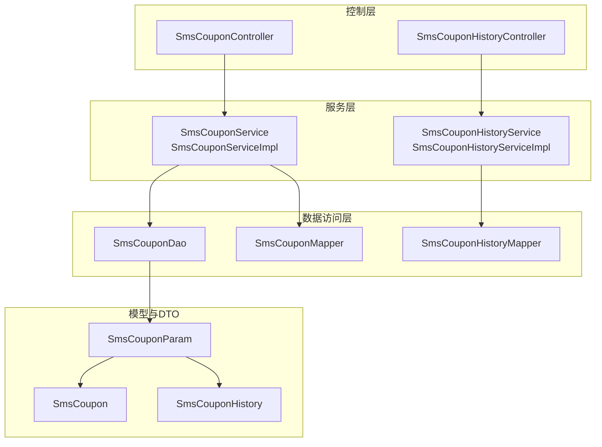
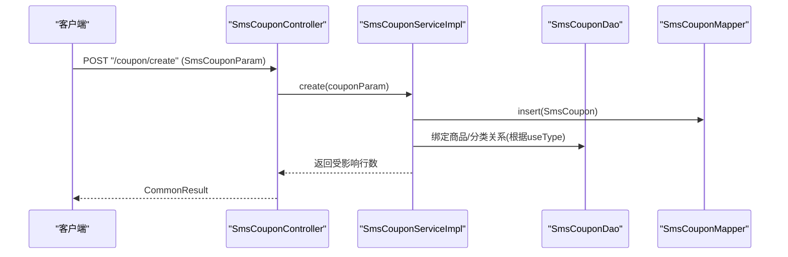
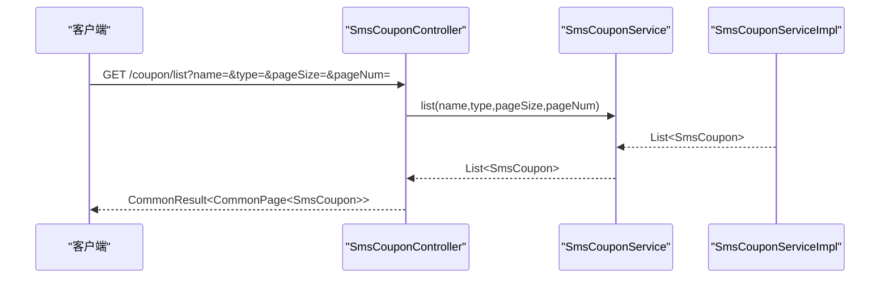
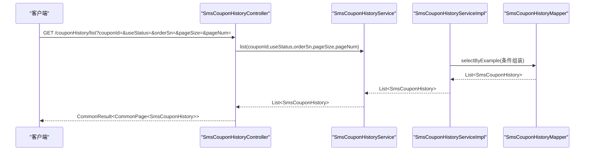
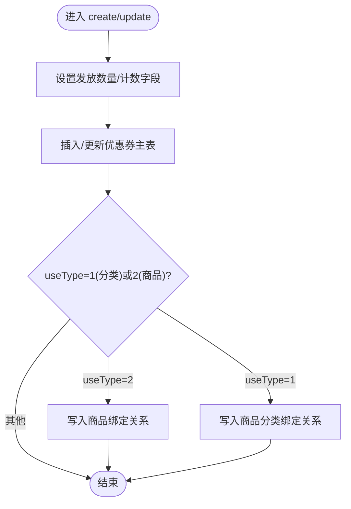
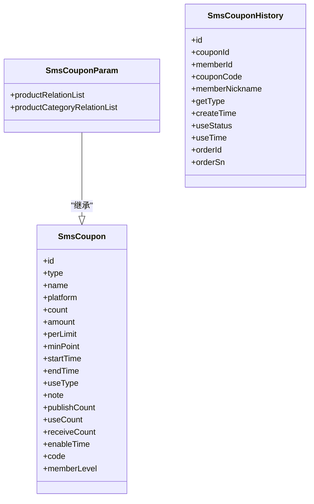
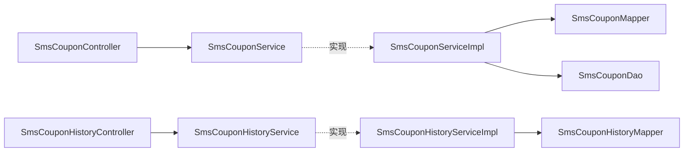

# 优惠券管理

<cite>
**本文引用的文件**
- [SmsCouponController.java](file://mall-admin/src/main/java/com/macro/mall/controller/SmsCouponController.java)
- [SmsCouponHistoryController.java](file://mall-admin/src/main/java/com/macro/mall/controller/SmsCouponHistoryController.java)
- [SmsCouponService.java](file://mall-admin/src/main/java/com/macro/mall/service/SmsCouponService.java)
- [SmsCouponServiceImpl.java](file://mall-admin/src/main/java/com/macro/mall/service/impl/SmsCouponServiceImpl.java)
- [SmsCouponHistoryService.java](file://mall-admin/src/main/java/com/macro/mall/service/SmsCouponHistoryService.java)
- [SmsCouponHistoryServiceImpl.java](file://mall-admin/src/main/java/com/macro/mall/service/impl/SmsCouponHistoryServiceImpl.java)
- [SmsCouponDao.java](file://mall-admin/src/main/java/com/macro/mall/dao/SmsCouponDao.java)
- [SmsCouponParam.java](file://mall-admin/src/main/java/com/macro/mall/dto/SmsCouponParam.java)
- [SmsCouponMapper.java](file://mall-mbg/src/main/java/com/macro/mall/mapper/SmsCouponMapper.java)
- [SmsCouponHistoryMapper.java](file://mall-mbg/src/main/java/com/macro/mall/mapper/SmsCouponHistoryMapper.java)
- [SmsCoupon.java](file://mall-mbg/src/main/java/com/macro/mall/model/SmsCoupon.java)
- [SmsCouponHistory.java](file://mall-mbg/src/main/java/com/macro/mall/model/SmsCouponHistory.java)
</cite>

## 目录
1. [简介](#简介)
2. [项目结构](#项目结构)
3. [核心组件](#核心组件)
4. [架构总览](#架构总览)
5. [详细组件分析](#详细组件分析)
6. [依赖分析](#依赖分析)
7. [性能考虑](#性能考虑)
8. [故障排查指南](#故障排查指南)
9. [结论](#结论)
10. [附录](#附录)

## 简介
本文件系统化梳理电商系统中的“优惠券管理”模块，覆盖优惠券全生命周期：创建、编辑、删除、查询；优惠券类型与使用规则配置；发放策略要点；以及历史记录管理（领取、使用、失效追踪）。同时给出控制器RESTful接口设计、优惠券参数DTO设计说明，并总结最佳实践与常见问题处理建议。

## 项目结构
优惠券管理相关代码主要分布在以下层次：
- 控制器层：负责HTTP请求入口与响应包装
- 服务层：封装业务逻辑，事务控制
- DAO/Mapper层：数据访问与SQL映射
- 模型层：数据库实体定义
- DTO层：对外传输对象，承载优惠券及其关联关系

图表来源
- [SmsCouponController.java:1-73](file://mall-admin/src/main/java/com/macro/mall/controller/SmsCouponController.java#L1-L73)
- [SmsCouponHistoryController.java:1-39](file://mall-admin/src/main/java/com/macro/mall/controller/SmsCouponHistoryController.java#L1-L39)
- [SmsCouponService.java:1-43](file://mall-admin/src/main/java/com/macro/mall/service/SmsCouponService.java#L1-L43)
- [SmsCouponServiceImpl.java:1-126](file://mall-admin/src/main/java/com/macro/mall/service/impl/SmsCouponServiceImpl.java#L1-L126)
- [SmsCouponHistoryService.java:1-20](file://mall-admin/src/main/java/com/macro/mall/service/SmsCouponHistoryService.java#L1-L20)
- [SmsCouponHistoryServiceImpl.java:1-39](file://mall-admin/src/main/java/com/macro/mall/service/impl/SmsCouponHistoryServiceImpl.java#L1-L39)
- [SmsCouponDao.java:1-16](file://mall-admin/src/main/java/com/macro/mall/dao/SmsCouponDao.java#L1-L16)
- [SmsCouponParam.java:1-23](file://mall-admin/src/main/java/com/macro/mall/dto/SmsCouponParam.java#L1-L23)
- [SmsCouponMapper.java:1-30](file://mall-mbg/src/main/java/com/macro/mall/mapper/SmsCouponMapper.java#L1-L30)
- [SmsCouponHistoryMapper.java:1-30](file://mall-mbg/src/main/java/com/macro/mall/mapper/SmsCouponHistoryMapper.java#L1-L30)
- [SmsCoupon.java:1-218](file://mall-mbg/src/main/java/com/macro/mall/model/SmsCoupon.java#L1-L218)
- [SmsCouponHistory.java:1-140](file://mall-mbg/src/main/java/com/macro/mall/model/SmsCouponHistory.java#L1-L140)

章节来源
- [SmsCouponController.java:1-73](file://mall-admin/src/main/java/com/macro/mall/controller/SmsCouponController.java#L1-L73)
- [SmsCouponHistoryController.java:1-39](file://mall-admin/src/main/java/com/macro/mall/controller/SmsCouponHistoryController.java#L1-L39)

## 核心组件
- 优惠券控制器：提供创建、删除、更新、分页查询、详情获取接口
- 优惠券历史控制器：提供按条件分页查询领取记录接口
- 优惠券服务：封装创建/删除/更新、查询与详情获取
- 历史记录服务：封装按优惠券ID、使用状态、订单号查询历史
- DAO/Mapper：提供自定义查询与通用CRUD
- DTO/模型：SmsCouponParam承载优惠券及绑定关系；SmsCoupon、SmsCouponHistory为持久化实体

章节来源
- [SmsCouponService.java:1-43](file://mall-admin/src/main/java/com/macro/mall/service/SmsCouponService.java#L1-L43)
- [SmsCouponServiceImpl.java:1-126](file://mall-admin/src/main/java/com/macro/mall/service/impl/SmsCouponServiceImpl.java#L1-L126)
- [SmsCouponHistoryService.java:1-20](file://mall-admin/src/main/java/com/macro/mall/service/SmsCouponHistoryService.java#L1-L20)
- [SmsCouponHistoryServiceImpl.java:1-39](file://mall-admin/src/main/java/com/macro/mall/service/impl/SmsCouponHistoryServiceImpl.java#L1-L39)
- [SmsCouponDao.java:1-16](file://mall-admin/src/main/java/com/macro/mall/dao/SmsCouponDao.java#L1-L16)
- [SmsCouponParam.java:1-23](file://mall-admin/src/main/java/com/macro/mall/dto/SmsCouponParam.java#L1-L23)
- [SmsCouponMapper.java:1-30](file://mall-mbg/src/main/java/com/macro/mall/mapper/SmsCouponMapper.java#L1-L30)
- [SmsCouponHistoryMapper.java:1-30](file://mall-mbg/src/main/java/com/macro/mall/mapper/SmsCouponHistoryMapper.java#L1-L30)
- [SmsCoupon.java:1-218](file://mall-mbg/src/main/java/com/macro/mall/model/SmsCoupon.java#L1-L218)
- [SmsCouponHistory.java:1-140](file://mall-mbg/src/main/java/com/macro/mall/model/SmsCouponHistory.java#L1-L140)

## 架构总览
优惠券管理采用经典的分层架构：Controller接收请求并返回统一结果包装；Service层编排业务与事务；DAO/Mapper负责数据持久化；DTO用于跨层传输复杂对象。

图表来源
- [SmsCouponController.java:25-33](file://mall-admin/src/main/java/com/macro/mall/controller/SmsCouponController.java#L25-L33)
- [SmsCouponServiceImpl.java:38-59](file://mall-admin/src/main/java/com/macro/mall/service/impl/SmsCouponServiceImpl.java#L38-L59)
- [SmsCouponDao.java:10-15](file://mall-admin/src/main/java/com/macro/mall/dao/SmsCouponDao.java#L10-L15)
- [SmsCouponMapper.java:15-17](file://mall-mbg/src/main/java/com/macro/mall/mapper/SmsCouponMapper.java#L15-L17)

## 详细组件分析

### 优惠券控制器（RESTful接口）
- 接口路径与方法
  - 创建：POST /coupon/create
  - 删除：POST /coupon/delete/{id}
  - 更新：POST /coupon/update/{id}
  - 列表：GET /coupon/list（支持名称、类型、分页）
  - 详情：GET /coupon/{id}
- 请求/响应特点
  - 统一使用CommonResult包装
  - 列表使用CommonPage分页封装
  - 详情返回SmsCouponParam（含绑定关系）

图表来源
- [SmsCouponController.java:55-64](file://mall-admin/src/main/java/com/macro/mall/controller/SmsCouponController.java#L55-L64)
- [SmsCouponServiceImpl.java:107-124](file://mall-admin/src/main/java/com/macro/mall/service/impl/SmsCouponServiceImpl.java#L107-L124)

章节来源
- [SmsCouponController.java:1-73](file://mall-admin/src/main/java/com/macro/mall/controller/SmsCouponController.java#L1-L73)

### 优惠券历史控制器（领取记录查询）
- 接口路径与方法
  - GET /couponHistory/list（支持优惠券ID、使用状态、订单号、分页）
- 查询条件
  - 可选过滤：couponId、useStatus、orderSn
  - 分页参数：pageSize、pageNum

图表来源
- [SmsCouponHistoryController.java:28-37](file://mall-admin/src/main/java/com/macro/mall/controller/SmsCouponHistoryController.java#L28-L37)
- [SmsCouponHistoryServiceImpl.java:23-37](file://mall-admin/src/main/java/com/macro/mall/service/impl/SmsCouponHistoryServiceImpl.java#L23-L37)
- [SmsCouponHistoryMapper.java:19-19](file://mall-mbg/src/main/java/com/macro/mall/mapper/SmsCouponHistoryMapper.java#L19-L19)

章节来源
- [SmsCouponHistoryController.java:1-39](file://mall-admin/src/main/java/com/macro/mall/controller/SmsCouponHistoryController.java#L1-L39)

### 优惠券服务与实现
- 事务性操作
  - create：插入优惠券主表，依据useType插入商品或商品分类绑定关系
  - update：先更新主表，再按useType重建绑定关系
  - delete：删除主表及所有绑定关系
- 查询能力
  - list：支持按名称模糊、类型精确过滤，分页查询
  - getItem：通过自定义DAO返回包含绑定关系的SmsCouponParam

图表来源
- [SmsCouponServiceImpl.java:38-105](file://mall-admin/src/main/java/com/macro/mall/service/impl/SmsCouponServiceImpl.java#L38-L105)

章节来源
- [SmsCouponService.java:1-43](file://mall-admin/src/main/java/com/macro/mall/service/SmsCouponService.java#L1-L43)
- [SmsCouponServiceImpl.java:1-126](file://mall-admin/src/main/java/com/macro/mall/service/impl/SmsCouponServiceImpl.java#L1-L126)

### 历史记录服务与实现
- 支持多条件过滤：优惠券ID、使用状态、订单号
- 使用分页助手进行分页
- 条件拼装采用MyBatis Example

章节来源
- [SmsCouponHistoryService.java:1-20](file://mall-admin/src/main/java/com/macro/mall/service/SmsCouponHistoryService.java#L1-L20)
- [SmsCouponHistoryServiceImpl.java:1-39](file://mall-admin/src/main/java/com/macro/mall/service/impl/SmsCouponHistoryServiceImpl.java#L1-L39)

### DTO与模型设计
- SmsCouponParam
  - 扩展SmsCoupon，新增两个列表字段：商品绑定关系、商品分类绑定关系
  - 用于在创建/更新时一次性传入优惠券主体与其绑定关系
- SmsCoupon
  - 包含优惠券类型、平台、数量、金额、使用门槛、有效期、使用方式、编码、会员等级等字段
- SmsCouponHistory
  - 记录领取人、领取方式、创建时间、使用状态、使用时间、订单号等

图表来源
- [SmsCoupon.java:1-218](file://mall-mbg/src/main/java/com/macro/mall/model/SmsCoupon.java#L1-L218)
- [SmsCouponParam.java:1-23](file://mall-admin/src/main/java/com/macro/mall/dto/SmsCouponParam.java#L1-L23)
- [SmsCouponHistory.java:1-140](file://mall-mbg/src/main/java/com/macro/mall/model/SmsCouponHistory.java#L1-L140)

章节来源
- [SmsCouponParam.java:1-23](file://mall-admin/src/main/java/com/macro/mall/dto/SmsCouponParam.java#L1-L23)
- [SmsCoupon.java:1-218](file://mall-mbg/src/main/java/com/macro/mall/model/SmsCoupon.java#L1-L218)
- [SmsCouponHistory.java:1-140](file://mall-mbg/src/main/java/com/macro/mall/model/SmsCouponHistory.java#L1-L140)

## 依赖分析
- 控制器依赖服务接口
- 服务实现依赖Mapper与DAO
- DAO提供getItem扩展查询
- DTO与模型解耦，通过Mapper映射到数据库

图表来源
- [SmsCouponController.java:23-24](file://mall-admin/src/main/java/com/macro/mall/controller/SmsCouponController.java#L23-L24)
- [SmsCouponHistoryController.java:25-26](file://mall-admin/src/main/java/com/macro/mall/controller/SmsCouponHistoryController.java#L25-L26)
- [SmsCouponService.java:13-42](file://mall-admin/src/main/java/com/macro/mall/service/SmsCouponService.java#L13-L42)
- [SmsCouponServiceImpl.java:24-36](file://mall-admin/src/main/java/com/macro/mall/service/impl/SmsCouponServiceImpl.java#L24-L36)
- [SmsCouponHistoryService.java:11-19](file://mall-admin/src/main/java/com/macro/mall/service/SmsCouponHistoryService.java#L11-L19)
- [SmsCouponHistoryServiceImpl.java:18-21](file://mall-admin/src/main/java/com/macro/mall/service/impl/SmsCouponHistoryServiceImpl.java#L18-L21)

章节来源
- [SmsCouponServiceImpl.java:1-126](file://mall-admin/src/main/java/com/macro/mall/service/impl/SmsCouponServiceImpl.java#L1-L126)
- [SmsCouponHistoryServiceImpl.java:1-39](file://mall-admin/src/main/java/com/macro/mall/service/impl/SmsCouponHistoryServiceImpl.java#L1-L39)

## 性能考虑
- 分页查询：服务层使用分页助手对列表查询进行分页，避免一次性加载大量数据
- 条件查询：历史记录服务基于Example条件拼装，建议在常用过滤字段上建立索引以提升查询效率
- 事务边界：创建/更新/删除均在Service层开启事务，确保数据一致性
- 批量写入：绑定关系插入前统一设置外键，减少重复查询

## 故障排查指南
- 创建失败
  - 检查useType是否正确，确保对应绑定关系列表非空且已设置外键
  - 核对主表字段约束与默认值（如count/useCount/receiveCount/publishCount）
- 更新异常
  - 确认更新前后的useType是否变化，若变化需重建绑定关系
  - 检查主表更新是否成功，绑定关系删除/插入顺序是否正确
- 查询无结果
  - 列表查询：确认name模糊匹配与type过滤条件是否符合预期
  - 历史查询：确认couponId/useStatus/orderSn是否为空或格式错误
- 分页不生效
  - 确认pageNum/pageSize是否传入且有效
  - 检查分页助手是否正确调用

章节来源
- [SmsCouponServiceImpl.java:38-105](file://mall-admin/src/main/java/com/macro/mall/service/impl/SmsCouponServiceImpl.java#L38-L105)
- [SmsCouponHistoryServiceImpl.java:23-37](file://mall-admin/src/main/java/com/macro/mall/service/impl/SmsCouponHistoryServiceImpl.java#L23-L37)

## 结论
该模块以清晰的分层架构实现了优惠券的全生命周期管理：从创建、编辑、删除到查询与详情展示；并通过历史记录控制器支撑了领取、使用与失效的追踪。通过DTO与模型分离、DAO/Mapper解耦，系统具备良好的可维护性与扩展性。建议在生产环境中完善索引、监控与日志，持续优化查询与事务性能。

## 附录

### 优惠券类型与使用规则
- 类型字段（type）：用于区分优惠券类别（例如满减、折扣、免邮等），具体语义由业务约定
- 使用方式（useType）：决定绑定范围
  - useType=1：绑定商品分类
  - useType=2：绑定具体商品
  - 其他：通用券或按业务定义
- 使用门槛（minPoint）：满足最低消费方可使用
- 有效期（startTime/endTime）：限制可用时间段
- 发放策略（publishCount/receiveCount/count）：控制总量与领取次数
- 平台（platform）：适用平台（如仅平台A或平台B）
- 编码（code）：唯一标识或外部券码
- 会员等级（memberLevel）：限定会员级别

章节来源
- [SmsCoupon.java:10-44](file://mall-mbg/src/main/java/com/macro/mall/model/SmsCoupon.java#L10-L44)

### 历史记录字段说明
- 领取记录关键字段：couponId、memberId、couponCode、memberNickname、getType、createTime
- 使用状态（useStatus）：0未使用、1已使用、2已失效等（具体枚举由业务定义）
- 使用时间（useTime）与订单号（orderSn）：用于核销与对账
- 关联订单（orderId）：便于后续对账与审计

章节来源
- [SmsCouponHistory.java:9-28](file://mall-mbg/src/main/java/com/macro/mall/model/SmsCouponHistory.java#L9-L28)