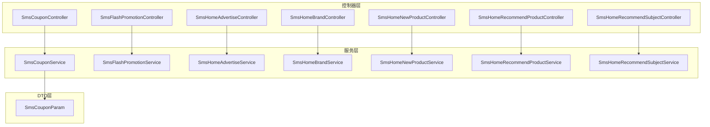
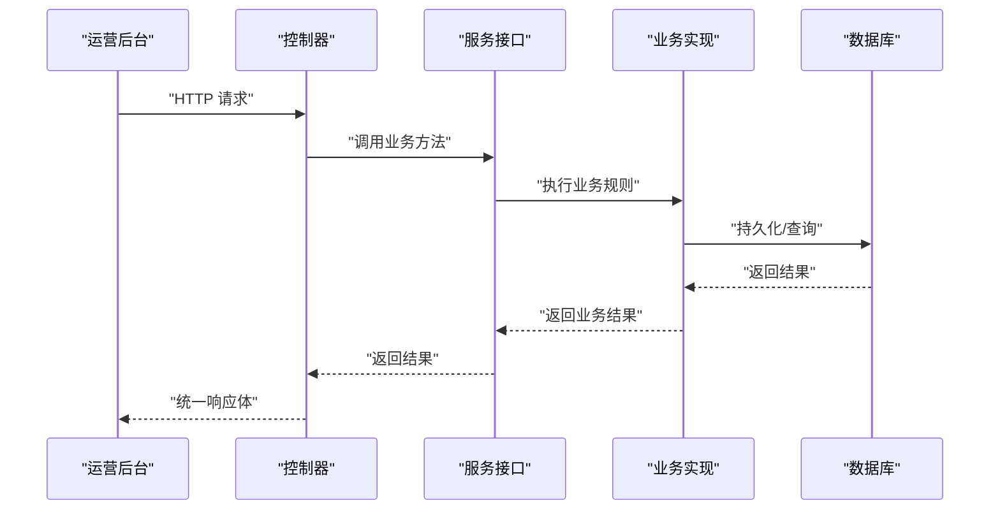
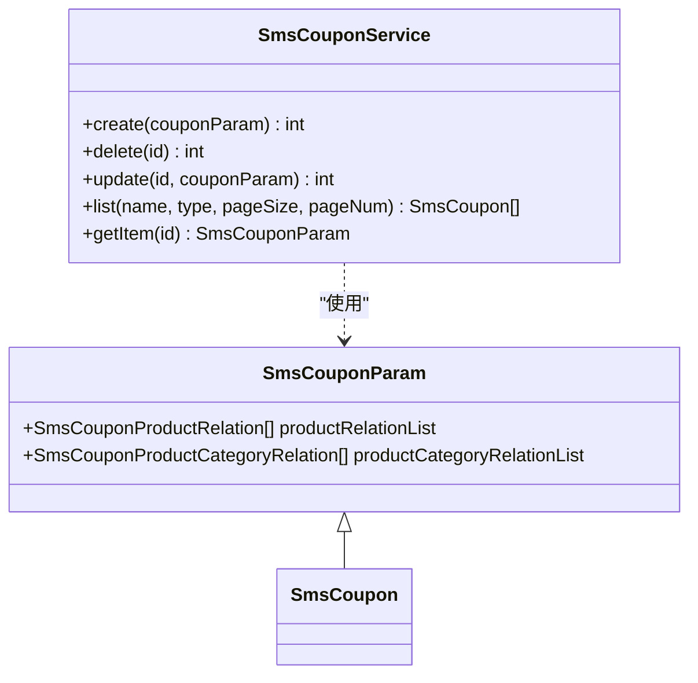
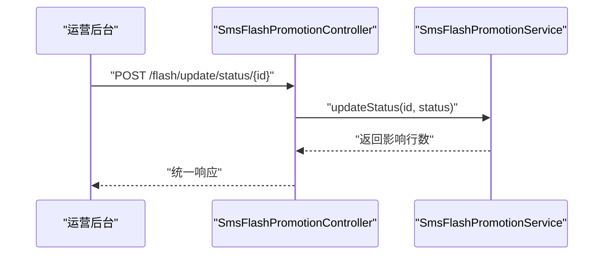
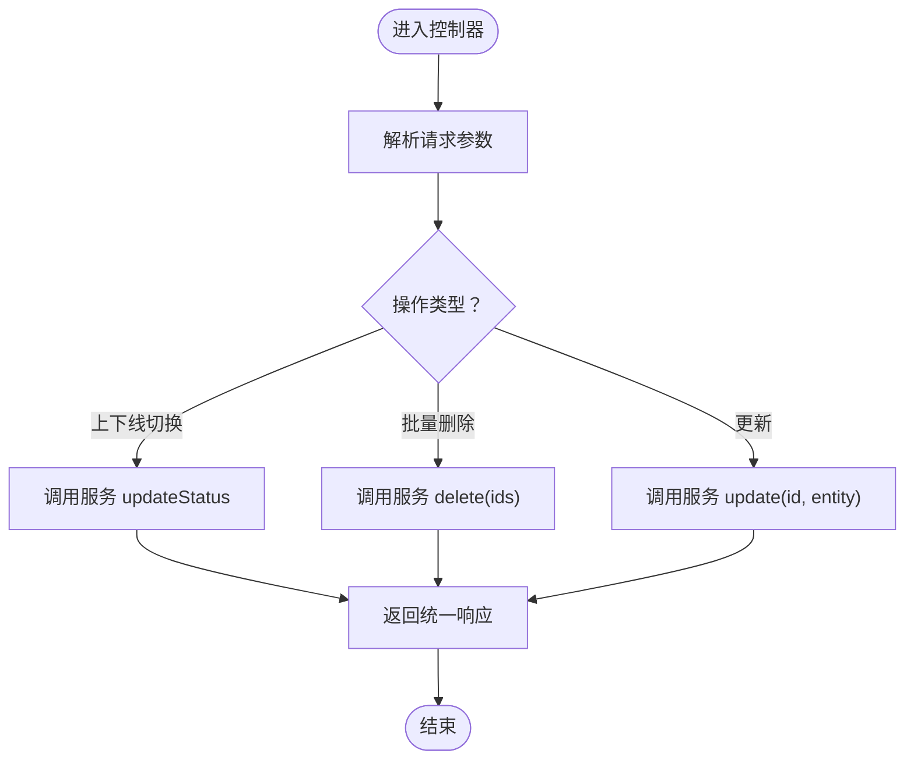
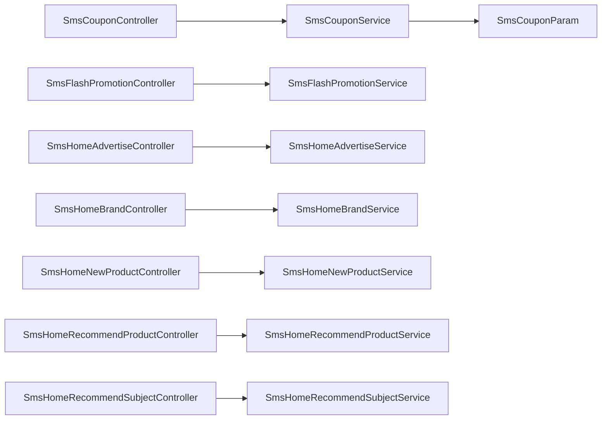

# 营销活动系统

<cite>
**本文引用的文件**
- [SmsCouponController.java](file://mall-admin/src/main/java/com/macro/mall/controller/SmsCouponController.java)
- [SmsFlashPromotionController.java](file://mall-admin/src/main/java/com/macro/mall/controller/SmsFlashPromotionController.java)
- [SmsHomeAdvertiseController.java](file://mall-admin/src/main/java/com/macro/mall/controller/SmsHomeAdvertiseController.java)
- [SmsHomeBrandController.java](file://mall-admin/src/main/java/com/macro/mall/controller/SmsHomeBrandController.java)
- [SmsHomeNewProductController.java](file://mall-admin/src/main/java/com/macro/mall/controller/SmsHomeNewProductController.java)
- [SmsHomeRecommendProductController.java](file://mall-admin/src/main/java/com/macro/mall/controller/SmsHomeRecommendProductController.java)
- [SmsHomeRecommendSubjectController.java](file://mall-admin/src/main/java/com/macro/mall/controller/SmsHomeRecommendSubjectController.java)
- [SmsCouponParam.java](file://mall-admin/src/main/java/com/macro/mall/dto/SmsCouponParam.java)
- [SmsCouponService.java](file://mall-admin/src/main/java/com/macro/mall/service/SmsCouponService.java)
- [SmsFlashPromotionService.java](file://mall-admin/src/main/java/com/macro/mall/service/SmsFlashPromotionService.java)
- [SmsHomeAdvertiseService.java](file://mall-admin/src/main/java/com/macro/mall/service/SmsHomeAdvertiseService.java)
- [SmsHomeBrandService.java](file://mall-admin/src/main/java/com/macro/mall/service/SmsHomeBrandService.java)
- [SmsHomeNewProductService.java](file://mall-admin/src/main/java/com/macro/mall/service/SmsHomeNewProductService.java)
- [SmsHomeRecommendProductService.java](file://mall-admin/src/main/java/com/macro/mall/service/SmsHomeRecommendProductService.java)
- [SmsHomeRecommendSubjectService.java](file://mall-admin/src/main/java/com/macro/mall/service/SmsHomeRecommendSubjectService.java)
</cite>

## 目录
1. [简介](#简介)
2. [项目结构](#项目结构)
3. [核心组件](#核心组件)
4. [架构总览](#架构总览)
5. [详细组件分析](#详细组件分析)
6. [依赖分析](#依赖分析)
7. [性能考虑](#性能考虑)
8. [故障排查指南](#故障排查指南)
9. [结论](#结论)
10. [附录：营销活动API接口文档与运营配置说明](#附录营销活动api接口文档与运营配置说明)

## 简介
本文件面向“营销活动系统”的运营与技术读者，系统性梳理优惠券管理、限时购管理、首页广告管理、首页品牌管理、新品推荐、首页商品推荐、首页专题推荐等核心功能模块。内容涵盖：
- 控制器RESTful接口设计（创建、编辑、启用/禁用、查询、分页）
- 服务层业务逻辑要点（发放规则、时间安排、展示配置）
- DTO数据传输对象设计（优惠券参数、促销商品、广告配置等）
- 完整的营销活动API接口文档与运营配置说明

## 项目结构
营销相关模块主要位于 mall-admin 工程中，采用“控制器-服务-数据传输对象”三层结构：
- 控制器层：各营销模块的HTTP入口，负责请求接收、参数校验与响应包装
- 服务层：定义营销业务接口，承载具体业务规则
- DTO层：封装跨模块的数据传输对象，如优惠券参数包含优惠券主体及其关联的商品/分类关系

图表来源
- [SmsCouponController.java:1-73](file://mall-admin/src/main/java/com/macro/mall/controller/SmsCouponController.java#L1-L73)
- [SmsFlashPromotionController.java:1-81](file://mall-admin/src/main/java/com/macro/mall/controller/SmsFlashPromotionController.java#L1-L81)
- [SmsHomeAdvertiseController.java:1-79](file://mall-admin/src/main/java/com/macro/mall/controller/SmsHomeAdvertiseController.java#L1-L79)
- [SmsHomeBrandController.java:1-75](file://mall-admin/src/main/java/com/macro/mall/controller/SmsHomeBrandController.java#L1-L75)
- [SmsHomeNewProductController.java:1-75](file://mall-admin/src/main/java/com/macro/mall/controller/SmsHomeNewProductController.java#L1-L75)
- [SmsHomeRecommendProductController.java:1-75](file://mall-admin/src/main/java/com/macro/mall/controller/SmsHomeRecommendProductController.java#L1-L75)
- [SmsHomeRecommendSubjectController.java:1-75](file://mall-admin/src/main/java/com/macro/mall/controller/SmsHomeRecommendSubjectController.java#L1-L75)
- [SmsCouponParam.java:1-23](file://mall-admin/src/main/java/com/macro/mall/dto/SmsCouponParam.java#L1-L23)
- [SmsCouponService.java:1-43](file://mall-admin/src/main/java/com/macro/mall/service/SmsCouponService.java#L1-L43)
- [SmsFlashPromotionService.java:1-42](file://mall-admin/src/main/java/com/macro/mall/service/SmsFlashPromotionService.java#L1-L42)
- [SmsHomeAdvertiseService.java:1-42](file://mall-admin/src/main/java/com/macro/mall/service/SmsHomeAdvertiseService.java#L1-L42)
- [SmsHomeBrandService.java:1-39](file://mall-admin/src/main/java/com/macro/mall/service/SmsHomeBrandService.java#L1-L39)
- [SmsHomeNewProductService.java:1-39](file://mall-admin/src/main/java/com/macro/mall/service/SmsHomeNewProductService.java#L1-L39)
- [SmsHomeRecommendProductService.java:1-39](file://mall-admin/src/main/java/com/macro/mall/service/SmsHomeRecommendProductService.java#L1-L39)
- [SmsHomeRecommendSubjectService.java:1-39](file://mall-admin/src/main/java/com/macro/mall/service/SmsHomeRecommendSubjectService.java#L1-L39)

章节来源
- [SmsCouponController.java:1-73](file://mall-admin/src/main/java/com/macro/mall/controller/SmsCouponController.java#L1-L73)
- [SmsCouponParam.java:1-23](file://mall-admin/src/main/java/com/macro/mall/dto/SmsCouponParam.java#L1-L23)

## 核心组件
- 优惠券管理：提供优惠券的增删改查、分页查询及详情读取；详情包含优惠券主体与其绑定的商品/分类关系
- 限时购管理：提供活动的增删改、上下线切换、分页查询与详情读取
- 首页广告管理：支持批量删除、上下线切换、分页查询与详情读取
- 首页品牌管理：支持批量新增、排序调整、批量删除、批量推荐状态切换与分页查询
- 新品推荐：支持批量新增、排序调整、批量删除、批量推荐状态切换与分页查询
- 首页商品推荐：支持批量新增、排序调整、批量删除、批量推荐状态切换与分页查询
- 首页专题推荐：支持批量新增、排序调整、批量删除、批量推荐状态切换与分页查询

章节来源
- [SmsCouponService.java:1-43](file://mall-admin/src/main/java/com/macro/mall/service/SmsCouponService.java#L1-L43)
- [SmsFlashPromotionService.java:1-42](file://mall-admin/src/main/java/com/macro/mall/service/SmsFlashPromotionService.java#L1-L42)
- [SmsHomeAdvertiseService.java:1-42](file://mall-admin/src/main/java/com/macro/mall/service/SmsHomeAdvertiseService.java#L1-L42)
- [SmsHomeBrandService.java:1-39](file://mall-admin/src/main/java/com/macro/mall/service/SmsHomeBrandService.java#L1-L39)
- [SmsHomeNewProductService.java:1-39](file://mall-admin/src/main/java/com/macro/mall/service/SmsHomeNewProductService.java#L1-L39)
- [SmsHomeRecommendProductService.java:1-39](file://mall-admin/src/main/java/com/macro/mall/service/SmsHomeRecommendProductService.java#L1-L39)
- [SmsHomeRecommendSubjectService.java:1-39](file://mall-admin/src/main/java/com/macro/mall/service/SmsHomeRecommendSubjectService.java#L1-L39)

## 架构总览
营销模块遵循标准的MVC分层，控制器通过服务接口完成业务操作，服务接口返回统一的结果包装，控制器再以REST风格输出。

图表来源
- [SmsCouponController.java:25-71](file://mall-admin/src/main/java/com/macro/mall/controller/SmsCouponController.java#L25-L71)
- [SmsFlashPromotionController.java:25-79](file://mall-admin/src/main/java/com/macro/mall/controller/SmsFlashPromotionController.java#L25-L79)
- [SmsHomeAdvertiseController.java:25-77](file://mall-admin/src/main/java/com/macro/mall/controller/SmsHomeAdvertiseController.java#L25-L77)
- [SmsHomeBrandController.java:25-73](file://mall-admin/src/main/java/com/macro/mall/controller/SmsHomeBrandController.java#L25-L73)
- [SmsHomeNewProductController.java:25-73](file://mall-admin/src/main/java/com/macro/mall/controller/SmsHomeNewProductController.java#L25-L73)
- [SmsHomeRecommendProductController.java:25-73](file://mall-admin/src/main/java/com/macro/mall/controller/SmsHomeRecommendProductController.java#L25-L73)
- [SmsHomeRecommendSubjectController.java:25-73](file://mall-admin/src/main/java/com/macro/mall/controller/SmsHomeRecommendSubjectController.java#L25-L73)

## 详细组件分析

### 优惠券管理模块
- 控制器接口
  - POST /coupon/create：创建优惠券（请求体为优惠券参数DTO）
  - POST /coupon/delete/{id}：删除优惠券
  - POST /coupon/update/{id}：更新优惠券（请求体为优惠券参数DTO）
  - GET /coupon/list：分页查询优惠券（可按名称、类型过滤）
  - GET /coupon/{id}：获取优惠券详情（包含优惠券主体及商品/分类绑定关系）
- 服务接口要点
  - 创建/删除/更新均使用事务注解，确保优惠券与其关联关系的一致性
  - 查询支持分页与条件过滤
- DTO设计
  - SmsCouponParam 继承优惠券实体，并扩展商品关联与分类关联列表字段

图表来源
- [SmsCouponParam.java:15-22](file://mall-admin/src/main/java/com/macro/mall/dto/SmsCouponParam.java#L15-L22)
- [SmsCouponService.java:13-42](file://mall-admin/src/main/java/com/macro/mall/service/SmsCouponService.java#L13-L42)

章节来源
- [SmsCouponController.java:25-71](file://mall-admin/src/main/java/com/macro/mall/controller/SmsCouponController.java#L25-L71)
- [SmsCouponParam.java:1-23](file://mall-admin/src/main/java/com/macro/mall/dto/SmsCouponParam.java#L1-L23)
- [SmsCouponService.java:1-43](file://mall-admin/src/main/java/com/macro/mall/service/SmsCouponService.java#L1-L43)

### 限时购管理模块
- 控制器接口
  - POST /flash/create：创建限时购活动
  - POST /flash/update/{id}：更新限时购活动
  - POST /flash/delete/{id}：删除限时购活动
  - POST /flash/update/status/{id}：修改活动上下线状态
  - GET /flash/{id}：获取活动详情
  - GET /flash/list：分页查询活动（可按关键字过滤）
- 服务接口要点
  - 提供活动状态切换能力，便于运营在合适时间启停活动

图表来源
- [SmsFlashPromotionController.java:55-63](file://mall-admin/src/main/java/com/macro/mall/controller/SmsFlashPromotionController.java#L55-L63)
- [SmsFlashPromotionService.java:29-30](file://mall-admin/src/main/java/com/macro/mall/service/SmsFlashPromotionService.java#L29-L30)

章节来源
- [SmsFlashPromotionController.java:25-79](file://mall-admin/src/main/java/com/macro/mall/controller/SmsFlashPromotionController.java#L25-L79)
- [SmsFlashPromotionService.java:1-42](file://mall-admin/src/main/java/com/macro/mall/service/SmsFlashPromotionService.java#L1-L42)

### 首页广告管理模块
- 控制器接口
  - POST /home/advertise/create：创建广告
  - POST /home/advertise/delete：批量删除广告
  - POST /home/advertise/update/status/{id}：修改广告上下线状态
  - GET /home/advertise/{id}：获取广告详情
  - POST /home/advertise/update/{id}：更新广告
  - GET /home/advertise/list：分页查询广告（可按名称、类型、结束时间过滤）

图表来源
- [SmsHomeAdvertiseController.java:34-50](file://mall-admin/src/main/java/com/macro/mall/controller/SmsHomeAdvertiseController.java#L34-L50)
- [SmsHomeAdvertiseController.java:36-41](file://mall-admin/src/main/java/com/macro/mall/controller/SmsHomeAdvertiseController.java#L36-L41)
- [SmsHomeAdvertiseController.java:59-66](file://mall-admin/src/main/java/com/macro/mall/controller/SmsHomeAdvertiseController.java#L59-L66)

章节来源
- [SmsHomeAdvertiseController.java:25-77](file://mall-admin/src/main/java/com/macro/mall/controller/SmsHomeAdvertiseController.java#L25-L77)
- [SmsHomeAdvertiseService.java:1-42](file://mall-admin/src/main/java/com/macro/mall/service/SmsHomeAdvertiseService.java#L1-L42)

### 首页品牌管理模块
- 控制器接口
  - POST /home/brand/create：批量创建品牌推荐
  - POST /home/brand/update/sort/{id}：调整品牌推荐排序
  - POST /home/brand/delete：批量删除品牌推荐
  - POST /home/brand/update/recommendStatus：批量设置推荐状态
  - GET /home/brand/list：分页查询（可按品牌名、推荐状态过滤）

章节来源
- [SmsHomeBrandController.java:25-73](file://mall-admin/src/main/java/com/macro/mall/controller/SmsHomeBrandController.java#L25-L73)
- [SmsHomeBrandService.java:1-39](file://mall-admin/src/main/java/com/macro/mall/service/SmsHomeBrandService.java#L1-L39)

### 新品推荐模块
- 控制器接口
  - POST /home/newProduct/create：批量创建新品推荐
  - POST /home/newProduct/update/sort/{id}：调整新品推荐排序
  - POST /home/newProduct/delete：批量删除新品推荐
  - POST /home/newProduct/update/recommendStatus：批量设置推荐状态
  - GET /home/newProduct/list：分页查询（可按商品名、推荐状态过滤）

章节来源
- [SmsHomeNewProductController.java:25-73](file://mall-admin/src/main/java/com/macro/mall/controller/SmsHomeNewProductController.java#L25-L73)
- [SmsHomeNewProductService.java:1-39](file://mall-admin/src/main/java/com/macro/mall/service/SmsHomeNewProductService.java#L1-L39)

### 首页商品推荐模块
- 控制器接口
  - POST /home/recommendProduct/create：批量创建商品推荐
  - POST /home/recommendProduct/update/sort/{id}：调整商品推荐排序
  - POST /home/recommendProduct/delete：批量删除商品推荐
  - POST /home/recommendProduct/update/recommendStatus：批量设置推荐状态
  - GET /home/recommendProduct/list：分页查询（可按商品名、推荐状态过滤）

章节来源
- [SmsHomeRecommendProductController.java:25-73](file://mall-admin/src/main/java/com/macro/mall/controller/SmsHomeRecommendProductController.java#L25-L73)
- [SmsHomeRecommendProductService.java:1-39](file://mall-admin/src/main/java/com/macro/mall/service/SmsHomeRecommendProductService.java#L1-L39)

### 首页专题推荐模块
- 控制器接口
  - POST /home/recommendSubject/create：批量创建专题推荐
  - POST /home/recommendSubject/update/sort/{id}：调整专题推荐排序
  - POST /home/recommendSubject/delete：批量删除专题推荐
  - POST /home/recommendSubject/update/recommendStatus：批量设置推荐状态
  - GET /home/recommendSubject/list：分页查询（可按专题名、推荐状态过滤）

章节来源
- [SmsHomeRecommendSubjectController.java:25-73](file://mall-admin/src/main/java/com/macro/mall/controller/SmsHomeRecommendSubjectController.java#L25-L73)
- [SmsHomeRecommendSubjectService.java:1-39](file://mall-admin/src/main/java/com/macro/mall/service/SmsHomeRecommendSubjectService.java#L1-L39)

## 依赖分析
- 控制器到服务：每个控制器均通过@Autowired注入对应服务接口，遵循单一职责与依赖倒置原则
- 服务到DTO：优惠券服务使用SmsCouponParam作为入参/出参载体，承载优惠券主体与其关联关系
- 事务边界：优惠券与首页推荐类服务接口声明了事务注解，保证多表写入一致性
- 统一响应：控制器返回统一的结果包装，便于前端处理与错误收敛

图表来源
- [SmsCouponController.java:23-24](file://mall-admin/src/main/java/com/macro/mall/controller/SmsCouponController.java#L23-L24)
- [SmsFlashPromotionController.java:22-23](file://mall-admin/src/main/java/com/macro/mall/controller/SmsFlashPromotionController.java#L22-L23)
- [SmsHomeAdvertiseController.java:22-23](file://mall-admin/src/main/java/com/macro/mall/controller/SmsHomeAdvertiseController.java#L22-L23)
- [SmsHomeBrandController.java:22-23](file://mall-admin/src/main/java/com/macro/mall/controller/SmsHomeBrandController.java#L22-L23)
- [SmsHomeNewProductController.java:22-23](file://mall-admin/src/main/java/com/macro/mall/controller/SmsHomeNewProductController.java#L22-L23)
- [SmsHomeRecommendProductController.java:22-23](file://mall-admin/src/main/java/com/macro/mall/controller/SmsHomeRecommendProductController.java#L22-L23)
- [SmsHomeRecommendSubjectController.java:22-23](file://mall-admin/src/main/java/com/macro/mall/controller/SmsHomeRecommendSubjectController.java#L22-L23)
- [SmsCouponParam.java:15-22](file://mall-admin/src/main/java/com/macro/mall/dto/SmsCouponParam.java#L15-L22)
- [SmsCouponService.java:17-18](file://mall-admin/src/main/java/com/macro/mall/service/SmsCouponService.java#L17-L18)

章节来源
- [SmsCouponService.java:1-43](file://mall-admin/src/main/java/com/macro/mall/service/SmsCouponService.java#L1-L43)
- [SmsHomeBrandService.java:16-17](file://mall-admin/src/main/java/com/macro/mall/service/SmsHomeBrandService.java#L16-L17)
- [SmsHomeNewProductService.java:16-17](file://mall-admin/src/main/java/com/macro/mall/service/SmsHomeNewProductService.java#L16-L17)
- [SmsHomeRecommendProductService.java:16-17](file://mall-admin/src/main/java/com/macro/mall/service/SmsHomeRecommendProductService.java#L16-L17)
- [SmsHomeRecommendSubjectService.java:16-17](file://mall-admin/src/main/java/com/macro/mall/service/SmsHomeRecommendSubjectService.java#L16-L17)

## 性能考虑
- 分页查询：所有列表接口均支持分页参数，建议运营侧合理设置每页大小，避免一次性加载过多数据
- 批量操作：首页推荐类模块提供批量删除与批量状态切换，减少多次往返开销
- 事务边界：优惠券与首页推荐类服务使用事务，注意批量写入时的事务时长与锁竞争
- 缓存策略：可在服务层或网关层引入缓存，对热点查询（如首页广告位）进行缓存优化（建议结合实际业务场景评估）

## 故障排查指南
- 统一响应：控制器返回统一结果包装，若出现失败，检查服务层返回的影响行数与异常日志
- 参数校验：控制器使用@RequestParam/@RequestBody接收参数，需确保传参格式与字段正确
- 事务回滚：优惠券与首页推荐类服务使用事务注解，若出现部分成功/失败，检查关联关系是否满足约束
- 接口幂等：对于状态切换类接口（如上下线），建议在业务层增加幂等控制，避免重复提交导致的状态抖动

章节来源
- [SmsCouponController.java:25-71](file://mall-admin/src/main/java/com/macro/mall/controller/SmsCouponController.java#L25-L71)
- [SmsHomeAdvertiseController.java:34-50](file://mall-admin/src/main/java/com/macro/mall/controller/SmsHomeAdvertiseController.java#L34-L50)
- [SmsHomeBrandController.java:55-62](file://mall-admin/src/main/java/com/macro/mall/controller/SmsHomeBrandController.java#L55-L62)
- [SmsHomeNewProductController.java:55-62](file://mall-admin/src/main/java/com/macro/mall/controller/SmsHomeNewProductController.java#L55-L62)
- [SmsHomeRecommendProductController.java:55-62](file://mall-admin/src/main/java/com/macro/mall/controller/SmsHomeRecommendProductController.java#L55-L62)
- [SmsHomeRecommendSubjectController.java:55-62](file://mall-admin/src/main/java/com/macro/mall/controller/SmsHomeRecommendSubjectController.java#L55-L62)

## 结论
营销活动系统以清晰的分层架构支撑起优惠券、限时购与首页多维度展示配置。通过统一的控制器与服务接口，配合DTO数据封装，实现了运营高频操作的标准化与可维护性。建议在生产环境中结合业务流量与数据规模，完善缓存与异步处理策略，持续优化用户体验与系统稳定性。

## 附录：营销活动API接口文档与运营配置说明

### 优惠券管理
- 创建优惠券
  - 方法：POST
  - 路径：/coupon/create
  - 请求体：优惠券参数DTO（包含优惠券主体及商品/分类绑定关系）
  - 响应：统一结果包装
- 删除优惠券
  - 方法：POST
  - 路径：/coupon/delete/{id}
  - 响应：统一结果包装
- 更新优惠券
  - 方法：POST
  - 路径：/coupon/update/{id}
  - 请求体：优惠券参数DTO
  - 响应：统一结果包装
- 分页查询
  - 方法：GET
  - 路径：/coupon/list
  - 查询参数：name（可选）、type（可选）、pageSize（默认5）、pageNum（默认1）
  - 响应：分页结果
- 获取详情
  - 方法：GET
  - 路径：/coupon/{id}
  - 响应：优惠券参数DTO（含绑定关系）

章节来源
- [SmsCouponController.java:25-71](file://mall-admin/src/main/java/com/macro/mall/controller/SmsCouponController.java#L25-L71)
- [SmsCouponParam.java:15-22](file://mall-admin/src/main/java/com/macro/mall/dto/SmsCouponParam.java#L15-L22)

### 限时购管理
- 创建活动
  - 方法：POST
  - 路径：/flash/create
  - 请求体：活动实体
  - 响应：统一结果包装
- 更新活动
  - 方法：POST
  - 路径：/flash/update/{id}
  - 请求体：活动实体
  - 响应：统一结果包装
- 删除活动
  - 方法：POST
  - 路径：/flash/delete/{id}
  - 响应：统一结果包装
- 上下线切换
  - 方法：POST
  - 路径：/flash/update/status/{id}
  - 请求体：状态值
  - 响应：统一结果包装
- 获取详情
  - 方法：GET
  - 路径：/flash/{id}
  - 响应：活动实体
- 分页查询
  - 方法：GET
  - 路径：/flash/list
  - 查询参数：keyword（可选）、pageSize（默认5）、pageNum（默认1）
  - 响应：分页结果

章节来源
- [SmsFlashPromotionController.java:25-79](file://mall-admin/src/main/java/com/macro/mall/controller/SmsFlashPromotionController.java#L25-L79)

### 首页广告管理
- 创建广告
  - 方法：POST
  - 路径：/home/advertise/create
  - 请求体：广告实体
  - 响应：统一结果包装
- 批量删除
  - 方法：POST
  - 路径：/home/advertise/delete
  - 请求体：ids（Long列表）
  - 响应：统一结果包装
- 上下线切换
  - 方法：POST
  - 路径：/home/advertise/update/status/{id}
  - 请求体：状态值
  - 响应：统一结果包装
- 获取详情
  - 方法：GET
  - 路径：/home/advertise/{id}
  - 响应：广告实体
- 更新广告
  - 方法：POST
  - 路径：/home/advertise/update/{id}
  - 请求体：广告实体
  - 响应：统一结果包装
- 分页查询
  - 方法：GET
  - 路径：/home/advertise/list
  - 查询参数：name（可选）、type（可选）、endTime（可选）、pageSize（默认5）、pageNum（默认1）
  - 响应：分页结果

章节来源
- [SmsHomeAdvertiseController.java:25-77](file://mall-admin/src/main/java/com/macro/mall/controller/SmsHomeAdvertiseController.java#L25-L77)

### 首页品牌管理
- 批量创建
  - 方法：POST
  - 路径：/home/brand/create
  - 请求体：品牌推荐实体列表
  - 响应：统一结果包装
- 排序调整
  - 方法：POST
  - 路径：/home/brand/update/sort/{id}
  - 请求体：sort（整数）
  - 响应：统一结果包装
- 批量删除
  - 方法：POST
  - 路径：/home/brand/delete
  - 请求体：ids（Long列表）
  - 响应：统一结果包装
- 批量推荐状态切换
  - 方法：POST
  - 路径：/home/brand/update/recommendStatus
  - 请求体：ids（Long列表）、recommendStatus（整数）
  - 响应：统一结果包装
- 分页查询
  - 方法：GET
  - 路径：/home/brand/list
  - 查询参数：brandName（可选）、recommendStatus（可选）、pageSize（默认5）、pageNum（默认1）
  - 响应：分页结果

章节来源
- [SmsHomeBrandController.java:25-73](file://mall-admin/src/main/java/com/macro/mall/controller/SmsHomeBrandController.java#L25-L73)

### 新品推荐
- 批量创建
  - 方法：POST
  - 路径：/home/newProduct/create
  - 请求体：新品推荐实体列表
  - 响应：统一结果包装
- 排序调整
  - 方法：POST
  - 路径：/home/newProduct/update/sort/{id}
  - 请求体：sort（整数）
  - 响应：统一结果包装
- 批量删除
  - 方法：POST
  - 路径：/home/newProduct/delete
  - 请求体：ids（Long列表）
  - 响应：统一结果包装
- 批量推荐状态切换
  - 方法：POST
  - 路径：/home/newProduct/update/recommendStatus
  - 请求体：ids（Long列表）、recommendStatus（整数）
  - 响应：统一结果包装
- 分页查询
  - 方法：GET
  - 路径：/home/newProduct/list
  - 查询参数：productName（可选）、recommendStatus（可选）、pageSize（默认5）、pageNum（默认1）
  - 响应：分页结果

章节来源
- [SmsHomeNewProductController.java:25-73](file://mall-admin/src/main/java/com/macro/mall/controller/SmsHomeNewProductController.java#L25-L73)

### 首页商品推荐
- 批量创建
  - 方法：POST
  - 路径：/home/recommendProduct/create
  - 请求体：商品推荐实体列表
  - 响应：统一结果包装
- 排序调整
  - 方法：POST
  - 路径：/home/recommendProduct/update/sort/{id}
  - 请求体：sort（整数）
  - 响应：统一结果包装
- 批量删除
  - 方法：POST
  - 路径：/home/recommendProduct/delete
  - 请求体：ids（Long列表）
  - 响应：统一结果包装
- 批量推荐状态切换
  - 方法：POST
  - 路径：/home/recommendProduct/update/recommendStatus
  - 请求体：ids（Long列表）、recommendStatus（整数）
  - 响应：统一结果包装
- 分页查询
  - 方法：GET
  - 路径：/home/recommendProduct/list
  - 查询参数：productName（可选）、recommendStatus（可选）、pageSize（默认5）、pageNum（默认1）
  - 响应：分页结果

章节来源
- [SmsHomeRecommendProductController.java:25-73](file://mall-admin/src/main/java/com/macro/mall/controller/SmsHomeRecommendProductController.java#L25-L73)

### 首页专题推荐
- 批量创建
  - 方法：POST
  - 路径：/home/recommendSubject/create
  - 请求体：专题推荐实体列表
  - 响应：统一结果包装
- 排序调整
  - 方法：POST
  - 路径：/home/recommendSubject/update/sort/{id}
  - 请求体：sort（整数）
  - 响应：统一结果包装
- 批量删除
  - 方法：POST
  - 路径：/home/recommendSubject/delete
  - 请求体：ids（Long列表）
  - 响应：统一结果包装
- 批量推荐状态切换
  - 方法：POST
  - 路径：/home/recommendSubject/update/recommendStatus
  - 请求体：ids（Long列表）、recommendStatus（整数）
  - 响应：统一结果包装
- 分页查询
  - 方法：GET
  - 路径：/home/recommendSubject/list
  - 查询参数：subjectName（可选）、recommendStatus（可选）、pageSize（默认5）、pageNum（默认1）
  - 响应：分页结果

章节来源
- [SmsHomeRecommendSubjectController.java:25-73](file://mall-admin/src/main/java/com/macro/mall/controller/SmsHomeRecommendSubjectController.java#L25-L73)

### 运营配置说明
- 优惠券发放规则
  - 建议在优惠券参数DTO中明确适用范围（商品/分类），并设置有效期限与使用门槛
  - 对于限量发放的优惠券，建议在服务层增加并发控制与库存校验
- 限时购时间安排
  - 活动上下线状态由运营在合适时间切换，建议提前规划预热与结束通知
  - 商品与场次的绑定需在创建后及时核对，避免超卖或错配
- 首页展示配置
  - 广告位、品牌、新品、推荐商品与专题的排序与推荐状态需根据活动节奏动态调整
  - 批量操作接口适合集中式配置，建议在低峰期执行，降低对线上服务的压力