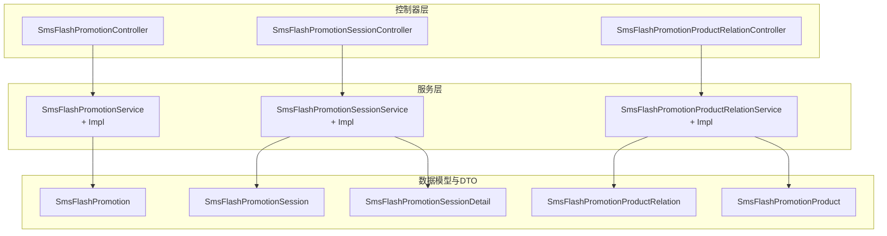
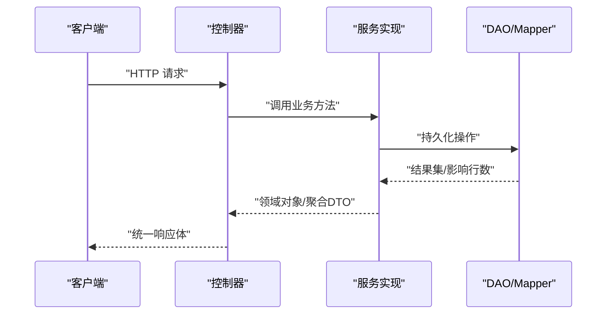
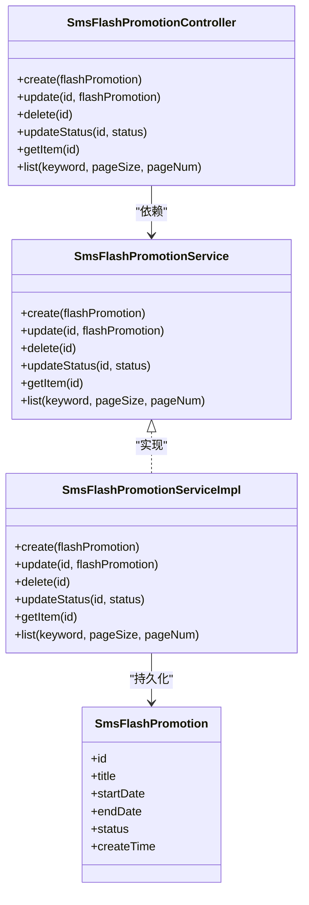
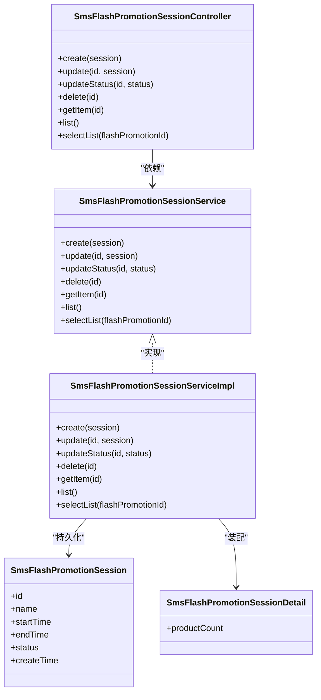
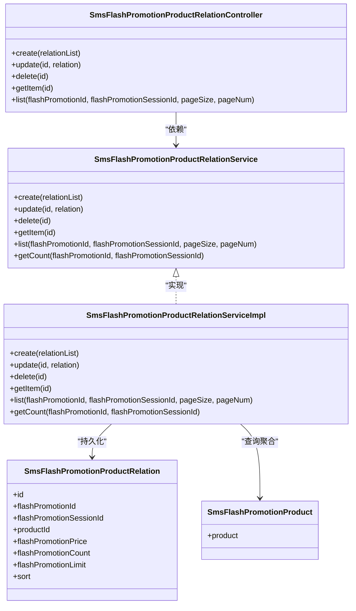
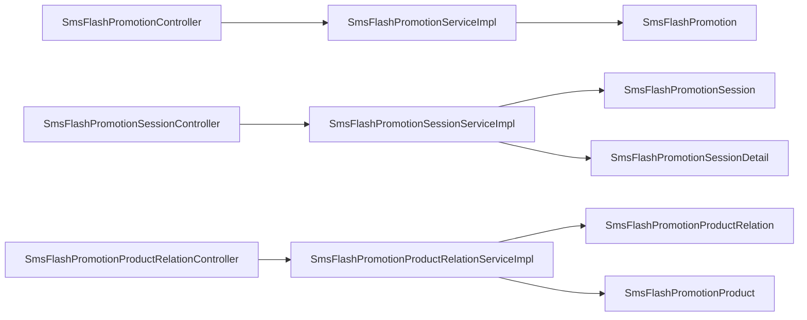

# 限时购管理

<cite>
**本文引用的文件**
- [SmsFlashPromotionController.java](file://mall-admin/src/main/java/com/macro/mall/controller/SmsFlashPromotionController.java)
- [SmsFlashPromotionSessionController.java](file://mall-admin/src/main/java/com/macro/mall/controller/SmsFlashPromotionSessionController.java)
- [SmsFlashPromotionProductRelationController.java](file://mall-admin/src/main/java/com/macro/mall/controller/SmsFlashPromotionProductRelationController.java)
- [SmsFlashPromotionService.java](file://mall-admin/src/main/java/com/macro/mall/service/SmsFlashPromotionService.java)
- [SmsFlashPromotionSessionService.java](file://mall-admin/src/main/java/com/macro/mall/service/SmsFlashPromotionSessionService.java)
- [SmsFlashPromotionProductRelationService.java](file://mall-admin/src/main/java/com/macro/mall/service/SmsFlashPromotionProductRelationService.java)
- [SmsFlashPromotionServiceImpl.java](file://mall-admin/src/main/java/com/macro/mall/service/impl/SmsFlashPromotionServiceImpl.java)
- [SmsFlashPromotionSessionServiceImpl.java](file://mall-admin/src/main/java/com/macro/mall/service/impl/SmsFlashPromotionSessionServiceImpl.java)
- [SmsFlashPromotionProductRelationServiceImpl.java](file://mall-admin/src/main/java/com/macro/mall/service/impl/SmsFlashPromotionProductRelationServiceImpl.java)
- [SmsFlashPromotion.java](file://mall-mbg/src/main/java/com/macro/mall/model/SmsFlashPromotion.java)
- [SmsFlashPromotionSession.java](file://mall-mbg/src/main/java/com/macro/mall/model/SmsFlashPromotionSession.java)
- [SmsFlashPromotionProductRelation.java](file://mall-mbg/src/main/java/com/macro/mall/model/SmsFlashPromotionProductRelation.java)
- [SmsFlashPromotionProduct.java](file://mall-admin/src/main/java/com/macro/mall/dto/SmsFlashPromotionProduct.java)
- [SmsFlashPromotionSessionDetail.java](file://mall-admin/src/main/java/com/macro/mall/dto/SmsFlashPromotionSessionDetail.java)
</cite>

## 目录
1. [引言](#引言)
2. [项目结构](#项目结构)
3. [核心组件](#核心组件)
4. [架构总览](#架构总览)
5. [详细组件分析](#详细组件分析)
6. [依赖分析](#依赖分析)
7. [性能考虑](#性能考虑)
8. [故障排查指南](#故障排查指南)
9. [结论](#结论)
10. [附录](#附录)

## 引言
本文件系统化梳理限时购管理模块的完整实现与使用方式，覆盖活动生命周期管理（创建、编辑、上下线）、场次（秒杀场次）配置（开始/结束时间、名称、状态）、商品关联关系（价格、库存、限购、排序）以及对应的控制器REST接口与DTO设计。同时给出运营策略与性能优化建议，帮助产品与技术团队高效落地与维护。

## 项目结构
限时购管理模块位于 mall-admin 工程中，采用经典的分层架构：控制器层负责对外暴露REST接口；服务层定义领域能力并编排业务；DAO/Mapper负责持久化访问；MBG生成的Model作为数据载体；DTO用于跨层传输与视图组装。



图表来源
- [SmsFlashPromotionController.java:1-81](file://mall-admin/src/main/java/com/macro/mall/controller/SmsFlashPromotionController.java#L1-L81)
- [SmsFlashPromotionSessionController.java:1-85](file://mall-admin/src/main/java/com/macro/mall/controller/SmsFlashPromotionSessionController.java#L1-L85)
- [SmsFlashPromotionProductRelationController.java:1-73](file://mall-admin/src/main/java/com/macro/mall/controller/SmsFlashPromotionProductRelationController.java#L1-L73)
- [SmsFlashPromotionService.java:1-42](file://mall-admin/src/main/java/com/macro/mall/service/SmsFlashPromotionService.java#L1-L42)
- [SmsFlashPromotionSessionService.java:1-48](file://mall-admin/src/main/java/com/macro/mall/service/SmsFlashPromotionSessionService.java#L1-L48)
- [SmsFlashPromotionProductRelationService.java:1-50](file://mall-admin/src/main/java/com/macro/mall/service/SmsFlashPromotionProductRelationService.java#L1-L50)
- [SmsFlashPromotionServiceImpl.java:1-64](file://mall-admin/src/main/java/com/macro/mall/service/impl/SmsFlashPromotionServiceImpl.java#L1-L64)
- [SmsFlashPromotionSessionServiceImpl.java:1-80](file://mall-admin/src/main/java/com/macro/mall/service/impl/SmsFlashPromotionSessionServiceImpl.java#L1-L80)
- [SmsFlashPromotionProductRelationServiceImpl.java:1-64](file://mall-admin/src/main/java/com/macro/mall/service/impl/SmsFlashPromotionProductRelationServiceImpl.java#L1-L64)
- [SmsFlashPromotion.java:1-85](file://mall-mbg/src/main/java/com/macro/mall/model/SmsFlashPromotion.java#L1-L85)
- [SmsFlashPromotionSession.java:1-85](file://mall-mbg/src/main/java/com/macro/mall/model/SmsFlashPromotionSession.java#L1-L85)
- [SmsFlashPromotionProductRelation.java:1-107](file://mall-mbg/src/main/java/com/macro/mall/model/SmsFlashPromotionProductRelation.java#L1-L107)
- [SmsFlashPromotionProduct.java:1-17](file://mall-admin/src/main/java/com/macro/mall/dto/SmsFlashPromotionProduct.java#L1-L17)
- [SmsFlashPromotionSessionDetail.java:1-16](file://mall-admin/src/main/java/com/macro/mall/dto/SmsFlashPromotionSessionDetail.java#L1-L16)

章节来源
- [SmsFlashPromotionController.java:1-81](file://mall-admin/src/main/java/com/macro/mall/controller/SmsFlashPromotionController.java#L1-L81)
- [SmsFlashPromotionSessionController.java:1-85](file://mall-admin/src/main/java/com/macro/mall/controller/SmsFlashPromotionSessionController.java#L1-L85)
- [SmsFlashPromotionProductRelationController.java:1-73](file://mall-admin/src/main/java/com/macro/mall/controller/SmsFlashPromotionProductRelationController.java#L1-L73)

## 核心组件
- 活动管理控制器与服务：负责限时购活动的增删改查、上下线切换与分页查询。
- 场次管理控制器与服务：负责场次的增删改查、启用停用、获取全部场次及“可选场次+商品数量”列表。
- 商品关联关系控制器与服务：负责批量建立/更新/删除关联、按活动+场次分页查询限时购商品、统计数量。
- 数据模型与DTO：活动、场次、关联关系的实体定义；用于返回商品详情与场次详情的DTO扩展。

章节来源
- [SmsFlashPromotionService.java:1-42](file://mall-admin/src/main/java/com/macro/mall/service/SmsFlashPromotionService.java#L1-L42)
- [SmsFlashPromotionSessionService.java:1-48](file://mall-admin/src/main/java/com/macro/mall/service/SmsFlashPromotionSessionService.java#L1-L48)
- [SmsFlashPromotionProductRelationService.java:1-50](file://mall-admin/src/main/java/com/macro/mall/service/SmsFlashPromotionProductRelationService.java#L1-L50)
- [SmsFlashPromotionServiceImpl.java:1-64](file://mall-admin/src/main/java/com/macro/mall/service/impl/SmsFlashPromotionServiceImpl.java#L1-L64)
- [SmsFlashPromotionSessionServiceImpl.java:1-80](file://mall-admin/src/main/java/com/macro/mall/service/impl/SmsFlashPromotionSessionServiceImpl.java#L1-L80)
- [SmsFlashPromotionProductRelationServiceImpl.java:1-64](file://mall-admin/src/main/java/com/macro/mall/service/impl/SmsFlashPromotionProductRelationServiceImpl.java#L1-L64)
- [SmsFlashPromotion.java:1-85](file://mall-mbg/src/main/java/com/macro/mall/model/SmsFlashPromotion.java#L1-L85)
- [SmsFlashPromotionSession.java:1-85](file://mall-mbg/src/main/java/com/macro/mall/model/SmsFlashPromotionSession.java#L1-L85)
- [SmsFlashPromotionProductRelation.java:1-107](file://mall-mbg/src/main/java/com/macro/mall/model/SmsFlashPromotionProductRelation.java#L1-L107)
- [SmsFlashPromotionProduct.java:1-17](file://mall-admin/src/main/java/com/macro/mall/dto/SmsFlashPromotionProduct.java#L1-L17)
- [SmsFlashPromotionSessionDetail.java:1-16](file://mall-admin/src/main/java/com/macro/mall/dto/SmsFlashPromotionSessionDetail.java#L1-L16)

## 架构总览
控制器通过Spring MVC接收请求，调用对应Service执行业务逻辑；Service层编排Mapper/DAO进行数据库操作；DTO用于跨层传输，避免直接暴露Model细节。



图表来源
- [SmsFlashPromotionController.java:25-33](file://mall-admin/src/main/java/com/macro/mall/controller/SmsFlashPromotionController.java#L25-L33)
- [SmsFlashPromotionServiceImpl.java:24-34](file://mall-admin/src/main/java/com/macro/mall/service/impl/SmsFlashPromotionServiceImpl.java#L24-L34)
- [SmsFlashPromotionProductRelationServiceImpl.java:25-42](file://mall-admin/src/main/java/com/macro/mall/service/impl/SmsFlashPromotionProductRelationServiceImpl.java#L25-L42)

## 详细组件分析

### 活动管理组件
- 控制器接口
  - 创建活动：POST /flash/create
  - 更新活动：POST /flash/update/{id}
  - 删除活动：POST /flash/delete/{id}
  - 更新状态：POST /flash/update/status/{id}
  - 查询单个：GET /flash/{id}
  - 分页查询：GET /flash/list（支持关键词、分页）
- 服务接口能力
  - 新增、修改、删除、按ID查询、按标题关键词分页查询
- 实现要点
  - 统一设置创建时间
  - 支持选择性更新状态字段
  - 关键词模糊匹配标题



图表来源
- [SmsFlashPromotionController.java:25-80](file://mall-admin/src/main/java/com/macro/mall/controller/SmsFlashPromotionController.java#L25-L80)
- [SmsFlashPromotionService.java:11-41](file://mall-admin/src/main/java/com/macro/mall/service/SmsFlashPromotionService.java#L11-L41)
- [SmsFlashPromotionServiceImpl.java:24-62](file://mall-admin/src/main/java/com/macro/mall/service/impl/SmsFlashPromotionServiceImpl.java#L24-L62)
- [SmsFlashPromotion.java:6-19](file://mall-mbg/src/main/java/com/macro/mall/model/SmsFlashPromotion.java#L6-L19)

章节来源
- [SmsFlashPromotionController.java:25-80](file://mall-admin/src/main/java/com/macro/mall/controller/SmsFlashPromotionController.java#L25-L80)
- [SmsFlashPromotionService.java:11-41](file://mall-admin/src/main/java/com/macro/mall/service/SmsFlashPromotionService.java#L11-L41)
- [SmsFlashPromotionServiceImpl.java:24-62](file://mall-admin/src/main/java/com/macro/mall/service/impl/SmsFlashPromotionServiceImpl.java#L24-L62)
- [SmsFlashPromotion.java:6-19](file://mall-mbg/src/main/java/com/macro/mall/model/SmsFlashPromotion.java#L6-L19)

### 场次管理组件
- 控制器接口
  - 创建场次：POST /flashSession/create
  - 更新场次：POST /flashSession/update/{id}
  - 更新状态：POST /flashSession/update/status/{id}
  - 删除场次：POST /flashSession/delete/{id}
  - 查询单个：GET /flashSession/{id}
  - 全量列表：GET /flashSession/list
  - 可选场次+数量：GET /flashSession/selectList?flashPromotionId=...
- 服务接口能力
  - 新增、修改、启用停用、删除、按ID查询、全量查询、按活动统计各场次商品数量
- 实现要点
  - 启用状态过滤（仅返回status=1）
  - 使用Bean拷贝将Session扩展为带商品数量的DTO



图表来源
- [SmsFlashPromotionSessionController.java:25-84](file://mall-admin/src/main/java/com/macro/mall/controller/SmsFlashPromotionSessionController.java#L25-L84)
- [SmsFlashPromotionSessionService.java:12-46](file://mall-admin/src/main/java/com/macro/mall/service/SmsFlashPromotionSessionService.java#L12-L46)
- [SmsFlashPromotionSessionServiceImpl.java:28-78](file://mall-admin/src/main/java/com/macro/mall/service/impl/SmsFlashPromotionSessionServiceImpl.java#L28-L78)
- [SmsFlashPromotionSession.java:6-19](file://mall-mbg/src/main/java/com/macro/mall/model/SmsFlashPromotionSession.java#L6-L19)
- [SmsFlashPromotionSessionDetail.java:11-15](file://mall-admin/src/main/java/com/macro/mall/dto/SmsFlashPromotionSessionDetail.java#L11-L15)

章节来源
- [SmsFlashPromotionSessionController.java:25-84](file://mall-admin/src/main/java/com/macro/mall/controller/SmsFlashPromotionSessionController.java#L25-L84)
- [SmsFlashPromotionSessionService.java:12-46](file://mall-admin/src/main/java/com/macro/mall/service/SmsFlashPromotionSessionService.java#L12-L46)
- [SmsFlashPromotionSessionServiceImpl.java:28-78](file://mall-admin/src/main/java/com/macro/mall/service/impl/SmsFlashPromotionSessionServiceImpl.java#L28-L78)
- [SmsFlashPromotionSession.java:6-19](file://mall-mbg/src/main/java/com/macro/mall/model/SmsFlashPromotionSession.java#L6-L19)
- [SmsFlashPromotionSessionDetail.java:11-15](file://mall-admin/src/main/java/com/macro/mall/dto/SmsFlashPromotionSessionDetail.java#L11-L15)

### 商品关联关系组件
- 控制器接口
  - 批量新增关联：POST /flashProductRelation/create
  - 更新单条关联：POST /flashProductRelation/update/{id}
  - 删除关联：POST /flashProductRelation/delete/{id}
  - 查询单条：GET /flashProductRelation/{id}
  - 分页查询限时购商品：GET /flashProductRelation/list（需传入活动ID与场次ID）
- 服务接口能力
  - 批量新增、更新、删除、按ID查询、按活动+场次分页查询、统计数量
- 实现要点
  - 分页查询通过DAO执行SQL聚合，返回包含商品详情的DTO
  - 统计数量基于条件组合查询



图表来源
- [SmsFlashPromotionProductRelationController.java:26-71](file://mall-admin/src/main/java/com/macro/mall/controller/SmsFlashPromotionProductRelationController.java#L26-L71)
- [SmsFlashPromotionProductRelationService.java:13-48](file://mall-admin/src/main/java/com/macro/mall/service/SmsFlashPromotionProductRelationService.java#L13-L48)
- [SmsFlashPromotionProductRelationServiceImpl.java:25-62](file://mall-admin/src/main/java/com/macro/mall/service/impl/SmsFlashPromotionProductRelationServiceImpl.java#L25-L62)
- [SmsFlashPromotionProductRelation.java:6-23](file://mall-mbg/src/main/java/com/macro/mall/model/SmsFlashPromotionProductRelation.java#L6-L23)
- [SmsFlashPromotionProduct.java:12-16](file://mall-admin/src/main/java/com/macro/mall/dto/SmsFlashPromotionProduct.java#L12-L16)

章节来源
- [SmsFlashPromotionProductRelationController.java:26-71](file://mall-admin/src/main/java/com/macro/mall/controller/SmsFlashPromotionProductRelationController.java#L26-L71)
- [SmsFlashPromotionProductRelationService.java:13-48](file://mall-admin/src/main/java/com/macro/mall/service/SmsFlashPromotionProductRelationService.java#L13-L48)
- [SmsFlashPromotionProductRelationServiceImpl.java:25-62](file://mall-admin/src/main/java/com/macro/mall/service/impl/SmsFlashPromotionProductRelationServiceImpl.java#L25-L62)
- [SmsFlashPromotionProductRelation.java:6-23](file://mall-mbg/src/main/java/com/macro/mall/model/SmsFlashPromotionProductRelation.java#L6-L23)
- [SmsFlashPromotionProduct.java:12-16](file://mall-admin/src/main/java/com/macro/mall/dto/SmsFlashPromotionProduct.java#L12-L16)

### 数据模型与DTO设计
- 活动模型（SmsFlashPromotion）
  - 字段：主键、标题、开始/结束时间、状态、创建时间
  - 用途：活动基本信息与状态控制
- 场次模型（SmsFlashPromotionSession）
  - 字段：主键、场次名称、开始/结束时间、状态、创建时间
  - 用途：定义秒杀场次的时间窗口与启用状态
- 关联关系模型（SmsFlashPromotionProductRelation）
  - 字段：主键、活动ID、场次ID、商品ID、限时购价格、库存总量、每人限购、排序
  - 用途：建立活动-场次-商品的多维关联与定价策略
- DTO
  - SmsFlashPromotionProduct：在关联关系基础上扩展商品详情（如名称、图片等）
  - SmsFlashPromotionSessionDetail：在场次基础上扩展“该场次下已配置的商品数量”

```mermaid
erDiagram
SMS_FLASH_PROMOTION {
bigint id PK
varchar title
datetime start_date
datetime end_date
int status
datetime create_time
}
SMS_FLASH_PROMOTION_SESSION {
bigint id PK
varchar name
datetime start_time
datetime end_time
int status
datetime create_time
}
SMS_FLASH_PROMOTION_PRODUCT_RELATION {
bigint id PK
bigint flash_promotion_id FK
bigint flash_promotion_session_id FK
bigint product_id FK
decimal flash_promotion_price
int flash_promotion_count
int flash_promotion_limit
int sort
}
PMS_PRODUCT {
bigint id PK
-- 商品基础信息由PmsProduct提供
}
SMS_FLASH_PROMOTION ||--o{ SMS_FLASH_PROMOTION_PRODUCT_RELATION : "包含"
SMS_FLASH_PROMOTION_SESSION ||--o{ SMS_FLASH_PROMOTION_PRODUCT_RELATION : "包含"
PMS_PRODUCT ||--o{ SMS_FLASH_PROMOTION_PRODUCT_RELATION : "被关联"
```

图表来源
- [SmsFlashPromotion.java:6-19](file://mall-mbg/src/main/java/com/macro/mall/model/SmsFlashPromotion.java#L6-L19)
- [SmsFlashPromotionSession.java:6-19](file://mall-mbg/src/main/java/com/macro/mall/model/SmsFlashPromotionSession.java#L6-L19)
- [SmsFlashPromotionProductRelation.java:6-23](file://mall-mbg/src/main/java/com/macro/mall/model/SmsFlashPromotionProductRelation.java#L6-L23)
- [SmsFlashPromotionProduct.java:12-16](file://mall-admin/src/main/java/com/macro/mall/dto/SmsFlashPromotionProduct.java#L12-L16)

章节来源
- [SmsFlashPromotion.java:6-19](file://mall-mbg/src/main/java/com/macro/mall/model/SmsFlashPromotion.java#L6-L19)
- [SmsFlashPromotionSession.java:6-19](file://mall-mbg/src/main/java/com/macro/mall/model/SmsFlashPromotionSession.java#L6-L19)
- [SmsFlashPromotionProductRelation.java:6-23](file://mall-mbg/src/main/java/com/macro/mall/model/SmsFlashPromotionProductRelation.java#L6-L23)
- [SmsFlashPromotionProduct.java:12-16](file://mall-admin/src/main/java/com/macro/mall/dto/SmsFlashPromotionProduct.java#L12-L16)
- [SmsFlashPromotionSessionDetail.java:11-15](file://mall-admin/src/main/java/com/macro/mall/dto/SmsFlashPromotionSessionDetail.java#L11-L15)

## 依赖分析
- 控制器到服务：强依赖注入，职责清晰
- 服务到DAO：通过Mapper/DAO访问数据库，实现关注点分离
- DTO与Model：DTO用于输出聚合信息，避免直接暴露Model内部字段
- 耦合度与内聚性：控制器仅负责参数校验与响应包装，业务逻辑集中在服务层，内聚性良好



图表来源
- [SmsFlashPromotionController.java:22-23](file://mall-admin/src/main/java/com/macro/mall/controller/SmsFlashPromotionController.java#L22-L23)
- [SmsFlashPromotionSessionController.java:22-23](file://mall-admin/src/main/java/com/macro/mall/controller/SmsFlashPromotionSessionController.java#L22-L23)
- [SmsFlashPromotionProductRelationController.java:23-24](file://mall-admin/src/main/java/com/macro/mall/controller/SmsFlashPromotionProductRelationController.java#L23-L24)
- [SmsFlashPromotionServiceImpl.java:21-22](file://mall-admin/src/main/java/com/macro/mall/service/impl/SmsFlashPromotionServiceImpl.java#L21-L22)
- [SmsFlashPromotionSessionServiceImpl.java:23-26](file://mall-admin/src/main/java/com/macro/mall/service/impl/SmsFlashPromotionSessionServiceImpl.java#L23-L26)
- [SmsFlashPromotionProductRelationServiceImpl.java:21-24](file://mall-admin/src/main/java/com/macro/mall/service/impl/SmsFlashPromotionProductRelationServiceImpl.java#L21-L24)

章节来源
- [SmsFlashPromotionController.java:22-23](file://mall-admin/src/main/java/com/macro/mall/controller/SmsFlashPromotionController.java#L22-L23)
- [SmsFlashPromotionSessionController.java:22-23](file://mall-admin/src/main/java/com/macro/mall/controller/SmsFlashPromotionSessionController.java#L22-L23)
- [SmsFlashPromotionProductRelationController.java:23-24](file://mall-admin/src/main/java/com/macro/mall/controller/SmsFlashPromotionProductRelationController.java#L23-L24)

## 性能考虑
- 分页查询
  - 活动与商品关联均使用分页组件，建议合理设置默认页大小与最大页大小，避免超大分页导致内存压力。
- 条件查询
  - 活动列表支持关键词模糊匹配，建议对标题建立索引或限制关键词长度，避免全表扫描。
- 关联查询
  - 商品关联列表通过DAO执行聚合查询，建议在活动ID、场次ID、商品ID上建立复合索引以提升查询效率。
- 状态过滤
  - 场次列表默认仅返回启用状态，减少前端筛选成本；若业务扩展更多状态，建议增加状态索引。
- 并发与事务
  - 批量新增关联使用事务注解，确保原子性；高并发场景建议评估锁粒度与重试策略，避免死锁。
- 缓存建议
  - 常用配置（如场次列表）可引入缓存降低DB压力；注意与写操作的一致性。

## 故障排查指南
- 接口返回失败
  - 检查控制器返回值与受影响行数是否符合预期；确认服务层异常未被捕获或未正确转换为统一响应。
- 分页结果为空
  - 核对分页参数（页码、每页大小）与实际数据量；检查关键词匹配条件是否过严。
- 场次统计数量不准确
  - 确认统计方法是否正确限定活动ID与场次ID；检查是否存在软删除或状态过滤逻辑。
- 批量导入关联失败
  - 核对传入的关联列表格式与必填字段；查看事务回滚原因（如唯一约束冲突）。

章节来源
- [SmsFlashPromotionController.java:27-33](file://mall-admin/src/main/java/com/macro/mall/controller/SmsFlashPromotionController.java#L27-L33)
- [SmsFlashPromotionSessionController.java:27-33](file://mall-admin/src/main/java/com/macro/mall/controller/SmsFlashPromotionSessionController.java#L27-L33)
- [SmsFlashPromotionProductRelationController.java:28-34](file://mall-admin/src/main/java/com/macro/mall/controller/SmsFlashPromotionProductRelationController.java#L28-L34)
- [SmsFlashPromotionProductRelationServiceImpl.java:55-62](file://mall-admin/src/main/java/com/macro/mall/service/impl/SmsFlashPromotionProductRelationServiceImpl.java#L55-L62)

## 结论
限时购管理模块通过清晰的分层设计与完善的DTO/Model定义，实现了从活动、场次到商品关联的全链路管理。REST接口覆盖了运营所需的常用操作，并通过分页与条件查询满足不同规模的数据展示需求。结合合理的索引与缓存策略，可在高并发场景下保持稳定性能。

## 附录
- 运营策略建议
  - 活动规划：提前设定活动周期与场次分布，避免时间重叠；根据销售节奏设置场次密度。
  - 商品池管理：按品类与利润贡献度筛选商品，设置合理库存与限购，防止刷单与黄牛。
  - 价格策略：限时购价格应显著低于日常价，同时保证毛利空间；结合满减/券叠加策略提升转化。
  - 宣传配合：在活动前预热，场次开始前提醒，提升流量与转化。
- 性能优化清单
  - 建立必要索引：活动ID/场次ID/商品ID复合索引；标题模糊索引（如适用）。
  - 分页参数上限：限制最大页大小，避免超大分页。
  - 缓存热点：场次列表、热门商品信息可做缓存；写操作时失效。
  - 事务边界：批量导入时控制单次事务大小，避免长时间锁表。