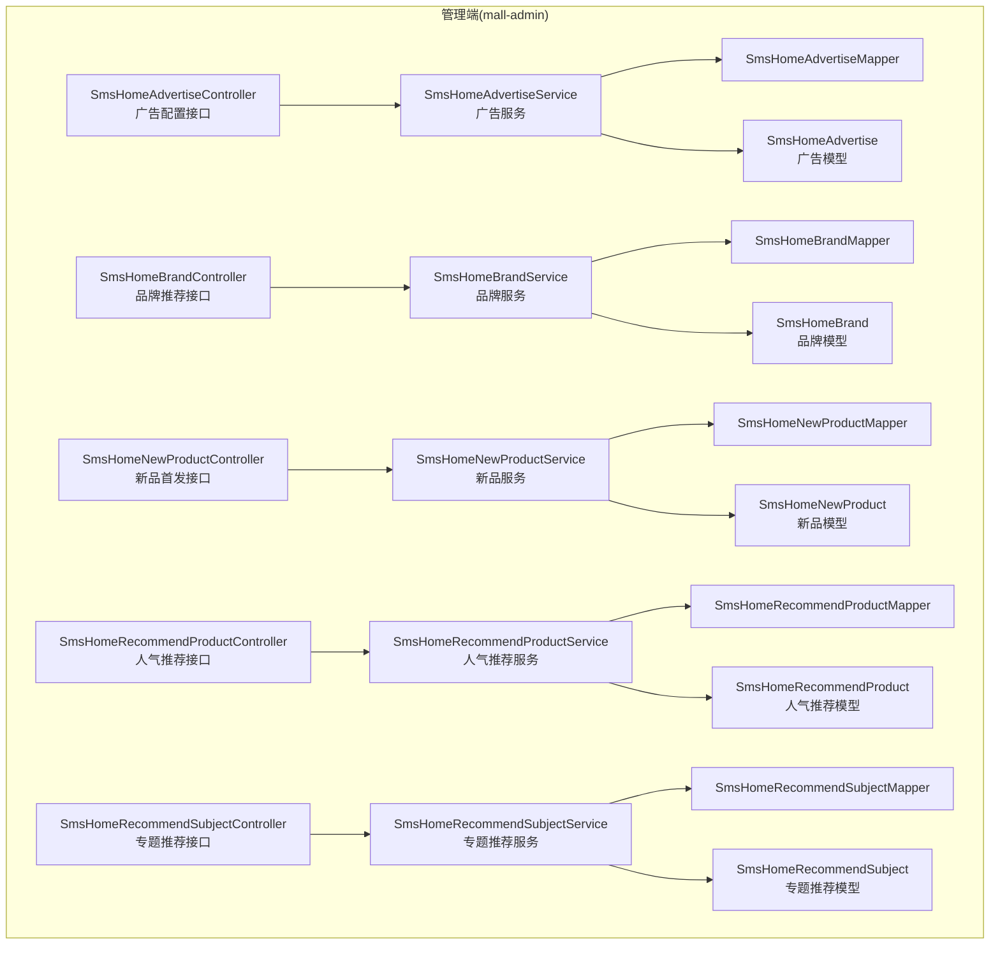
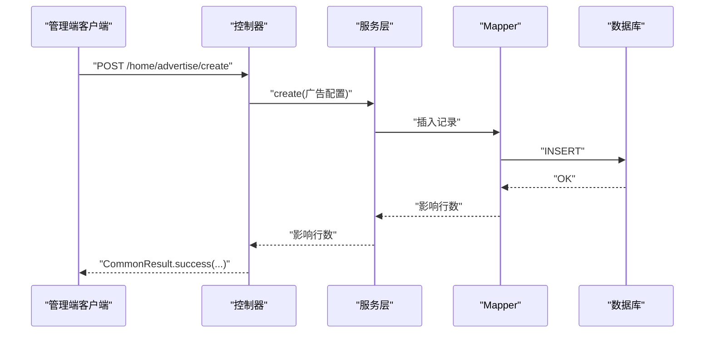
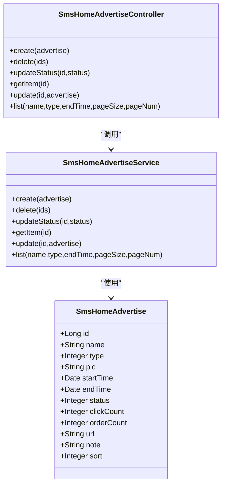
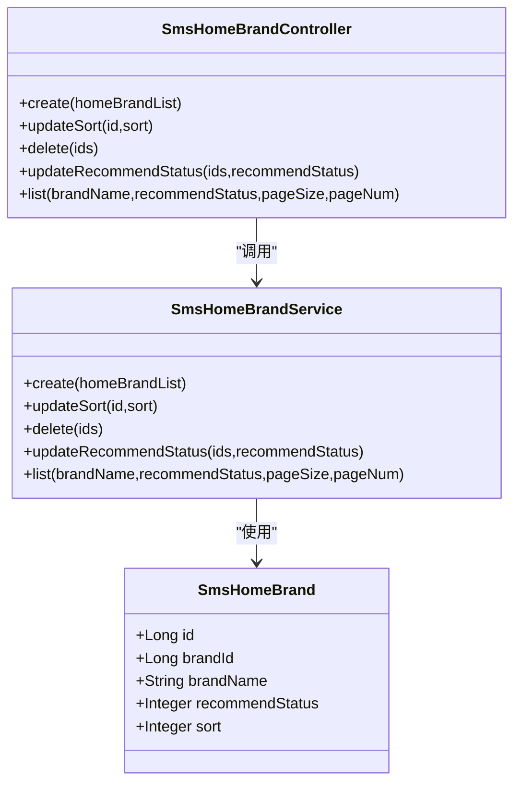
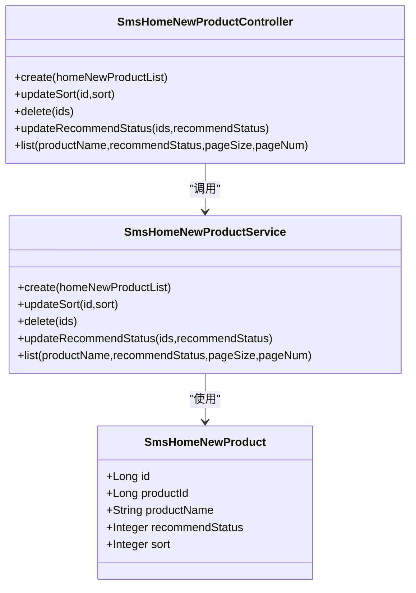
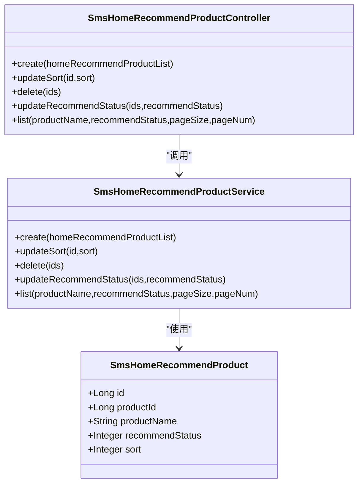
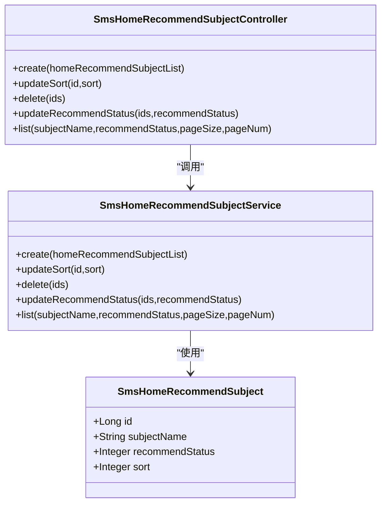
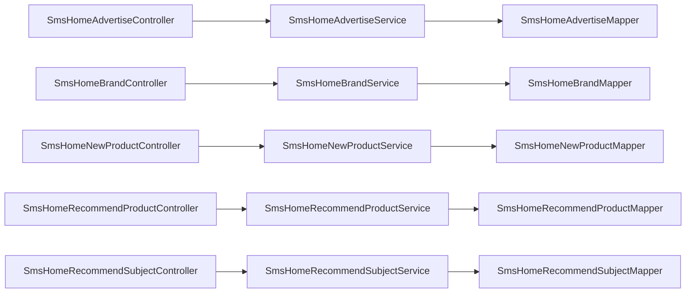

# 首页配置管理

<cite>
**本文引用的文件**
- [mall-admin/src/main/java/com/macro/mall/controller/SmsHomeAdvertiseController.java](file://mall-admin/src/main/java/com/macro/mall/controller/SmsHomeAdvertiseController.java)
- [mall-admin/src/main/java/com/macro/mall/controller/SmsHomeBrandController.java](file://mall-admin/src/main/java/com/macro/mall/controller/SmsHomeBrandController.java)
- [mall-admin/src/main/java/com/macro/mall/controller/SmsHomeNewProductController.java](file://mall-admin/src/main/java/com/macro/mall/controller/SmsHomeNewProductController.java)
- [mall-admin/src/main/java/com/macro/mall/controller/SmsHomeRecommendProductController.java](file://mall-admin/src/main/java/com/macro/mall/controller/SmsHomeRecommendProductController.java)
- [mall-admin/src/main/java/com/macro/mall/controller/SmsHomeRecommendSubjectController.java](file://mall-admin/src/main/java/com/macro/mall/controller/SmsHomeRecommendSubjectController.java)
- [mall-admin/src/main/java/com/macro/mall/service/SmsHomeAdvertiseService.java](file://mall-admin/src/main/java/com/macro/mall/service/SmsHomeAdvertiseService.java)
- [mall-admin/src/main/java/com/macro/mall/service/SmsHomeBrandService.java](file://mall-admin/src/main/java/com/macro/mall/service/SmsHomeBrandService.java)
- [mall-admin/src/main/java/com/macro/mall/service/SmsHomeNewProductService.java](file://mall-admin/src/main/java/com/macro/mall/service/SmsHomeNewProductService.java)
- [mall-admin/src/main/java/com/macro/mall/service/SmsHomeRecommendProductService.java](file://mall-admin/src/main/java/com/macro/mall/service/SmsHomeRecommendProductService.java)
- [mall-admin/src/main/java/com/macro/mall/service/SmsHomeRecommendSubjectService.java](file://mall-admin/src/main/java/com/macro/mall/service/SmsHomeRecommendSubjectService.java)
- [mall-mbg/src/main/java/com/macro/mall/model/SmsHomeAdvertise.java](file://mall-mbg/src/main/java/com/macro/mall/model/SmsHomeAdvertise.java)
- [mall-mbg/src/main/java/com/macro/mall/model/SmsHomeBrand.java](file://mall-mbg/src/main/java/com/macro/mall/model/SmsHomeBrand.java)
- [mall-mbg/src/main/java/com/macro/mall/model/SmsHomeNewProduct.java](file://mall-mbg/src/main/java/com/macro/mall/model/SmsHomeNewProduct.java)
- [mall-mbg/src/main/java/com/macro/mall/model/SmsHomeRecommendProduct.java](file://mall-mbg/src/main/java/com/macro/mall/model/SmsHomeRecommendProduct.java)
- [mall-mbg/src/main/java/com/macro/mall/model/SmsHomeRecommendSubject.java](file://mall-mbg/src/main/java/com/macro/mall/model/SmsHomeRecommendSubject.java)
- [mall-mbg/src/main/java/com/macro/mall/mapper/SmsHomeAdvertiseMapper.java](file://mall-mbg/src/main/java/com/macro/mall/mapper/SmsHomeAdvertiseMapper.java)
- [mall-mbg/src/main/java/com/macro/mall/mapper/SmsHomeBrandMapper.java](file://mall-mbg/src/main/java/com/macro/mall/mapper/SmsHomeBrandMapper.java)
- [mall-mbg/src/main/java/com/macro/mall/mapper/SmsHomeNewProductMapper.java](file://mall-mbg/src/main/java/com/macro/mall/mapper/SmsHomeNewProductMapper.java)
- [mall-mbg/src/main/java/com/macro/mall/mapper/SmsHomeRecommendProductMapper.java](file://mall-mbg/src/main/java/com/macro/mall/mapper/SmsHomeRecommendProductMapper.java)
- [mall-mbg/src/main/java/com/macro/mall/mapper/SmsHomeRecommendSubjectMapper.java](file://mall-mbg/src/main/java/com/macro/mall/mapper/SmsHomeRecommendSubjectMapper.java)
</cite>

## 目录
1. [简介](#简介)
2. [项目结构](#项目结构)
3. [核心组件](#核心组件)
4. [架构总览](#架构总览)
5. [详细组件分析](#详细组件分析)
6. [依赖关系分析](#依赖关系分析)
7. [性能考量](#性能考量)
8. [故障排查指南](#故障排查指南)
9. [结论](#结论)
10. [附录](#附录)

## 简介
本文件系统化梳理商城首页配置管理模块，覆盖首页广告位、品牌推荐、新品首发、人气推荐商品、专题推荐等五大模块的配置能力与数据结构；阐述各模块的REST接口设计、状态与排序控制、展示顺序与跳转链接配置；并结合运营视角给出视觉设计、用户体验与转化率优化建议，以及SEO与移动端适配策略。

## 项目结构
首页配置管理采用“控制器-服务-持久层”分层架构，围绕五个首页推荐实体分别提供独立的控制器与服务接口，统一通过通用响应包装返回结果。

图表来源
- [mall-admin/src/main/java/com/macro/mall/controller/SmsHomeAdvertiseController.java:1-79](file://mall-admin/src/main/java/com/macro/mall/controller/SmsHomeAdvertiseController.java#L1-L79)
- [mall-admin/src/main/java/com/macro/mall/controller/SmsHomeBrandController.java:1-75](file://mall-admin/src/main/java/com/macro/mall/controller/SmsHomeBrandController.java#L1-L75)
- [mall-admin/src/main/java/com/macro/mall/controller/SmsHomeNewProductController.java:1-75](file://mall-admin/src/main/java/com/macro/mall/controller/SmsHomeNewProductController.java#L1-L75)
- [mall-admin/src/main/java/com/macro/mall/controller/SmsHomeRecommendProductController.java:1-75](file://mall-admin/src/main/java/com/macro/mall/controller/SmsHomeRecommendProductController.java#L1-L75)
- [mall-admin/src/main/java/com/macro/mall/controller/SmsHomeRecommendSubjectController.java:1-75](file://mall-admin/src/main/java/com/macro/mall/controller/SmsHomeRecommendSubjectController.java#L1-L75)
- [mall-admin/src/main/java/com/macro/mall/service/SmsHomeAdvertiseService.java:1-42](file://mall-admin/src/main/java/com/macro/mall/service/SmsHomeAdvertiseService.java#L1-L42)
- [mall-admin/src/main/java/com/macro/mall/service/SmsHomeBrandService.java:1-39](file://mall-admin/src/main/java/com/macro/mall/service/SmsHomeBrandService.java#L1-L39)
- [mall-admin/src/main/java/com/macro/mall/service/SmsHomeNewProductService.java:1-39](file://mall-admin/src/main/java/com/macro/mall/service/SmsHomeNewProductService.java#L1-L39)
- [mall-admin/src/main/java/com/macro/mall/service/SmsHomeRecommendProductService.java:1-39](file://mall-admin/src/main/java/com/macro/mall/service/SmsHomeRecommendProductService.java#L1-L39)
- [mall-admin/src/main/java/com/macro/mall/service/SmsHomeRecommendSubjectService.java:1-39](file://mall-admin/src/main/java/com/macro/mall/service/SmsHomeRecommendSubjectService.java#L1-L39)
- [mall-mbg/src/main/java/com/macro/mall/model/SmsHomeAdvertise.java:1-151](file://mall-mbg/src/main/java/com/macro/mall/model/SmsHomeAdvertise.java#L1-L151)
- [mall-mbg/src/main/java/com/macro/mall/model/SmsHomeBrand.java:1-73](file://mall-mbg/src/main/java/com/macro/mall/model/SmsHomeBrand.java#L1-L73)
- [mall-mbg/src/main/java/com/macro/mall/model/SmsHomeNewProduct.java:1-73](file://mall-mbg/src/main/java/com/macro/mall/model/SmsHomeNewProduct.java#L1-L73)
- [mall-mbg/src/main/java/com/macro/mall/model/SmsHomeRecommendProduct.java](file://mall-mbg/src/main/java/com/macro/mall/model/SmsHomeRecommendProduct.java)
- [mall-mbg/src/main/java/com/macro/mall/model/SmsHomeRecommendSubject.java](file://mall-mbg/src/main/java/com/macro/mall/model/SmsHomeRecommendSubject.java)
- [mall-mbg/src/main/java/com/macro/mall/mapper/SmsHomeAdvertiseMapper.java](file://mall-mbg/src/main/java/com/macro/mall/mapper/SmsHomeAdvertiseMapper.java)
- [mall-mbg/src/main/java/com/macro/mall/mapper/SmsHomeBrandMapper.java](file://mall-mbg/src/main/java/com/macro/mall/mapper/SmsHomeBrandMapper.java)
- [mall-mbg/src/main/java/com/macro/mall/mapper/SmsHomeNewProductMapper.java](file://mall-mbg/src/main/java/com/macro/mall/mapper/SmsHomeNewProductMapper.java)
- [mall-mbg/src/main/java/com/macro/mall/mapper/SmsHomeRecommendProductMapper.java](file://mall-mbg/src/main/java/com/macro/mall/mapper/SmsHomeRecommendProductMapper.java)
- [mall-mbg/src/main/java/com/macro/mall/mapper/SmsHomeRecommendSubjectMapper.java](file://mall-mbg/src/main/java/com/macro/mall/mapper/SmsHomeRecommendSubjectMapper.java)

章节来源
- [mall-admin/src/main/java/com/macro/mall/controller/SmsHomeAdvertiseController.java:1-79](file://mall-admin/src/main/java/com/macro/mall/controller/SmsHomeAdvertiseController.java#L1-L79)
- [mall-admin/src/main/java/com/macro/mall/controller/SmsHomeBrandController.java:1-75](file://mall-admin/src/main/java/com/macro/mall/controller/SmsHomeBrandController.java#L1-L75)
- [mall-admin/src/main/java/com/macro/mall/controller/SmsHomeNewProductController.java:1-75](file://mall-admin/src/main/java/com/macro/mall/controller/SmsHomeNewProductController.java#L1-L75)
- [mall-admin/src/main/java/com/macro/mall/controller/SmsHomeRecommendProductController.java:1-75](file://mall-admin/src/main/java/com/macro/mall/controller/SmsHomeRecommendProductController.java#L1-L75)
- [mall-admin/src/main/java/com/macro/mall/controller/SmsHomeRecommendSubjectController.java:1-75](file://mall-admin/src/main/java/com/macro/mall/controller/SmsHomeRecommendSubjectController.java#L1-L75)

## 核心组件
- 广告配置模块：支持新增、删除、上下线切换、按名称/类型/结束时间分页查询、单条查询与更新。
- 品牌推荐模块：支持批量新增品牌推荐、按推荐状态与品牌名分页查询、批量删除、批量修改推荐状态、单个排序调整。
- 新品首发模块：支持批量新增新品推荐、按推荐状态与商品名分页查询、批量删除、批量修改推荐状态、单个排序调整。
- 人气推荐模块：支持批量新增人气推荐、按推荐状态与商品名分页查询、批量删除、批量修改推荐状态、单个排序调整。
- 专题推荐模块：支持批量新增专题推荐、按推荐状态与专题名分页查询、批量删除、批量修改推荐状态、单个排序调整。

章节来源
- [mall-admin/src/main/java/com/macro/mall/controller/SmsHomeAdvertiseController.java:25-77](file://mall-admin/src/main/java/com/macro/mall/controller/SmsHomeAdvertiseController.java#L25-L77)
- [mall-admin/src/main/java/com/macro/mall/controller/SmsHomeBrandController.java:25-73](file://mall-admin/src/main/java/com/macro/mall/controller/SmsHomeBrandController.java#L25-L73)
- [mall-admin/src/main/java/com/macro/mall/controller/SmsHomeNewProductController.java:25-73](file://mall-admin/src/main/java/com/macro/mall/controller/SmsHomeNewProductController.java#L25-L73)
- [mall-admin/src/main/java/com/macro/mall/controller/SmsHomeRecommendProductController.java:25-73](file://mall-admin/src/main/java/com/macro/mall/controller/SmsHomeRecommendProductController.java#L25-L73)
- [mall-admin/src/main/java/com/macro/mall/controller/SmsHomeRecommendSubjectController.java:25-73](file://mall-admin/src/main/java/com/macro/mall/controller/SmsHomeRecommendSubjectController.java#L25-L73)

## 架构总览
首页配置管理遵循标准的三层架构：控制器负责HTTP请求映射与参数校验，服务层封装业务逻辑（含事务控制），持久层通过MyBatis Mapper访问数据库。所有接口返回统一的通用结果包装。

图表来源
- [mall-admin/src/main/java/com/macro/mall/controller/SmsHomeAdvertiseController.java:25-32](file://mall-admin/src/main/java/com/macro/mall/controller/SmsHomeAdvertiseController.java#L25-L32)
- [mall-admin/src/main/java/com/macro/mall/service/SmsHomeAdvertiseService.java:15-15](file://mall-admin/src/main/java/com/macro/mall/service/SmsHomeAdvertiseService.java#L15-L15)
- [mall-mbg/src/main/java/com/macro/mall/mapper/SmsHomeAdvertiseMapper.java](file://mall-mbg/src/main/java/com/macro/mall/mapper/SmsHomeAdvertiseMapper.java)

## 详细组件分析

### 广告配置模块
- 数据结构要点
  - 名称、类型、图片地址、起止时间、状态、点击/下单计数、跳转链接、备注、排序等字段构成完整的广告位配置。
- 接口能力
  - 创建、删除（批量）、上下线切换、按条件分页查询、单条查询、更新。
- 关键流程
  - 创建时写入图片URL与跳转链接；更新时可变更状态与排序；分页查询支持按名称、类型、结束时间过滤。

图表来源
- [mall-mbg/src/main/java/com/macro/mall/model/SmsHomeAdvertise.java:6-31](file://mall-mbg/src/main/java/com/macro/mall/model/SmsHomeAdvertise.java#L6-L31)
- [mall-admin/src/main/java/com/macro/mall/controller/SmsHomeAdvertiseController.java:21-77](file://mall-admin/src/main/java/com/macro/mall/controller/SmsHomeAdvertiseController.java#L21-L77)
- [mall-admin/src/main/java/com/macro/mall/service/SmsHomeAdvertiseService.java:11-41](file://mall-admin/src/main/java/com/macro/mall/service/SmsHomeAdvertiseService.java#L11-L41)

章节来源
- [mall-mbg/src/main/java/com/macro/mall/model/SmsHomeAdvertise.java:1-151](file://mall-mbg/src/main/java/com/macro/mall/model/SmsHomeAdvertise.java#L1-L151)
- [mall-admin/src/main/java/com/macro/mall/controller/SmsHomeAdvertiseController.java:25-77](file://mall-admin/src/main/java/com/macro/mall/controller/SmsHomeAdvertiseController.java#L25-L77)
- [mall-admin/src/main/java/com/macro/mall/service/SmsHomeAdvertiseService.java:11-41](file://mall-admin/src/main/java/com/macro/mall/service/SmsHomeAdvertiseService.java#L11-L41)

### 品牌推荐模块
- 数据结构要点
  - 关联品牌ID与品牌名、推荐状态、排序。
- 接口能力
  - 批量新增、按品牌名与推荐状态分页查询、批量删除、批量修改推荐状态、单个排序调整。
- 运营要点
  - 通过推荐状态与排序控制首页品牌位的曝光优先级。

图表来源
- [mall-mbg/src/main/java/com/macro/mall/model/SmsHomeBrand.java:5-16](file://mall-mbg/src/main/java/com/macro/mall/model/SmsHomeBrand.java#L5-L16)
- [mall-admin/src/main/java/com/macro/mall/controller/SmsHomeBrandController.java:21-73](file://mall-admin/src/main/java/com/macro/mall/controller/SmsHomeBrandController.java#L21-L73)
- [mall-admin/src/main/java/com/macro/mall/service/SmsHomeBrandService.java:12-38](file://mall-admin/src/main/java/com/macro/mall/service/SmsHomeBrandService.java#L12-L38)

章节来源
- [mall-mbg/src/main/java/com/macro/mall/model/SmsHomeBrand.java:1-73](file://mall-mbg/src/main/java/com/macro/mall/model/SmsHomeBrand.java#L1-L73)
- [mall-admin/src/main/java/com/macro/mall/controller/SmsHomeBrandController.java:25-73](file://mall-admin/src/main/java/com/macro/mall/controller/SmsHomeBrandController.java#L25-L73)
- [mall-admin/src/main/java/com/macro/mall/service/SmsHomeBrandService.java:12-38](file://mall-admin/src/main/java/com/macro/mall/service/SmsHomeBrandService.java#L12-L38)

### 新品首发模块
- 数据结构要点
  - 关联商品ID与商品名、推荐状态、排序。
- 接口能力
  - 批量新增、按商品名与推荐状态分页查询、批量删除、批量修改推荐状态、单个排序调整。

图表来源
- [mall-mbg/src/main/java/com/macro/mall/model/SmsHomeNewProduct.java:5-16](file://mall-mbg/src/main/java/com/macro/mall/model/SmsHomeNewProduct.java#L5-L16)
- [mall-admin/src/main/java/com/macro/mall/controller/SmsHomeNewProductController.java:21-73](file://mall-admin/src/main/java/com/macro/mall/controller/SmsHomeNewProductController.java#L21-L73)
- [mall-admin/src/main/java/com/macro/mall/service/SmsHomeNewProductService.java:12-38](file://mall-admin/src/main/java/com/macro/mall/service/SmsHomeNewProductService.java#L12-L38)

章节来源
- [mall-mbg/src/main/java/com/macro/mall/model/SmsHomeNewProduct.java:1-73](file://mall-mbg/src/main/java/com/macro/mall/model/SmsHomeNewProduct.java#L1-L73)
- [mall-admin/src/main/java/com/macro/mall/controller/SmsHomeNewProductController.java:25-73](file://mall-admin/src/main/java/com/macro/mall/controller/SmsHomeNewProductController.java#L25-L73)
- [mall-admin/src/main/java/com/macro/mall/service/SmsHomeNewProductService.java:12-38](file://mall-admin/src/main/java/com/macro/mall/service/SmsHomeNewProductService.java#L12-L38)

### 人气推荐模块
- 数据结构要点
  - 关联商品ID与商品名、推荐状态、排序。
- 接口能力
  - 批量新增、按商品名与推荐状态分页查询、批量删除、批量修改推荐状态、单个排序调整。

图表来源
- [mall-mbg/src/main/java/com/macro/mall/model/SmsHomeRecommendProduct.java](file://mall-mbg/src/main/java/com/macro/mall/model/SmsHomeRecommendProduct.java)
- [mall-admin/src/main/java/com/macro/mall/controller/SmsHomeRecommendProductController.java:21-73](file://mall-admin/src/main/java/com/macro/mall/controller/SmsHomeRecommendProductController.java#L21-L73)
- [mall-admin/src/main/java/com/macro/mall/service/SmsHomeRecommendProductService.java:12-38](file://mall-admin/src/main/java/com/macro/mall/service/SmsHomeRecommendProductService.java#L12-L38)

章节来源
- [mall-mbg/src/main/java/com/macro/mall/model/SmsHomeRecommendProduct.java](file://mall-mbg/src/main/java/com/macro/mall/model/SmsHomeRecommendProduct.java)
- [mall-admin/src/main/java/com/macro/mall/controller/SmsHomeRecommendProductController.java:25-73](file://mall-admin/src/main/java/com/macro/mall/controller/SmsHomeRecommendProductController.java#L25-L73)
- [mall-admin/src/main/java/com/macro/mall/service/SmsHomeRecommendProductService.java:12-38](file://mall-admin/src/main/java/com/macro/mall/service/SmsHomeRecommendProductService.java#L12-L38)

### 专题推荐模块
- 数据结构要点
  - 专题名称、推荐状态、排序。
- 接口能力
  - 批量新增、按专题名与推荐状态分页查询、批量删除、批量修改推荐状态、单个排序调整。

图表来源
- [mall-mbg/src/main/java/com/macro/mall/model/SmsHomeRecommendSubject.java](file://mall-mbg/src/main/java/com/macro/mall/model/SmsHomeRecommendSubject.java)
- [mall-admin/src/main/java/com/macro/mall/controller/SmsHomeRecommendSubjectController.java:21-73](file://mall-admin/src/main/java/com/macro/mall/controller/SmsHomeRecommendSubjectController.java#L21-L73)
- [mall-admin/src/main/java/com/macro/mall/service/SmsHomeRecommendSubjectService.java:12-38](file://mall-admin/src/main/java/com/macro/mall/service/SmsHomeRecommendSubjectService.java#L12-L38)

章节来源
- [mall-mbg/src/main/java/com/macro/mall/model/SmsHomeRecommendSubject.java](file://mall-mbg/src/main/java/com/macro/mall/model/SmsHomeRecommendSubject.java)
- [mall-admin/src/main/java/com/macro/mall/controller/SmsHomeRecommendSubjectController.java:25-73](file://mall-admin/src/main/java/com/macro/mall/controller/SmsHomeRecommendSubjectController.java#L25-L73)
- [mall-admin/src/main/java/com/macro/mall/service/SmsHomeRecommendSubjectService.java:12-38](file://mall-admin/src/main/java/com/macro/mall/service/SmsHomeRecommendSubjectService.java#L12-L38)

## 依赖关系分析
- 控制器到服务：每个控制器均通过@Autowired注入对应服务，集中处理参数与返回值包装。
- 服务到持久层：服务方法通过Mapper执行数据库操作，部分服务方法标注事务以保证批量操作一致性。
- 模型到映射：各实体模型与Mapper一一对应，字段与表结构保持一致。

图表来源
- [mall-admin/src/main/java/com/macro/mall/controller/SmsHomeAdvertiseController.java:22-23](file://mall-admin/src/main/java/com/macro/mall/controller/SmsHomeAdvertiseController.java#L22-L23)
- [mall-admin/src/main/java/com/macro/mall/controller/SmsHomeBrandController.java:23-23](file://mall-admin/src/main/java/com/macro/mall/controller/SmsHomeBrandController.java#L23-L23)
- [mall-admin/src/main/java/com/macro/mall/controller/SmsHomeNewProductController.java:23-23](file://mall-admin/src/main/java/com/macro/mall/controller/SmsHomeNewProductController.java#L23-L23)
- [mall-admin/src/main/java/com/macro/mall/controller/SmsHomeRecommendProductController.java:23-23](file://mall-admin/src/main/java/com/macro/mall/controller/SmsHomeRecommendProductController.java#L23-L23)
- [mall-admin/src/main/java/com/macro/mall/controller/SmsHomeRecommendSubjectController.java:23-23](file://mall-admin/src/main/java/com/macro/mall/controller/SmsHomeRecommendSubjectController.java#L23-L23)
- [mall-mbg/src/main/java/com/macro/mall/mapper/SmsHomeAdvertiseMapper.java](file://mall-mbg/src/main/java/com/macro/mall/mapper/SmsHomeAdvertiseMapper.java)
- [mall-mbg/src/main/java/com/macro/mall/mapper/SmsHomeBrandMapper.java](file://mall-mbg/src/main/java/com/macro/mall/mapper/SmsHomeBrandMapper.java)
- [mall-mbg/src/main/java/com/macro/mall/mapper/SmsHomeNewProductMapper.java](file://mall-mbg/src/main/java/com/macro/mall/mapper/SmsHomeNewProductMapper.java)
- [mall-mbg/src/main/java/com/macro/mall/mapper/SmsHomeRecommendProductMapper.java](file://mall-mbg/src/main/java/com/macro/mall/mapper/SmsHomeRecommendProductMapper.java)
- [mall-mbg/src/main/java/com/macro/mall/mapper/SmsHomeRecommendSubjectMapper.java](file://mall-mbg/src/main/java/com/macro/mall/mapper/SmsHomeRecommendSubjectMapper.java)

章节来源
- [mall-admin/src/main/java/com/macro/mall/service/SmsHomeAdvertiseService.java:1-42](file://mall-admin/src/main/java/com/macro/mall/service/SmsHomeAdvertiseService.java#L1-L42)
- [mall-admin/src/main/java/com/macro/mall/service/SmsHomeBrandService.java:1-39](file://mall-admin/src/main/java/com/macro/mall/service/SmsHomeBrandService.java#L1-L39)
- [mall-admin/src/main/java/com/macro/mall/service/SmsHomeNewProductService.java:1-39](file://mall-admin/src/main/java/com/macro/mall/service/SmsHomeNewProductService.java#L1-L39)
- [mall-admin/src/main/java/com/macro/mall/service/SmsHomeRecommendProductService.java:1-39](file://mall-admin/src/main/java/com/macro/mall/service/SmsHomeRecommendProductService.java#L1-L39)
- [mall-admin/src/main/java/com/macro/mall/service/SmsHomeRecommendSubjectService.java:1-39](file://mall-admin/src/main/java/com/macro/mall/service/SmsHomeRecommendSubjectService.java#L1-L39)

## 性能考量
- 分页查询：列表接口统一支持分页参数，建议在大数据量场景下合理设置每页大小，避免一次性加载过多数据。
- 批量操作：品牌、新品、人气、专题模块提供批量新增与批量状态更新，减少网络往返，提高运营效率。
- 排序与状态：通过排序字段与推荐状态快速控制展示优先级，降低前端复杂度。
- 缓存与索引：可在查询高频字段（如推荐状态、商品名/品牌名）上建立索引，结合缓存策略优化读取性能。

## 故障排查指南
- 统一响应包装：所有接口返回通用结果对象，便于前端统一处理错误与成功状态。
- 参数校验：控制器接收参数时应确保必填项与格式正确（如ID列表、排序整数、状态枚举）。
- 事务边界：批量新增与批量状态更新涉及多条记录，需关注事务提交与回滚，避免部分成功导致的数据不一致。
- 日志与监控：建议在服务层与控制器层增加关键操作日志，便于问题定位与审计。

## 结论
首页配置管理模块以清晰的分层架构与统一的接口规范支撑了广告、品牌、新品、人气、专题五大推荐位的配置与运营需求。通过标准化的数据结构与REST接口，实现了高效的配置管理与灵活的展示控制。配合合理的运营策略与性能优化，可显著提升首页转化效果与用户体验。

## 附录

### 接口清单与字段说明
- 广告配置接口
  - POST /home/advertise/create：创建广告，请求体为广告配置对象。
  - POST /home/advertise/delete：批量删除广告，参数为ID列表。
  - POST /home/advertise/update/status/{id}：切换广告上下线状态。
  - GET /home/advertise/{id}：查询单条广告详情。
  - POST /home/advertise/update/{id}：更新广告配置。
  - GET /home/advertise/list：分页查询广告，支持名称、类型、结束时间过滤。
- 品牌推荐接口
  - POST /home/brand/create：批量创建品牌推荐。
  - POST /home/brand/update/sort/{id}：调整单个品牌推荐排序。
  - POST /home/brand/delete：批量删除品牌推荐。
  - POST /home/brand/update/recommendStatus：批量更新推荐状态。
  - GET /home/brand/list：分页查询品牌推荐，支持品牌名与推荐状态过滤。
- 新品首发接口
  - POST /home/newProduct/create：批量创建新品推荐。
  - POST /home/newProduct/update/sort/{id}：调整单个新品推荐排序。
  - POST /home/newProduct/delete：批量删除新品推荐。
  - POST /home/newProduct/update/recommendStatus：批量更新推荐状态。
  - GET /home/newProduct/list：分页查询新品推荐，支持商品名与推荐状态过滤。
- 人气推荐接口
  - POST /home/recommendProduct/create：批量创建人气推荐。
  - POST /home/recommendProduct/update/sort/{id}：调整单个推荐排序。
  - POST /home/recommendProduct/delete：批量删除人气推荐。
  - POST /home/recommendProduct/update/recommendStatus：批量更新推荐状态。
  - GET /home/recommendProduct/list：分页查询人气推荐，支持商品名与推荐状态过滤。
- 专题推荐接口
  - POST /home/recommendSubject/create：批量创建专题推荐。
  - POST /home/recommendSubject/update/sort/{id}：调整单个专题推荐排序。
  - POST /home/recommendSubject/delete：批量删除专题推荐。
  - POST /home/recommendSubject/update/recommendStatus：批量更新推荐状态。
  - GET /home/recommendSubject/list：分页查询专题推荐，支持专题名与推荐状态过滤。

章节来源
- [mall-admin/src/main/java/com/macro/mall/controller/SmsHomeAdvertiseController.java:25-77](file://mall-admin/src/main/java/com/macro/mall/controller/SmsHomeAdvertiseController.java#L25-L77)
- [mall-admin/src/main/java/com/macro/mall/controller/SmsHomeBrandController.java:25-73](file://mall-admin/src/main/java/com/macro/mall/controller/SmsHomeBrandController.java#L25-L73)
- [mall-admin/src/main/java/com/macro/mall/controller/SmsHomeNewProductController.java:25-73](file://mall-admin/src/main/java/com/macro/mall/controller/SmsHomeNewProductController.java#L25-L73)
- [mall-admin/src/main/java/com/macro/mall/controller/SmsHomeRecommendProductController.java:25-73](file://mall-admin/src/main/java/com/macro/mall/controller/SmsHomeRecommendProductController.java#L25-L73)
- [mall-admin/src/main/java/com/macro/mall/controller/SmsHomeRecommendSubjectController.java:25-73](file://mall-admin/src/main/java/com/macro/mall/controller/SmsHomeRecommendSubjectController.java#L25-L73)

### 数据模型字段参考
- 广告配置模型字段：名称、类型、图片地址、起止时间、状态、点击/下单计数、跳转链接、备注、排序。
- 品牌推荐模型字段：品牌ID、品牌名、推荐状态、排序。
- 新品推荐模型字段：商品ID、商品名、推荐状态、排序。
- 人气推荐模型字段：商品ID、商品名、推荐状态、排序。
- 专题推荐模型字段：专题名称、推荐状态、排序。

章节来源
- [mall-mbg/src/main/java/com/macro/mall/model/SmsHomeAdvertise.java:6-31](file://mall-mbg/src/main/java/com/macro/mall/model/SmsHomeAdvertise.java#L6-L31)
- [mall-mbg/src/main/java/com/macro/mall/model/SmsHomeBrand.java:5-16](file://mall-mbg/src/main/java/com/macro/mall/model/SmsHomeBrand.java#L5-L16)
- [mall-mbg/src/main/java/com/macro/mall/model/SmsHomeNewProduct.java:5-16](file://mall-mbg/src/main/java/com/macro/mall/model/SmsHomeNewProduct.java#L5-L16)
- [mall-mbg/src/main/java/com/macro/mall/model/SmsHomeRecommendProduct.java](file://mall-mbg/src/main/java/com/macro/mall/model/SmsHomeRecommendProduct.java)
- [mall-mbg/src/main/java/com/macro/mall/model/SmsHomeRecommendSubject.java](file://mall-mbg/src/main/java/com/macro/mall/model/SmsHomeRecommendSubject.java)

### 运营策略与最佳实践
- 视觉设计原则
  - 图片尺寸与比例统一，避免拉伸变形；标题与卖点突出但不过度拥挤。
- 用户体验优化
  - 跳转链接明确，避免误导；排序依据用户偏好与转化率动态调整。
- 转化率提升技巧
  - 热门与新品组合展示，利用从众心理；限时活动与促销标签增强紧迫感。
- SEO优化建议
  - 图片添加alt文本与title；跳转链接使用语义化路径；页面加载速度优化。
- 移动端适配
  - 图片自适应与懒加载；点击区域足够大；导航层级扁平化。