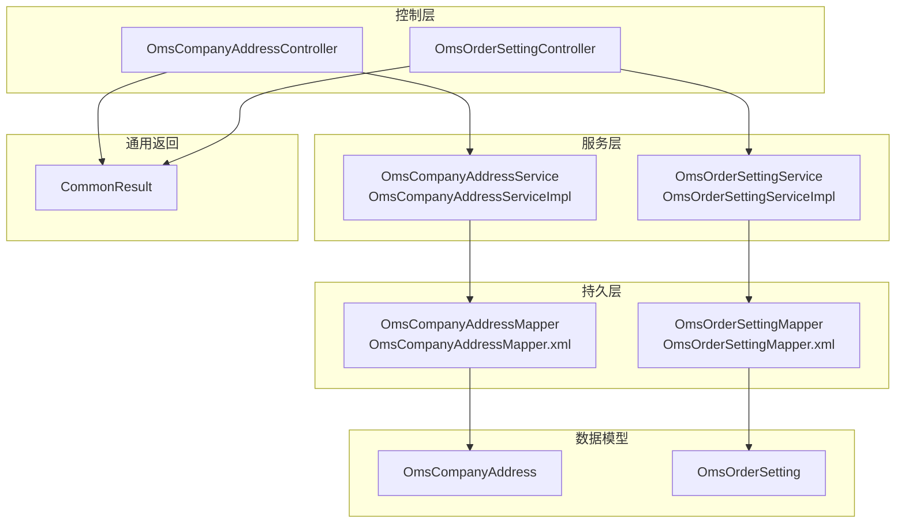
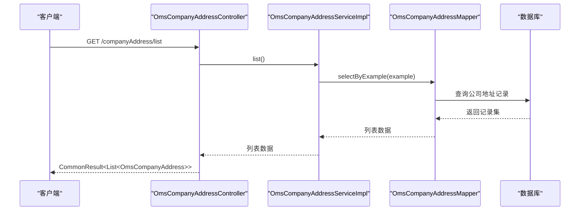
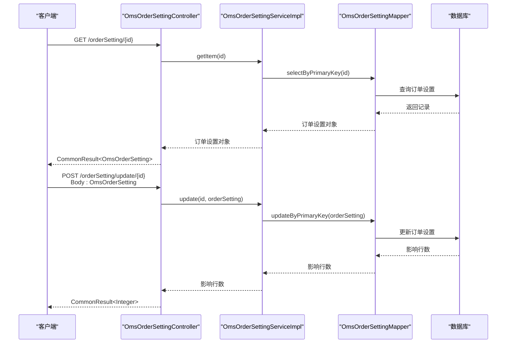
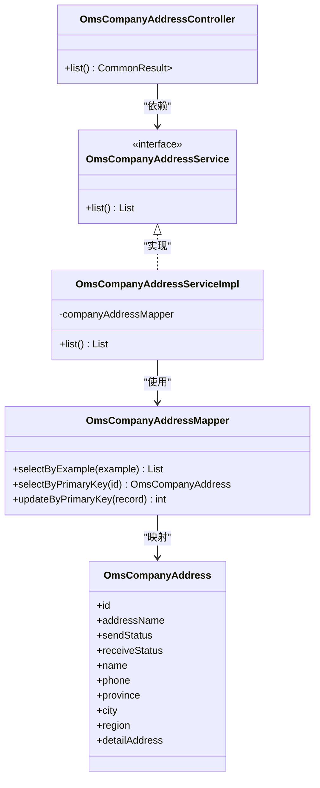
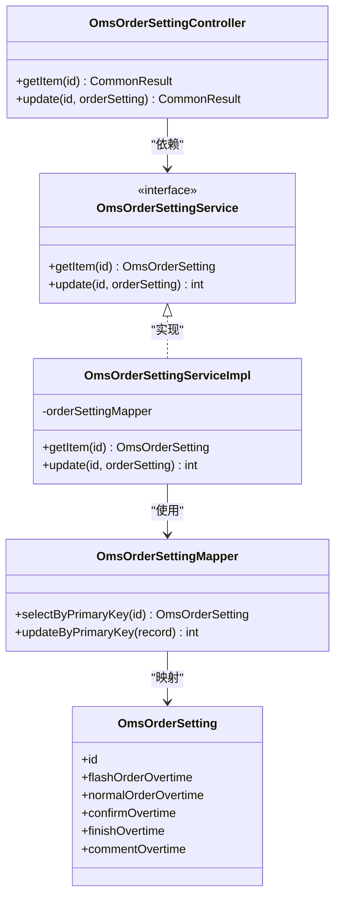
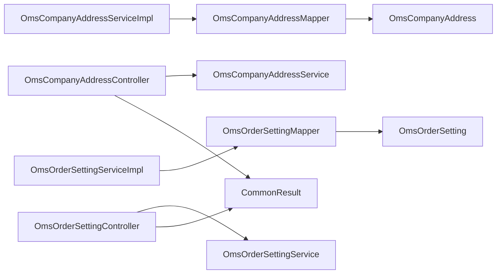

# 订单地址设置

<cite>
**本文引用的文件**
- [OmsCompanyAddressController.java](file://mall-admin/src/main/java/com/macro/mall/controller/OmsCompanyAddressController.java)
- [OmsOrderSettingController.java](file://mall-admin/src/main/java/com/macro/mall/controller/OmsOrderSettingController.java)
- [OmsCompanyAddressService.java](file://mall-admin/src/main/java/com/macro/mall/service/OmsCompanyAddressService.java)
- [OmsOrderSettingService.java](file://mall-admin/src/main/java/com/macro/mall/service/OmsOrderSettingService.java)
- [OmsCompanyAddressServiceImpl.java](file://mall-admin/src/main/java/com/macro/mall/service/impl/OmsCompanyAddressServiceImpl.java)
- [OmsOrderSettingServiceImpl.java](file://mall-admin/src/main/java/com/macro/mall/service/impl/OmsOrderSettingServiceImpl.java)
- [OmsCompanyAddress.java](file://mall-mbg/src/main/java/com/macro/mall/model/OmsCompanyAddress.java)
- [OmsOrderSetting.java](file://mall-mbg/src/main/java/com/macro/mall/model/OmsOrderSetting.java)
- [OmsCompanyAddressMapper.java](file://mall-mbg/src/main/java/com/macro/mall/mapper/OmsCompanyAddressMapper.java)
- [OmsOrderSettingMapper.java](file://mall-mbg/src/main/java/com/macro/mall/mapper/OmsOrderSettingMapper.java)
- [OmsCompanyAddressMapper.xml](file://mall-mbg/src/main/resources/com/macro/mall/mapper/OmsCompanyAddressMapper.xml)
- [OmsOrderSettingMapper.xml](file://mall-mbg/src/main/resources/com/macro/mall/mapper/OmsOrderSettingMapper.xml)
- [CommonResult.java](file://mall-common/src/main/java/com/macro/mall/common/api/CommonResult.java)
</cite>

## 目录
1. [引言](#引言)
2. [项目结构](#项目结构)
3. [核心组件](#核心组件)
4. [架构总览](#架构总览)
5. [详细组件分析](#详细组件分析)
6. [依赖分析](#依赖分析)
7. [性能考虑](#性能考虑)
8. [故障排查指南](#故障排查指南)
9. [结论](#结论)
10. [附录：完整接口文档](#附录完整接口文档)

## 引言
本文件聚焦“订单地址设置”能力，系统性梳理公司地址管理与订单设置两大模块的控制器、服务层与数据模型之间的协作关系，并给出接口使用规范、最佳实践与排障建议。重点覆盖：
- 公司地址管理：默认配送地址设置、收货/发货地址状态管理、地址信息维护与查询。
- 订单设置：自动确认收货时间、自动关闭订单时间、发货通知相关参数等。

## 项目结构
围绕“订单地址设置”的关键代码分层如下：
- 控制器层：负责HTTP请求接入与响应封装。
- 服务接口与实现：定义业务契约与具体实现。
- 持久层：MyBatis Mapper与XML映射，完成数据库读写。
- 数据模型：对应数据库表的实体类。
- 通用返回体：统一返回格式。

图表来源
- [OmsCompanyAddressController.java:1-33](file://mall-admin/src/main/java/com/macro/mall/controller/OmsCompanyAddressController.java#L1-L33)
- [OmsOrderSettingController.java:1-39](file://mall-admin/src/main/java/com/macro/mall/controller/OmsOrderSettingController.java#L1-L39)
- [OmsCompanyAddressServiceImpl.java:1-25](file://mall-admin/src/main/java/com/macro/mall/service/impl/OmsCompanyAddressServiceImpl.java#L1-L25)
- [OmsOrderSettingServiceImpl.java:1-29](file://mall-admin/src/main/java/com/macro/mall/service/impl/OmsOrderSettingServiceImpl.java#L1-L29)
- [OmsCompanyAddressMapper.java:1-30](file://mall-mbg/src/main/java/com/macro/mall/mapper/OmsCompanyAddressMapper.java#L1-L30)
- [OmsOrderSettingMapper.java:1-30](file://mall-mbg/src/main/java/com/macro/mall/mapper/OmsOrderSettingMapper.java#L1-L30)
- [OmsCompanyAddress.java:1-128](file://mall-mbg/src/main/java/com/macro/mall/model/OmsCompanyAddress.java#L1-L128)
- [OmsOrderSetting.java:1-84](file://mall-mbg/src/main/java/com/macro/mall/model/OmsOrderSetting.java#L1-L84)
- [CommonResult.java:1-134](file://mall-common/src/main/java/com/macro/mall/common/api/CommonResult.java#L1-L134)

章节来源
- [OmsCompanyAddressController.java:1-33](file://mall-admin/src/main/java/com/macro/mall/controller/OmsCompanyAddressController.java#L1-L33)
- [OmsOrderSettingController.java:1-39](file://mall-admin/src/main/java/com/macro/mall/controller/OmsOrderSettingController.java#L1-L39)

## 核心组件
- 公司地址管理控制器：提供公司收货地址列表查询接口。
- 订单设置控制器：提供订单设置项的查询与更新接口。
- 服务接口与实现：分别封装公司地址与订单设置的业务逻辑。
- 持久层：通过Mapper访问数据库，XML中定义SQL映射。
- 数据模型：与数据库字段一一对应，承载业务数据。

章节来源
- [OmsCompanyAddressService.java:1-17](file://mall-admin/src/main/java/com/macro/mall/service/OmsCompanyAddressService.java#L1-L17)
- [OmsOrderSettingService.java:1-20](file://mall-admin/src/main/java/com/macro/mall/service/OmsOrderSettingService.java#L1-L20)
- [OmsCompanyAddressServiceImpl.java:1-25](file://mall-admin/src/main/java/com/macro/mall/service/impl/OmsCompanyAddressServiceImpl.java#L1-L25)
- [OmsOrderSettingServiceImpl.java:1-29](file://mall-admin/src/main/java/com/macro/mall/service/impl/OmsOrderSettingServiceImpl.java#L1-L29)

## 架构总览
下图展示从HTTP请求到数据库的调用链路与数据流转：

图表来源
- [OmsCompanyAddressController.java:26-31](file://mall-admin/src/main/java/com/macro/mall/controller/OmsCompanyAddressController.java#L26-L31)
- [OmsCompanyAddressServiceImpl.java:20-23](file://mall-admin/src/main/java/com/macro/mall/service/impl/OmsCompanyAddressServiceImpl.java#L20-L23)
- [OmsCompanyAddressMapper.java:19-21](file://mall-mbg/src/main/java/com/macro/mall/mapper/OmsCompanyAddressMapper.java#L19-L21)
- [CommonResult.java:35-47](file://mall-common/src/main/java/com/macro/mall/common/api/CommonResult.java#L35-L47)

图表来源
- [OmsOrderSettingController.java:22-37](file://mall-admin/src/main/java/com/macro/mall/controller/OmsOrderSettingController.java#L22-L37)
- [OmsOrderSettingServiceImpl.java:18-27](file://mall-admin/src/main/java/com/macro/mall/service/impl/OmsOrderSettingServiceImpl.java#L18-L27)
- [OmsOrderSettingMapper.java:21-29](file://mall-mbg/src/main/java/com/macro/mall/mapper/OmsOrderSettingMapper.java#L21-L29)
- [CommonResult.java:35-47](file://mall-common/src/main/java/com/macro/mall/common/api/CommonResult.java#L35-L47)

## 详细组件分析

### 公司地址管理组件分析
- 控制器职责：提供公司收货地址列表查询接口，返回统一包装的结果对象。
- 服务实现：通过Mapper查询所有公司地址记录，不带条件筛选。
- 数据模型字段要点：包含地址名称、默认发货/收货状态、收件人姓名与电话、省市区及详细地址等。
- 持久层映射：XML中定义了基础列清单与常用查询/更新语句。

图表来源
- [OmsCompanyAddressController.java:26-31](file://mall-admin/src/main/java/com/macro/mall/controller/OmsCompanyAddressController.java#L26-L31)
- [OmsCompanyAddressService.java:11-16](file://mall-admin/src/main/java/com/macro/mall/service/OmsCompanyAddressService.java#L11-L16)
- [OmsCompanyAddressServiceImpl.java:16-24](file://mall-admin/src/main/java/com/macro/mall/service/impl/OmsCompanyAddressServiceImpl.java#L16-L24)
- [OmsCompanyAddressMapper.java:8-29](file://mall-mbg/src/main/java/com/macro/mall/mapper/OmsCompanyAddressMapper.java#L8-L29)
- [OmsCompanyAddress.java:5-128](file://mall-mbg/src/main/java/com/macro/mall/model/OmsCompanyAddress.java#L5-L128)

章节来源
- [OmsCompanyAddressController.java:1-33](file://mall-admin/src/main/java/com/macro/mall/controller/OmsCompanyAddressController.java#L1-L33)
- [OmsCompanyAddressServiceImpl.java:1-25](file://mall-admin/src/main/java/com/macro/mall/service/impl/OmsCompanyAddressServiceImpl.java#L1-L25)
- [OmsCompanyAddressMapper.xml:74-97](file://mall-mbg/src/main/resources/com/macro/mall/mapper/OmsCompanyAddressMapper.xml#L74-L97)

### 订单设置组件分析
- 控制器职责：提供订单设置项的按主键查询与更新接口。
- 服务实现：根据主键获取设置项；更新时将传入对象的主键回填后执行更新。
- 数据模型字段要点：包含闪购订单超时、普通订单超时、确认收货超时、完成超时、评论超时等时间阈值字段。
- 持久层映射：XML中定义了基础列清单与按主键更新语句。

图表来源
- [OmsOrderSettingController.java:22-37](file://mall-admin/src/main/java/com/macro/mall/controller/OmsOrderSettingController.java#L22-L37)
- [OmsOrderSettingService.java:9-19](file://mall-admin/src/main/java/com/macro/mall/service/OmsOrderSettingService.java#L9-L19)
- [OmsOrderSettingServiceImpl.java:14-28](file://mall-admin/src/main/java/com/macro/mall/service/impl/OmsOrderSettingServiceImpl.java#L14-L28)
- [OmsOrderSettingMapper.java:8-29](file://mall-mbg/src/main/java/com/macro/mall/mapper/OmsOrderSettingMapper.java#L8-L29)
- [OmsOrderSetting.java:5-84](file://mall-mbg/src/main/java/com/macro/mall/model/OmsOrderSetting.java#L5-L84)

章节来源
- [OmsOrderSettingController.java:1-39](file://mall-admin/src/main/java/com/macro/mall/controller/OmsOrderSettingController.java#L1-L39)
- [OmsOrderSettingServiceImpl.java:1-29](file://mall-admin/src/main/java/com/macro/mall/service/impl/OmsOrderSettingServiceImpl.java#L1-L29)
- [OmsOrderSettingMapper.xml:70-93](file://mall-mbg/src/main/resources/com/macro/mall/mapper/OmsOrderSettingMapper.xml#L70-L93)

## 依赖分析
- 控制器依赖服务接口，服务实现依赖Mapper接口。
- Mapper接口与实体类之间存在一对一映射关系，XML中定义了SQL与实体属性的映射。
- 统一返回体由CommonResult提供，保证接口输出风格一致。

图表来源
- [OmsCompanyAddressController.java:23-24](file://mall-admin/src/main/java/com/macro/mall/controller/OmsCompanyAddressController.java#L23-L24)
- [OmsOrderSettingController.java:19-20](file://mall-admin/src/main/java/com/macro/mall/controller/OmsOrderSettingController.java#L19-L20)
- [OmsCompanyAddressServiceImpl.java:18-19](file://mall-admin/src/main/java/com/macro/mall/service/impl/OmsCompanyAddressServiceImpl.java#L18-L19)
- [OmsOrderSettingServiceImpl.java:15-16](file://mall-admin/src/main/java/com/macro/mall/service/impl/OmsOrderSettingServiceImpl.java#L15-L16)
- [CommonResult.java:35-47](file://mall-common/src/main/java/com/macro/mall/common/api/CommonResult.java#L35-L47)

章节来源
- [OmsCompanyAddressMapper.java:1-30](file://mall-mbg/src/main/java/com/macro/mall/mapper/OmsCompanyAddressMapper.java#L1-L30)
- [OmsOrderSettingMapper.java:1-30](file://mall-mbg/src/main/java/com/macro/mall/mapper/OmsOrderSettingMapper.java#L1-L30)

## 性能考虑
- 查询路径：公司地址列表查询未带过滤条件，建议在业务侧增加分页或条件过滤，避免一次性加载过多记录。
- 更新路径：订单设置更新采用按主键更新，确保幂等性；建议在服务层对关键字段进行范围校验，减少无效写入。
- 缓存策略：当前实现未见显式缓存逻辑，可在高频读取场景引入缓存（如Redis），并配合失效策略或变更事件同步，降低数据库压力。
- 并发控制：更新操作应结合业务锁或乐观锁，防止并发修改导致的覆盖问题。

## 故障排查指南
- 接口返回失败：检查控制器返回的统一错误包装，定位服务层异常或数据库更新影响行数为0的情况。
- 数据库异常：核对Mapper XML中的SQL与实体字段映射是否一致，确认主键是否存在且正确。
- 参数校验：若涉及新增/更新，建议在服务层增加参数校验与边界检查，避免非法值进入数据库。
- 日志与监控：结合通用日志切面与异常处理，定位异常堆栈与耗时瓶颈。

章节来源
- [CommonResult.java:53-79](file://mall-common/src/main/java/com/macro/mall/common/api/CommonResult.java#L53-L79)
- [OmsOrderSettingServiceImpl.java:24-27](file://mall-admin/src/main/java/com/macro/mall/service/impl/OmsOrderSettingServiceImpl.java#L24-L27)

## 结论
本文档从架构与实现两个维度梳理了“订单地址设置”能力，明确了公司地址与订单设置的接口职责、数据流与依赖关系，并给出了性能优化与排障建议。后续可在此基础上扩展默认地址切换、区域配置与运费模板等高级能力，逐步完善订单侧的地址与时效治理体系。

## 附录：完整接口文档

### 公司地址管理接口
- 列表查询
  - 方法：GET
  - 路径：/companyAddress/list
  - 请求参数：无
  - 响应：CommonResult<List<OmsCompanyAddress>>
  - 说明：返回全部公司地址列表，包含默认发货/收货状态、联系人与地址详情等字段。

章节来源
- [OmsCompanyAddressController.java:26-31](file://mall-admin/src/main/java/com/macro/mall/controller/OmsCompanyAddressController.java#L26-L31)
- [OmsCompanyAddressMapper.xml:78-91](file://mall-mbg/src/main/resources/com/macro/mall/mapper/OmsCompanyAddressMapper.xml#L78-L91)

### 订单设置接口
- 获取设置项
  - 方法：GET
  - 路径：/orderSetting/{id}
  - 路径参数：id（Long）
  - 响应：CommonResult<OmsOrderSetting>
  - 说明：返回指定主键的订单设置对象，包含闪购/普通订单超时、确认收货超时、完成超时、评论超时等字段。

- 更新设置项
  - 方法：POST
  - 路径：/orderSetting/update/{id}
  - 路径参数：id（Long）
  - 请求体：OmsOrderSetting（建议仅传递需要更新的字段）
  - 响应：CommonResult<Integer>（受影响行数）
  - 说明：服务端会将传入对象的id回填后执行更新，注意字段范围与业务约束。

章节来源
- [OmsOrderSettingController.java:22-37](file://mall-admin/src/main/java/com/macro/mall/controller/OmsOrderSettingController.java#L22-L37)
- [OmsOrderSettingServiceImpl.java:18-27](file://mall-admin/src/main/java/com/macro/mall/service/impl/OmsOrderSettingServiceImpl.java#L18-L27)
- [OmsOrderSettingMapper.xml:199-228](file://mall-mbg/src/main/resources/com/macro/mall/mapper/OmsOrderSettingMapper.xml#L199-L228)

### 数据模型字段说明（节选）
- 公司地址（OmsCompanyAddress）
  - 字段：id、addressName、sendStatus、receiveStatus、name、phone、province、city、region、detailAddress
  - 用途：公司发货/收货地址信息与默认状态标记

- 订单设置（OmsOrderSetting）
  - 字段：id、flashOrderOvertime、normalOrderOvertime、confirmOvertime、finishOvertime、commentOvertime
  - 用途：订单生命周期关键时间阈值配置

章节来源
- [OmsCompanyAddress.java:5-128](file://mall-mbg/src/main/java/com/macro/mall/model/OmsCompanyAddress.java#L5-L128)
- [OmsOrderSetting.java:5-84](file://mall-mbg/src/main/java/com/macro/mall/model/OmsOrderSetting.java#L5-L84)