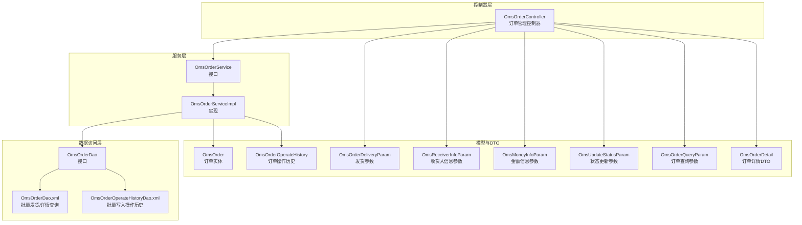
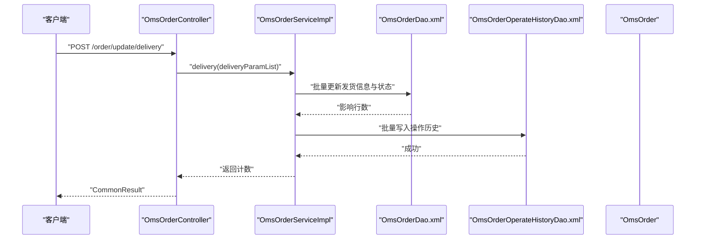
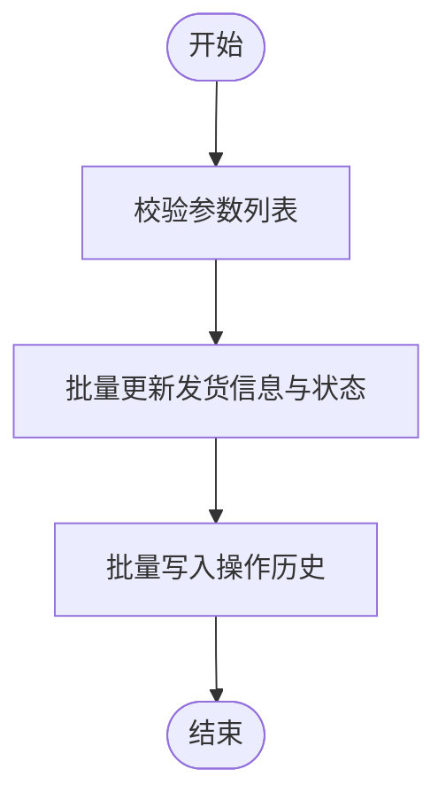
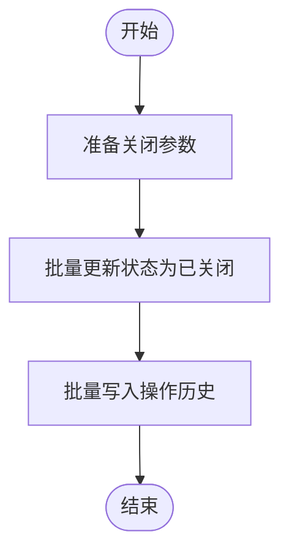
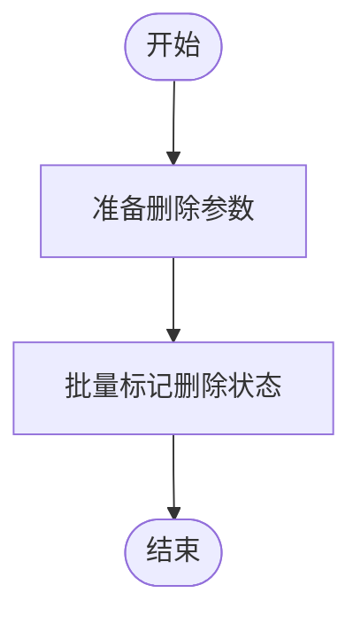
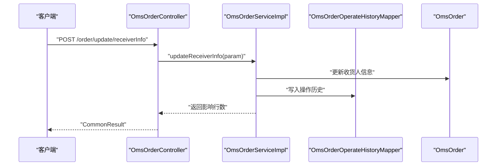
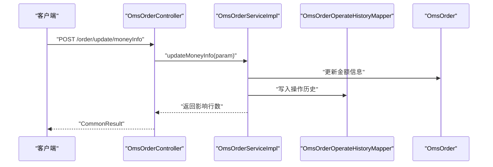
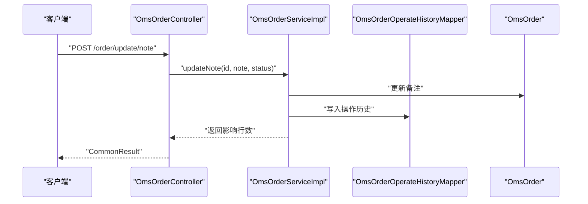
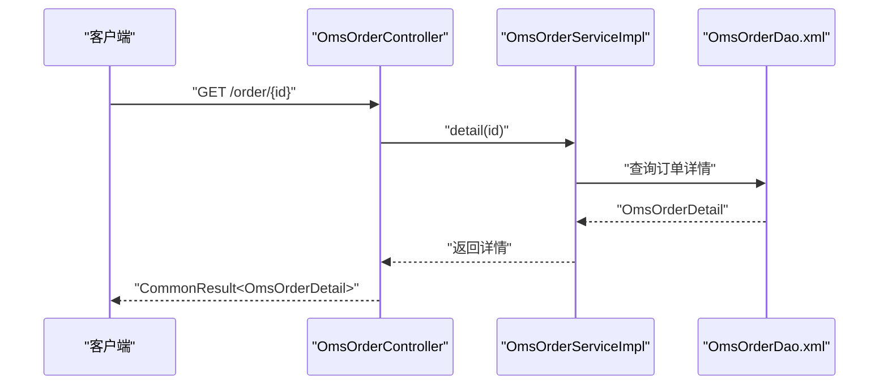
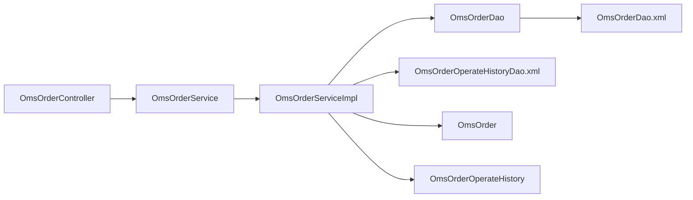

# 订单处理管理

<cite>
**本文引用的文件**
- [OmsOrderController.java](file://mall-admin/src/main/java/com/macro/mall/controller/OmsOrderController.java)
- [OmsOrderService.java](file://mall-admin/src/main/java/com/macro/mall/service/OmsOrderService.java)
- [OmsOrderServiceImpl.java](file://mall-admin/src/main/java/com/macro/mall/service/impl/OmsOrderServiceImpl.java)
- [OmsOrderDao.java](file://mall-admin/src/main/java/com/macro/mall/dao/OmsOrderDao.java)
- [OmsOrderDao.xml](file://mall-admin/src/main/resources/dao/OmsOrderDao.xml)
- [OmsOrderOperateHistoryDao.xml](file://mall-admin/src/main/resources/dao/OmsOrderOperateHistoryDao.xml)
- [OmsOrderDeliveryParam.java](file://mall-admin/src/main/java/com/macro/mall/dto/OmsOrderDeliveryParam.java)
- [OmsReceiverInfoParam.java](file://mall-admin/src/main/java/com/macro/mall/dto/OmsReceiverInfoParam.java)
- [OmsMoneyInfoParam.java](file://mall-admin/src/main/java/com/macro/mall/dto/OmsMoneyInfoParam.java)
- [OmsUpdateStatusParam.java](file://mall-admin/src/main/java/com/macro/mall/dto/OmsUpdateStatusParam.java)
- [OmsOrderQueryParam.java](file://mall-admin/src/main/java/com/macro/mall/dto/OmsOrderQueryParam.java)
- [OmsOrderDetail.java](file://mall-admin/src/main/java/com/macro/mall/dto/OmsOrderDetail.java)
- [OmsOrder.java](file://mall-mbg/src/main/java/com/macro/mall/model/OmsOrder.java)
- [OmsOrderOperateHistory.java](file://mall-mbg/src/main/java/com/macro/mall/model/OmsOrderOperateHistory.java)
</cite>

## 目录
1. [简介](#简介)
2. [项目结构](#项目结构)
3. [核心组件](#核心组件)
4. [架构总览](#架构总览)
5. [详细组件分析](#详细组件分析)
6. [依赖分析](#依赖分析)
7. [性能考虑](#性能考虑)
8. [故障排查指南](#故障排查指南)
9. [结论](#结论)
10. [附录：完整API接口文档](#附录完整api接口文档)

## 简介
本文件系统性梳理“订单处理管理”的核心能力与实现细节，覆盖发货操作、订单关闭、订单删除、收货人信息修改、金额信息调整、备注状态更新等关键流程；重点解析 OmsOrderDeliveryParam 发货参数设计（快递公司、快递单号等字段）；阐述订单状态更新机制与 updateNote 接口的状态流转控制；介绍批量操作（批量发货、批量关闭订单）的实现方式；并提供完整的订单处理 API 接口文档与使用示例。

## 项目结构
围绕订单处理的关键模块由“控制器层 → 服务层 → DAO/XML → 模型/DTO”构成，采用分层清晰的职责划分，保证可维护性与扩展性。

图表来源
- [OmsOrderController.java:1-104](file://mall-admin/src/main/java/com/macro/mall/controller/OmsOrderController.java#L1-L104)
- [OmsOrderService.java:1-59](file://mall-admin/src/main/java/com/macro/mall/service/OmsOrderService.java#L1-L59)
- [OmsOrderServiceImpl.java:1-154](file://mall-admin/src/main/java/com/macro/mall/service/impl/OmsOrderServiceImpl.java#L1-L154)
- [OmsOrderDao.java:1-31](file://mall-admin/src/main/java/com/macro/mall/dao/OmsOrderDao.java#L1-L31)
- [OmsOrderDao.xml:1-90](file://mall-admin/src/main/resources/dao/OmsOrderDao.xml#L1-L90)
- [OmsOrderOperateHistoryDao.xml:1-14](file://mall-admin/src/main/resources/dao/OmsOrderOperateHistoryDao.xml#L1-L14)
- [OmsOrder.java:1-504](file://mall-mbg/src/main/java/com/macro/mall/model/OmsOrder.java#L1-L504)
- [OmsOrderOperateHistory.java:1-85](file://mall-mbg/src/main/java/com/macro/mall/model/OmsOrderOperateHistory.java#L1-L85)
- [OmsOrderDeliveryParam.java:1-17](file://mall-admin/src/main/java/com/macro/mall/dto/OmsOrderDeliveryParam.java#L1-L17)
- [OmsReceiverInfoParam.java:1-23](file://mall-admin/src/main/java/com/macro/mall/dto/OmsReceiverInfoParam.java#L1-L23)
- [OmsMoneyInfoParam.java:1-20](file://mall-admin/src/main/java/com/macro/mall/dto/OmsMoneyInfoParam.java#L1-L20)
- [OmsUpdateStatusParam.java:1-24](file://mall-admin/src/main/java/com/macro/mall/dto/OmsUpdateStatusParam.java#L1-L24)
- [OmsOrderQueryParam.java:1-20](file://mall-admin/src/main/java/com/macro/mall/dto/OmsOrderQueryParam.java#L1-L20)
- [OmsOrderDetail.java:1-23](file://mall-admin/src/main/java/com/macro/mall/dto/OmsOrderDetail.java#L1-L23)

章节来源
- [OmsOrderController.java:1-104](file://mall-admin/src/main/java/com/macro/mall/controller/OmsOrderController.java#L1-L104)
- [OmsOrderService.java:1-59](file://mall-admin/src/main/java/com/macro/mall/service/OmsOrderService.java#L1-L59)
- [OmsOrderServiceImpl.java:1-154](file://mall-admin/src/main/java/com/macro/mall/service/impl/OmsOrderServiceImpl.java#L1-L154)
- [OmsOrderDao.java:1-31](file://mall-admin/src/main/java/com/macro/mall/dao/OmsOrderDao.java#L1-L31)
- [OmsOrderDao.xml:1-90](file://mall-admin/src/main/resources/dao/OmsOrderDao.xml#L1-L90)
- [OmsOrderOperateHistoryDao.xml:1-14](file://mall-admin/src/main/resources/dao/OmsOrderOperateHistoryDao.xml#L1-L14)
- [OmsOrder.java:1-504](file://mall-mbg/src/main/java/com/macro/mall/model/OmsOrder.java#L1-L504)
- [OmsOrderOperateHistory.java:1-85](file://mall-mbg/src/main/java/com/macro/mall/model/OmsOrderOperateHistory.java#L1-L85)
- [OmsOrderDeliveryParam.java:1-17](file://mall-admin/src/main/java/com/macro/mall/dto/OmsOrderDeliveryParam.java#L1-L17)
- [OmsReceiverInfoParam.java:1-23](file://mall-admin/src/main/java/com/macro/mall/dto/OmsReceiverInfoParam.java#L1-L23)
- [OmsMoneyInfoParam.java:1-20](file://mall-admin/src/main/java/com/macro/mall/dto/OmsMoneyInfoParam.java#L1-L20)
- [OmsUpdateStatusParam.java:1-24](file://mall-admin/src/main/java/com/macro/mall/dto/OmsUpdateStatusParam.java#L1-L24)
- [OmsOrderQueryParam.java:1-20](file://mall-admin/src/main/java/com/macro/mall/dto/OmsOrderQueryParam.java#L1-L20)
- [OmsOrderDetail.java:1-23](file://mall-admin/src/main/java/com/macro/mall/dto/OmsOrderDetail.java#L1-L23)

## 核心组件
- 控制器层：提供 REST 接口，负责接收请求参数、调用服务层并返回结果。
- 服务层：封装业务逻辑，包含事务控制与操作历史记录写入。
- 数据访问层：通过 MyBatis XML 实现批量更新与复杂查询。
- 模型与 DTO：映射数据库表结构与接口参数，确保类型安全与可读性。

章节来源
- [OmsOrderController.java:1-104](file://mall-admin/src/main/java/com/macro/mall/controller/OmsOrderController.java#L1-L104)
- [OmsOrderService.java:1-59](file://mall-admin/src/main/java/com/macro/mall/service/OmsOrderService.java#L1-L59)
- [OmsOrderServiceImpl.java:1-154](file://mall-admin/src/main/java/com/macro/mall/service/impl/OmsOrderServiceImpl.java#L1-L154)
- [OmsOrderDao.java:1-31](file://mall-admin/src/main/java/com/macro/mall/dao/OmsOrderDao.java#L1-L31)
- [OmsOrderDao.xml:1-90](file://mall-admin/src/main/resources/dao/OmsOrderDao.xml#L1-L90)
- [OmsOrderOperateHistoryDao.xml:1-14](file://mall-admin/src/main/resources/dao/OmsOrderOperateHistoryDao.xml#L1-L14)
- [OmsOrder.java:1-504](file://mall-mbg/src/main/java/com/macro/mall/model/OmsOrder.java#L1-L504)
- [OmsOrderOperateHistory.java:1-85](file://mall-mbg/src/main/java/com/macro/mall/model/OmsOrderOperateHistory.java#L1-L85)
- [OmsOrderDeliveryParam.java:1-17](file://mall-admin/src/main/java/com/macro/mall/dto/OmsOrderDeliveryParam.java#L1-L17)
- [OmsReceiverInfoParam.java:1-23](file://mall-admin/src/main/java/com/macro/mall/dto/OmsReceiverInfoParam.java#L1-L23)
- [OmsMoneyInfoParam.java:1-20](file://mall-admin/src/main/java/com/macro/mall/dto/OmsMoneyInfoParam.java#L1-L20)
- [OmsUpdateStatusParam.java:1-24](file://mall-admin/src/main/java/com/macro/mall/dto/OmsUpdateStatusParam.java#L1-L24)
- [OmsOrderQueryParam.java:1-20](file://mall-admin/src/main/java/com/macro/mall/dto/OmsOrderQueryParam.java#L1-L20)
- [OmsOrderDetail.java:1-23](file://mall-admin/src/main/java/com/macro/mall/dto/OmsOrderDetail.java#L1-L23)

## 架构总览
订单处理采用典型的三层架构，控制器负责对外暴露接口，服务层编排业务与持久化，DAO/XML 负责 SQL 执行与结果映射。所有关键操作均写入订单操作历史，便于审计与追踪。

图表来源
- [OmsOrderController.java:35-43](file://mall-admin/src/main/java/com/macro/mall/controller/OmsOrderController.java#L35-L43)
- [OmsOrderServiceImpl.java:42-58](file://mall-admin/src/main/java/com/macro/mall/service/impl/OmsOrderServiceImpl.java#L42-L58)
- [OmsOrderDao.xml:36-65](file://mall-admin/src/main/resources/dao/OmsOrderDao.xml#L36-L65)
- [OmsOrderOperateHistoryDao.xml:4-13](file://mall-admin/src/main/resources/dao/OmsOrderOperateHistoryDao.xml#L4-L13)

## 详细组件分析

### 发货操作（批量）
- 接口：POST /order/update/delivery
- 参数：List<OmsOrderDeliveryParam>
- 流程要点：
  - 使用 MyBatis 的 CASE WHEN 批量更新 delivery_sn、delivery_company、delivery_time 与 status 字段。
  - 仅对当前状态为“已付款待发货”的订单执行更新，避免状态倒退或并发问题。
  - 成功后批量写入订单操作历史，记录操作人、时间、状态与备注。

图表来源
- [OmsOrderServiceImpl.java:42-58](file://mall-admin/src/main/java/com/macro/mall/service/impl/OmsOrderServiceImpl.java#L42-L58)
- [OmsOrderDao.xml:36-65](file://mall-admin/src/main/resources/dao/OmsOrderDao.xml#L36-L65)
- [OmsOrderOperateHistoryDao.xml:4-13](file://mall-admin/src/main/resources/dao/OmsOrderOperateHistoryDao.xml#L4-L13)

章节来源
- [OmsOrderController.java:35-43](file://mall-admin/src/main/java/com/macro/mall/controller/OmsOrderController.java#L35-L43)
- [OmsOrderServiceImpl.java:42-58](file://mall-admin/src/main/java/com/macro/mall/service/impl/OmsOrderServiceImpl.java#L42-L58)
- [OmsOrderDao.xml:36-65](file://mall-admin/src/main/resources/dao/OmsOrderDao.xml#L36-L65)
- [OmsOrderOperateHistoryDao.xml:4-13](file://mall-admin/src/main/resources/dao/OmsOrderOperateHistoryDao.xml#L4-L13)

### 订单关闭（批量）
- 接口：POST /order/update/close
- 参数：ids（List<Long>）、note（String）
- 流程要点：
  - 将订单状态设置为“已关闭”，且仅对未删除订单执行更新。
  - 批量写入操作历史，记录关闭原因与操作人。

图表来源
- [OmsOrderServiceImpl.java:61-78](file://mall-admin/src/main/java/com/macro/mall/service/impl/OmsOrderServiceImpl.java#L61-L78)
- [OmsOrderDao.xml:36-65](file://mall-admin/src/main/resources/dao/OmsOrderDao.xml#L36-L65)
- [OmsOrderOperateHistoryDao.xml:4-13](file://mall-admin/src/main/resources/dao/OmsOrderOperateHistoryDao.xml#L4-L13)

章节来源
- [OmsOrderController.java:45-53](file://mall-admin/src/main/java/com/macro/mall/controller/OmsOrderController.java#L45-L53)
- [OmsOrderServiceImpl.java:61-78](file://mall-admin/src/main/java/com/macro/mall/service/impl/OmsOrderServiceImpl.java#L61-L78)

### 订单删除（批量软删）
- 接口：POST /order/delete
- 参数：ids（List<Long>）
- 流程要点：
  - 设置 delete_status=1，实现软删除，保留历史数据用于审计与合规。

图表来源
- [OmsOrderServiceImpl.java:80-87](file://mall-admin/src/main/java/com/macro/mall/service/impl/OmsOrderServiceImpl.java#L80-L87)

章节来源
- [OmsOrderController.java:55-63](file://mall-admin/src/main/java/com/macro/mall/controller/OmsOrderController.java#L55-L63)
- [OmsOrderServiceImpl.java:80-87](file://mall-admin/src/main/java/com/macro/mall/service/impl/OmsOrderServiceImpl.java#L80-L87)

### 收货人信息修改
- 接口：POST /order/update/receiverInfo
- 参数：OmsReceiverInfoParam（orderId 及收货人相关信息）
- 流程要点：
  - 更新收货人姓名、电话、邮编、地址及所在省市区等字段。
  - 写入操作历史，记录当前状态与备注。

图表来源
- [OmsOrderController.java:72-80](file://mall-admin/src/main/java/com/macro/mall/controller/OmsOrderController.java#L72-L80)
- [OmsOrderServiceImpl.java:94-116](file://mall-admin/src/main/java/com/macro/mall/service/impl/OmsOrderServiceImpl.java#L94-L116)

章节来源
- [OmsOrderController.java:72-80](file://mall-admin/src/main/java/com/macro/mall/controller/OmsOrderController.java#L72-L80)
- [OmsOrderServiceImpl.java:94-116](file://mall-admin/src/main/java/com/macro/mall/service/impl/OmsOrderServiceImpl.java#L94-L116)

### 金额信息调整
- 接口：POST /order/update/moneyInfo
- 参数：OmsMoneyInfoParam（orderId、freightAmount、discountAmount）
- 流程要点：
  - 更新运费与优惠金额等字段。
  - 写入操作历史，记录当前状态与备注。

图表来源
- [OmsOrderController.java:82-90](file://mall-admin/src/main/java/com/macro/mall/controller/OmsOrderController.java#L82-L90)
- [OmsOrderServiceImpl.java:118-135](file://mall-admin/src/main/java/com/macro/mall/service/impl/OmsOrderServiceImpl.java#L118-L135)

章节来源
- [OmsOrderController.java:82-90](file://mall-admin/src/main/java/com/macro/mall/controller/OmsOrderController.java#L82-L90)
- [OmsOrderServiceImpl.java:118-135](file://mall-admin/src/main/java/com/macro/mall/service/impl/OmsOrderServiceImpl.java#L118-L135)

### 备注与状态更新（updateNote）
- 接口：POST /order/update/note
- 参数：id、note、status
- 流程要点：
  - 更新订单备注字段。
  - 写入操作历史，记录目标状态与备注内容。
  - 注意：该接口仅更新备注与状态字段，不改变订单主状态机（如发货状态），具体状态变更需通过其他专用接口完成。

图表来源
- [OmsOrderController.java:92-102](file://mall-admin/src/main/java/com/macro/mall/controller/OmsOrderController.java#L92-L102)
- [OmsOrderServiceImpl.java:137-152](file://mall-admin/src/main/java/com/macro/mall/service/impl/OmsOrderServiceImpl.java#L137-L152)

章节来源
- [OmsOrderController.java:92-102](file://mall-admin/src/main/java/com/macro/mall/controller/OmsOrderController.java#L92-L102)
- [OmsOrderServiceImpl.java:137-152](file://mall-admin/src/main/java/com/macro/mall/service/impl/OmsOrderServiceImpl.java#L137-L152)

### 订单详情查询
- 接口：GET /order/{id}
- 功能：返回订单详情，包含订单明细与历史记录。

图表来源
- [OmsOrderController.java:65-70](file://mall-admin/src/main/java/com/macro/mall/controller/OmsOrderController.java#L65-L70)
- [OmsOrderServiceImpl.java:89-92](file://mall-admin/src/main/java/com/macro/mall/service/impl/OmsOrderServiceImpl.java#L89-L92)
- [OmsOrderDao.xml:66-89](file://mall-admin/src/main/resources/dao/OmsOrderDao.xml#L66-L89)

章节来源
- [OmsOrderController.java:65-70](file://mall-admin/src/main/java/com/macro/mall/controller/OmsOrderController.java#L65-L70)
- [OmsOrderServiceImpl.java:89-92](file://mall-admin/src/main/java/com/macro/mall/service/impl/OmsOrderServiceImpl.java#L89-L92)
- [OmsOrderDao.xml:66-89](file://mall-admin/src/main/resources/dao/OmsOrderDao.xml#L66-L89)

### 查询与分页
- 接口：GET /order/list
- 参数：OmsOrderQueryParam（支持订单号、收货人关键字、状态、订单类型、来源类型、创建时间等条件）
- 返回：分页后的订单列表。

章节来源
- [OmsOrderController.java:26-33](file://mall-admin/src/main/java/com/macro/mall/controller/OmsOrderController.java#L26-L33)
- [OmsOrderDao.xml:8-35](file://mall-admin/src/main/resources/dao/OmsOrderDao.xml#L8-L35)
- [OmsOrderQueryParam.java:1-20](file://mall-admin/src/main/java/com/macro/mall/dto/OmsOrderQueryParam.java#L1-L20)

## 依赖分析
- 控制器依赖服务接口，服务实现依赖 DAO 与 Mapper，DAO 依赖 XML 映射与数据库。
- 关键依赖链路：
  - OmsOrderController → OmsOrderService → OmsOrderServiceImpl → OmsOrderDao → OmsOrderDao.xml
  - OmsOrderServiceImpl → OmsOrderOperateHistoryDao.xml（批量写入历史）
  - OmsOrderServiceImpl → OmsOrder、OmsOrderOperateHistory（实体）

图表来源
- [OmsOrderController.java:1-104](file://mall-admin/src/main/java/com/macro/mall/controller/OmsOrderController.java#L1-L104)
- [OmsOrderService.java:1-59](file://mall-admin/src/main/java/com/macro/mall/service/OmsOrderService.java#L1-L59)
- [OmsOrderServiceImpl.java:1-154](file://mall-admin/src/main/java/com/macro/mall/service/impl/OmsOrderServiceImpl.java#L1-L154)
- [OmsOrderDao.java:1-31](file://mall-admin/src/main/java/com/macro/mall/dao/OmsOrderDao.java#L1-L31)
- [OmsOrderDao.xml:1-90](file://mall-admin/src/main/resources/dao/OmsOrderDao.xml#L1-L90)
- [OmsOrderOperateHistoryDao.xml:1-14](file://mall-admin/src/main/resources/dao/OmsOrderOperateHistoryDao.xml#L1-L14)
- [OmsOrder.java:1-504](file://mall-mbg/src/main/java/com/macro/mall/model/OmsOrder.java#L1-L504)
- [OmsOrderOperateHistory.java:1-85](file://mall-mbg/src/main/java/com/macro/mall/model/OmsOrderOperateHistory.java#L1-L85)

章节来源
- [OmsOrderController.java:1-104](file://mall-admin/src/main/java/com/macro/mall/controller/OmsOrderController.java#L1-L104)
- [OmsOrderService.java:1-59](file://mall-admin/src/main/java/com/macro/mall/service/OmsOrderService.java#L1-L59)
- [OmsOrderServiceImpl.java:1-154](file://mall-admin/src/main/java/com/macro/mall/service/impl/OmsOrderServiceImpl.java#L1-L154)
- [OmsOrderDao.java:1-31](file://mall-admin/src/main/java/com/macro/mall/dao/OmsOrderDao.java#L1-L31)
- [OmsOrderDao.xml:1-90](file://mall-admin/src/main/resources/dao/OmsOrderDao.xml#L1-L90)
- [OmsOrderOperateHistoryDao.xml:1-14](file://mall-admin/src/main/resources/dao/OmsOrderOperateHistoryDao.xml#L1-L14)
- [OmsOrder.java:1-504](file://mall-mbg/src/main/java/com/macro/mall/model/OmsOrder.java#L1-L504)
- [OmsOrderOperateHistory.java:1-85](file://mall-mbg/src/main/java/com/macro/mall/model/OmsOrderOperateHistory.java#L1-L85)

## 性能考虑
- 批量更新：使用 MyBatis 的 CASE WHEN 与 IN 子句在单次 SQL 中完成批量更新，减少往返次数，提升吞吐。
- 分页查询：结合 PageHelper 在服务层进行分页，避免一次性加载大量数据。
- 历史记录：批量写入操作历史时采用批量 INSERT，降低事务开销。
- 并发控制：发货更新限制当前状态为“已付款待发货”，防止状态倒退与竞态。

## 故障排查指南
- 发货失败或未生效
  - 检查订单当前状态是否为“已付款待发货”，否则不会更新。
  - 核对传入的订单 ID 是否存在于数据库且未被删除。
  - 查看操作历史是否正确写入。
- 关闭/删除异常
  - 确认未删除订单才允许关闭；删除为软删除，检查 delete_status 字段。
- 金额/收货人信息未更新
  - 确认传入的 orderId 正确且存在；查看是否触发了事务回滚。
- 备注更新无效
  - updateNote 接口仅更新备注与状态字段，请勿期望其改变主状态机。

章节来源
- [OmsOrderDao.xml:64-65](file://mall-admin/src/main/resources/dao/OmsOrderDao.xml#L64-L65)
- [OmsOrderServiceImpl.java:61-78](file://mall-admin/src/main/java/com/macro/mall/service/impl/OmsOrderServiceImpl.java#L61-L78)
- [OmsOrderServiceImpl.java:80-87](file://mall-admin/src/main/java/com/macro/mall/service/impl/OmsOrderServiceImpl.java#L80-L87)
- [OmsOrderServiceImpl.java:94-116](file://mall-admin/src/main/java/com/macro/mall/service/impl/OmsOrderServiceImpl.java#L94-L116)
- [OmsOrderServiceImpl.java:118-135](file://mall-admin/src/main/java/com/macro/mall/service/impl/OmsOrderServiceImpl.java#L118-L135)
- [OmsOrderServiceImpl.java:137-152](file://mall-admin/src/main/java/com/macro/mall/service/impl/OmsOrderServiceImpl.java#L137-L152)

## 结论
本订单处理体系以清晰的分层与严谨的事务控制为核心，结合批量更新与历史审计，实现了高效、可观测的订单生命周期管理。发货、关闭、删除、信息修改与备注更新等能力覆盖了运营场景的主要诉求；updateNote 接口明确仅用于备注与状态字段更新，避免误用导致状态机混乱。

## 附录：完整API接口文档

- 接口：POST /order/update/delivery
  - 请求体：List<OmsOrderDeliveryParam>
    - orderId：订单ID
    - deliveryCompany：快递公司
    - deliverySn：快递单号
  - 返回：CommonResult<Integer>（受影响的订单数量）
  - 说明：批量发货，仅对“已付款待发货”订单生效，同时写入操作历史。

- 接口：POST /order/update/close
  - 参数：
    - ids：订单ID列表
    - note：关闭原因
  - 返回：CommonResult<Integer>（受影响的订单数量）
  - 说明：批量关闭未删除订单，写入操作历史。

- 接口：POST /order/delete
  - 参数：ids（订单ID列表）
  - 返回：CommonResult<Integer>（受影响的订单数量）
  - 说明：批量软删除订单（设置 delete_status=1）。

- 接口：GET /order/{id}
  - 路径参数：id（订单ID）
  - 返回：CommonResult<OmsOrderDetail>
  - 说明：查询订单详情，包含订单明细与历史记录。

- 接口：POST /order/update/receiverInfo
  - 请求体：OmsReceiverInfoParam
    - orderId：订单ID
    - receiverName、receiverPhone、receiverPostCode、receiverDetailAddress、receiverProvince、receiverCity、receiverRegion、status：收货人信息与目标状态
  - 返回：CommonResult<Integer>
  - 说明：更新收货人信息并写入操作历史。

- 接口：POST /order/update/moneyInfo
  - 请求体：OmsMoneyInfoParam
    - orderId：订单ID
    - freightAmount、discountAmount、status：金额信息与目标状态
  - 返回：CommonResult<Integer>
  - 说明：更新金额信息并写入操作历史。

- 接口：POST /order/update/note
  - 参数：
    - id：订单ID
    - note：备注内容
    - status：目标状态值
  - 返回：CommonResult<Integer>
  - 说明：更新订单备注与状态字段，写入操作历史。

章节来源
- [OmsOrderController.java:26-102](file://mall-admin/src/main/java/com/macro/mall/controller/OmsOrderController.java#L26-L102)
- [OmsOrderDeliveryParam.java:1-17](file://mall-admin/src/main/java/com/macro/mall/dto/OmsOrderDeliveryParam.java#L1-L17)
- [OmsReceiverInfoParam.java:1-23](file://mall-admin/src/main/java/com/macro/mall/dto/OmsReceiverInfoParam.java#L1-L23)
- [OmsMoneyInfoParam.java:1-20](file://mall-admin/src/main/java/com/macro/mall/dto/OmsMoneyInfoParam.java#L1-L20)
- [OmsUpdateStatusParam.java:1-24](file://mall-admin/src/main/java/com/macro/mall/dto/OmsUpdateStatusParam.java#L1-L24)
- [OmsOrderDetail.java:1-23](file://mall-admin/src/main/java/com/macro/mall/dto/OmsOrderDetail.java#L1-L23)