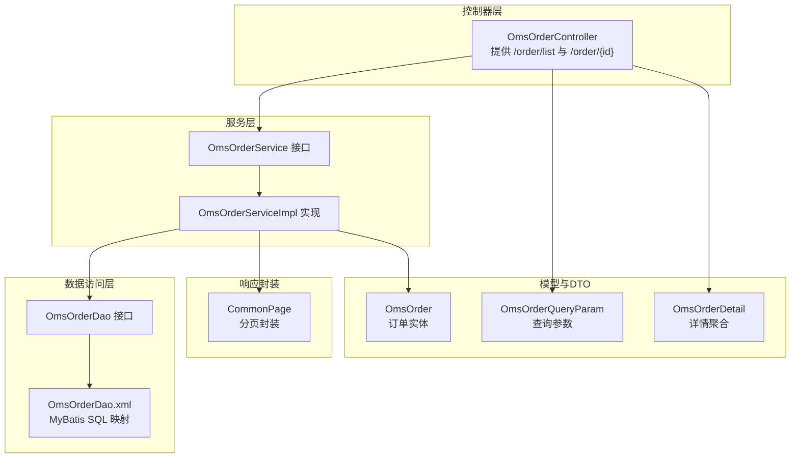
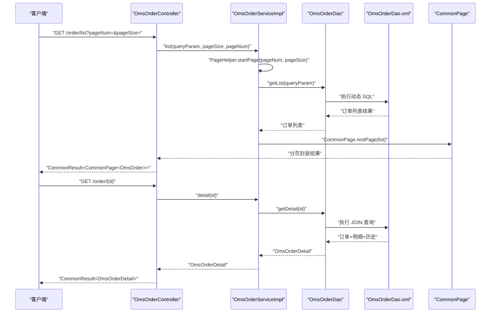
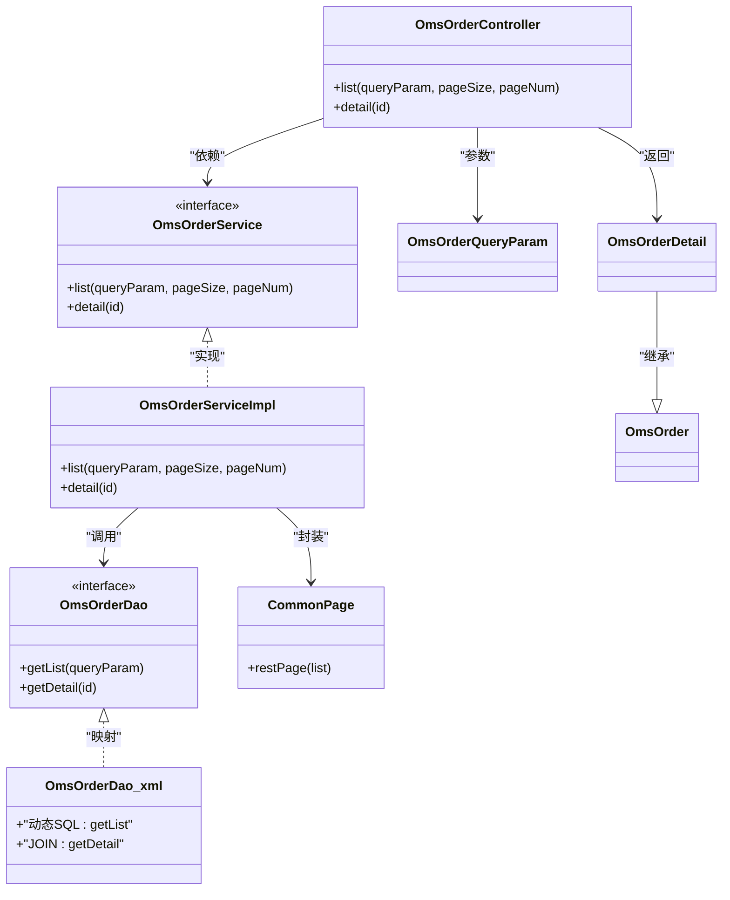

# 订单查询管理

<cite>
**本文引用的文件**
- [OmsOrderController.java](file://mall-admin/src/main/java/com/macro/mall/controller/OmsOrderController.java)
- [OmsOrderQueryParam.java](file://mall-admin/src/main/java/com/macro/mall/dto/OmsOrderQueryParam.java)
- [OmsOrderDetail.java](file://mall-admin/src/main/java/com/macro/mall/dto/OmsOrderDetail.java)
- [OmsOrderService.java](file://mall-admin/src/main/java/com/macro/mall/service/OmsOrderService.java)
- [OmsOrderServiceImpl.java](file://mall-admin/src/main/java/com/macro/mall/service/impl/OmsOrderServiceImpl.java)
- [CommonPage.java](file://mall-common/src/main/java/com/macro/mall/common/api/CommonPage.java)
- [OmsOrderDao.java](file://mall-admin/src/main/java/com/macro/mall/dao/OmsOrderDao.java)
- [OmsOrderDao.xml](file://mall-admin/src/main/resources/dao/OmsOrderDao.xml)
- [OmsOrder.java](file://mall-mbg/src/main/java/com/macro/mall/model/OmsOrder.java)
</cite>

## 目录
1. [引言](#引言)
2. [项目结构](#项目结构)
3. [核心组件](#核心组件)
4. [架构总览](#架构总览)
5. [详细组件分析](#详细组件分析)
6. [依赖分析](#依赖分析)
7. [性能考虑](#性能考虑)
8. [故障排查指南](#故障排查指南)
9. [结论](#结论)
10. [附录](#附录)

## 引言
本文件系统性梳理“订单查询管理”的实现与使用，重点覆盖以下内容：
- 控制器层：OmsOrderController 的 list 方法设计与 GET /order/list 接口
- 查询参数：OmsOrderQueryParam 支持的多条件查询字段
- 分页机制：pageSize 与 pageNum 的使用及 CommonPage 响应封装
- 详情查询：GET /order/{id} 与 OmsOrderDetail 返回对象
- 高级查询：订单状态过滤、时间范围查询、客户信息筛选
- 完整接口文档：请求参数、响应格式与使用示例

## 项目结构
围绕订单查询管理的关键模块如下：
- 控制器层：OmsOrderController 提供订单列表与详情查询接口
- DTO 层：OmsOrderQueryParam（查询参数）、OmsOrderDetail（详情聚合）
- 服务层：OmsOrderService 及其实现 OmsOrderServiceImpl
- 数据访问层：OmsOrderDao 接口与 XML 映射 OmsOrderDao.xml
- 响应封装：CommonPage 统一分页包装
- 模型层：OmsOrder 订单实体

图表来源
- [OmsOrderController.java:26-33](file://mall-admin/src/main/java/com/macro/mall/controller/OmsOrderController.java#L26-L33)
- [OmsOrderService.java:13-39](file://mall-admin/src/main/java/com/macro/mall/service/OmsOrderService.java#L13-L39)
- [OmsOrderServiceImpl.java:35-39](file://mall-admin/src/main/java/com/macro/mall/service/impl/OmsOrderServiceImpl.java#L35-L39)
- [OmsOrderDao.java:15-29](file://mall-admin/src/main/java/com/macro/mall/dao/OmsOrderDao.java#L15-L29)
- [OmsOrderDao.xml:8-35](file://mall-admin/src/main/resources/dao/OmsOrderDao.xml#L8-L35)
- [CommonPage.java:37-46](file://mall-common/src/main/java/com/macro/mall/common/api/CommonPage.java#L37-L46)
- [OmsOrder.java:7-96](file://mall-mbg/src/main/java/com/macro/mall/model/OmsOrder.java#L7-L96)
- [OmsOrderQueryParam.java:12-19](file://mall-admin/src/main/java/com/macro/mall/dto/OmsOrderQueryParam.java#L12-L19)
- [OmsOrderDetail.java:15-22](file://mall-admin/src/main/java/com/macro/mall/dto/OmsOrderDetail.java#L15-L22)

章节来源
- [OmsOrderController.java:26-33](file://mall-admin/src/main/java/com/macro/mall/controller/OmsOrderController.java#L26-L33)
- [OmsOrderService.java:13-39](file://mall-admin/src/main/java/com/macro/mall/service/OmsOrderService.java#L13-L39)
- [OmsOrderServiceImpl.java:35-39](file://mall-admin/src/main/java/com/macro/mall/service/impl/OmsOrderServiceImpl.java#L35-L39)
- [OmsOrderDao.java:15-29](file://mall-admin/src/main/java/com/macro/mall/dao/OmsOrderDao.java#L15-L29)
- [OmsOrderDao.xml:8-35](file://mall-admin/src/main/resources/dao/OmsOrderDao.xml#L8-L35)
- [CommonPage.java:37-46](file://mall-common/src/main/java/com/macro/mall/common/api/CommonPage.java#L37-L46)
- [OmsOrder.java:7-96](file://mall-mbg/src/main/java/com/macro/mall/model/OmsOrder.java#L7-L96)
- [OmsOrderQueryParam.java:12-19](file://mall-admin/src/main/java/com/macro/mall/dto/OmsOrderQueryParam.java#L12-L19)
- [OmsOrderDetail.java:15-22](file://mall-admin/src/main/java/com/macro/mall/dto/OmsOrderDetail.java#L15-L22)

## 核心组件
- 控制器 OmsOrderController
  - GET /order/list：分页查询订单列表，接收 OmsOrderQueryParam、pageSize、pageNum
  - GET /order/{id}：按订单 ID 查询详情，返回 OmsOrderDetail
- 服务 OmsOrderService/OmsOrderServiceImpl
  - list：基于 PageHelper 分页，调用 OmsOrderDao.getList 进行条件查询
  - detail：调用 OmsOrderDao.getDetail 聚合订单明细与历史记录
- DAO 与 XML
  - getList：根据 OmsOrderQueryParam 动态拼接 WHERE 条件
  - getDetail：LEFT JOIN 订单项与操作历史，形成 OmsOrderDetail
- 响应封装 CommonPage
  - restPage：将 PageHelper 结果转换为统一分页对象

章节来源
- [OmsOrderController.java:26-33](file://mall-admin/src/main/java/com/macro/mall/controller/OmsOrderController.java#L26-L33)
- [OmsOrderController.java:65-70](file://mall-admin/src/main/java/com/macro/mall/controller/OmsOrderController.java#L65-L70)
- [OmsOrderService.java:13-39](file://mall-admin/src/main/java/com/macro/mall/service/OmsOrderService.java#L13-L39)
- [OmsOrderServiceImpl.java:35-39](file://mall-admin/src/main/java/com/macro/mall/service/impl/OmsOrderServiceImpl.java#L35-L39)
- [OmsOrderDao.java:15-29](file://mall-admin/src/main/java/com/macro/mall/dao/OmsOrderDao.java#L15-L29)
- [OmsOrderDao.xml:8-35](file://mall-admin/src/main/resources/dao/OmsOrderDao.xml#L8-L35)
- [CommonPage.java:37-46](file://mall-common/src/main/java/com/macro/mall/common/api/CommonPage.java#L37-L46)

## 架构总览
下图展示从控制器到服务、DAO、XML 映射以及响应封装的整体流程。

图表来源
- [OmsOrderController.java:26-33](file://mall-admin/src/main/java/com/macro/mall/controller/OmsOrderController.java#L26-L33)
- [OmsOrderController.java:65-70](file://mall-admin/src/main/java/com/macro/mall/controller/OmsOrderController.java#L65-L70)
- [OmsOrderServiceImpl.java:35-39](file://mall-admin/src/main/java/com/macro/mall/service/impl/OmsOrderServiceImpl.java#L35-L39)
- [OmsOrderDao.java:15-29](file://mall-admin/src/main/java/com/macro/mall/dao/OmsOrderDao.java#L15-L29)
- [OmsOrderDao.xml:8-35](file://mall-admin/src/main/resources/dao/OmsOrderDao.xml#L8-L35)
- [CommonPage.java:37-46](file://mall-common/src/main/java/com/macro/mall/common/api/CommonPage.java#L37-L46)

## 详细组件分析

### 控制器层：OmsOrderController
- GET /order/list
  - 请求参数
    - queryParam：OmsOrderQueryParam（多条件查询）
    - pageSize：每页大小，默认 5
    - pageNum：页码，默认 1
  - 处理逻辑
    - 调用 orderService.list(queryParam, pageSize, pageNum)
    - 使用 CommonPage.restPage 包装为分页结果
    - 返回 CommonResult.success
- GET /order/{id}
  - 请求参数
    - 路径变量 id：Long 类型
  - 处理逻辑
    - 调用 orderService.detail(id)
    - 返回 CommonResult.success(OmsOrderDetail)

章节来源
- [OmsOrderController.java:26-33](file://mall-admin/src/main/java/com/macro/mall/controller/OmsOrderController.java#L26-L33)
- [OmsOrderController.java:65-70](file://mall-admin/src/main/java/com/macro/mall/controller/OmsOrderController.java#L65-L70)

### 查询参数：OmsOrderQueryParam
- 字段说明
  - orderSn：订单编号（精确匹配）
  - receiverKeyword：收货人关键字（模糊匹配姓名或电话）
  - status：订单状态（精确匹配）
  - orderType：订单类型（精确匹配）
  - sourceType：订单来源（精确匹配）
  - createTime：下单时间（前缀匹配，形如“YYYY-MM-DD”）
- SQL 映射
  - 对应 XML 中的 <if> 条件片段，仅在非空时拼接到 WHERE 子句

章节来源
- [OmsOrderQueryParam.java:12-19](file://mall-admin/src/main/java/com/macro/mall/dto/OmsOrderQueryParam.java#L12-L19)
- [OmsOrderDao.xml:14-34](file://mall-admin/src/main/resources/dao/OmsOrderDao.xml#L14-L34)

### 分页查询机制：pageSize 与 pageNum
- 控制器接收
  - @RequestParam("pageSize") Integer pageSize，默认 5
  - @RequestParam("pageNum") Integer pageNum，默认 1
- 服务端实现
  - 使用 PageHelper.startPage(pageNum, pageSize) 设置分页上下文
  - 调用 OmsOrderDao.getList(queryParam) 执行查询
- 响应封装
  - 使用 CommonPage.restPage(list) 将 PageInfo 转换为统一分页对象
  - 返回字段包含 pageNum、pageSize、totalPage、total、list

章节来源
- [OmsOrderController.java:28-32](file://mall-admin/src/main/java/com/macro/mall/controller/OmsOrderController.java#L28-L32)
- [OmsOrderServiceImpl.java:35-39](file://mall-admin/src/main/java/com/macro/mall/service/impl/OmsOrderServiceImpl.java#L35-L39)
- [CommonPage.java:37-46](file://mall-common/src/main/java/com/macro/mall/common/api/CommonPage.java#L37-L46)

### 订单详情查询：OmsOrderDetail
- 设计说明
  - 继承 OmsOrder，扩展两个集合属性：
    - orderItemList：订单项列表
    - historyList：操作历史列表
- 查询实现
  - OmsOrderDao.getDetail(id) 通过 LEFT JOIN 订单表与订单项、历史表
  - XML 中通过 resultMap 的 collection 节点映射集合属性
- 返回对象
  - CommonResult.success(OmsOrderDetail)

章节来源
- [OmsOrderDetail.java:15-22](file://mall-admin/src/main/java/com/macro/mall/dto/OmsOrderDetail.java#L15-L22)
- [OmsOrderDao.java](file://mall-admin/src/main/java/com/macro/mall/dao/OmsOrderDao.java#L29)
- [OmsOrderDao.xml:4-7](file://mall-admin/src/main/resources/dao/OmsOrderDao.xml#L4-L7)
- [OmsOrderDao.xml:66-89](file://mall-admin/src/main/resources/dao/OmsOrderDao.xml#L66-L89)

### 高级查询功能实现
- 订单状态过滤
  - 通过 queryParam.status=... 实现
  - XML 中对应 <if test="queryParam.status!=null"> AND `status` = #{queryParam.status} </if>
- 时间范围查询
  - 通过 queryParam.createTime=YYYY-MM-DD 前缀匹配
  - XML 中使用 LIKE concat(#{queryParam.createTime},"%")
- 客户信息筛选
  - 通过 queryParam.receiverKeyword=关键字 实现
  - XML 中对 receiver_name 与 receiver_phone 同时进行模糊匹配

章节来源
- [OmsOrderDao.xml:17-34](file://mall-admin/src/main/resources/dao/OmsOrderDao.xml#L17-L34)

### 接口文档：GET /order/list
- 请求
  - 方法：GET
  - 路径：/order/list
  - 查询参数：
    - queryParam：OmsOrderQueryParam（可选）
      - orderSn：字符串，订单编号
      - receiverKeyword：字符串，收货人关键字
      - status：整数，订单状态
      - orderType：整数，订单类型
      - sourceType：整数，订单来源
      - createTime：字符串，日期前缀“YYYY-MM-DD”
    - pageSize：整数，每页数量，默认 5
    - pageNum：整数，页码，默认 1
- 处理流程
  - 控制器接收参数并调用服务层 list
  - 服务层设置分页并执行条件查询
  - 返回 CommonPage 包装的订单列表
- 响应
  - 成功时返回 CommonResult.success(CommonPage<OmsOrder>)
  - 分页字段：pageNum、pageSize、totalPage、total、list

章节来源
- [OmsOrderController.java:26-33](file://mall-admin/src/main/java/com/macro/mall/controller/OmsOrderController.java#L26-L33)
- [OmsOrderService.java](file://mall-admin/src/main/java/com/macro/mall/service/OmsOrderService.java#L17)
- [OmsOrderServiceImpl.java:35-39](file://mall-admin/src/main/java/com/macro/mall/service/impl/OmsOrderServiceImpl.java#L35-L39)
- [CommonPage.java:37-46](file://mall-common/src/main/java/com/macro/mall/common/api/CommonPage.java#L37-L46)

### 接口文档：GET /order/{id}
- 请求
  - 方法：GET
  - 路径：/order/{id}
  - 路径参数：
    - id：Long，订单 ID
- 处理流程
  - 控制器接收 id 并调用服务层 detail
  - 服务层通过 DAO 执行 JOIN 查询，返回 OmsOrderDetail
- 响应
  - 成功时返回 CommonResult.success(OmsOrderDetail)
  - OmsOrderDetail 包含订单基础信息、订单项列表与历史记录列表

章节来源
- [OmsOrderController.java:65-70](file://mall-admin/src/main/java/com/macro/mall/controller/OmsOrderController.java#L65-L70)
- [OmsOrderService.java](file://mall-admin/src/main/java/com/macro/mall/service/OmsOrderService.java#L39)
- [OmsOrderServiceImpl.java:89-92](file://mall-admin/src/main/java/com/macro/mall/service/impl/OmsOrderServiceImpl.java#L89-L92)

## 依赖分析
- 控制器依赖服务接口，服务实现依赖 DAO 与 XML 映射
- 服务层通过 PageHelper 实现分页，通过 CommonPage 统一封装
- DAO 与 XML 通过动态 SQL 实现多条件查询与 JOIN 聚合

图表来源
- [OmsOrderController.java:22-70](file://mall-admin/src/main/java/com/macro/mall/controller/OmsOrderController.java#L22-L70)
- [OmsOrderService.java:13-39](file://mall-admin/src/main/java/com/macro/mall/service/OmsOrderService.java#L13-L39)
- [OmsOrderServiceImpl.java:25-92](file://mall-admin/src/main/java/com/macro/mall/service/impl/OmsOrderServiceImpl.java#L25-L92)
- [OmsOrderDao.java:15-29](file://mall-admin/src/main/java/com/macro/mall/dao/OmsOrderDao.java#L15-L29)
- [OmsOrderDao.xml:8-89](file://mall-admin/src/main/resources/dao/OmsOrderDao.xml#L8-L89)
- [CommonPage.java:37-46](file://mall-common/src/main/java/com/macro/mall/common/api/CommonPage.java#L37-L46)
- [OmsOrderQueryParam.java:12-19](file://mall-admin/src/main/java/com/macro/mall/dto/OmsOrderQueryParam.java#L12-L19)
- [OmsOrderDetail.java:15-22](file://mall-admin/src/main/java/com/macro/mall/dto/OmsOrderDetail.java#L15-L22)
- [OmsOrder.java:7-96](file://mall-mbg/src/main/java/com/macro/mall/model/OmsOrder.java#L7-L96)

## 性能考虑
- 分页策略
  - 使用 PageHelper.startPage(pageNum, pageSize) 控制分页，避免一次性加载大量数据
- 查询优化
  - 建议在订单表的常用过滤字段（status、source_type、order_type、create_time）建立索引
  - receiverKeyword 的模糊查询可能影响性能，建议结合业务限制输入长度或增加专用索引
- 关联查询
  - getDetail 使用 LEFT JOIN 聚合明细与历史，注意在大订单场景下的数据量增长
- 缓存建议
  - 对高频查询的订单详情可考虑缓存热点数据，降低数据库压力

## 故障排查指南
- 分页结果异常
  - 检查 pageNum、pageSize 是否传入正确，默认值是否符合预期
  - 确认 PageHelper 是否正确设置分页上下文
- 查询无结果
  - 确认查询参数是否为空（空参数不会拼接到 WHERE）
  - 检查 createTime 的格式是否为“YYYY-MM-DD”
  - receiverKeyword 是否匹配到姓名或电话
- 详情查询为空
  - 确认订单 ID 是否存在且未被逻辑删除（delete_status=0）
  - 检查 JOIN 条件与列前缀是否一致

章节来源
- [OmsOrderServiceImpl.java:35-39](file://mall-admin/src/main/java/com/macro/mall/service/impl/OmsOrderServiceImpl.java#L35-L39)
- [OmsOrderDao.xml:14-34](file://mall-admin/src/main/resources/dao/OmsOrderDao.xml#L14-L34)
- [OmsOrderDao.xml:66-89](file://mall-admin/src/main/resources/dao/OmsOrderDao.xml#L66-L89)

## 结论
订单查询管理通过清晰的分层设计实现了灵活的多条件分页查询与详情聚合。控制器负责参数接收与响应封装，服务层负责分页与条件组装，DAO/XML 负责动态 SQL 与 JOIN 聚合。该方案具备良好的扩展性与可维护性，适合在中大型电商系统中作为订单查询的基础能力。

## 附录
- 常用查询参数组合示例（概念性说明）
  - 订单编号精确查询：orderSn=“20250401123456”
  - 收货人模糊查询：receiverKeyword=“张三”
  - 订单状态过滤：status=1
  - 下单时间前缀：createTime=“2025-04-01”
  - 组合查询：同时设置 status 与 createTime
- 使用示例（概念性说明）
  - 列表查询：GET /order/list?pageSize=10&pageNum=1&status=1&createTime=2025-04-01
  - 详情查询：GET /order/123456789