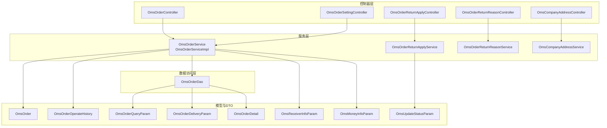
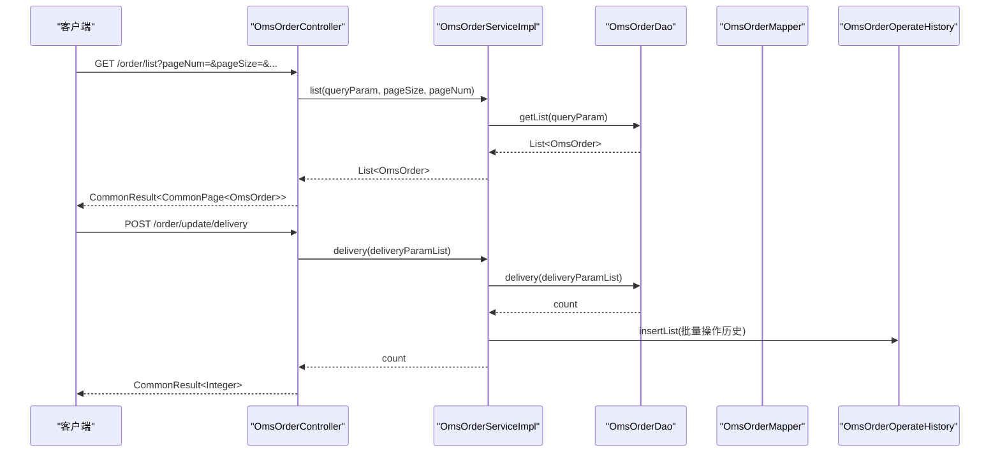
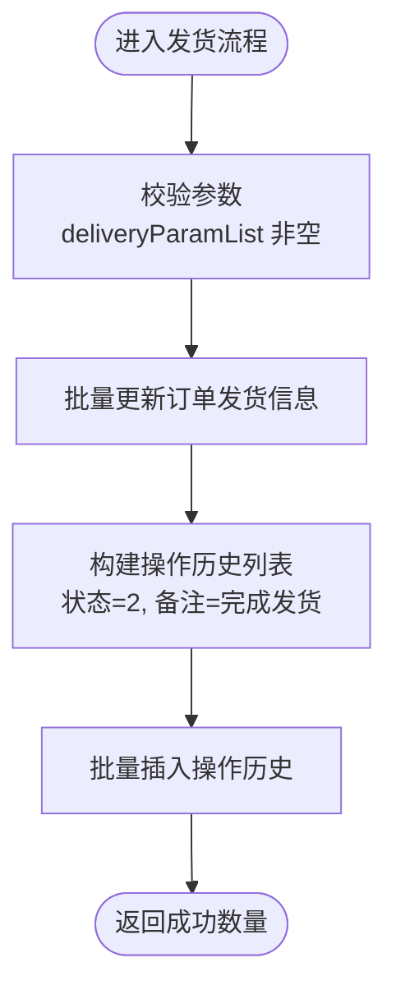
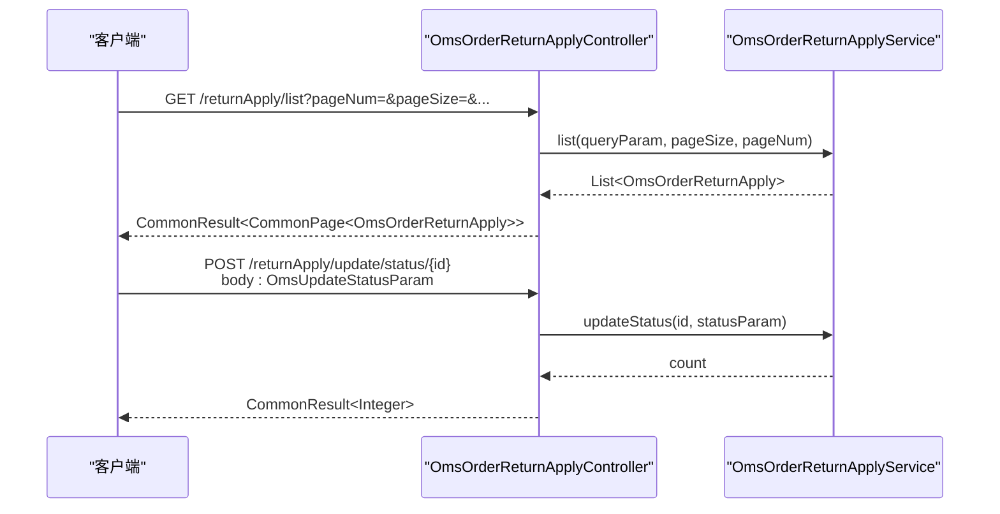
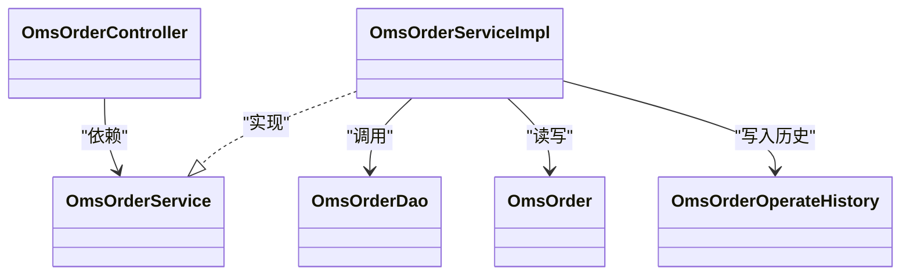

# 订单管理系统

<cite>
**本文引用的文件**
- [OmsOrderController.java](file://mall-admin/src/main/java/com/macro/mall/controller/OmsOrderController.java)
- [OmsOrderService.java](file://mall-admin/src/main/java/com/macro/mall/service/OmsOrderService.java)
- [OmsOrderServiceImpl.java](file://mall-admin/src/main/java/com/macro/mall/service/impl/OmsOrderServiceImpl.java)
- [OmsOrderDao.java](file://mall-admin/src/main/java/com/macro/mall/dao/OmsOrderDao.java)
- [OmsOrderQueryParam.java](file://mall-admin/src/main/java/com/macro/mall/dto/OmsOrderQueryParam.java)
- [OmsOrderDeliveryParam.java](file://mall-admin/src/main/java/com/macro/mall/dto/OmsOrderDeliveryParam.java)
- [OmsOrderDetail.java](file://mall-admin/src/main/java/com/macro/mall/dto/OmsOrderDetail.java)
- [OmsReceiverInfoParam.java](file://mall-admin/src/main/java/com/macro/mall/dto/OmsReceiverInfoParam.java)
- [OmsMoneyInfoParam.java](file://mall-admin/src/main/java/com/macro/mall/dto/OmsMoneyInfoParam.java)
- [OmsUpdateStatusParam.java](file://mall-admin/src/main/java/com/macro/mall/dto/OmsUpdateStatusParam.java)
- [OmsOrderReturnApplyController.java](file://mall-admin/src/main/java/com/macro/mall/controller/OmsOrderReturnApplyController.java)
- [OmsOrderReturnReasonController.java](file://mall-admin/src/main/java/com/macro/mall/controller/OmsOrderReturnReasonController.java)
- [OmsCompanyAddressController.java](file://mall-admin/src/main/java/com/macro/mall/controller/OmsCompanyAddressController.java)
- [OmsOrderSettingController.java](file://mall-admin/src/main/java/com/macro/mall/controller/OmsOrderSettingController.java)
- [OmsOrderReturnApplyService.java](file://mall-admin/src/main/java/com/macro/mall/service/OmsOrderReturnApplyService.java)
- [OmsOrderReturnReasonService.java](file://mall-admin/src/main/java/com/macro/mall/service/OmsOrderReturnReasonService.java)
- [OmsCompanyAddressService.java](file://mall-admin/src/main/java/com/macro/mall/service/OmsCompanyAddressService.java)
- [OmsOrderOperateHistory.java](file://mall-mbg/src/main/java/com/macro/mall/model/OmsOrderOperateHistory.java)
- [OmsOrder.java](file://mall-mbg/src/main/java/com/macro/mall/model/OmsOrder.java)
</cite>

## 目录
1. [简介](#简介)
2. [项目结构](#项目结构)
3. [核心组件](#核心组件)
4. [架构总览](#架构总览)
5. [详细组件分析](#详细组件分析)
6. [依赖关系分析](#依赖关系分析)
7. [性能考虑](#性能考虑)
8. [故障排查指南](#故障排查指南)
9. [结论](#结论)
10. [附录](#附录)

## 简介
本文件为订单管理系统的完整技术文档，覆盖订单查询、订单处理、退货申请、退货原因管理、公司地址管理、订单设置等核心功能模块。重点阐述 OmsOrderController 控制器的 RESTful 接口设计与业务流程，解析订单服务层的业务逻辑（状态流转、发货流程、退款处理、订单统计），并给出 DTO 设计说明与 API 接口文档。

## 项目结构
订单管理模块位于 mall-admin 工程中，采用典型的分层架构：
- 控制器层：提供 RESTful 接口，负责接收请求与返回响应
- 服务层：封装业务逻辑，协调 DAO/Mapper 完成数据持久化
- 数据访问层：通过 MyBatis DAO 接口执行复杂查询与批量操作
- 模型与 DTO：模型映射数据库表，DTO 封装接口参数与返回结果

图表来源
- [OmsOrderController.java:22-103](file://mall-admin/src/main/java/com/macro/mall/controller/OmsOrderController.java#L22-L103)
- [OmsOrderServiceImpl.java:25-153](file://mall-admin/src/main/java/com/macro/mall/service/impl/OmsOrderServiceImpl.java#L25-L153)
- [OmsOrderDao.java:15-30](file://mall-admin/src/main/java/com/macro/mall/dao/OmsOrderDao.java#L15-L30)
- [OmsOrderQueryParam.java:12-19](file://mall-admin/src/main/java/com/macro/mall/dto/OmsOrderQueryParam.java#L12-L19)
- [OmsOrderDeliveryParam.java:12-16](file://mall-admin/src/main/java/com/macro/mall/dto/OmsOrderDeliveryParam.java#L12-L16)
- [OmsOrderDetail.java:15-22](file://mall-admin/src/main/java/com/macro/mall/dto/OmsOrderDetail.java#L15-L22)
- [OmsReceiverInfoParam.java:12-22](file://mall-admin/src/main/java/com/macro/mall/dto/OmsReceiverInfoParam.java#L12-L22)
- [OmsMoneyInfoParam.java:14-19](file://mall-admin/src/main/java/com/macro/mall/dto/OmsMoneyInfoParam.java#L14-L19)
- [OmsUpdateStatusParam.java:14-23](file://mall-admin/src/main/java/com/macro/mall/dto/OmsUpdateStatusParam.java#L14-L23)

章节来源
- [OmsOrderController.java:15-21](file://mall-admin/src/main/java/com/macro/mall/controller/OmsOrderController.java#L15-L21)
- [OmsOrderService.java:9-58](file://mall-admin/src/main/java/com/macro/mall/service/OmsOrderService.java#L9-L58)
- [OmsOrderServiceImpl.java:20-33](file://mall-admin/src/main/java/com/macro/mall/service/impl/OmsOrderServiceImpl.java#L20-L33)

## 核心组件
- 订单控制器：提供订单列表、详情、发货、关闭、删除、收货人信息与费用信息更新、备注更新等接口
- 订单服务：封装订单查询、批量发货、批量关闭、删除、详情获取、信息更新与历史记录写入
- 订单 DAO：提供条件查询、批量发货、详情获取等能力
- DTO 与模型：查询参数、发货参数、订单详情聚合、收货人与费用信息参数、状态更新参数；模型包含订单主表字段与状态流转字段

章节来源
- [OmsOrderController.java:26-102](file://mall-admin/src/main/java/com/macro/mall/controller/OmsOrderController.java#L26-L102)
- [OmsOrderService.java:13-58](file://mall-admin/src/main/java/com/macro/mall/service/OmsOrderService.java#L13-L58)
- [OmsOrderServiceImpl.java:35-92](file://mall-admin/src/main/java/com/macro/mall/service/impl/OmsOrderServiceImpl.java#L35-L92)
- [OmsOrderDao.java:15-29](file://mall-admin/src/main/java/com/macro/mall/dao/OmsOrderDao.java#L15-L29)
- [OmsOrderQueryParam.java:12-19](file://mall-admin/src/main/java/com/macro/mall/dto/OmsOrderQueryParam.java#L12-L19)
- [OmsOrderDeliveryParam.java:12-16](file://mall-admin/src/main/java/com/macro/mall/dto/OmsOrderDeliveryParam.java#L12-L16)
- [OmsOrderDetail.java:15-22](file://mall-admin/src/main/java/com/macro/mall/dto/OmsOrderDetail.java#L15-L22)
- [OmsReceiverInfoParam.java:12-22](file://mall-admin/src/main/java/com/macro/mall/dto/OmsReceiverInfoParam.java#L12-L22)
- [OmsMoneyInfoParam.java:14-19](file://mall-admin/src/main/java/com/macro/mall/dto/OmsMoneyInfoParam.java#L14-L19)
- [OmsUpdateStatusParam.java:14-23](file://mall-admin/src/main/java/com/macro/mall/dto/OmsUpdateStatusParam.java#L14-L23)

## 架构总览
订单管理采用标准的 MVC + 分层架构，控制器负责协议与参数校验，服务层编排业务，DAO 层执行 SQL，模型与 DTO 负责数据传输。

图表来源
- [OmsOrderController.java:26-43](file://mall-admin/src/main/java/com/macro/mall/controller/OmsOrderController.java#L26-L43)
- [OmsOrderServiceImpl.java:42-58](file://mall-admin/src/main/java/com/macro/mall/service/impl/OmsOrderServiceImpl.java#L42-L58)
- [OmsOrderDao.java:22-24](file://mall-admin/src/main/java/com/macro/mall/dao/OmsOrderDao.java#L22-L24)

## 详细组件分析

### 订单控制器 RESTful 接口设计
- 列表查询
  - 方法：GET
  - 路径：/order/list
  - 查询参数：OmsOrderQueryParam（订单号、收货人关键字、状态、订单类型、来源类型、创建时间）
  - 分页参数：pageNum、pageSize
  - 返回：分页订单列表
- 订单详情
  - 方法：GET
  - 路径：/order/{id}
  - 返回：订单详情（含订单明细与操作历史）
- 发货操作
  - 方法：POST
  - 路径：/order/update/delivery
  - 请求体：List<OmsOrderDeliveryParam>（orderId、deliveryCompany、deliverySn）
  - 返回：成功数量
- 关闭订单
  - 方法：POST
  - 路径：/order/update/close
  - 参数：ids（订单ID列表）、note（备注）
  - 返回：成功数量
- 删除订单
  - 方法：POST
  - 路径：/order/delete
  - 参数：ids（订单ID列表）
  - 返回：成功数量
- 更新收货人信息
  - 方法：POST
  - 路径：/order/update/receiverInfo
  - 请求体：OmsReceiverInfoParam（orderId 及收货人信息字段）
  - 返回：成功数量
- 更新费用信息
  - 方法：POST
  - 路径：/order/update/moneyInfo
  - 请求体：OmsMoneyInfoParam（orderId、运费、优惠金额、状态）
  - 返回：成功数量
- 更新备注
  - 方法：POST
  - 路径：/order/update/note
  - 参数：id、note、status
  - 返回：成功数量

章节来源
- [OmsOrderController.java:26-102](file://mall-admin/src/main/java/com/macro/mall/controller/OmsOrderController.java#L26-L102)
- [OmsOrderQueryParam.java:12-19](file://mall-admin/src/main/java/com/macro/mall/dto/OmsOrderQueryParam.java#L12-L19)
- [OmsOrderDeliveryParam.java:12-16](file://mall-admin/src/main/java/com/macro/mall/dto/OmsOrderDeliveryParam.java#L12-L16)
- [OmsReceiverInfoParam.java:12-22](file://mall-admin/src/main/java/com/macro/mall/dto/OmsReceiverInfoParam.java#L12-L22)
- [OmsMoneyInfoParam.java:14-19](file://mall-admin/src/main/java/com/macro/mall/dto/OmsMoneyInfoParam.java#L14-L19)

### 订单服务层业务逻辑
- 订单查询：使用分页插件与自定义 DAO 条件查询
- 批量发货：更新订单发货信息，写入操作历史（状态=2，备注“完成发货”）
- 批量关闭：更新状态为已关闭（状态=4），写入操作历史
- 删除订单：逻辑删除（设置 deleteStatus=1）
- 订单详情：聚合订单明细与操作历史
- 更新收货人信息：更新收货人字段并写入操作历史
- 更新费用信息：更新运费与优惠金额并写入操作历史
- 更新备注：更新备注并写入操作历史

图表来源
- [OmsOrderServiceImpl.java:42-58](file://mall-admin/src/main/java/com/macro/mall/service/impl/OmsOrderServiceImpl.java#L42-L58)

章节来源
- [OmsOrderService.java:13-58](file://mall-admin/src/main/java/com/macro/mall/service/OmsOrderService.java#L13-L58)
- [OmsOrderServiceImpl.java:35-92](file://mall-admin/src/main/java/com/macro/mall/service/impl/OmsOrderServiceImpl.java#L35-L92)

### 退货申请管理
- 列表查询：支持分页与条件过滤
- 删除申请：批量删除
- 查看详情：返回申请详情聚合结果
- 审核状态：根据 OmsUpdateStatusParam 更新状态与备注

图表来源
- [OmsOrderReturnApplyController.java:28-62](file://mall-admin/src/main/java/com/macro/mall/controller/OmsOrderReturnApplyController.java#L28-L62)
- [OmsOrderReturnApplyService.java:14-34](file://mall-admin/src/main/java/com/macro/mall/service/OmsOrderReturnApplyService.java#L14-L34)
- [OmsUpdateStatusParam.java:14-23](file://mall-admin/src/main/java/com/macro/mall/dto/OmsUpdateStatusParam.java#L14-L23)

章节来源
- [OmsOrderReturnApplyController.java:17-64](file://mall-admin/src/main/java/com/macro/mall/controller/OmsOrderReturnApplyController.java#L17-L64)
- [OmsOrderReturnApplyService.java:14-34](file://mall-admin/src/main/java/com/macro/mall/service/OmsOrderReturnApplyService.java#L14-L34)

### 退货原因管理
- 新增、修改、删除退货原因
- 分页查询与启用/禁用切换
- 单条详情查看

章节来源
- [OmsOrderReturnReasonController.java:14-80](file://mall-admin/src/main/java/com/macro/mall/controller/OmsOrderReturnReasonController.java#L14-L80)
- [OmsOrderReturnReasonService.java:11-41](file://mall-admin/src/main/java/com/macro/mall/service/OmsOrderReturnReasonService.java#L11-L41)

### 公司地址管理
- 获取全部公司收货地址列表

章节来源
- [OmsCompanyAddressController.java:15-32](file://mall-admin/src/main/java/com/macro/mall/controller/OmsCompanyAddressController.java#L15-L32)
- [OmsCompanyAddressService.java:11-16](file://mall-admin/src/main/java/com/macro/mall/service/OmsCompanyAddressService.java#L11-L16)

### 订单设置管理
- 获取指定订单设置
- 更新订单设置（如自动确认收货天数等）

章节来源
- [OmsOrderSettingController.java:11-38](file://mall-admin/src/main/java/com/macro/mall/controller/OmsOrderSettingController.java#L11-L38)

### DTO 设计说明
- 查询参数：OmsOrderQueryParam（订单号、收货人关键字、状态、订单类型、来源类型、创建时间）
- 发货参数：OmsOrderDeliveryParam（orderId、deliveryCompany、deliverySn）
- 订单详情：OmsOrderDetail（继承 OmsOrder，扩展 orderItemList、historyList）
- 收货人信息：OmsReceiverInfoParam（orderId 及收货人地址系列字段、状态）
- 费用信息：OmsMoneyInfoParam（orderId、freightAmount、discountAmount、status）
- 状态更新：OmsUpdateStatusParam（id、companyAddressId、returnAmount、handleNote、handleMan、receiveNote、receiveMan、status）

章节来源
- [OmsOrderQueryParam.java:12-19](file://mall-admin/src/main/java/com/macro/mall/dto/OmsOrderQueryParam.java#L12-L19)
- [OmsOrderDeliveryParam.java:12-16](file://mall-admin/src/main/java/com/macro/mall/dto/OmsOrderDeliveryParam.java#L12-L16)
- [OmsOrderDetail.java:15-22](file://mall-admin/src/main/java/com/macro/mall/dto/OmsOrderDetail.java#L15-L22)
- [OmsReceiverInfoParam.java:12-22](file://mall-admin/src/main/java/com/macro/mall/dto/OmsReceiverInfoParam.java#L12-L22)
- [OmsMoneyInfoParam.java:14-19](file://mall-admin/src/main/java/com/macro/mall/dto/OmsMoneyInfoParam.java#L14-L19)
- [OmsUpdateStatusParam.java:14-23](file://mall-admin/src/main/java/com/macro/mall/dto/OmsUpdateStatusParam.java#L14-L23)

## 依赖关系分析
- 控制器依赖服务接口，服务实现依赖 DAO 与 Mapper
- 服务实现依赖订单模型与操作历史模型进行状态更新与历史记录写入
- DAO 依赖 MyBatis 注解参数绑定，实现条件查询、批量发货与详情聚合

图表来源
- [OmsOrderController.java:23-24](file://mall-admin/src/main/java/com/macro/mall/controller/OmsOrderController.java#L23-L24)
- [OmsOrderService.java:13-58](file://mall-admin/src/main/java/com/macro/mall/service/OmsOrderService.java#L13-L58)
- [OmsOrderServiceImpl.java:25-33](file://mall-admin/src/main/java/com/macro/mall/service/impl/OmsOrderServiceImpl.java#L25-L33)
- [OmsOrderDao.java:15-29](file://mall-admin/src/main/java/com/macro/mall/dao/OmsOrderDao.java#L15-L29)
- [OmsOrder.java:218-248](file://mall-mbg/src/main/java/com/macro/mall/model/OmsOrder.java#L218-L248)
- [OmsOrderOperateHistory.java:61-84](file://mall-mbg/src/main/java/com/macro/mall/model/OmsOrderOperateHistory.java#L61-L84)

章节来源
- [OmsOrderServiceImpl.java:25-33](file://mall-admin/src/main/java/com/macro/mall/service/impl/OmsOrderServiceImpl.java#L25-L33)
- [OmsOrderDao.java:15-29](file://mall-admin/src/main/java/com/macro/mall/dao/OmsOrderDao.java#L15-L29)

## 性能考虑
- 分页查询：服务层使用分页插件，避免一次性加载大量订单数据
- 批量操作：发货与关闭均采用批量更新，减少数据库往返
- 历史记录：批量插入操作历史，注意索引与事务边界控制
- 查询优化：DAO 层按需传参，结合数据库索引提升查询效率

## 故障排查指南
- 发货失败：检查 deliveryParamList 参数是否为空，确认订单状态允许发货
- 关闭失败：确认订单未被删除（deleteStatus=0）且满足关闭条件
- 删除异常：逻辑删除仅更新 deleteStatus，确保后续查询过滤该状态
- 历史记录缺失：确认操作历史插入逻辑在事务内执行
- 状态码与含义：参考订单状态字段定义，确保前后端一致

章节来源
- [OmsOrderServiceImpl.java:61-77](file://mall-admin/src/main/java/com/macro/mall/service/impl/OmsOrderServiceImpl.java#L61-L77)
- [OmsOrderServiceImpl.java:80-87](file://mall-admin/src/main/java/com/macro/mall/service/impl/OmsOrderServiceImpl.java#L80-L87)
- [OmsOrderOperateHistory.java:15720-15722](file://mall-mbg/src/main/java/com/macro/mall/model/OmsOrderOperateHistory.java#L15720-L15722)

## 结论
订单管理模块以清晰的分层架构实现了订单全生命周期管理，控制器提供完备的 RESTful 接口，服务层封装了关键业务逻辑与历史记录维护，DAO 层承担复杂查询与批量操作。通过 DTO 与模型的合理拆分，系统具备良好的可扩展性与可维护性。

## 附录

### 订单状态定义（参考）
- 0：待付款
- 1：待发货
- 2：已发货
- 3：已完成
- 4：已关闭
- 5：无效订单

章节来源
- [OmsOrderOperateHistory.java:15720-15722](file://mall-mbg/src/main/java/com/macro/mall/model/OmsOrderOperateHistory.java#L15720-L15722)
- [OmsOrder.java:218-248](file://mall-mbg/src/main/java/com/macro/mall/model/OmsOrder.java#L218-L248)