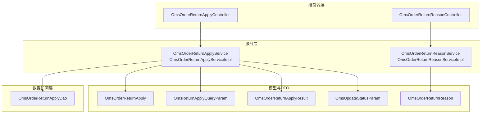
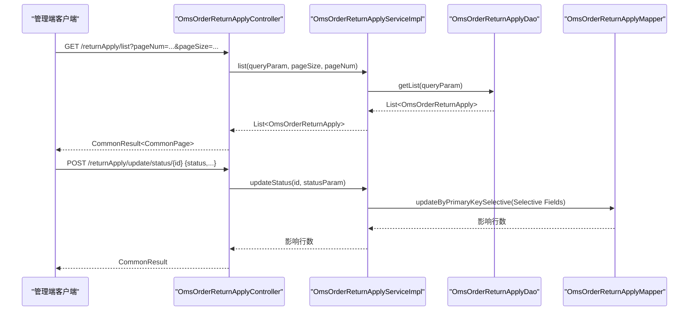
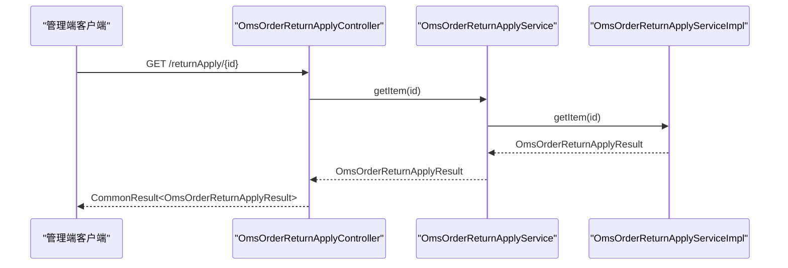
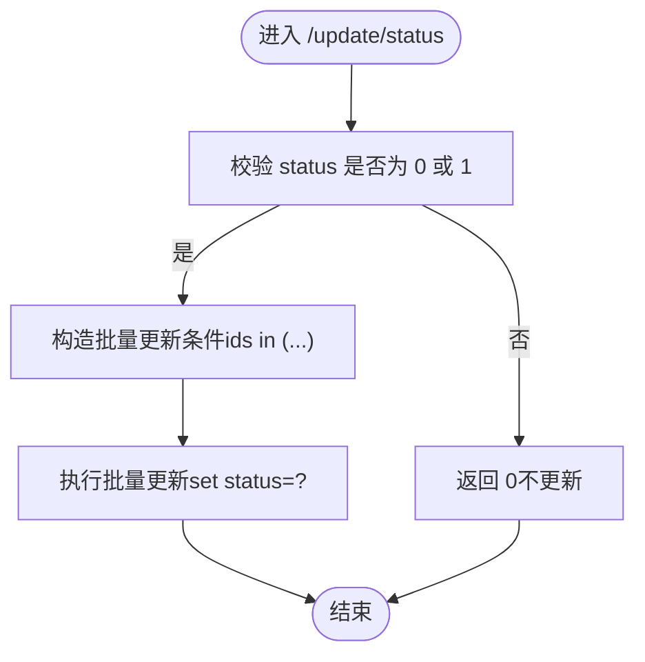
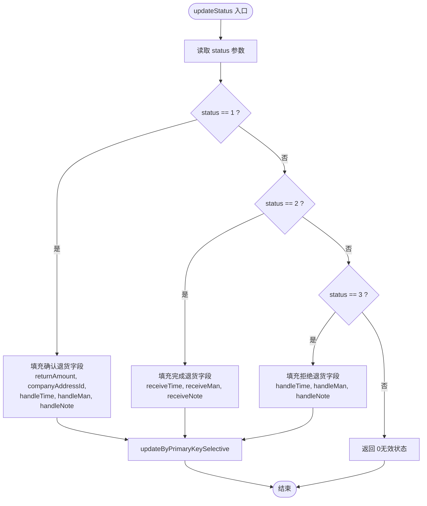
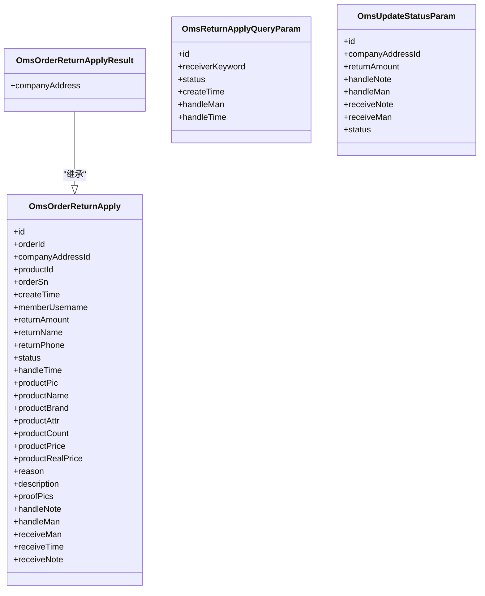
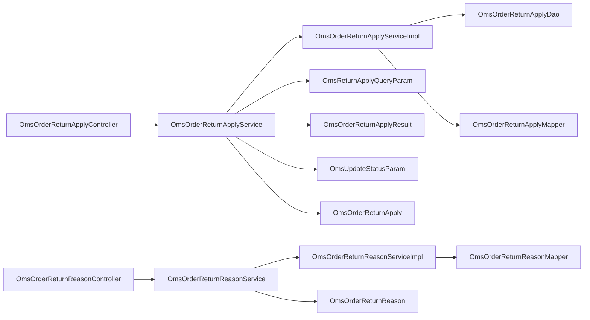

# 订单退货管理

<cite>
**本文引用的文件**
- [OmsOrderReturnApplyController.java](file://mall-admin/src/main/java/com/macro/mall/controller/OmsOrderReturnApplyController.java)
- [OmsOrderReturnReasonController.java](file://mall-admin/src/main/java/com/macro/mall/controller/OmsOrderReturnReasonController.java)
- [OmsOrderReturnApplyService.java](file://mall-admin/src/main/java/com/macro/mall/service/OmsOrderReturnApplyService.java)
- [OmsOrderReturnReasonService.java](file://mall-admin/src/main/java/com/macro/mall/service/OmsOrderReturnReasonService.java)
- [OmsOrderReturnApplyServiceImpl.java](file://mall-admin/src/main/java/com/macro/mall/service/impl/OmsOrderReturnApplyServiceImpl.java)
- [OmsOrderReturnReasonServiceImpl.java](file://mall-admin/src/main/java/com/macro/mall/service/impl/OmsOrderReturnReasonServiceImpl.java)
- [OmsOrderReturnApplyDao.java](file://mall-admin/src/main/java/com/macro/mall/dao/OmsOrderReturnApplyDao.java)
- [OmsReturnApplyQueryParam.java](file://mall-admin/src/main/java/com/macro/mall/dto/OmsReturnApplyQueryParam.java)
- [OmsOrderReturnApplyResult.java](file://mall-admin/src/main/java/com/macro/mall/dto/OmsOrderReturnApplyResult.java)
- [OmsUpdateStatusParam.java](file://mall-admin/src/main/java/com/macro/mall/dto/OmsUpdateStatusParam.java)
- [OmsOrderReturnApply.java](file://mall-mbg/src/main/java/com/macro/mall/model/OmsOrderReturnApply.java)
- [OmsOrderReturnReason.java](file://mall-mbg/src/main/java/com/macro/mall/model/OmsOrderReturnReason.java)
</cite>

## 目录
1. [简介](#简介)
2. [项目结构](#项目结构)
3. [核心组件](#核心组件)
4. [架构总览](#架构总览)
5. [详细组件分析](#详细组件分析)
6. [依赖分析](#依赖分析)
7. [性能考虑](#性能考虑)
8. [故障排查指南](#故障排查指南)
9. [结论](#结论)
10. [附录](#附录)

## 简介
本文件系统性梳理“订单退货管理”的完整流程与技术实现，覆盖退货申请与退货原因两大模块。重点包括：
- 退货申请：申请查询、审核处理（确认退货/完成退货/拒绝退货）、状态更新与详情展示。
- 退货原因：新增、修改、删除、分页查询、批量启用/禁用及按排序字段排序。
- 数据传输对象：退货申请查询参数、结果封装对象、状态更新参数。
- API 接口：面向管理端的退货申请与退货原因的完整操作说明。

## 项目结构
围绕退货管理的核心文件组织如下：
- 控制器层：OmsOrderReturnApplyController、OmsOrderReturnReasonController
- 服务接口与实现：OmsOrderReturnApplyService/ServiceImpl、OmsOrderReturnReasonService/ServiceImpl
- DAO 层：OmsOrderReturnApplyDao（自定义）
- DTO 层：OmsReturnApplyQueryParam、OmsOrderReturnApplyResult、OmsUpdateStatusParam
- 模型层：OmsOrderReturnApply、OmsOrderReturnReason

图表来源
- [OmsOrderReturnApplyController.java:1-65](file://mall-admin/src/main/java/com/macro/mall/controller/OmsOrderReturnApplyController.java#L1-L65)
- [OmsOrderReturnReasonController.java:1-81](file://mall-admin/src/main/java/com/macro/mall/controller/OmsOrderReturnReasonController.java#L1-L81)
- [OmsOrderReturnApplyService.java:1-35](file://mall-admin/src/main/java/com/macro/mall/service/OmsOrderReturnApplyService.java#L1-L35)
- [OmsOrderReturnReasonService.java:1-42](file://mall-admin/src/main/java/com/macro/mall/service/OmsOrderReturnReasonService.java#L1-L42)
- [OmsOrderReturnApplyServiceImpl.java:1-79](file://mall-admin/src/main/java/com/macro/mall/service/impl/OmsOrderReturnApplyServiceImpl.java#L1-L79)
- [OmsOrderReturnReasonServiceImpl.java:1-66](file://mall-admin/src/main/java/com/macro/mall/service/impl/OmsOrderReturnReasonServiceImpl.java#L1-L66)
- [OmsOrderReturnApplyDao.java:1-25](file://mall-admin/src/main/java/com/macro/mall/dao/OmsOrderReturnApplyDao.java#L1-L25)
- [OmsReturnApplyQueryParam.java:1-20](file://mall-admin/src/main/java/com/macro/mall/dto/OmsReturnApplyQueryParam.java#L1-L20)
- [OmsOrderReturnApplyResult.java:1-17](file://mall-admin/src/main/java/com/macro/mall/dto/OmsOrderReturnApplyResult.java#L1-L17)
- [OmsUpdateStatusParam.java:1-24](file://mall-admin/src/main/java/com/macro/mall/dto/OmsUpdateStatusParam.java#L1-L24)
- [OmsOrderReturnApply.java:1-317](file://mall-mbg/src/main/java/com/macro/mall/model/OmsOrderReturnApply.java#L1-L317)
- [OmsOrderReturnReason.java:1-74](file://mall-mbg/src/main/java/com/macro/mall/model/OmsOrderReturnReason.java#L1-L74)

章节来源
- [OmsOrderReturnApplyController.java:1-65](file://mall-admin/src/main/java/com/macro/mall/controller/OmsOrderReturnApplyController.java#L1-L65)
- [OmsOrderReturnReasonController.java:1-81](file://mall-admin/src/main/java/com/macro/mall/controller/OmsOrderReturnReasonController.java#L1-L81)

## 核心组件
- 退货申请控制器：提供退货申请的分页查询、批量删除、单条详情、状态更新等接口。
- 退货原因控制器：提供退货原因的增删改查、批量启停与分页查询。
- 服务接口与实现：封装业务逻辑，包含分页、条件过滤、状态变更、详情聚合等。
- DAO：提供申请列表与详情的自定义查询能力。
- DTO：封装查询参数、结果对象与状态更新参数。
- 模型：对应数据库表结构，承载退货申请与退货原因的字段。

章节来源
- [OmsOrderReturnApplyService.java:1-35](file://mall-admin/src/main/java/com/macro/mall/service/OmsOrderReturnApplyService.java#L1-L35)
- [OmsOrderReturnReasonService.java:1-42](file://mall-admin/src/main/java/com/macro/mall/service/OmsOrderReturnReasonService.java#L1-L42)
- [OmsOrderReturnApplyServiceImpl.java:1-79](file://mall-admin/src/main/java/com/macro/mall/service/impl/OmsOrderReturnApplyServiceImpl.java#L1-L79)
- [OmsOrderReturnReasonServiceImpl.java:1-66](file://mall-admin/src/main/java/com/macro/mall/service/impl/OmsOrderReturnReasonServiceImpl.java#L1-L66)
- [OmsOrderReturnApplyDao.java:1-25](file://mall-admin/src/main/java/com/macro/mall/dao/OmsOrderReturnApplyDao.java#L1-L25)
- [OmsReturnApplyQueryParam.java:1-20](file://mall-admin/src/main/java/com/macro/mall/dto/OmsReturnApplyQueryParam.java#L1-L20)
- [OmsOrderReturnApplyResult.java:1-17](file://mall-admin/src/main/java/com/macro/mall/dto/OmsOrderReturnApplyResult.java#L1-L17)
- [OmsUpdateStatusParam.java:1-24](file://mall-admin/src/main/java/com/macro/mall/dto/OmsUpdateStatusParam.java#L1-L24)
- [OmsOrderReturnApply.java:1-317](file://mall-mbg/src/main/java/com/macro/mall/model/OmsOrderReturnApply.java#L1-L317)
- [OmsOrderReturnReason.java:1-74](file://mall-mbg/src/main/java/com/macro/mall/model/OmsOrderReturnReason.java#L1-L74)

## 架构总览
退货管理采用标准的 MVC 分层架构：
- 控制器负责接收请求、参数校验与返回统一响应包装。
- 服务层编排业务规则与状态机转换。
- DAO 提供自定义查询能力，结合 PageHelper 实现分页。
- DTO 封装跨层传输对象，避免直接暴露模型细节。

图表来源
- [OmsOrderReturnApplyController.java:28-62](file://mall-admin/src/main/java/com/macro/mall/controller/OmsOrderReturnApplyController.java#L28-L62)
- [OmsOrderReturnApplyServiceImpl.java:29-72](file://mall-admin/src/main/java/com/macro/mall/service/impl/OmsOrderReturnApplyServiceImpl.java#L29-L72)
- [OmsOrderReturnApplyDao.java:14-24](file://mall-admin/src/main/java/com/macro/mall/dao/OmsOrderReturnApplyDao.java#L14-L24)

## 详细组件分析

### 退货申请控制器（OmsOrderReturnApplyController）
- 路由前缀：/returnApply
- 主要接口：
  - GET /list：分页查询退货申请，支持关键词、状态、时间等条件过滤。
  - POST /delete：批量删除（仅允许删除已完结状态的申请）。
  - GET /{id}：获取申请详情（包含公司地址等扩展信息）。
  - POST /update/status/{id}：更新申请状态（确认退货/完成退货/拒绝退货）。

图表来源
- [OmsOrderReturnApplyController.java:47-52](file://mall-admin/src/main/java/com/macro/mall/controller/OmsOrderReturnApplyController.java#L47-L52)
- [OmsOrderReturnApplyService.java:33-33](file://mall-admin/src/main/java/com/macro/mall/service/OmsOrderReturnApplyService.java#L33-L33)
- [OmsOrderReturnApplyServiceImpl.java:74-77](file://mall-admin/src/main/java/com/macro/mall/service/impl/OmsOrderReturnApplyServiceImpl.java#L74-L77)

章节来源
- [OmsOrderReturnApplyController.java:28-62](file://mall-admin/src/main/java/com/macro/mall/controller/OmsOrderReturnApplyController.java#L28-L62)

### 退货原因控制器（OmsOrderReturnReasonController）
- 路由前缀：/returnReason
- 主要接口：
  - POST /create：新增退货原因（自动记录创建时间）。
  - POST /update/{id}：修改退货原因。
  - POST /delete：批量删除。
  - GET /list：分页查询，按 sort 降序排列。
  - GET /{id}：获取单条退货原因详情。
  - POST /update/status：批量启用/禁用（status 只接受 0 或 1）。

图表来源
- [OmsOrderReturnReasonController.java:70-79](file://mall-admin/src/main/java/com/macro/mall/controller/OmsOrderReturnReasonController.java#L70-L79)
- [OmsOrderReturnReasonServiceImpl.java:50-59](file://mall-admin/src/main/java/com/macro/mall/service/impl/OmsOrderReturnReasonServiceImpl.java#L50-L59)

章节来源
- [OmsOrderReturnReasonController.java:25-80](file://mall-admin/src/main/java/com/macro/mall/controller/OmsOrderReturnReasonController.java#L25-L80)

### 退货申请服务与实现（OmsOrderReturnApplyService/ServiceImpl）
- 列表查询：集成 PageHelper 分页，调用 DAO 的 getList 进行条件查询。
- 删除：仅允许删除状态为“已完结”的申请（status=3）。
- 状态更新：根据传入 status 值分别填充不同字段集（确认退货/完成退货/拒绝退货），并进行选择性更新。
- 详情：通过 DAO 的 getDetail 返回包含公司地址等扩展信息的结果对象。

图表来源
- [OmsOrderReturnApplyServiceImpl.java:42-72](file://mall-admin/src/main/java/com/macro/mall/service/impl/OmsOrderReturnApplyServiceImpl.java#L42-L72)

章节来源
- [OmsOrderReturnApplyService.java:14-34](file://mall-admin/src/main/java/com/macro/mall/service/OmsOrderReturnApplyService.java#L14-L34)
- [OmsOrderReturnApplyServiceImpl.java:29-77](file://mall-admin/src/main/java/com/macro/mall/service/impl/OmsOrderReturnApplyServiceImpl.java#L29-L77)

### 退货原因服务与实现（OmsOrderReturnReasonService/ServiceImpl）
- 新增：设置创建时间后插入。
- 修改：按主键更新整条记录。
- 删除：按主键集合删除。
- 列表：分页查询并按 sort 降序排列。
- 批量启停：仅允许 0/1 两个值，否则返回 0。

章节来源
- [OmsOrderReturnReasonService.java:11-41](file://mall-admin/src/main/java/com/macro/mall/service/OmsOrderReturnReasonService.java#L11-L41)
- [OmsOrderReturnReasonServiceImpl.java:23-64](file://mall-admin/src/main/java/com/macro/mall/service/impl/OmsOrderReturnReasonServiceImpl.java#L23-L64)

### 数据传输对象（DTO）
- OmsReturnApplyQueryParam：用于退货申请查询的条件参数（如 id、关键词、状态、时间、经办人等）。
- OmsOrderReturnApplyResult：在继承退货申请模型的基础上，增加公司地址字段，用于详情展示。
- OmsUpdateStatusParam：用于状态更新的请求体参数（包含退货金额、公司地址、处理/收货人员与备注、状态码等）。

图表来源
- [OmsOrderReturnApply.java:1-317](file://mall-mbg/src/main/java/com/macro/mall/model/OmsOrderReturnApply.java#L1-L317)
- [OmsOrderReturnApplyResult.java:1-17](file://mall-admin/src/main/java/com/macro/mall/dto/OmsOrderReturnApplyResult.java#L1-L17)
- [OmsReturnApplyQueryParam.java:1-20](file://mall-admin/src/main/java/com/macro/mall/dto/OmsReturnApplyQueryParam.java#L1-L20)
- [OmsUpdateStatusParam.java:1-24](file://mall-admin/src/main/java/com/macro/mall/dto/OmsUpdateStatusParam.java#L1-L24)

章节来源
- [OmsReturnApplyQueryParam.java:12-19](file://mall-admin/src/main/java/com/macro/mall/dto/OmsReturnApplyQueryParam.java#L12-L19)
- [OmsOrderReturnApplyResult.java:12-16](file://mall-admin/src/main/java/com/macro/mall/dto/OmsOrderReturnApplyResult.java#L12-L16)
- [OmsUpdateStatusParam.java:14-23](file://mall-admin/src/main/java/com/macro/mall/dto/OmsUpdateStatusParam.java#L14-L23)

### 数据模型（Model）
- OmsOrderReturnApply：退货申请表的实体映射，包含订单号、会员名、退货金额、商品信息、原因描述、凭证图片、处理/收货人员与时间、状态等字段。
- OmsOrderReturnReason：退货原因表的实体映射，包含名称、排序、状态、创建时间等字段。

章节来源
- [OmsOrderReturnApply.java:7-62](file://mall-mbg/src/main/java/com/macro/mall/model/OmsOrderReturnApply.java#L7-L62)
- [OmsOrderReturnReason.java:6-17](file://mall-mbg/src/main/java/com/macro/mall/model/OmsOrderReturnReason.java#L6-L17)

## 依赖分析
- 控制器依赖服务接口；服务实现依赖 DAO 与 Mapper；DAO 依赖 MyBatis XML 映射（此处未直接分析 XML 文件，但可确认 DAO 方法签名与实现对应）。
- DTO 与 Model 之间存在一对一映射关系，DTO 作为传输载体，避免直接暴露持久化模型细节。
- 服务层承担状态机转换与业务规则校验，降低控制器与 DAO 的复杂度。

图表来源
- [OmsOrderReturnApplyController.java:25-26](file://mall-admin/src/main/java/com/macro/mall/controller/OmsOrderReturnApplyController.java#L25-L26)
- [OmsOrderReturnReasonController.java:23-23](file://mall-admin/src/main/java/com/macro/mall/controller/OmsOrderReturnReasonController.java#L23-L23)
- [OmsOrderReturnApplyServiceImpl.java:24-27](file://mall-admin/src/main/java/com/macro/mall/service/impl/OmsOrderReturnApplyServiceImpl.java#L24-L27)
- [OmsOrderReturnReasonServiceImpl.java:21-21](file://mall-admin/src/main/java/com/macro/mall/service/impl/OmsOrderReturnReasonServiceImpl.java#L21-L21)
- [OmsOrderReturnApplyDao.java:14-24](file://mall-admin/src/main/java/com/macro/mall/dao/OmsOrderReturnApplyDao.java#L14-L24)

章节来源
- [OmsOrderReturnApplyController.java:21-26](file://mall-admin/src/main/java/com/macro/mall/controller/OmsOrderReturnApplyController.java#L21-L26)
- [OmsOrderReturnReasonController.java:18-23](file://mall-admin/src/main/java/com/macro/mall/controller/OmsOrderReturnReasonController.java#L18-L23)

## 性能考虑
- 分页查询：服务层使用 PageHelper 进行分页，建议在查询条件中尽量使用索引字段以提升分页效率。
- 条件查询：DAO 提供 getList 支持多条件组合，建议在数据库层面建立合适的索引以优化过滤性能。
- 状态更新：ServiceImpl 使用选择性更新（Selective），仅更新传入的字段，减少写放大。
- 批量操作：批量删除/启停时建议控制批量大小，避免一次性操作过多记录导致锁竞争或超时。

## 故障排查指南
- 状态更新失败：
  - 检查传入 status 是否为 1/2/3，其他值将直接返回 0。
  - 确认必填字段是否完整（如 handleMan/handleNote、receiveMan/receiveNote 等）。
- 删除失败：
  - 仅允许删除状态为“已完结”（status=3）的申请。
- 列表为空：
  - 检查查询参数是否过严，或数据库中无匹配数据。
- 启停失败：
  - update/status 接口仅接受 status=0 或 1，其他值将返回 0。

章节来源
- [OmsOrderReturnApplyServiceImpl.java:42-72](file://mall-admin/src/main/java/com/macro/mall/service/impl/OmsOrderReturnApplyServiceImpl.java#L42-L72)
- [OmsOrderReturnReasonServiceImpl.java:50-59](file://mall-admin/src/main/java/com/macro/mall/service/impl/OmsOrderReturnReasonServiceImpl.java#L50-L59)

## 结论
退货管理模块通过清晰的分层设计与规范的 DTO/Model 映射，实现了退货申请与退货原因的完整闭环。控制器提供简洁的 REST 接口，服务层封装状态机与业务规则，DAO 提供灵活的查询能力。建议在生产环境中配合索引优化、批量操作限流与必要的日志埋点，确保高并发下的稳定性与可观测性。

## 附录

### API 接口清单（退货申请）
- GET /returnApply/list
  - 功能：分页查询退货申请
  - 请求参数：OmsReturnApplyQueryParam（id、receiverKeyword、status、createTime、handleMan、handleTime）、pageNum、pageSize
  - 返回：CommonResult<CommonPage<OmsOrderReturnApply>>
- POST /returnApply/delete
  - 功能：批量删除退货申请（仅允许删除已完结状态）
  - 请求参数：ids（List<Long>）
  - 返回：CommonResult<Integer>
- GET /returnApply/{id}
  - 功能：获取退货申请详情（含公司地址）
  - 返回：CommonResult<OmsOrderReturnApplyResult>
- POST /returnApply/update/status/{id}
  - 功能：更新退货申请状态（确认退货/完成退货/拒绝退货）
  - 请求体：OmsUpdateStatusParam（status 必填，其余字段按状态选择性填写）
  - 返回：CommonResult<Integer>

章节来源
- [OmsOrderReturnApplyController.java:28-62](file://mall-admin/src/main/java/com/macro/mall/controller/OmsOrderReturnApplyController.java#L28-L62)
- [OmsReturnApplyQueryParam.java:12-19](file://mall-admin/src/main/java/com/macro/mall/dto/OmsReturnApplyQueryParam.java#L12-L19)
- [OmsOrderReturnApplyResult.java:12-16](file://mall-admin/src/main/java/com/macro/mall/dto/OmsOrderReturnApplyResult.java#L12-L16)
- [OmsUpdateStatusParam.java:14-23](file://mall-admin/src/main/java/com/macro/mall/dto/OmsUpdateStatusParam.java#L14-L23)

### API 接口清单（退货原因）
- POST /returnReason/create
  - 功能：新增退货原因（自动记录创建时间）
  - 请求体：OmsOrderReturnReason
  - 返回：CommonResult<Integer>
- POST /returnReason/update/{id}
  - 功能：修改退货原因
  - 请求体：OmsOrderReturnReason
  - 返回：CommonResult<Integer>
- POST /returnReason/delete
  - 功能：批量删除退货原因
  - 请求参数：ids（List<Long>）
  - 返回：CommonResult<Integer>
- GET /returnReason/list
  - 功能：分页查询退货原因（按 sort 降序）
  - 请求参数：pageNum、pageSize
  - 返回：CommonResult<CommonPage<OmsOrderReturnReason>>
- GET /returnReason/{id}
  - 功能：获取单条退货原因详情
  - 返回：CommonResult<OmsOrderReturnReason>
- POST /returnReason/update/status
  - 功能：批量启用/禁用退货原因（status=0/1）
  - 请求参数：ids（List<Long>）、status（0 或 1）
  - 返回：CommonResult<Integer>

章节来源
- [OmsOrderReturnReasonController.java:25-80](file://mall-admin/src/main/java/com/macro/mall/controller/OmsOrderReturnReasonController.java#L25-L80)