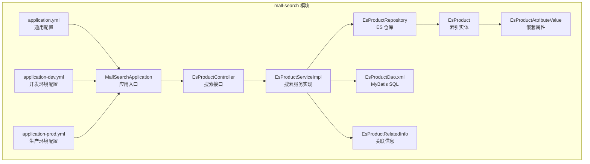
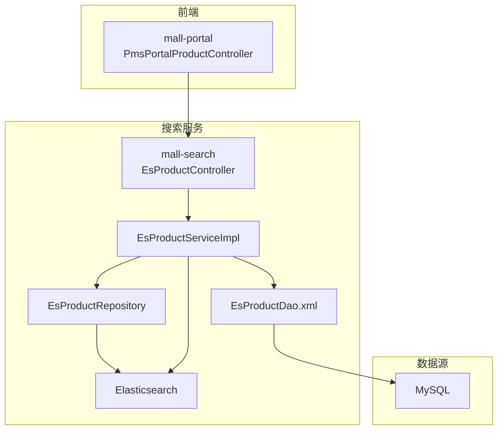
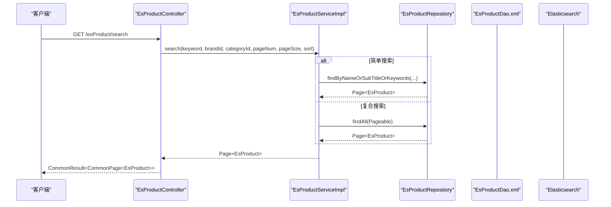
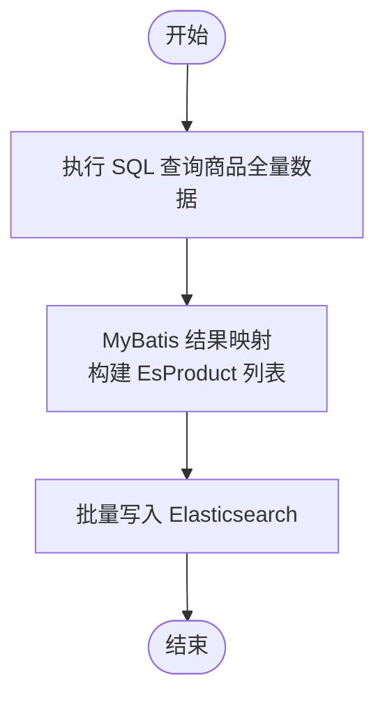
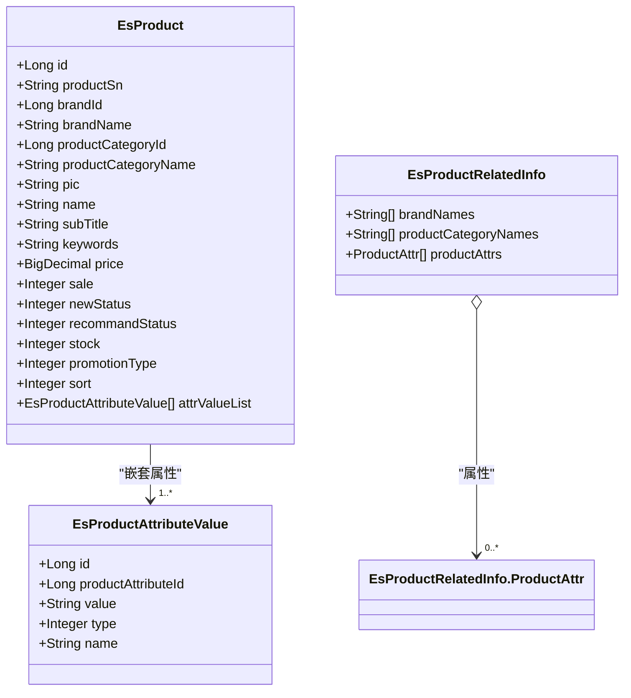
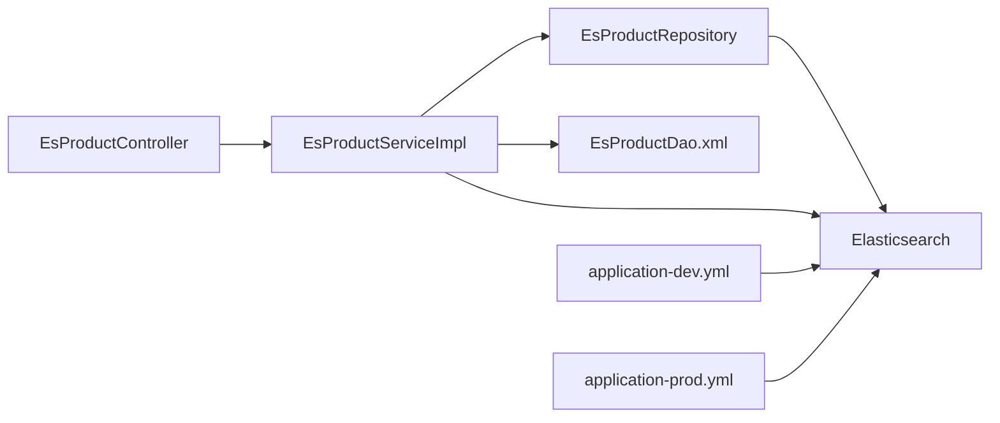

# 商品搜索系统（mall-search）

<cite>
**本文引用的文件**
- [MallSearchApplication.java](file://mall-search/src/main/java/com/macro/mall/search/MallSearchApplication.java)
- [application.yml](file://mall-search/src/main/resources/application.yml)
- [application-dev.yml](file://mall-search/src/main/resources/application-dev.yml)
- [application-prod.yml](file://mall-search/src/main/resources/application-prod.yml)
- [EsProductController.java](file://mall-search/src/main/java/com/macro/mall/search/controller/EsProductController.java)
- [EsProductServiceImpl.java](file://mall-search/src/main/java/com/macro/mall/search/service/impl/EsProductServiceImpl.java)
- [EsProductRepository.java](file://mall-search/src/main/java/com/macro/mall/search/repository/EsProductRepository.java)
- [EsProduct.java](file://mall-search/src/main/java/com/macro/mall/search/domain/EsProduct.java)
- [EsProductAttributeValue.java](file://mall-search/src/main/java/com/macro/mall/search/domain/EsProductAttributeValue.java)
- [EsProductRelatedInfo.java](file://mall-search/src/main/java/com/macro/mall/search/domain/EsProductRelatedInfo.java)
- [EsProductDao.xml](file://mall-search/src/main/resources/dao/EsProductDao.xml)
- [PmsPortalProductController.java](file://mall-portal/src/main/java/com/macro/mall/portal/controller/PmsPortalProductController.java)
- [WebLogAspect.java](file://mall-common/src/main/java/com/macro/mall/common/log/WebLogAspect.java)
- [logstash.conf](file://document/elk/logstash.conf)
- [docker-compose-app.yml](file://document/docker/docker-compose-app.yml)
- [docker-compose-env.yml](file://document/docker/docker-compose-env.yml)
</cite>

## 目录
1. [简介](#简介)
2. [项目结构](#项目结构)
3. [核心组件](#核心组件)
4. [架构总览](#架构总览)
5. [详细组件分析](#详细组件分析)
6. [依赖关系分析](#依赖关系分析)
7. [性能考虑](#性能考虑)
8. [故障排查指南](#故障排查指南)
9. [结论](#结论)
10. [附录](#附录)

## 简介
本文件面向“商品搜索系统（mall-search）”的技术文档，围绕基于 Elasticsearch 的商品搜索解决方案进行系统化说明。内容涵盖商品索引管理、全文检索、搜索建议、热门搜索、Elasticsearch 集群配置、索引映射设计、搜索 DSL 编写、商品数据同步机制（MySQL 到 Elasticsearch）、搜索结果排序、高亮显示、分页查询、性能优化策略以及部署与监控方案。

## 项目结构
mall-search 作为独立的微服务模块，采用 Spring Boot + Spring Data Elasticsearch 构建，主要包含以下层次：
- 应用入口与配置：应用启动类、多环境配置文件
- 控制器层：对外暴露搜索相关接口
- 服务层：封装搜索逻辑、批量导入、删除、推荐、关联信息提取
- 数据访问层：MyBatis 映射 SQL 查询商品全量数据；Elasticsearch 仓库用于索引 CRUD 与查询
- 领域模型：EsProduct 及其嵌套属性模型、关联信息模型

图表来源
- [MallSearchApplication.java:1-13](file://mall-search/src/main/java/com/macro/mall/search/MallSearchApplication.java#L1-L13)
- [application.yml:1-20](file://mall-search/src/main/resources/application.yml#L1-L20)
- [application-dev.yml:1-29](file://mall-search/src/main/resources/application-dev.yml#L1-L29)
- [application-prod.yml:1-30](file://mall-search/src/main/resources/application-prod.yml#L1-L30)
- [EsProductController.java:1-96](file://mall-search/src/main/java/com/macro/mall/search/controller/EsProductController.java#L1-L96)
- [EsProductServiceImpl.java:1-118](file://mall-search/src/main/java/com/macro/mall/search/service/impl/EsProductServiceImpl.java#L1-L118)
- [EsProductRepository.java:1-24](file://mall-search/src/main/java/com/macro/mall/search/repository/EsProductRepository.java#L1-L24)
- [EsProductDao.xml:1-30](file://mall-search/src/main/resources/dao/EsProductDao.xml#L1-L30)
- [EsProduct.java:1-51](file://mall-search/src/main/java/com/macro/mall/search/domain/EsProduct.java#L1-L51)
- [EsProductAttributeValue.java:1-29](file://mall-search/src/main/java/com/macro/mall/search/domain/EsProductAttributeValue.java#L1-L29)
- [EsProductRelatedInfo.java:1-27](file://mall-search/src/main/java/com/macro/mall/search/domain/EsProductRelatedInfo.java#L1-L27)

章节来源
- [MallSearchApplication.java:1-13](file://mall-search/src/main/java/com/macro/mall/search/MallSearchApplication.java#L1-L13)
- [application.yml:1-20](file://mall-search/src/main/resources/application.yml#L1-L20)
- [application-dev.yml:1-29](file://mall-search/src/main/resources/application-dev.yml#L1-L29)
- [application-prod.yml:1-30](file://mall-search/src/main/resources/application-prod.yml#L1-L30)

## 核心组件
- 应用入口与配置
  - 应用入口类负责启动 Spring Boot 应用，扫描基础包路径
  - 多环境配置分别定义数据库连接、Elasticsearch 连接、日志级别与 Logstash 主机等
- 控制器层
  - 提供批量导入、单条/批量删除、单条创建、简单搜索、复合搜索、推荐、关联信息查询等接口
- 服务层
  - 实现全量导入、按 ID 删除、按 ID 创建、批量删除、分页搜索、推荐、关联信息提取
  - 使用 ElasticsearchOperations 执行原生查询（NativeQuery），便于扩展复杂 DSL
- 数据访问层
  - MyBatis Mapper 负责从 MySQL 拉取商品全量数据，构建 EsProduct 对象
  - ElasticsearchRepository 提供基于方法名的查询（如按名称/副标题/关键词 OR 组合）
- 领域模型
  - EsProduct：索引文档，包含商品基本信息、全文字段、嵌套属性列表、分片与副本设置
  - EsProductAttributeValue：嵌套属性值，包含属性名、值、类型
  - EsProductRelatedInfo：品牌名、分类名、属性集合的聚合信息载体

章节来源
- [EsProductController.java:1-96](file://mall-search/src/main/java/com/macro/mall/search/controller/EsProductController.java#L1-L96)
- [EsProductServiceImpl.java:1-118](file://mall-search/src/main/java/com/macro/mall/search/service/impl/EsProductServiceImpl.java#L1-L118)
- [EsProductRepository.java:1-24](file://mall-search/src/main/java/com/macro/mall/search/repository/EsProductRepository.java#L1-L24)
- [EsProduct.java:1-51](file://mall-search/src/main/java/com/macro/mall/search/domain/EsProduct.java#L1-L51)
- [EsProductAttributeValue.java:1-29](file://mall-search/src/main/java/com/macro/mall/search/domain/EsProductAttributeValue.java#L1-L29)
- [EsProductRelatedInfo.java:1-27](file://mall-search/src/main/java/com/macro/mall/search/domain/EsProductRelatedInfo.java#L1-L27)
- [EsProductDao.xml:1-30](file://mall-search/src/main/resources/dao/EsProductDao.xml#L1-L30)

## 架构总览
mall-search 与上游 MySQL、下游 Elasticsearch、Portal 前端共同构成搜索链路。Portal 层发起搜索请求，mall-search 通过 ElasticsearchRepository 或 ElasticsearchOperations 执行查询，返回分页结果；索引数据由 MyBatis 从 MySQL 拉取后写入 ES。

图表来源
- [PmsPortalProductController.java:25-53](file://mall-portal/src/main/java/com/macro/mall/portal/controller/PmsPortalProductController.java#L25-L53)
- [EsProductController.java:1-96](file://mall-search/src/main/java/com/macro/mall/search/controller/EsProductController.java#L1-L96)
- [EsProductServiceImpl.java:1-118](file://mall-search/src/main/java/com/macro/mall/search/service/impl/EsProductServiceImpl.java#L1-L118)
- [EsProductRepository.java:1-24](file://mall-search/src/main/java/com/macro/mall/search/repository/EsProductRepository.java#L1-L24)
- [EsProductDao.xml:1-30](file://mall-search/src/main/resources/dao/EsProductDao.xml#L1-L30)

## 详细组件分析

### 控制器层：EsProductController
- 接口职责
  - 导入全量：POST /esProduct/importAll
  - 删除单条：GET /esProduct/delete/{id}
  - 批量删除：POST /esProduct/delete/batch
  - 单条创建：POST /esProduct/create/{id}
  - 简单搜索：GET /esProduct/search/simple
  - 复合搜索：GET /esProduct/search
  - 推荐：GET /esProduct/recommend/{id}
  - 关联信息：GET /esProduct/search/relate
- 参数与返回
  - 支持分页参数 pageNum、pageSize
  - 复合搜索支持 keyword、brandId、productCategoryId、sort
  - 返回统一包装对象，内含分页结果

章节来源
- [EsProductController.java:1-96](file://mall-search/src/main/java/com/macro/mall/search/controller/EsProductController.java#L1-L96)

### 服务层：EsProductServiceImpl
- 全量导入 importAll
  - 通过 EsProductDao 获取全量 EsProduct 列表
  - 使用 saveAll 批量写入 Elasticsearch
- 删除 delete
  - 支持单条与批量删除
- 创建 create
  - 通过 EsProductDao 获取单个 EsProduct 并保存
- 搜索 search
  - 简单搜索：按 name/subTitle/keywords OR 组合查询
  - 复合搜索：当前实现返回全部（预留扩展点）
- 推荐 recommend
  - 读取关联商品列表，若存在则返回全量分页（简化实现）
- 关联信息 searchRelatedInfo
  - 当前返回空集合（简化实现）

图表来源
- [EsProductController.java:68-78](file://mall-search/src/main/java/com/macro/mall/search/controller/EsProductController.java#L68-L78)
- [EsProductServiceImpl.java:85-95](file://mall-search/src/main/java/com/macro/mall/search/service/impl/EsProductServiceImpl.java#L85-L95)
- [EsProductRepository.java:12-23](file://mall-search/src/main/java/com/macro/mall/search/repository/EsProductRepository.java#L12-L23)

章节来源
- [EsProductServiceImpl.java:1-118](file://mall-search/src/main/java/com/macro/mall/search/service/impl/EsProductServiceImpl.java#L1-L118)

### 数据访问层：EsProductRepository 与 EsProductDao.xml
- EsProductRepository
  - 提供基于方法名的查询：findByNameOrSubTitleOrKeywords
- EsProductDao.xml
  - 定义 EsProduct 结果映射，包含嵌套属性集合 attrValueList
  - 提供 getAllEsProductList 查询，用于全量导入

图表来源
- [EsProductDao.xml:1-30](file://mall-search/src/main/resources/dao/EsProductDao.xml#L1-L30)
- [EsProductRepository.java:12-23](file://mall-search/src/main/java/com/macro/mall/search/repository/EsProductRepository.java#L12-L23)

章节来源
- [EsProductRepository.java:1-24](file://mall-search/src/main/java/com/macro/mall/search/repository/EsProductRepository.java#L1-L24)
- [EsProductDao.xml:1-30](file://mall-search/src/main/resources/dao/EsProductDao.xml#L1-L30)

### 领域模型：EsProduct、EsProductAttributeValue、EsProductRelatedInfo
- EsProduct
  - 索引文档，使用注解声明索引名称与分片/副本设置
  - 字段包含：编号、品牌、分类、图片、名称、副标题、关键词、价格、销量、库存、促销类型、排序、嵌套属性列表
  - 文本字段使用中文分词器（ik_max_word），关键词字段使用 Keyword 类型
- EsProductAttributeValue
  - 嵌套属性值，包含属性名、值、类型
- EsProductRelatedInfo
  - 关联信息载体，包含品牌名、分类名、属性集合

图表来源
- [EsProduct.java:1-51](file://mall-search/src/main/java/com/macro/mall/search/domain/EsProduct.java#L1-L51)
- [EsProductAttributeValue.java:1-29](file://mall-search/src/main/java/com/macro/mall/search/domain/EsProductAttributeValue.java#L1-L29)
- [EsProductRelatedInfo.java:1-27](file://mall-search/src/main/java/com/macro/mall/search/domain/EsProductRelatedInfo.java#L1-L27)

章节来源
- [EsProduct.java:1-51](file://mall-search/src/main/java/com/macro/mall/search/domain/EsProduct.java#L1-L51)
- [EsProductAttributeValue.java:1-29](file://mall-search/src/main/java/com/macro/mall/search/domain/EsProductAttributeValue.java#L1-L29)
- [EsProductRelatedInfo.java:1-27](file://mall-search/src/main/java/com/macro/mall/search/domain/EsProductRelatedInfo.java#L1-L27)

### 搜索建议与热门搜索
- 当前实现
  - 搜索建议与热门搜索接口存在，但返回空集合或简化实现
- 建议
  - 引入 completion suggester 实现输入即搜
  - 引入 terms aggregation 统计热门关键词
  - 引入 percolator 实现反向匹配与规则触发

章节来源
- [EsProductServiceImpl.java:108-116](file://mall-search/src/main/java/com/macro/mall/search/service/impl/EsProductServiceImpl.java#L108-L116)
- [EsProductController.java:89-94](file://mall-search/src/main/java/com/macro/mall/search/controller/EsProductController.java#L89-L94)

### 排序、高亮与分页
- 排序
  - 复合搜索接口接收 sort 参数，当前实现未生效，可结合 ElasticsearchOperations 使用 NativeQuery 扩展
- 高亮
  - 可通过 HighlightBuilder 在 ElasticsearchOperations 中添加高亮字段
- 分页
  - 使用 PageRequest/Pageable 实现分页查询

章节来源
- [EsProductController.java:68-78](file://mall-search/src/main/java/com/macro/mall/search/controller/EsProductController.java#L68-L78)
- [EsProductServiceImpl.java:85-95](file://mall-search/src/main/java/com/macro/mall/search/service/impl/EsProductServiceImpl.java#L85-L95)

### 数据同步机制（MySQL → Elasticsearch）
- 同步策略
  - 全量导入：调用 /esProduct/importAll 将 MySQL 商品数据转换为 EsProduct 并批量写入 ES
  - 增量更新：当前控制器未提供专门的增量接口，可在业务变更时调用 /esProduct/create/{id} 或 /esProduct/delete/{id} 触发同步
- 建议
  - 引入消息队列（如 RocketMQ/RabbitMQ）监听 MySQL binlog，实现近实时增量同步
  - 引入补偿机制与幂等处理，避免重复或遗漏

章节来源
- [EsProductController.java:27-57](file://mall-search/src/main/java/com/macro/mall/search/controller/EsProductController.java#L27-L57)
- [EsProductServiceImpl.java:44-70](file://mall-search/src/main/java/com/macro/mall/search/service/impl/EsProductServiceImpl.java#L44-L70)

### Elasticsearch 集群配置与索引映射
- 集群配置
  - 开发环境：本地 9200 端口
  - 生产环境：容器内 es:9200
- 索引映射
  - 索引名称：pms
  - 分片：1，副本：0（开发环境）
  - 字段类型：文本字段使用中文分词器，关键词字段使用 Keyword
  - 嵌套属性：attrValueList 使用 Nested 类型
- DSL 语句编写
  - 简单搜索：multi_match + bool + OR 组合
  - 复合搜索：bool + filter + function_score（权重/排序）
  - 高亮：highlight + fields
  - 聚合：terms + range + nested

章节来源
- [application-dev.yml:16-20](file://mall-search/src/main/resources/application-dev.yml#L16-L20)
- [application-prod.yml:15-20](file://mall-search/src/main/resources/application-prod.yml#L15-L20)
- [EsProduct.java:21-22](file://mall-search/src/main/java/com/macro/mall/search/domain/EsProduct.java#L21-L22)
- [EsProduct.java:36-50](file://mall-search/src/main/java/com/macro/mall/search/domain/EsProduct.java#L36-L50)

## 依赖关系分析
- 组件耦合
  - 控制器依赖服务接口
  - 服务实现依赖仓库接口与 DAO XML
  - 仓库接口依赖 Elasticsearch
- 外部依赖
  - ElasticsearchRepositories 启用：data.elasticsearch.repositories.enabled=true
  - Elasticsearch URIs：dev=9200；prod=es:9200
  - 日志：Logstash 主机配置

图表来源
- [EsProductController.java:1-96](file://mall-search/src/main/java/com/macro/mall/search/controller/EsProductController.java#L1-L96)
- [EsProductServiceImpl.java:1-118](file://mall-search/src/main/java/com/macro/mall/search/service/impl/EsProductServiceImpl.java#L1-L118)
- [EsProductRepository.java:1-24](file://mall-search/src/main/java/com/macro/mall/search/repository/EsProductRepository.java#L1-L24)
- [application-dev.yml:16-20](file://mall-search/src/main/resources/application-dev.yml#L16-L20)
- [application-prod.yml:15-20](file://mall-search/src/main/resources/application-prod.yml#L15-L20)

章节来源
- [application-dev.yml:1-29](file://mall-search/src/main/resources/application-dev.yml#L1-L29)
- [application-prod.yml:1-30](file://mall-search/src/main/resources/application-prod.yml#L1-L30)

## 性能考虑
- 查询优化
  - 合理使用 bool + filter 减少评分计算
  - 优先使用 Keyword 字段进行过滤与聚合
  - 限制分页深度，必要时使用 search_after 替代 deep paging
- 缓存策略
  - 对热点搜索词与热门分类结果进行缓存
  - 使用 CDN 缓存静态资源
- 分片配置
  - 根据数据量与查询负载调整分片数量
  - 合理设置副本数量以提升查询并发能力
- 写入优化
  - 批量写入（bulk）提升导入效率
  - 调整 refresh_interval 降低写入压力

## 故障排查指南
- Elasticsearch 连接失败
  - 检查 application-dev.yml 与 application-prod.yml 中 elasticsearch.uris 配置
  - 确认 ES 集群可达性与网络连通
- 索引映射异常
  - 检查 EsProduct 注解中的 indexName、分片与副本设置
  - 确认字段类型与分词器配置
- 查询结果为空
  - 核对搜索接口参数与服务实现是否生效
  - 使用 ElasticsearchOperations 执行原生查询验证 DSL
- 日志采集
  - WebLogAspect 通过 Logstash 记录请求信息，确认 logstash.host 配置

章节来源
- [application-dev.yml:16-20](file://mall-search/src/main/resources/application-dev.yml#L16-L20)
- [application-prod.yml:15-20](file://mall-search/src/main/resources/application-prod.yml#L15-L20)
- [EsProduct.java:21-22](file://mall-search/src/main/java/com/macro/mall/search/domain/EsProduct.java#L21-L22)
- [WebLogAspect.java:59-59](file://mall-common/src/main/java/com/macro/mall/common/log/WebLogAspect.java#L59-L59)

## 结论
mall-search 已实现基于 Elasticsearch 的商品搜索核心能力，包括全量导入、简单/复合搜索、推荐与关联信息接口。当前版本在搜索建议、热门搜索、排序高亮、增量同步等方面为简化实现，建议后续引入 completion suggester、percolator、高亮与 NativeQuery 排序、消息队列增量同步等能力，以满足更复杂的业务场景与性能要求。

## 附录
- 部署与监控
  - 应用与环境编排参考 docker-compose 文件
  - ELK 日志管道参考 logstash.conf
  - 建议增加 ES 集群健康检查、慢查询日志、指标监控（JVM、线程池、磁盘 IO）

章节来源
- [docker-compose-app.yml](file://document/docker/docker-compose-app.yml)
- [docker-compose-env.yml](file://document/docker/docker-compose-env.yml)
- [logstash.conf](file://document/elk/logstash.conf)