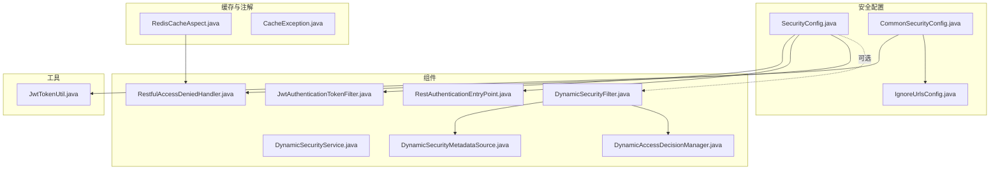
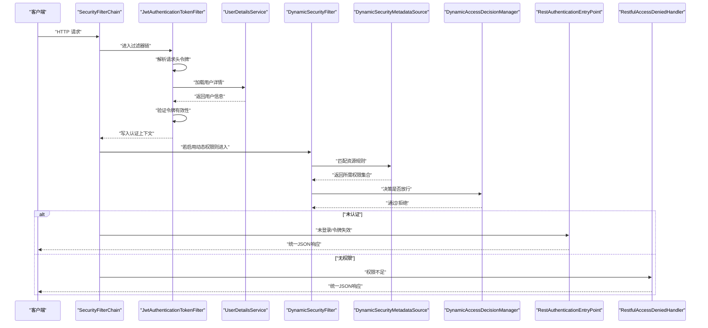
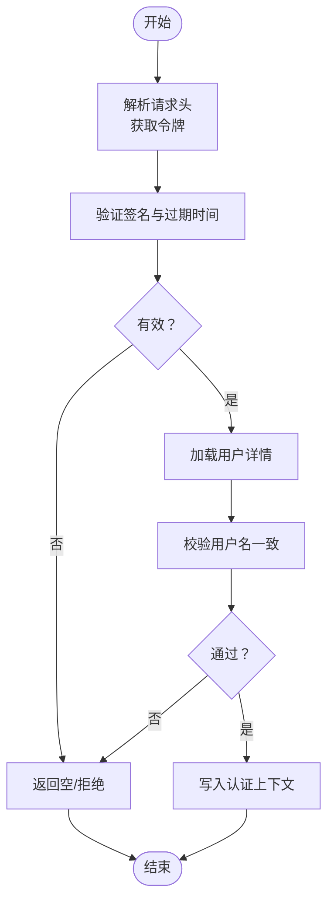
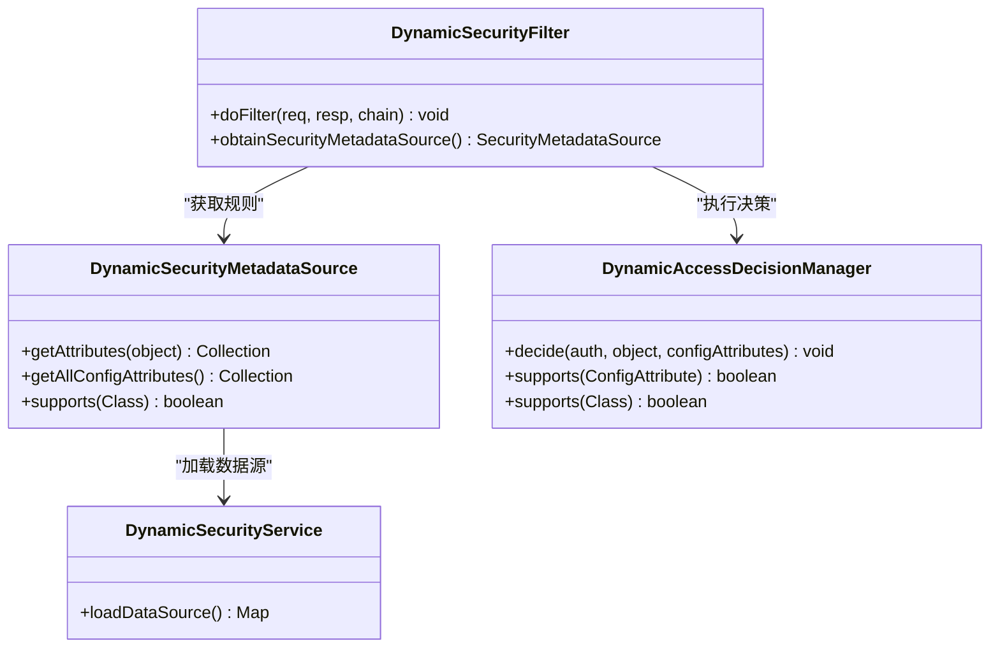
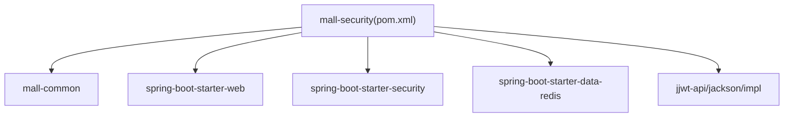

# 安全认证模块 (mall-security)

<cite>
**本文引用的文件**
- [SecurityConfig.java](file://mall-security/src/main/java/com/macro/mall/security/config/SecurityConfig.java)
- [CommonSecurityConfig.java](file://mall-security/src/main/java/com/macro/mall/security/config/CommonSecurityConfig.java)
- [JwtTokenUtil.java](file://mall-security/src/main/java/com/macro/mall/security/util/JwtTokenUtil.java)
- [JwtAuthenticationTokenFilter.java](file://mall-security/src/main/java/com/macro/mall/security/component/JwtAuthenticationTokenFilter.java)
- [DynamicSecurityService.java](file://mall-security/src/main/java/com/macro/mall/security/component/DynamicSecurityService.java)
- [DynamicSecurityFilter.java](file://mall-security/src/main/java/com/macro/mall/security/component/DynamicSecurityFilter.java)
- [DynamicSecurityMetadataSource.java](file://mall-security/src/main/java/com/macro/mall/security/component/DynamicSecurityMetadataSource.java)
- [DynamicAccessDecisionManager.java](file://mall-security/src/main/java/com/macro/mall/security/component/DynamicAccessDecisionManager.java)
- [IgnoreUrlsConfig.java](file://mall-security/src/main/java/com/macro/mall/security/config/IgnoreUrlsConfig.java)
- [RestAuthenticationEntryPoint.java](file://mall-security/src/main/java/com/macro/mall/security/component/RestAuthenticationEntryPoint.java)
- [RestfulAccessDeniedHandler.java](file://mall-security/src/main/java/com/macro/mall/security/component/RestfulAccessDeniedHandler.java)
- [RedisCacheAspect.java](file://mall-security/src/main/java/com/macro/mall/security/aspect/RedisCacheAspect.java)
- [CacheException.java](file://mall-security/src/main/java/com/macro/mall/security/annotation/CacheException.java)
- [pom.xml](file://mall-security/pom.xml)
- [application.yml(管理端)](file://mall-admin/src/main/resources/application.yml)
- [application.yml(门户端)](file://mall-portal/src/main/resources/application.yml)
</cite>

## 目录
1. [简介](#简介)
2. [项目结构](#项目结构)
3. [核心组件](#核心组件)
4. [架构总览](#架构总览)
5. [详细组件分析](#详细组件分析)
6. [依赖分析](#依赖分析)
7. [性能考虑](#性能考虑)
8. [故障排查指南](#故障排查指南)
9. [结论](#结论)
10. [附录](#附录)

## 简介
本文件面向“安全认证模块(mall-security)”，系统性阐述基于 JWT 的认证授权体系与动态权限控制能力。内容覆盖：
- 用户认证流程与权限控制机制
- Spring Security 配置要点（过滤器链、白名单、异常处理）
- JWT 令牌生成、验证与刷新机制（密钥、过期时间、存储策略）
- 动态权限控制（基于 URL 的权限匹配、基于注解的权限控制、权限数据缓存）
- Redis 缓存切面与权限变更通知
- 安全配置最佳实践与常见问题

## 项目结构
mall-security 作为独立的安全子模块，提供通用的 Spring Security 配置、JWT 工具、动态权限过滤器链以及缓存切面等能力。其核心包结构如下：
- config：安全配置与忽略路径配置
- component：过滤器、异常处理器、动态权限组件
- util：JWT 工具类
- aspect：AOP 缓存切面
- annotation：缓存异常注解

图表来源
- [SecurityConfig.java:38-67](file://mall-security/src/main/java/com/macro/mall/security/config/SecurityConfig.java#L38-L67)
- [CommonSecurityConfig.java:19-66](file://mall-security/src/main/java/com/macro/mall/security/config/CommonSecurityConfig.java#L19-L66)
- [JwtAuthenticationTokenFilter.java:25-57](file://mall-security/src/main/java/com/macro/mall/security/component/JwtAuthenticationTokenFilter.java#L25-L57)
- [DynamicSecurityFilter.java:21-77](file://mall-security/src/main/java/com/macro/mall/security/component/DynamicSecurityFilter.java#L21-L77)
- [DynamicSecurityMetadataSource.java:18-64](file://mall-security/src/main/java/com/macro/mall/security/component/DynamicSecurityMetadataSource.java#L18-L64)
- [DynamicAccessDecisionManager.java:18-51](file://mall-security/src/main/java/com/macro/mall/security/component/DynamicAccessDecisionManager.java#L18-L51)
- [RestAuthenticationEntryPoint.java:18-28](file://mall-security/src/main/java/com/macro/mall/security/component/RestAuthenticationEntryPoint.java#L18-28)
- [RestfulAccessDeniedHandler.java:18-30](file://mall-security/src/main/java/com/macro/mall/security/component/RestfulAccessDeniedHandler.java#L18-30)
- [JwtTokenUtil.java:31-181](file://mall-security/src/main/java/com/macro/mall/security/util/JwtTokenUtil.java#L31-181)
- [RedisCacheAspect.java:21-50](file://mall-security/src/main/java/com/macro/mall/security/aspect/RedisCacheAspect.java#L21-50)
- [CacheException.java:9-13](file://mall-security/src/main/java/com/macro/mall/security/annotation/CacheException.java#L9-L13)

章节来源
- [pom.xml:19-52](file://mall-security/pom.xml#L19-L52)

## 核心组件
- 过滤器链与安全配置
  - SecurityConfig：构建 SecurityFilterChain，禁用 CSRF、启用无状态 Session、注册 JWT 过滤器、配置异常处理、按需加入动态权限过滤器。
  - CommonSecurityConfig：统一装配密码编码器、忽略路径配置、JWT 工具、异常处理器、JWT 过滤器以及动态权限相关 Bean。
  - IgnoreUrlsConfig：白名单路径配置，支持 ANT 表达式。
- JWT 认证
  - JwtAuthenticationTokenFilter：从请求头读取令牌，解析用户名，加载用户详情并写入 SecurityContext。
  - JwtTokenUtil：令牌生成、解析、过期判断、刷新（带时间窗口防抖）。
- 动态权限
  - DynamicSecurityService：加载资源-权限映射（ANT 路径 → 权限标识）。
  - DynamicSecurityFilter：基于路径匹配的动态权限拦截。
  - DynamicSecurityMetadataSource：根据访问路径匹配资源规则。
  - DynamicAccessDecisionManager：基于用户权限集合的决策。
- 异常处理
  - RestAuthenticationEntryPoint：未登录/令牌失效返回统一 JSON。
  - RestfulAccessDeniedHandler：无权限访问返回统一 JSON。

章节来源
- [SecurityConfig.java:38-67](file://mall-security/src/main/java/com/macro/mall/security/config/SecurityConfig.java#L38-L67)
- [CommonSecurityConfig.java:19-66](file://mall-security/src/main/java/com/macro/mall/security/config/CommonSecurityConfig.java#L19-L66)
- [IgnoreUrlsConfig.java:14-21](file://mall-security/src/main/java/com/macro/mall/security/config/IgnoreUrlsConfig.java#L14-L21)
- [JwtAuthenticationTokenFilter.java:25-57](file://mall-security/src/main/java/com/macro/mall/security/component/JwtAuthenticationTokenFilter.java#L25-L57)
- [JwtTokenUtil.java:31-181](file://mall-security/src/main/java/com/macro/mall/security/util/JwtTokenUtil.java#L31-181)
- [DynamicSecurityService.java:11-16](file://mall-security/src/main/java/com/macro/mall/security/component/DynamicSecurityService.java#L11-L16)
- [DynamicSecurityFilter.java:21-77](file://mall-security/src/main/java/com/macro/mall/security/component/DynamicSecurityFilter.java#L21-L77)
- [DynamicSecurityMetadataSource.java:18-64](file://mall-security/src/main/java/com/macro/mall/security/component/DynamicSecurityMetadataSource.java#L18-L64)
- [DynamicAccessDecisionManager.java:18-51](file://mall-security/src/main/java/com/macro/mall/security/component/DynamicAccessDecisionManager.java#L18-L51)
- [RestAuthenticationEntryPoint.java:18-28](file://mall-security/src/main/java/com/macro/mall/security/component/RestAuthenticationEntryPoint.java#L18-28)
- [RestfulAccessDeniedHandler.java:18-30](file://mall-security/src/main/java/com/macro/mall/security/component/RestfulAccessDeniedHandler.java#L18-30)

## 架构总览
下图展示 mall-security 在请求生命周期中的作用：JWT 过滤器解析令牌并注入认证上下文；动态权限过滤器在需要时进行基于路径的权限决策；异常处理器统一输出响应。

图表来源
- [SecurityConfig.java:38-67](file://mall-security/src/main/java/com/macro/mall/security/config/SecurityConfig.java#L38-L67)
- [JwtAuthenticationTokenFilter.java:36-56](file://mall-security/src/main/java/com/macro/mall/security/component/JwtAuthenticationTokenFilter.java#L36-L56)
- [DynamicSecurityFilter.java:37-61](file://mall-security/src/main/java/com/macro/mall/security/component/DynamicSecurityFilter.java#L37-L61)
- [DynamicSecurityMetadataSource.java:34-51](file://mall-security/src/main/java/com/macro/mall/security/component/DynamicSecurityMetadataSource.java#L34-L51)
- [DynamicAccessDecisionManager.java:20-38](file://mall-security/src/main/java/com/macro/mall/security/component/DynamicAccessDecisionManager.java#L20-L38)
- [RestAuthenticationEntryPoint.java:19-27](file://mall-security/src/main/java/com/macro/mall/security/component/RestAuthenticationEntryPoint.java#L19-27)
- [RestfulAccessDeniedHandler.java:18-30](file://mall-security/src/main/java/com/macro/mall/security/component/RestfulAccessDeniedHandler.java#L18-30)

## 详细组件分析

### Spring Security 配置与过滤器链
- 关键点
  - 禁用 CSRF，启用无状态 Session，适配前后端分离场景。
  - 注册 JwtAuthenticationTokenFilter 于 UsernamePasswordAuthenticationFilter 之前，确保在用户名密码过滤器前完成令牌解析与认证。
  - 白名单路径逐条 permitAll，允许 OPTIONS 预检请求。
  - 若存在动态权限服务，则在 FilterSecurityInterceptor 之前加入 DynamicSecurityFilter。
  - 异常处理：未登录/令牌失效与无权限分别由自定义 EntryPoint 与 AccessDeniedHandler 统一输出 JSON。
- CORS 处理
  - 本模块未直接实现 CORS 过滤器，但异常处理器设置了跨域响应头，便于统一处理跨域场景下的未登录/无权限响应。

章节来源
- [SecurityConfig.java:38-67](file://mall-security/src/main/java/com/macro/mall/security/config/SecurityConfig.java#L38-L67)
- [RestAuthenticationEntryPoint.java:18-28](file://mall-security/src/main/java/com/macro/mall/security/component/RestAuthenticationEntryPoint.java#L18-28)
- [RestfulAccessDeniedHandler.java:18-30](file://mall-security/src/main/java/com/macro/mall/security/component/RestfulAccessDeniedHandler.java#L18-30)

### JWT 令牌生成、验证与刷新
- 生成与解析
  - 使用 HS512 算法与对称密钥（从配置注入），负载包含用户名与创建时间，过期时间由配置项决定。
  - 解析时校验签名与过期时间，提取用户名。
- 令牌验证
  - 结合 UserDetailsService 加载的用户详情，校验用户名一致且未过期。
- 刷新机制
  - 支持在一定时间窗口内对未过期的旧令牌进行刷新，刷新后更新创建时间，避免频繁重建。
  - 若令牌已过期或无效，返回空以阻止刷新。
- 存储策略
  - 客户端通常将令牌放在请求头中，键名与前缀由配置项定义。

图表来源
- [JwtAuthenticationTokenFilter.java:36-56](file://mall-security/src/main/java/com/macro/mall/security/component/JwtAuthenticationTokenFilter.java#L36-L56)
- [JwtTokenUtil.java:87-107](file://mall-security/src/main/java/com/macro/mall/security/util/JwtTokenUtil.java#L87-L107)
- [JwtTokenUtil.java:140-164](file://mall-security/src/main/java/com/macro/mall/security/util/JwtTokenUtil.java#L140-L164)

章节来源
- [JwtTokenUtil.java:31-181](file://mall-security/src/main/java/com/macro/mall/security/util/JwtTokenUtil.java#L31-181)
- [JwtAuthenticationTokenFilter.java:25-57](file://mall-security/src/main/java/com/macro/mall/security/component/JwtAuthenticationTokenFilter.java#L25-L57)

### 动态权限控制（基于 URL 与注解）
- 基于 URL 的权限匹配
  - DynamicSecurityService 提供资源-权限映射（ANT 路径 → 权限标识）。
  - DynamicSecurityMetadataSource 在每次请求时匹配当前访问路径，返回所需权限集合。
  - DynamicAccessDecisionManager 对比用户权限集合，任一匹配即放行，否则拒绝。
  - DynamicSecurityFilter 在过滤器链中拦截请求，执行上述匹配与决策。
- 基于注解的权限控制
  - 本模块未直接提供基于 @PreAuthorize/@PostAuthorize 等注解的全局开关，但可通过引入 Spring Security 注解支持与动态权限结合实现。建议在业务层配合使用注解与动态权限，以满足细粒度控制需求。
- 权限数据缓存
  - 可在 DynamicSecurityService 中缓存资源-权限映射，减少每次请求的数据库查询。
  - Redis 缓存切面可隔离缓存异常对业务的影响，保证主流程稳定。

图表来源
- [DynamicSecurityService.java:11-16](file://mall-security/src/main/java/com/macro/mall/security/component/DynamicSecurityService.java#L11-L16)
- [DynamicSecurityMetadataSource.java:18-64](file://mall-security/src/main/java/com/macro/mall/security/component/DynamicSecurityMetadataSource.java#L18-L64)
- [DynamicAccessDecisionManager.java:18-51](file://mall-security/src/main/java/com/macro/mall/security/component/DynamicAccessDecisionManager.java#L18-L51)
- [DynamicSecurityFilter.java:21-77](file://mall-security/src/main/java/com/macro/mall/security/component/DynamicSecurityFilter.java#L21-L77)

章节来源
- [DynamicSecurityService.java:11-16](file://mall-security/src/main/java/com/macro/mall/security/component/DynamicSecurityService.java#L11-L16)
- [DynamicSecurityFilter.java:37-61](file://mall-security/src/main/java/com/macro/mall/security/component/DynamicSecurityFilter.java#L37-L61)
- [DynamicSecurityMetadataSource.java:34-51](file://mall-security/src/main/java/com/macro/mall/security/component/DynamicSecurityMetadataSource.java#L34-L51)
- [DynamicAccessDecisionManager.java:20-38](file://mall-security/src/main/java/com/macro/mall/security/component/DynamicAccessDecisionManager.java#L20-L38)

### Redis 缓存切面与权限变更通知
- RedisCacheAspect
  - 对以 CacheService 结尾的公开方法进行环绕增强，捕获异常。
  - 若方法标注 CacheException 注解，则抛出异常；否则记录日志，避免 Redis 故障影响主流程。
- 权限变更通知
  - 建议在权限数据更新后，清理 DynamicSecurityMetadataSource 的缓存并触发重新加载，确保动态权限规则即时生效。

章节来源
- [RedisCacheAspect.java:21-50](file://mall-security/src/main/java/com/macro/mall/security/aspect/RedisCacheAspect.java#L21-L50)
- [CacheException.java:9-13](file://mall-security/src/main/java/com/macro/mall/security/annotation/CacheException.java#L9-L13)

### 配置项与最佳实践
- 配置项来源
  - JWT：tokenHeader、tokenHead、secret、expiration。
  - 白名单：secure.ignored.urls。
  - Redis：key、expire（不同模块可自定义）。
- 最佳实践
  - 密钥管理：secret 应来自安全的配置中心或环境变量，定期轮换。
  - 过期时间：expiration 建议按业务风险调整，短期令牌配合刷新窗口使用。
  - 令牌存储：前端统一从响应头或本地存储中读取并携带，避免明文泄露。
  - 白名单：仅开放必要静态资源与注册/登录等接口，其余均需认证。
  - 动态权限：资源-权限映射应集中管理，变更后及时刷新缓存。
  - 异常处理：统一 JSON 输出，便于前端提示与日志采集。

章节来源
- [application.yml(管理端):20-52](file://mall-admin/src/main/resources/application.yml#L20-L52)
- [application.yml(门户端):15-40](file://mall-portal/src/main/resources/application.yml#L15-L40)
- [IgnoreUrlsConfig.java:14-21](file://mall-security/src/main/java/com/macro/mall/security/config/IgnoreUrlsConfig.java#L14-L21)
- [JwtTokenUtil.java:35-40](file://mall-security/src/main/java/com/macro/mall/security/util/JwtTokenUtil.java#L35-L40)

## 依赖分析
mall-security 依赖 mall-common、Spring Boot Starter Web/Security/Redis 以及 jjwt 生态，形成“通用配置 + 安全过滤 + JWT 工具 + 动态权限 + 缓存切面”的完整能力集。

图表来源
- [pom.xml:19-52](file://mall-security/pom.xml#L19-L52)

章节来源
- [pom.xml:19-52](file://mall-security/pom.xml#L19-L52)

## 性能考虑
- 无状态设计：禁用 Session、使用 JWT，降低服务器状态维护成本。
- 缓存策略：动态权限规则与用户详情建议缓存，减少数据库压力；Redis 故障时通过缓存切面降级，保障可用性。
- 过滤器链优化：白名单路径快速放行，避免不必要的鉴权开销。
- 令牌刷新：合理设置刷新窗口，减少重复签发带来的 CPU 开销。

## 故障排查指南
- 未登录/令牌失效
  - 现象：统一返回未授权 JSON。
  - 排查：确认请求头是否包含正确的 tokenHeader 与 tokenHead；检查 secret 是否正确；确认令牌未过期。
- 无权限访问
  - 现象：统一返回禁止访问 JSON。
  - 排查：确认用户角色是否包含所需权限；检查动态权限规则是否正确加载与匹配。
- 动态权限不生效
  - 现象：访问受限但规则应放行。
  - 排查：确认 DynamicSecurityService 已正确加载资源-权限映射；检查路径匹配是否使用 ANT 表达式；确认缓存已刷新。
- Redis 故障
  - 现象：缓存不可用导致业务异常。
  - 排查：利用 RedisCacheAspect 的降级行为，确认异常被捕获；必要时临时关闭缓存或切换备用存储。

章节来源
- [RestAuthenticationEntryPoint.java:18-28](file://mall-security/src/main/java/com/macro/mall/security/component/RestAuthenticationEntryPoint.java#L18-28)
- [RestfulAccessDeniedHandler.java:18-30](file://mall-security/src/main/java/com/macro/mall/security/component/RestfulAccessDeniedHandler.java#L18-30)
- [RedisCacheAspect.java:31-48](file://mall-security/src/main/java/com/macro/mall/security/aspect/RedisCacheAspect.java#L31-L48)

## 结论
mall-security 通过“无状态 + JWT + 动态权限 + 缓存切面”构建了高可用、易扩展的安全基础设施。结合合理的配置与最佳实践，可在多端（管理端/门户端）复用统一的安全能力，并平滑演进到更细粒度的注解权限控制。

## 附录
- 配置示例参考
  - 管理端配置：JWT 参数与白名单路径
  - 门户端配置：JWT 参数与白名单路径
- 建议扩展
  - 引入 Spring Security 注解权限控制，与动态权限互补。
  - 增加令牌黑名单与撤销机制，提升安全性。
  - 完善权限变更通知与灰度发布策略，保障线上稳定。