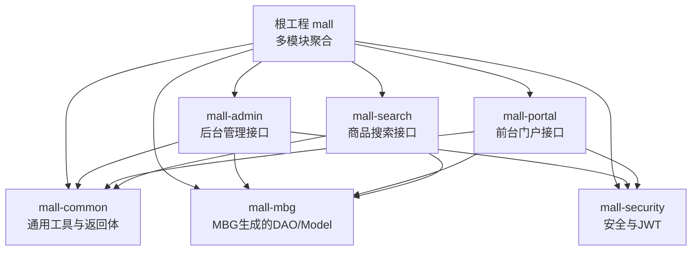
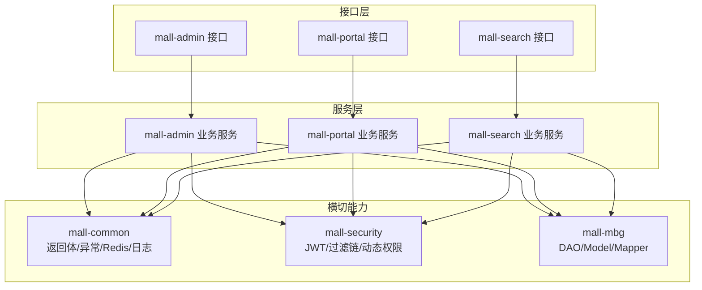
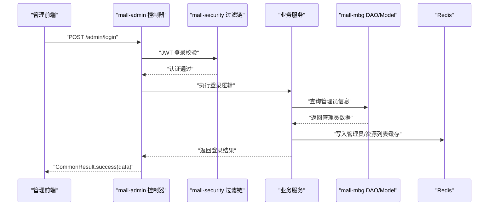
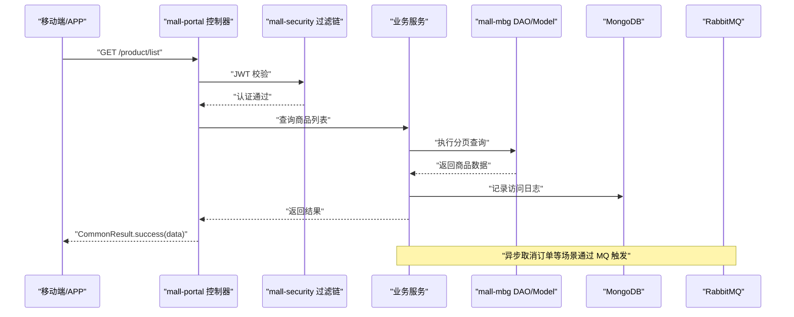
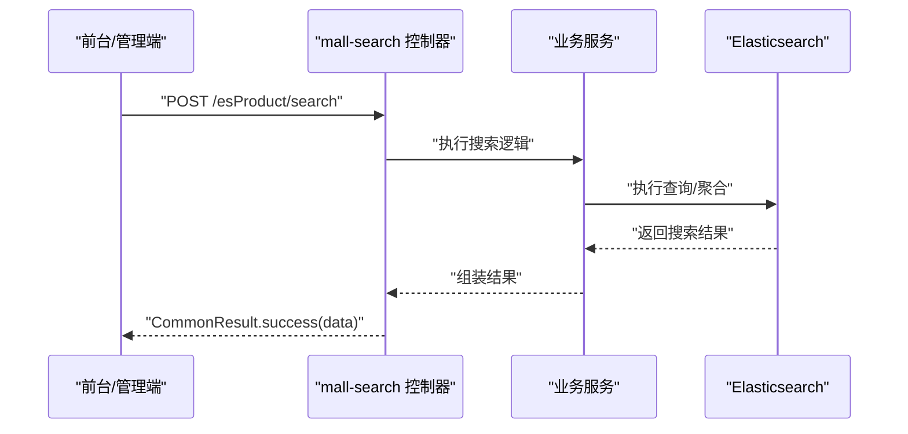
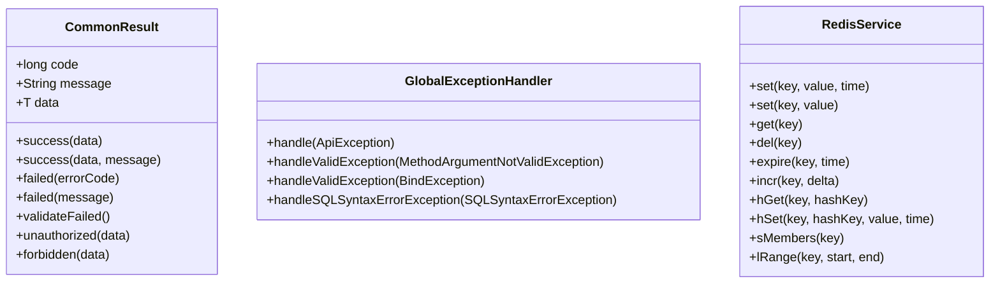
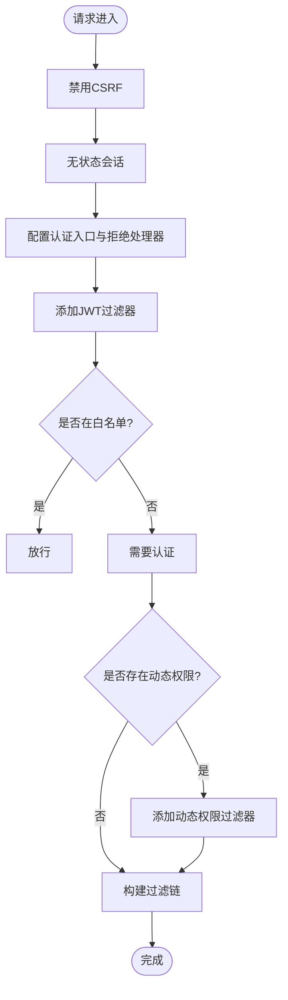
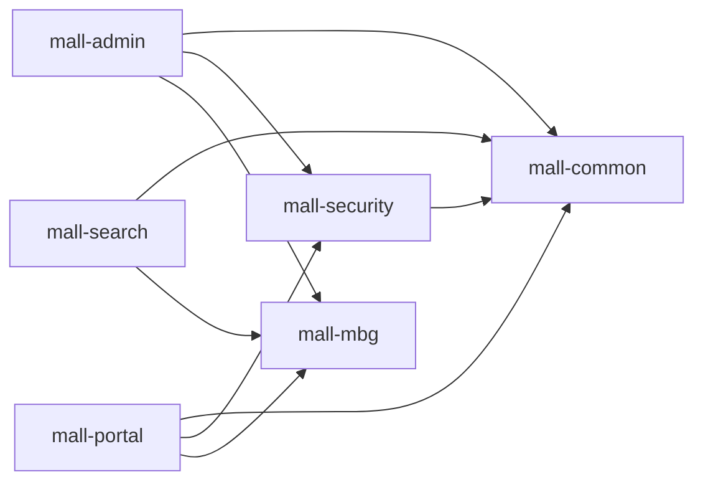

# 核心模块

<cite>
**本文引用的文件**
- [README.md](file://README.md)
- [pom.xml](file://pom.xml)
- [mall-admin/MallAdminApplication.java](file://mall-admin/src/main/java/com/macro/mall/MallAdminApplication.java)
- [mall-admin/pom.xml](file://mall-admin/pom.xml)
- [mall-admin/src/main/resources/application.yml](file://mall-admin/src/main/resources/application.yml)
- [mall-portal/MallPortalApplication.java](file://mall-portal/src/main/java/com/macro/mall/portal/MallPortalApplication.java)
- [mall-portal/pom.xml](file://mall-portal/pom.xml)
- [mall-portal/src/main/resources/application.yml](file://mall-portal/src/main/resources/application.yml)
- [mall-search/MallSearchApplication.java](file://mall-search/src/main/java/com/macro/mall/search/MallSearchApplication.java)
- [mall-search/pom.xml](file://mall-search/pom.xml)
- [mall-search/src/main/resources/application.yml](file://mall-search/src/main/resources/application.yml)
- [mall-common/pom.xml](file://mall-common/pom.xml)
- [mall-common/src/main/java/com/macro/mall/common/api/CommonResult.java](file://mall-common/src/main/java/com/macro/mall/common/api/CommonResult.java)
- [mall-common/src/main/java/com/macro/mall/common/exception/GlobalExceptionHandler.java](file://mall-common/src/main/java/com/macro/mall/common/exception/GlobalExceptionHandler.java)
- [mall-common/src/main/java/com/macro/mall/common/service/RedisService.java](file://mall-common/src/main/java/com/macro/mall/common/service/RedisService.java)
- [mall-security/pom.xml](file://mall-security/pom.xml)
- [mall-security/src/main/java/com/macro/mall/security/config/SecurityConfig.java](file://mall-security/src/main/java/com/macro/mall/security/config/SecurityConfig.java)
- [mall-security/src/main/java/com/macro/mall/security/util/JwtTokenUtil.java](file://mall-security/src/main/java/com/macro/mall/security/util/JwtTokenUtil.java)
- [mall-mbg/pom.xml](file://mall-mbg/pom.xml)
</cite>

## 目录
1. [简介](#简介)
2. [项目结构](#项目结构)
3. [核心组件](#核心组件)
4. [架构总览](#架构总览)
5. [详细组件分析](#详细组件分析)
6. [依赖分析](#依赖分析)
7. [性能考虑](#性能考虑)
8. [故障排查指南](#故障排查指南)
9. [结论](#结论)
10. [附录](#附录)

## 简介
本项目是一套基于 Spring Boot 的电商系统，包含后台管理系统、前台门户系统与商品搜索系统，采用模块化架构组织，核心模块包括：
- mall-admin：后台管理系统接口与业务实现
- mall-portal：前台门户系统接口与业务实现
- mall-search：基于 Elasticsearch 的商品搜索系统
- mall-common：通用返回体、全局异常、Redis 封装与日志切面等
- mall-security：统一安全配置、JWT、动态权限与过滤链
- mall-mbg：MyBatis Generator 自动生成的数据库访问代码

项目提供统一的返回体与异常处理，内置安全认证与鉴权，支持对象存储、消息队列、缓存、日志采集等基础设施。

章节来源
- [README.md:29-62](file://README.md#L29-L62)

## 项目结构
项目采用 Maven 多模块聚合结构，顶层 pom 声明了所有子模块，并集中管理依赖与插件。各模块职责清晰，通过 mall-common、mall-security、mall-mbg 实现复用与解耦。

图表来源
- [pom.xml:12-20](file://pom.xml#L12-L20)
- [mall-admin/pom.xml:19-36](file://mall-admin/pom.xml#L19-L36)
- [mall-portal/pom.xml:20-50](file://mall-portal/pom.xml#L20-L50)
- [mall-search/pom.xml:20-35](file://mall-search/pom.xml#L20-L35)
- [mall-common/pom.xml:21-51](file://mall-common/pom.xml#L21-L51)
- [mall-security/pom.xml:19-53](file://mall-security/pom.xml#L19-L53)
- [mall-mbg/pom.xml:21-46](file://mall-mbg/pom.xml#L21-L46)

章节来源
- [pom.xml:12-20](file://pom.xml#L12-L20)
- [README.md:51-62](file://README.md#L51-L62)

## 核心组件
- mall-common：提供统一返回体、全局异常处理、Redis 操作接口、Swagger 配置与日志切面，作为各模块公共能力输出。
- mall-security：提供安全过滤链、JWT 工具、忽略路径配置、认证与授权入口点、动态权限组件，保障接口安全。
- mall-mbg：通过 MBG 生成 DAO、Mapper 与 Model，配合分页与 Druid 连接池，支撑数据访问层。
- mall-admin：后台管理接口，提供商品、订单、会员、促销、运营、内容、权限等管理能力。
- mall-portal：前台门户接口，提供首页、商品、购物车、订单、会员、支付、MongoDB 与消息队列集成等能力。
- mall-search：基于 Elasticsearch 的商品搜索接口，提供检索与聚合能力。

章节来源
- [mall-common/src/main/java/com/macro/mall/common/api/CommonResult.java:7-134](file://mall-common/src/main/java/com/macro/mall/common/api/CommonResult.java#L7-L134)
- [mall-common/src/main/java/com/macro/mall/common/exception/GlobalExceptionHandler.java:19-69](file://mall-common/src/main/java/com/macro/mall/common/exception/GlobalExceptionHandler.java#L19-L69)
- [mall-common/src/main/java/com/macro/mall/common/service/RedisService.java:11-182](file://mall-common/src/main/java/com/macro/mall/common/service/RedisService.java#L11-L182)
- [mall-security/src/main/java/com/macro/mall/security/config/SecurityConfig.java:23-67](file://mall-security/src/main/java/com/macro/mall/security/config/SecurityConfig.java#L23-L67)
- [mall-security/src/main/java/com/macro/mall/security/util/JwtTokenUtil.java:28-171](file://mall-security/src/main/java/com/macro/mall/security/util/JwtTokenUtil.java#L28-L171)
- [mall-mbg/pom.xml:21-46](file://mall-mbg/pom.xml#L21-L46)
- [mall-admin/pom.xml:19-36](file://mall-admin/pom.xml#L19-L36)
- [mall-portal/pom.xml:20-50](file://mall-portal/pom.xml#L20-L50)
- [mall-search/pom.xml:20-35](file://mall-search/pom.xml#L20-L35)

## 架构总览
系统采用“接口层-服务层-数据访问层”三层架构，结合 mall-common、mall-security、mall-mbg 形成横切能力，模块间通过统一返回体与异常处理进行交互，安全通过 mall-security 的过滤链统一接入。

图表来源
- [pom.xml:12-20](file://pom.xml#L12-L20)
- [mall-admin/pom.xml:19-36](file://mall-admin/pom.xml#L19-L36)
- [mall-portal/pom.xml:20-50](file://mall-portal/pom.xml#L20-L50)
- [mall-search/pom.xml:20-35](file://mall-search/pom.xml#L20-L35)
- [mall-common/pom.xml:21-51](file://mall-common/pom.xml#L21-L51)
- [mall-security/pom.xml:19-53](file://mall-security/pom.xml#L19-L53)
- [mall-mbg/pom.xml:21-46](file://mall-mbg/pom.xml#L21-L46)

## 详细组件分析

### mall-admin 后台管理系统
- 职责边界：提供后台管理所需的商品、订单、会员、促销、运营、内容、权限、财务、设置等接口。
- 对外接口与服务能力：基于 Spring MVC 提供 RESTful 接口；集成 mall-security 进行统一认证与鉴权；使用 mall-common 的统一返回体与异常处理；使用 mall-mbg 的 DAO/Model 进行数据持久化。
- 关键配置：application.yml 中配置 JWT、Redis 缓存键空间、安全白名单、阿里云 OSS 回调等。
- 启动入口：MallAdminApplication。

图表来源
- [mall-admin/src/main/resources/application.yml:20-66](file://mall-admin/src/main/resources/application.yml#L20-L66)
- [mall-security/src/main/java/com/macro/mall/security/config/SecurityConfig.java:38-67](file://mall-security/src/main/java/com/macro/mall/security/config/SecurityConfig.java#L38-L67)
- [mall-common/src/main/java/com/macro/mall/common/api/CommonResult.java:35-47](file://mall-common/src/main/java/com/macro/mall/common/api/CommonResult.java#L35-L47)

章节来源
- [mall-admin/MallAdminApplication.java:10-15](file://mall-admin/src/main/java/com/macro/mall/MallAdminApplication.java#L10-L15)
- [mall-admin/src/main/resources/application.yml:20-66](file://mall-admin/src/main/resources/application.yml#L20-L66)
- [mall-admin/pom.xml:19-36](file://mall-admin/pom.xml#L19-L36)

### mall-portal 前台门户系统
- 职责边界：提供前台门户所需的商品浏览、首页推荐、购物车、订单流程、会员中心、支付、MongoDB 日志与消息队列集成等能力。
- 对外接口与服务能力：基于 Spring MVC 提供 RESTful 接口；集成 mall-security 进行统一认证与鉴权；使用 mall-common 的统一返回体与异常处理；使用 mall-mbg 的 DAO/Model 进行数据持久化；集成 MongoDB 与 RabbitMQ。
- 关键配置：application.yml 中配置 JWT、Redis 缓存键空间、MongoDB 插入开关、RabbitMQ 队列名称等。
- 启动入口：MallPortalApplication。

图表来源
- [mall-portal/src/main/resources/application.yml:15-62](file://mall-portal/src/main/resources/application.yml#L15-L62)
- [mall-security/src/main/java/com/macro/mall/security/config/SecurityConfig.java:38-67](file://mall-security/src/main/java/com/macro/mall/security/config/SecurityConfig.java#L38-L67)
- [mall-common/src/main/java/com/macro/mall/common/api/CommonResult.java:35-47](file://mall-common/src/main/java/com/macro/mall/common/api/CommonResult.java#L35-L47)

章节来源
- [mall-portal/MallPortalApplication.java:6-13](file://mall-portal/src/main/java/com/macro/mall/portal/MallPortalApplication.java#L6-L13)
- [mall-portal/src/main/resources/application.yml:15-62](file://mall-portal/src/main/resources/application.yml#L15-L62)
- [mall-portal/pom.xml:20-50](file://mall-portal/pom.xml#L20-L50)

### mall-search 商品搜索系统
- 职责边界：提供商品搜索、聚合、高亮等能力，基于 Elasticsearch 实现。
- 对外接口与服务能力：基于 Spring MVC 提供 RESTful 接口；集成 mall-common 的统一返回体与异常处理；使用 mall-mbg 的 Model 进行数据模型映射。
- 关键配置：application.yml 中配置服务端口与 MyBatis Mapper 路径。
- 启动入口：MallSearchApplication。

图表来源
- [mall-search/src/main/resources/application.yml:10-20](file://mall-search/src/main/resources/application.yml#L10-L20)
- [mall-common/src/main/java/com/macro/mall/common/api/CommonResult.java:35-47](file://mall-common/src/main/java/com/macro/mall/common/api/CommonResult.java#L35-L47)

章节来源
- [mall-search/MallSearchApplication.java:6-12](file://mall-search/src/main/java/com/macro/mall/search/MallSearchApplication.java#L6-L12)
- [mall-search/src/main/resources/application.yml:10-20](file://mall-search/src/main/resources/application.yml#L10-L20)
- [mall-search/pom.xml:20-35](file://mall-search/pom.xml#L20-L35)

### mall-common 通用工具模块
- 统一返回体：CommonResult 提供 success/failed/validateFailed/unauthorized/forbidden 等静态方法，规范接口返回。
- 全局异常处理：GlobalExceptionHandler 统一处理业务异常、参数校验异常与 SQL 权限异常。
- Redis 操作接口：RedisService 定义常用键值、哈希、集合、列表操作，便于缓存复用。
- 日志与切面：WebLogAspect 记录接口访问日志，结合 logstash 输出到 ELK。

图表来源
- [mall-common/src/main/java/com/macro/mall/common/api/CommonResult.java:7-134](file://mall-common/src/main/java/com/macro/mall/common/api/CommonResult.java#L7-L134)
- [mall-common/src/main/java/com/macro/mall/common/exception/GlobalExceptionHandler.java:20-68](file://mall-common/src/main/java/com/macro/mall/common/exception/GlobalExceptionHandler.java#L20-L68)
- [mall-common/src/main/java/com/macro/mall/common/service/RedisService.java:11-182](file://mall-common/src/main/java/com/macro/mall/common/service/RedisService.java#L11-L182)

章节来源
- [mall-common/pom.xml:21-51](file://mall-common/pom.xml#L21-L51)

### mall-security 安全认证模块
- 安全过滤链：SecurityConfig 配置 CSRF 关闭、无状态会话、异常处理器、JWT 过滤器与动态权限过滤器。
- JWT 工具：JwtTokenUtil 提供生成、解析、刷新、过期判断等能力，读取配置中的密钥、过期时间与 token 前缀。
- 动态权限：DynamicSecurityService/DynamicSecurityFilter 支持运行时权限控制。

图表来源
- [mall-security/src/main/java/com/macro/mall/security/config/SecurityConfig.java:38-67](file://mall-security/src/main/java/com/macro/mall/security/config/SecurityConfig.java#L38-L67)

章节来源
- [mall-security/pom.xml:19-53](file://mall-security/pom.xml#L19-L53)
- [mall-security/src/main/java/com/macro/mall/security/util/JwtTokenUtil.java:28-171](file://mall-security/src/main/java/com/macro/mall/security/util/JwtTokenUtil.java#L28-L171)

### mall-mbg 数据访问模块
- 作用：通过 MyBatis Generator 自动生成 DAO、Mapper 与 Model，配合 PageHelper 分页与 Druid 连接池。
- 依赖：依赖 mall-common 提供的通用能力，被 mall-admin、mall-portal、mall-search 复用。

章节来源
- [mall-mbg/pom.xml:21-46](file://mall-mbg/pom.xml#L21-L46)

## 依赖分析
- 模块内聚：各模块按职责划分，admin/portal/search 依赖 common/security/mbg，形成清晰的上层接口与底层横切能力。
- 模块耦合：common 与 security 为横切模块，被其他模块广泛依赖；mbg 为数据访问层，被 admin/portal/search 依赖。
- 外部依赖：Redis、Elasticsearch、MongoDB、RabbitMQ、JWT、Druid、PageHelper、Logstash 等。

图表来源
- [pom.xml:12-20](file://pom.xml#L12-L20)
- [mall-admin/pom.xml:19-36](file://mall-admin/pom.xml#L19-L36)
- [mall-portal/pom.xml:20-50](file://mall-portal/pom.xml#L20-L50)
- [mall-search/pom.xml:20-35](file://mall-search/pom.xml#L20-L35)
- [mall-security/pom.xml:19-53](file://mall-security/pom.xml#L19-L53)
- [mall-common/pom.xml:21-51](file://mall-common/pom.xml#L21-L51)
- [mall-mbg/pom.xml:21-46](file://mall-mbg/pom.xml#L21-L46)

章节来源
- [pom.xml:93-194](file://pom.xml#L93-L194)

## 性能考虑
- 缓存策略：mall-common 的 RedisService 提供键值、哈希、集合、列表等操作，建议在热点数据与鉴权信息上启用缓存，降低数据库压力。
- 分页与连接池：mbg 依赖 PageHelper 与 Druid，合理设置分页参数与连接池大小，避免慢查询与连接泄漏。
- 异步与消息：portal 集成 RabbitMQ，建议对耗时操作（如取消订单、发送通知）采用异步队列，提升响应性能。
- 搜索优化：search 基于 Elasticsearch，建议对热门词、拼写纠错、聚合查询进行优化，合理设置索引与分片。

## 故障排查指南
- 统一返回与异常：优先检查接口返回体是否符合 CommonResult 规范；查看 GlobalExceptionHandler 是否捕获到业务异常或参数校验异常。
- 安全问题：确认 SecurityConfig 的白名单配置是否覆盖当前接口；核对 JWT 密钥、过期时间与 tokenHead 前缀。
- Redis 缓存：确认 RedisService 的 key 命名与过期策略是否正确；检查缓存键空间与过期时间。
- 数据访问：核对 MyBatis Mapper 路径与实体类映射；检查 PageHelper 分页参数与 Druid 连接池配置。
- 搜索问题：确认 Elasticsearch 索引与映射；检查查询 DSL 与聚合配置。

章节来源
- [mall-common/src/main/java/com/macro/mall/common/exception/GlobalExceptionHandler.java:20-68](file://mall-common/src/main/java/com/macro/mall/common/exception/GlobalExceptionHandler.java#L20-L68)
- [mall-security/src/main/java/com/macro/mall/security/config/SecurityConfig.java:38-67](file://mall-security/src/main/java/com/macro/mall/security/config/SecurityConfig.java#L38-L67)
- [mall-common/src/main/java/com/macro/mall/common/service/RedisService.java:11-182](file://mall-common/src/main/java/com/macro/mall/common/service/RedisService.java#L11-L182)
- [mall-mbg/pom.xml:21-46](file://mall-mbg/pom.xml#L21-L46)
- [mall-search/src/main/resources/application.yml:10-20](file://mall-search/src/main/resources/application.yml#L10-L20)

## 结论
本项目通过 mall-common、mall-security、mall-mbg 三大横切模块，为 mall-admin、mall-portal、mall-search 提供统一的返回体、安全与数据访问能力。模块间职责清晰、依赖明确，具备良好的扩展性与可维护性。建议在生产环境中完善缓存策略、异步处理与搜索索引优化，以进一步提升性能与稳定性。

## 附录
- 配置与部署要点
  - 环境变量与配置文件：各模块 application.yml 中包含 JWT、Redis、安全白名单、MongoDB、RabbitMQ 等关键配置，部署时需根据实际环境调整。
  - Docker 与容器化：根 pom 提供 docker-maven-plugin 插件配置，支持构建镜像与远程 Docker 主机集成。
  - 开发与测试：顶层 pom 集中管理依赖与插件版本，便于统一升级与测试。

章节来源
- [mall-admin/src/main/resources/application.yml:20-66](file://mall-admin/src/main/resources/application.yml#L20-L66)
- [mall-portal/src/main/resources/application.yml:15-62](file://mall-portal/src/main/resources/application.yml#L15-L62)
- [mall-search/src/main/resources/application.yml:10-20](file://mall-search/src/main/resources/application.yml#L10-L20)
- [pom.xml:196-259](file://pom.xml#L196-L259)