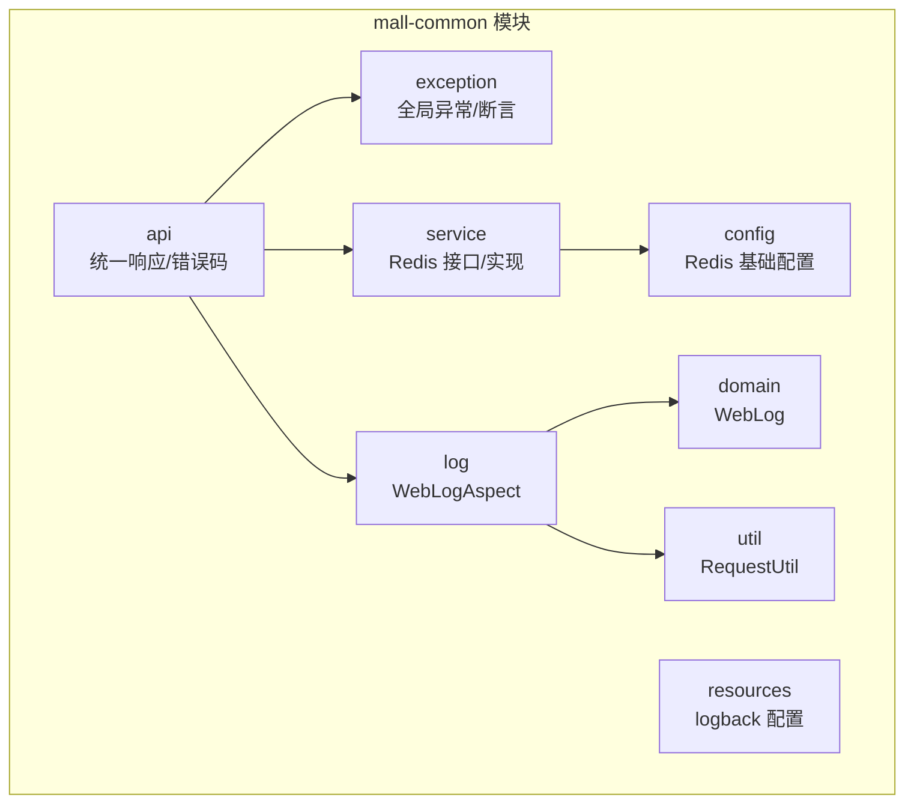
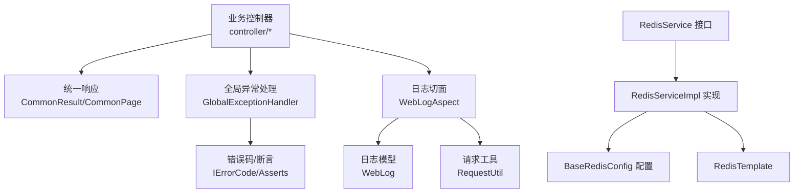
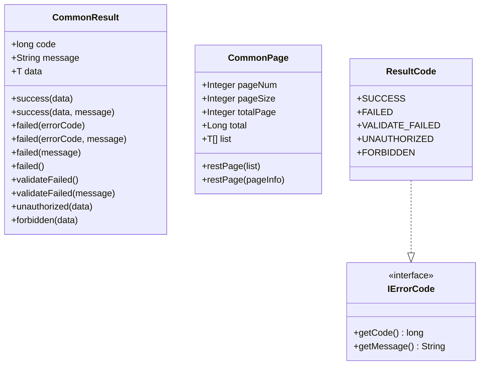
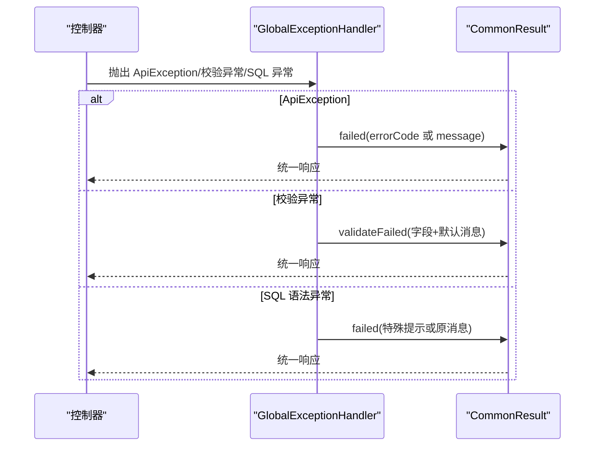
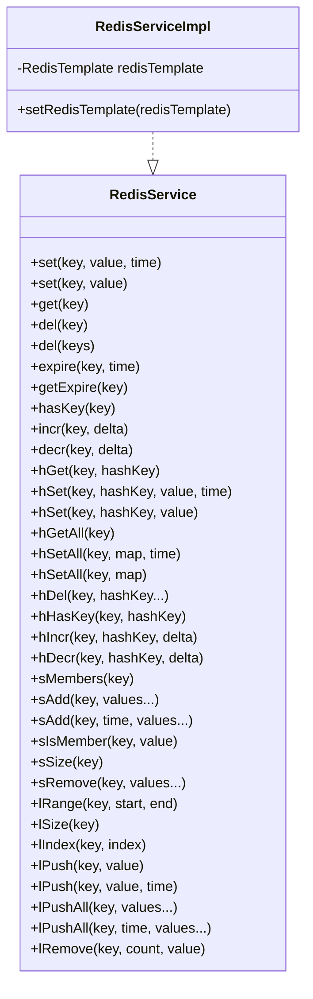
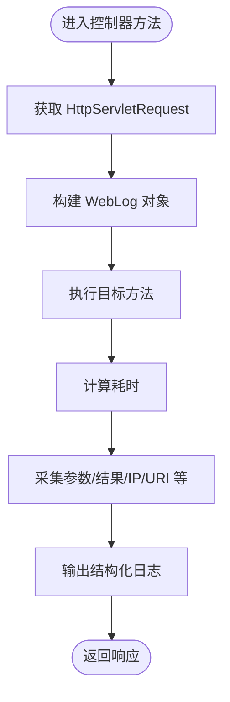
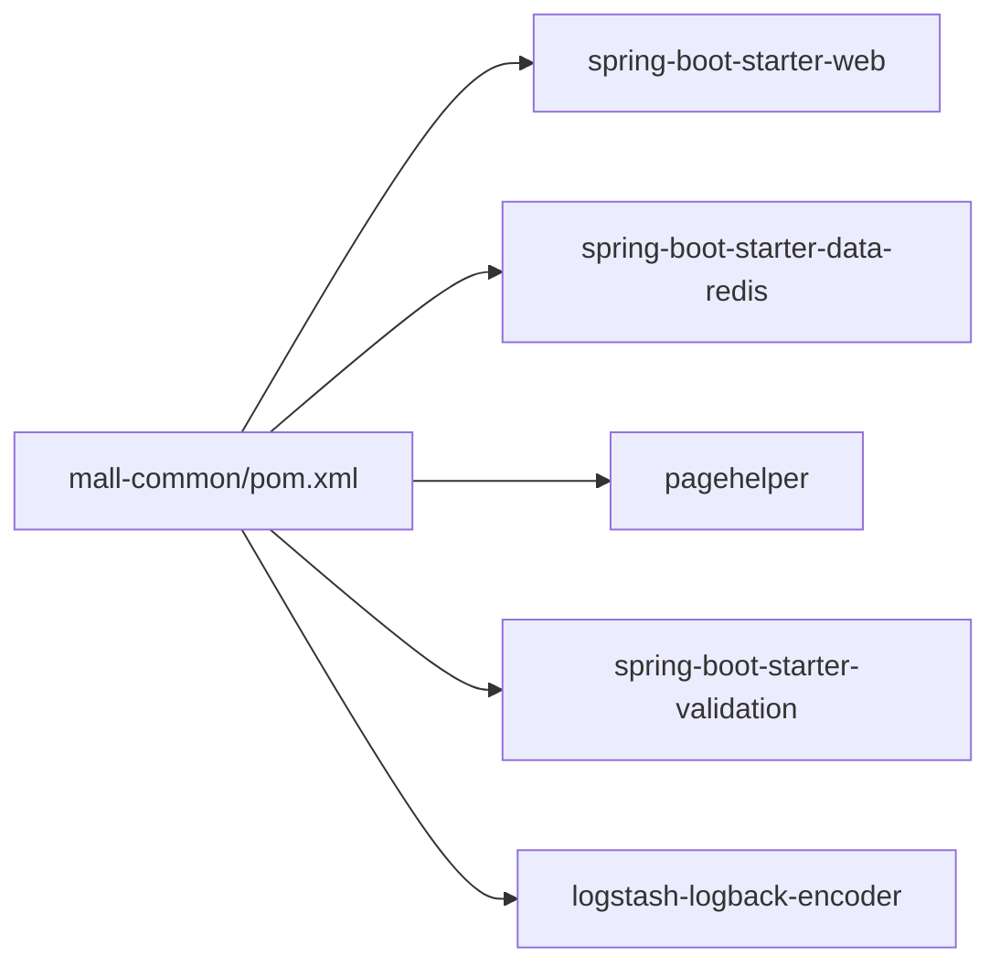

# 通用工具模块 (mall-common)

<cite>
**本文引用的文件**
- [CommonResult.java](file://mall-common/src/main/java/com/macro/mall/common/api/CommonResult.java)
- [CommonPage.java](file://mall-common/src/main/java/com/macro/mall/common/api/CommonPage.java)
- [IErrorCode.java](file://mall-common/src/main/java/com/macro/mall/common/api/IErrorCode.java)
- [ResultCode.java](file://mall-common/src/main/java/com/macro/mall/common/api/ResultCode.java)
- [GlobalExceptionHandler.java](file://mall-common/src/main/java/com/macro/mall/common/exception/GlobalExceptionHandler.java)
- [ApiException.java](file://mall-common/src/main/java/com/macro/mall/common/exception/ApiException.java)
- [Asserts.java](file://mall-common/src/main/java/com/macro/mall/common/exception/Asserts.java)
- [RedisService.java](file://mall-common/src/main/java/com/macro/mall/common/service/RedisService.java)
- [RedisServiceImpl.java](file://mall-common/src/main/java/com/macro/mall/common/service/impl/RedisServiceImpl.java)
- [BaseRedisConfig.java](file://mall-common/src/main/java/com/macro/mall/common/config/BaseRedisConfig.java)
- [WebLogAspect.java](file://mall-common/src/main/java/com/macro/mall/common/log/WebLogAspect.java)
- [WebLog.java](file://mall-common/src/main/java/com/macro/mall/common/domain/WebLog.java)
- [RequestUtil.java](file://mall-common/src/main/java/com/macro/mall/common/util/RequestUtil.java)
- [pom.xml](file://mall-common/pom.xml)
</cite>

## 目录
1. [简介](#简介)
2. [项目结构](#项目结构)
3. [核心组件](#核心组件)
4. [架构总览](#架构总览)
5. [详细组件分析](#详细组件分析)
6. [依赖关系分析](#依赖关系分析)
7. [性能与扩展性](#性能与扩展性)
8. [故障排查指南](#故障排查指南)
9. [结论](#结论)
10. [附录：使用指南与最佳实践](#附录使用指南与最佳实践)

## 简介
mall-common 是 Mall 项目的通用工具模块，提供统一的 API 响应封装、全局异常处理、Redis 缓存服务以及请求日志切面等基础能力，为 mall-admin、mall-portal、mall-search 等子模块提供一致的基础设施支持。

## 项目结构
mall-common 的核心目录组织如下：
- api：统一响应与错误码定义
- exception：全局异常处理与断言工具
- service：Redis 操作接口与实现
- config：Redis 序列化与缓存管理配置
- log：AOP 日志切面
- domain：日志模型
- util：请求工具类
- 资源：日志配置（logback）

图表来源
- [CommonResult.java:1-134](file://mall-common/src/main/java/com/macro/mall/common/api/CommonResult.java#L1-L134)
- [GlobalExceptionHandler.java:1-69](file://mall-common/src/main/java/com/macro/mall/common/exception/GlobalExceptionHandler.java#L1-L69)
- [RedisService.java:1-182](file://mall-common/src/main/java/com/macro/mall/common/service/RedisService.java#L1-L182)
- [BaseRedisConfig.java:1-67](file://mall-common/src/main/java/com/macro/mall/common/config/BaseRedisConfig.java#L1-L67)
- [WebLogAspect.java:1-126](file://mall-common/src/main/java/com/macro/mall/common/log/WebLogAspect.java#L1-L126)
- [WebLog.java:1-69](file://mall-common/src/main/java/com/macro/mall/common/domain/WebLog.java#L1-L69)
- [RequestUtil.java:1-48](file://mall-common/src/main/java/com/macro/mall/common/util/RequestUtil.java#L1-L48)

章节来源
- [pom.xml:1-53](file://mall-common/pom.xml#L1-L53)

## 核心组件
- 统一 API 响应封装：提供成功、失败、校验失败、未登录、未授权等标准返回体，并支持泛型数据承载。
- 分页响应封装：兼容 PageHelper 与 Spring Data 分页结果，输出统一分页结构。
- 错误码体系：定义 IErrorCode 接口与 ResultCode 枚举，便于集中管理状态码与消息。
- 全局异常处理：基于 @ControllerAdvice 统一捕获业务异常、参数校验异常与 SQL 语法异常，转换为统一响应。
- Redis 服务：抽象 Redis 操作接口，覆盖字符串、Hash、Set、List 等常用数据结构；提供序列化配置与缓存管理。
- AOP 日志切面：对控制器层进行环绕增强，采集请求参数、响应结果、耗时、IP 等信息，输出结构化日志。
- 请求工具类：解析真实 IP 地址，适配多级代理场景。

章节来源
- [CommonResult.java:1-134](file://mall-common/src/main/java/com/macro/mall/common/api/CommonResult.java#L1-L134)
- [CommonPage.java:1-101](file://mall-common/src/main/java/com/macro/mall/common/api/CommonPage.java#L1-L101)
- [IErrorCode.java:1-18](file://mall-common/src/main/java/com/macro/mall/common/api/IErrorCode.java#L1-L18)
- [ResultCode.java:1-29](file://mall-common/src/main/java/com/macro/mall/common/api/ResultCode.java#L1-L29)
- [GlobalExceptionHandler.java:1-69](file://mall-common/src/main/java/com/macro/mall/common/exception/GlobalExceptionHandler.java#L1-L69)
- [ApiException.java:1-33](file://mall-common/src/main/java/com/macro/mall/common/exception/ApiException.java#L1-L33)
- [Asserts.java:1-18](file://mall-common/src/main/java/com/macro/mall/common/exception/Asserts.java#L1-L18)
- [RedisService.java:1-182](file://mall-common/src/main/java/com/macro/mall/common/service/RedisService.java#L1-L182)
- [RedisServiceImpl.java:1-204](file://mall-common/src/main/java/com/macro/mall/common/service/impl/RedisServiceImpl.java#L1-L204)
- [BaseRedisConfig.java:1-67](file://mall-common/src/main/java/com/macro/mall/common/config/BaseRedisConfig.java#L1-L67)
- [WebLogAspect.java:1-126](file://mall-common/src/main/java/com/macro/mall/common/log/WebLogAspect.java#L1-L126)
- [WebLog.java:1-69](file://mall-common/src/main/java/com/macro/mall/common/domain/WebLog.java#L1-L69)
- [RequestUtil.java:1-48](file://mall-common/src/main/java/com/macro/mall/common/util/RequestUtil.java#L1-L48)

## 架构总览
mall-common 在系统中的定位是“基础设施层”，向上为各业务模块提供统一的响应、异常、缓存与日志能力。其关键交互如下：

图表来源
- [WebLogAspect.java:1-126](file://mall-common/src/main/java/com/macro/mall/common/log/WebLogAspect.java#L1-L126)
- [WebLog.java:1-69](file://mall-common/src/main/java/com/macro/mall/common/domain/WebLog.java#L1-L69)
- [RequestUtil.java:1-48](file://mall-common/src/main/java/com/macro/mall/common/util/RequestUtil.java#L1-L48)
- [RedisService.java:1-182](file://mall-common/src/main/java/com/macro/mall/common/service/RedisService.java#L1-L182)
- [RedisServiceImpl.java:1-204](file://mall-common/src/main/java/com/macro/mall/common/service/impl/RedisServiceImpl.java#L1-L204)
- [BaseRedisConfig.java:1-67](file://mall-common/src/main/java/com/macro/mall/common/config/BaseRedisConfig.java#L1-L67)
- [GlobalExceptionHandler.java:1-69](file://mall-common/src/main/java/com/macro/mall/common/exception/GlobalExceptionHandler.java#L1-L69)
- [IErrorCode.java:1-18](file://mall-common/src/main/java/com/macro/mall/common/api/IErrorCode.java#L1-L18)
- [Asserts.java:1-18](file://mall-common/src/main/java/com/macro/mall/common/exception/Asserts.java#L1-L18)

## 详细组件分析

### 统一 API 响应与分页封装
- CommonResult：提供 success/fail/validateFailed/unauthorized/forbidden 等静态工厂方法，统一返回 code、message、data 字段。
- CommonPage：将 PageHelper 或 Spring Data 分页结果转换为统一的分页对象，包含 pageNum、pageSize、totalPage、total、list。
- IErrorCode/ResultCode：定义标准错误码与消息，便于在异常处理与业务断言中复用。

图表来源
- [CommonResult.java:1-134](file://mall-common/src/main/java/com/macro/mall/common/api/CommonResult.java#L1-L134)
- [CommonPage.java:1-101](file://mall-common/src/main/java/com/macro/mall/common/api/CommonPage.java#L1-L101)
- [IErrorCode.java:1-18](file://mall-common/src/main/java/com/macro/mall/common/api/IErrorCode.java#L1-L18)
- [ResultCode.java:1-29](file://mall-common/src/main/java/com/macro/mall/common/api/ResultCode.java#L1-L29)

章节来源
- [CommonResult.java:1-134](file://mall-common/src/main/java/com/macro/mall/common/api/CommonResult.java#L1-L134)
- [CommonPage.java:1-101](file://mall-common/src/main/java/com/macro/mall/common/api/CommonPage.java#L1-L101)
- [IErrorCode.java:1-18](file://mall-common/src/main/java/com/macro/mall/common/api/IErrorCode.java#L1-L18)
- [ResultCode.java:1-29](file://mall-common/src/main/java/com/macro/mall/common/api/ResultCode.java#L1-L29)

### 全局异常处理机制
- GlobalExceptionHandler：基于 @ControllerAdvice 统一拦截以下异常：
  - ApiException：优先使用其携带的 IErrorCode，否则回退到异常消息。
  - 参数校验异常（MethodArgumentNotValidException、BindException）：提取首个字段错误信息，返回校验失败响应。
  - SQLSyntaxErrorException：对“denied”关键字做演示环境特殊提示，其余返回失败响应。
- Asserts：提供 fail(IErrorCode)/fail(String) 快捷断言入口，配合业务代码快速抛出标准化异常。

图表来源
- [GlobalExceptionHandler.java:1-69](file://mall-common/src/main/java/com/macro/mall/common/exception/GlobalExceptionHandler.java#L1-L69)
- [ApiException.java:1-33](file://mall-common/src/main/java/com/macro/mall/common/exception/ApiException.java#L1-L33)
- [CommonResult.java:1-134](file://mall-common/src/main/java/com/macro/mall/common/api/CommonResult.java#L1-L134)

章节来源
- [GlobalExceptionHandler.java:1-69](file://mall-common/src/main/java/com/macro/mall/common/exception/GlobalExceptionHandler.java#L1-L69)
- [ApiException.java:1-33](file://mall-common/src/main/java/com/macro/mall/common/exception/ApiException.java#L1-L33)
- [Asserts.java:1-18](file://mall-common/src/main/java/com/macro/mall/common/exception/Asserts.java#L1-L18)

### Redis 服务封装与配置
- RedisService：定义键值、Hash、Set、List 等常用操作，支持过期时间、批量删除、增量/递减等。
- RedisServiceImpl：基于 RedisTemplate 实现上述接口，覆盖字符串、Hash、Set、List 的典型场景。
- BaseRedisConfig：提供 RedisTemplate、Jackson2JsonRedisSerializer、RedisCacheManager 配置，统一序列化策略与缓存 TTL。

图表来源
- [RedisService.java:1-182](file://mall-common/src/main/java/com/macro/mall/common/service/RedisService.java#L1-L182)
- [RedisServiceImpl.java:1-204](file://mall-common/src/main/java/com/macro/mall/common/service/impl/RedisServiceImpl.java#L1-L204)
- [BaseRedisConfig.java:1-67](file://mall-common/src/main/java/com/macro/mall/common/config/BaseRedisConfig.java#L1-L67)

章节来源
- [RedisService.java:1-182](file://mall-common/src/main/java/com/macro/mall/common/service/RedisService.java#L1-L182)
- [RedisServiceImpl.java:1-204](file://mall-common/src/main/java/com/macro/mall/common/service/impl/RedisServiceImpl.java#L1-L204)
- [BaseRedisConfig.java:1-67](file://mall-common/src/main/java/com/macro/mall/common/config/BaseRedisConfig.java#L1-L67)

### AOP 日志切面与请求工具
- WebLogAspect：对 controller 包下的公共接口进行环绕增强，采集请求/响应元数据，计算耗时，输出结构化日志。
- WebLog：封装一次请求的完整上下文，包括描述、用户、起止时间、URI、URL、方法、IP、参数、结果、耗时等。
- RequestUtil：解析真实 IP，兼容 x-forwarded-for、Proxy-Client-IP、WL-Proxy-Client-IP 与本机回环地址。

图表来源
- [WebLogAspect.java:1-126](file://mall-common/src/main/java/com/macro/mall/common/log/WebLogAspect.java#L1-L126)
- [WebLog.java:1-69](file://mall-common/src/main/java/com/macro/mall/common/domain/WebLog.java#L1-L69)
- [RequestUtil.java:1-48](file://mall-common/src/main/java/com/macro/mall/common/util/RequestUtil.java#L1-L48)

章节来源
- [WebLogAspect.java:1-126](file://mall-common/src/main/java/com/macro/mall/common/log/WebLogAspect.java#L1-L126)
- [WebLog.java:1-69](file://mall-common/src/main/java/com/macro/mall/common/domain/WebLog.java#L1-L69)
- [RequestUtil.java:1-48](file://mall-common/src/main/java/com/macro/mall/common/util/RequestUtil.java#L1-L48)

## 依赖关系分析
mall-common 的核心依赖包括：
- spring-boot-starter-web：提供 Web 环境与 MVC 支持。
- spring-boot-starter-data-redis：提供 Redis 客户端与模板。
- pagehelper：提供分页能力，用于 CommonPage。
- logstash-logback-encoder：结构化日志输出。
- spring-boot-starter-validation：JSR-303 参数校验支持。

图表来源
- [pom.xml:1-53](file://mall-common/pom.xml#L1-L53)

章节来源
- [pom.xml:1-53](file://mall-common/pom.xml#L1-L53)

## 性能与扩展性
- Redis 序列化：采用 Jackson2JsonRedisSerializer 并启用类型信息激活，确保复杂对象序列化/反序列化一致性，但需注意序列化开销与字段演进策略。
- 缓存 TTL：默认缓存 1 天，可根据业务热点调整；建议对热点数据设置更短过期时间以降低陈旧风险。
- 日志输出：使用 Logstash Encoder 输出 JSON，便于 ELK 集成；建议在高并发场景下评估日志落盘与网络传输成本。
- 分页性能：CommonPage 对 PageHelper/Spring Data 的封装为纯转换逻辑，不引入额外 IO；实际分页查询性能取决于数据库与索引设计。

[本节为通用指导，无需列出具体文件来源]

## 故障排查指南
- 统一响应未生效
  - 检查控制器是否直接返回实体而非 CommonResult；确认全局异常处理器已扫描到对应包。
  - 参考：[GlobalExceptionHandler.java:1-69](file://mall-common/src/main/java/com/macro/mall/common/exception/GlobalExceptionHandler.java#L1-L69)
- 参数校验异常未被识别
  - 确认参数上使用了 @Valid/@Validated，并且控制器方法标注了 @Validated。
  - 参考：[GlobalExceptionHandler.java:1-69](file://mall-common/src/main/java/com/macro/mall/common/exception/GlobalExceptionHandler.java#L1-L69)
- Redis 写入失败或反序列化异常
  - 检查对象是否可序列化，确认 Jackson 类型信息已激活。
  - 参考：[BaseRedisConfig.java:1-67](file://mall-common/src/main/java/com/macro/mall/common/config/BaseRedisConfig.java#L1-L67)
- 日志未输出或字段缺失
  - 确认切点表达式匹配到目标控制器包；检查日志配置与输出通道。
  - 参考：[WebLogAspect.java:1-126](file://mall-common/src/main/java/com/macro/mall/common/log/WebLogAspect.java#L1-L126)

章节来源
- [GlobalExceptionHandler.java:1-69](file://mall-common/src/main/java/com/macro/mall/common/exception/GlobalExceptionHandler.java#L1-L69)
- [BaseRedisConfig.java:1-67](file://mall-common/src/main/java/com/macro/mall/common/config/BaseRedisConfig.java#L1-L67)
- [WebLogAspect.java:1-126](file://mall-common/src/main/java/com/macro/mall/common/log/WebLogAspect.java#L1-L126)

## 结论
mall-common 通过统一响应、全局异常、Redis 服务与 AOP 日志四大能力，为 Mall 项目提供了稳定一致的基础设施。其清晰的接口设计与可配置的序列化策略，既保证了易用性，也为后续扩展与优化留足空间。

[本节为总结性内容，无需列出具体文件来源]

## 附录：使用指南与最佳实践
- 使用统一响应
  - 成功返回：使用 CommonResult.success(data[, message])。
  - 失败返回：使用 CommonResult.failed(errorCode/message)。
  - 校验失败：使用 CommonResult.validateFailed(message)。
  - 未登录/未授权：使用 CommonResult.unauthorized(data)/forbidden(data)。
  - 分页返回：使用 CommonPage.restPage(list/pageInfo)。
  - 参考：[CommonResult.java:1-134](file://mall-common/src/main/java/com/macro/mall/common/api/CommonResult.java#L1-L134)，[CommonPage.java:1-101](file://mall-common/src/main/java/com/macro/mall/common/api/CommonPage.java#L1-L101)
- 抛出标准化异常
  - 业务断言：使用 Asserts.fail(errorCode/message)。
  - 自定义异常：继承 ApiException，构造时传入 IErrorCode 或 message。
  - 参考：[Asserts.java:1-18](file://mall-common/src/main/java/com/macro/mall/common/exception/Asserts.java#L1-L18)，[ApiException.java:1-33](file://mall-common/src/main/java/com/macro/mall/common/exception/ApiException.java#L1-L33)
- Redis 操作
  - 基础键值：set/get/del/expire/hasKey/incr/decr。
  - Hash：hGet/hSet/hGetAll/hSetAll/hDel/hHasKey/hIncr/hDecr。
  - Set：sMembers/sAdd/sIsMember/sSize/sRemove。
  - List：lRange/lSize/lIndex/lPush/lPushAll/lRemove。
  - 参考：[RedisService.java:1-182](file://mall-common/src/main/java/com/macro/mall/common/service/RedisService.java#L1-L182)，[RedisServiceImpl.java:1-204](file://mall-common/src/main/java/com/macro/mall/common/service/impl/RedisServiceImpl.java#L1-L204)
- 日志与监控
  - 控制器层自动采集请求/响应、耗时、IP、参数等，便于审计与性能分析。
  - 参考：[WebLogAspect.java:1-126](file://mall-common/src/main/java/com/macro/mall/common/log/WebLogAspect.java#L1-L126)，[WebLog.java:1-69](file://mall-common/src/main/java/com/macro/mall/common/domain/WebLog.java#L1-L69)，[RequestUtil.java:1-48](file://mall-common/src/main/java/com/macro/mall/common/util/RequestUtil.java#L1-L48)
- 最佳实践
  - 统一在控制器层返回 CommonResult，避免直接返回原始对象。
  - 对外暴露的接口参数必须进行校验，减少无效调用。
  - Redis 缓存键命名规范统一，避免冲突；对热点数据设置合理过期时间。
  - 日志输出开启必要的字段，避免敏感信息泄露；结合 ELK 进行集中检索。

章节来源
- [CommonResult.java:1-134](file://mall-common/src/main/java/com/macro/mall/common/api/CommonResult.java#L1-L134)
- [CommonPage.java:1-101](file://mall-common/src/main/java/com/macro/mall/common/api/CommonPage.java#L1-L101)
- [Asserts.java:1-18](file://mall-common/src/main/java/com/macro/mall/common/exception/Asserts.java#L1-L18)
- [ApiException.java:1-33](file://mall-common/src/main/java/com/macro/mall/common/exception/ApiException.java#L1-L33)
- [RedisService.java:1-182](file://mall-common/src/main/java/com/macro/mall/common/service/RedisService.java#L1-L182)
- [RedisServiceImpl.java:1-204](file://mall-common/src/main/java/com/macro/mall/common/service/impl/RedisServiceImpl.java#L1-L204)
- [WebLogAspect.java:1-126](file://mall-common/src/main/java/com/macro/mall/common/log/WebLogAspect.java#L1-L126)
- [WebLog.java:1-69](file://mall-common/src/main/java/com/macro/mall/common/domain/WebLog.java#L1-L69)
- [RequestUtil.java:1-48](file://mall-common/src/main/java/com/macro/mall/common/util/RequestUtil.java#L1-L48)