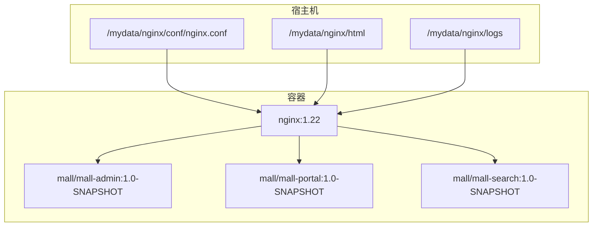
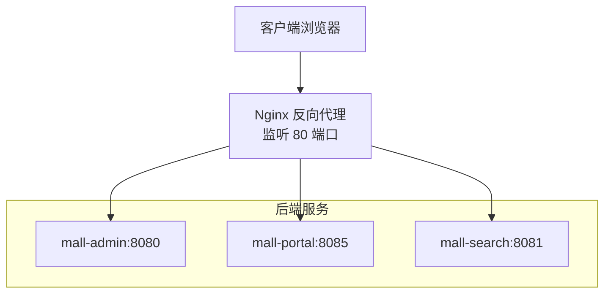
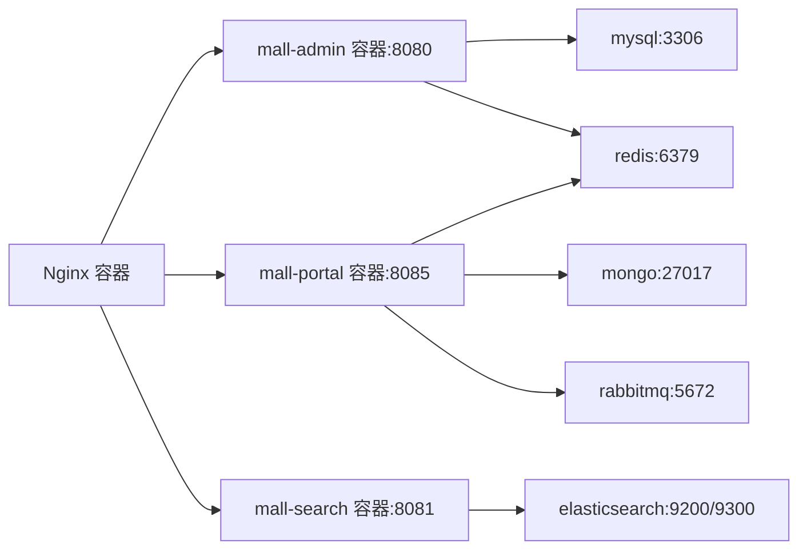

# Nginx反向代理

<cite>
**本文引用的文件**
- [nginx.conf](file://document/docker/nginx.conf)
- [docker-compose-app.yml](file://document/docker/docker-compose-app.yml)
- [docker-compose-env.yml](file://document/docker/docker-compose-env.yml)
- [mall-admin 应用配置](file://mall-admin/src/main/resources/application.yml)
- [mall-portal 应用配置](file://mall-portal/src/main/resources/application.yml)
- [mall-search 应用配置](file://mall-search/src/main/resources/application.yml)
- [mall-admin 开发环境配置](file://mall-admin/src/main/resources/application-dev.yml)
- [mall-admin 生产环境配置](file://mall-admin/src/main/resources/application-prod.yml)
- [mall-portal 开发环境配置](file://mall-portal/src/main/resources/application-dev.yml)
- [mall-portal 生产环境配置](file://mall-portal/src/main/resources/application-prod.yml)
- [mall-search 开发环境配置](file://mall-search/src/main/resources/application-dev.yml)
- [mall-search 生产环境配置](file://mall-search/src/main/resources/application-prod.yml)
- [mall-admin 容器启动脚本](file://document/sh/mall-admin.sh)
- [mall-portal 容器启动脚本](file://document/sh/mall-portal.sh)
- [mall-search 容器启动脚本](file://document/sh/mall-search.sh)
</cite>

## 目录
1. [简介](#简介)
2. [项目结构](#项目结构)
3. [核心组件](#核心组件)
4. [架构总览](#架构总览)
5. [详细组件分析](#详细组件分析)
6. [依赖关系分析](#依赖关系分析)
7. [性能考虑](#性能考虑)
8. [故障排查指南](#故障排查指南)
9. [结论](#结论)
10. [附录](#附录)

## 简介
本文件面向 Mall 项目的 Nginx 反向代理配置，系统性梳理负载均衡、静态资源处理与 SSL 证书配置策略，明确 upstream、server 块与 location 规则的设计思路，并给出针对 mall-admin、mall-search、mall-portal 三类核心服务的路由方案。同时，结合仓库中的 docker-compose 配置，解释监听端口、虚拟主机、gzip 与缓存策略的现状与改进建议；并提供 HTTPS 与证书管理（含 Let’s Encrypt 自动化）的实施路径与性能优化建议（连接池、超时与健康检查）。

## 项目结构
- Nginx 配置位于 docker 目录，采用挂载方式将宿主机配置映射至容器内。
- 服务容器通过 docker-compose 统一编排，暴露端口并提供服务发现能力。
- 三大后端服务分别在不同端口运行，Nginx 作为统一入口进行反向代理与静态资源分发。

图表来源
- [docker-compose-env.yml:24-33](file://document/docker/docker-compose-env.yml#L24-L33)
- [docker-compose-app.yml:3-42](file://document/docker/docker-compose-app.yml#L3-L42)
- [nginx.conf:1-46](file://document/docker/nginx.conf#L1-L46)

章节来源
- [docker-compose-env.yml:1-100](file://document/docker/docker-compose-env.yml#L1-L100)
- [docker-compose-app.yml:1-42](file://document/docker/docker-compose-app.yml#L1-L42)
- [nginx.conf:1-46](file://document/docker/nginx.conf#L1-L46)

## 核心组件
- Nginx 主配置与模块化 include：包含 MIME 类型、默认类型、日志格式与访问日志、keepalive 超时等。
- 事件模块：工作进程与连接数上限。
- HTTP 块：server 块监听 80 端口，server_name 为 localhost，默认 location 返回静态页面。
- 服务容器：mall-admin（8080）、mall-portal（8085）、mall-search（8081），均通过 docker-compose 暴露端口并挂载日志目录。

章节来源
- [nginx.conf:14-46](file://document/docker/nginx.conf#L14-L46)
- [docker-compose-app.yml:3-42](file://document/docker/docker-compose-app.yml#L3-L42)
- [docker-compose-env.yml:24-33](file://document/docker/docker-compose-env.yml#L24-L33)

## 架构总览
下图展示 Nginx 作为统一入口，对三个核心服务进行反向代理与静态资源分发的整体架构。

图表来源
- [docker-compose-app.yml:3-42](file://document/docker/docker-compose-app.yml#L3-L42)
- [docker-compose-env.yml:24-33](file://document/docker/docker-compose-env.yml#L24-L33)

## 详细组件分析

### Nginx 主配置解析
- 全局指令：用户、工作进程、错误日志、PID 文件。
- events 块：worker_connections 控制单个 worker 的并发连接上限。
- http 块：MIME 类型、默认类型、日志格式、访问日志、sendfile、keepalive_timeout。
- server 块：监听 80 端口，server_name 为 localhost，location / 返回静态页面，错误页映射。

章节来源
- [nginx.conf:1-46](file://document/docker/nginx.conf#L1-L46)

### upstream 配置设计
当前仓库未提供 upstream 配置示例。建议在生产环境中引入 upstream，实现多实例负载均衡与健康检查：
- 将 mall-admin、mall-portal、mall-search 的多个实例加入 upstream。
- 使用 proxy_pass 指向对应的 upstream 名称。
- 结合 proxy_next_upstream 或外部健康检查工具实现故障转移。

（本节为概念性说明，不直接对应具体源码文件）

### server 块与虚拟主机
- 当前 server 块仅监听 80 端口，server_name 为 localhost，适合本地演示。
- 生产部署建议：
  - 明确 server_name（如 mall.example.com）。
  - 配置基于 host 的虚拟主机，按服务划分 location 前缀或子路径。
  - 为每个服务设置独立的 location 块，便于维护与扩展。

章节来源
- [nginx.conf:31-44](file://document/docker/docker/nginx.conf#L31-L44)

### location 规则与路由策略
- 当前仅返回静态页面的默认 location。
- 建议为三类服务设计 location 规则：
  - /admin → mall-admin
  - /portal → mall-portal
  - /search → mall-search
- 对于静态资源（如前端打包产物），可单独挂载目录并通过 Nginx 提供缓存与压缩支持。

章节来源
- [nginx.conf:35-38](file://document/docker/nginx.conf#L35-L38)

### 静态资源处理与缓存策略
- 当前静态资源根目录为 /usr/share/nginx/html，index 页面为 index.html/index.htm。
- 建议：
  - 将前端构建产物放入宿主机静态目录并挂载至容器。
  - 针对静态资源设置合理的缓存头与过期策略，减少带宽消耗。
  - 启用 gzip 压缩提升传输效率。

章节来源
- [nginx.conf:36-37](file://document/docker/nginx.conf#L36-L37)

### gzip 压缩与性能
- 当前 gzip 已被注释，未启用。
- 建议启用 gzip 并合理配置压缩级别与类型，以降低首屏加载时间。

章节来源
- [nginx.conf:29](file://document/docker/nginx.conf#L29)

### SSL 与 HTTPS 配置
- 当前未提供 HTTPS 配置与证书管理。
- 建议：
  - 在 server 块中添加 443 端口监听与 ssl_certificate/ssl_certificate_key。
  - 引入自动证书申请与续期流程（如 Certbot + Let’s Encrypt）。
  - 配置 HSTS 与 TLS 版本策略，提升安全性。

章节来源
- [nginx.conf:31-44](file://document/docker/nginx.conf#L31-L44)

### 服务端口与容器编排
- mall-admin：8080
- mall-portal：8085
- mall-search：8081
- Nginx 容器映射 80 端口至宿主机，便于外部访问。

章节来源
- [docker-compose-app.yml:6-32](file://document/docker/docker-compose-app.yml#L6-L32)
- [docker-compose-env.yml:31-32](file://document/docker/docker-compose-env.yml#L31-L32)

### 应用端口与配置文件
- mall-search 在其配置中显式声明了端口 8081。
- mall-admin 与 mall-portal 的端口在 compose 中暴露，应用层未显式覆盖端口时默认使用容器内端口。

章节来源
- [mall-search 应用配置:10-11](file://mall-search/src/main/resources/application.yml#L10-L11)
- [docker-compose-app.yml:6-32](file://document/docker/docker-compose-app.yml#L6-L32)

### 容器启动脚本与网络链接
- 各服务容器通过 --link 方式连接数据库、消息队列等依赖服务。
- 日志目录挂载至宿主机，便于运维与审计。

章节来源
- [mall-admin 容器启动脚本:9-15](file://document/sh/mall-admin.sh#L9-L15)
- [mall-portal 容器启动脚本:9-17](file://document/sh/mall-portal.sh#L9-L17)
- [mall-search 容器启动脚本:9-15](file://document/sh/mall-search.sh#L9-L15)

## 依赖关系分析
- Nginx 依赖后端服务容器（mall-admin、mall-portal、mall-search）提供接口。
- 后端服务通过 docker-compose 的 links/external_links 实现服务发现与依赖连接。
- Nginx 与后端服务之间通过容器端口映射进行通信。

图表来源
- [docker-compose-app.yml:13-39](file://document/docker/docker-compose-app.yml#L13-L39)
- [docker-compose-env.yml:3-15](file://document/docker/docker-compose-env.yml#L3-L15)
- [docker-compose-env.yml:16-23](file://document/docker/docker-compose-env.yml#L16-L23)
- [docker-compose-env.yml:33-40](file://document/docker/docker-compose-env.yml#L33-L40)
- [docker-compose-env.yml:41-53](file://document/docker/docker-compose-env.yml#L41-L53)

## 性能考虑
- 连接池与上游健康检查
  - 在 upstream 中配置多个后端实例，结合健康检查实现故障转移与流量分摊。
- 超时设置
  - 合理设置 proxy_connect_timeout、proxy_send_timeout、proxy_read_timeout，避免长连接阻塞。
- 缓存与压缩
  - 启用 gzip 并为静态资源设置强缓存策略，降低带宽与服务器压力。
- keepalive
  - 根据并发量调整 keepalive_timeout 与 worker_connections，平衡资源占用与响应速度。

（本节为通用性能建议，不直接对应具体源码文件）

## 故障排查指南
- Nginx 访问/错误日志
  - 访问日志与错误日志已配置，可通过挂载目录查看。
- 容器日志
  - 后端服务容器的日志目录已挂载至宿主机，便于定位问题。
- 端口连通性
  - 确认 Nginx 映射端口与后端服务端口一致，容器间网络链路正常。

章节来源
- [nginx.conf:18-22](file://document/docker/nginx.conf#L18-L22)
- [docker-compose-env.yml:27-30](file://document/docker/docker-compose-env.yml#L27-L30)
- [docker-compose-app.yml:8-10](file://document/docker/docker-compose-app.yml#L8-L10)
- [docker-compose-app.yml:20-22](file://document/docker/docker-compose-app.yml#L20-L22)
- [docker-compose-app.yml:34-35](file://document/docker/docker-compose-app.yml#L34-L35)

## 结论
当前仓库提供了基础的 Nginx 配置与服务容器编排，能够满足本地演示场景。若要投入生产，需补充：
- upstream 负载均衡与健康检查；
- 基于 host 的虚拟主机与清晰的 location 路由；
- 静态资源缓存与 gzip 压缩；
- HTTPS 与证书自动化管理；
- 更完善的超时与连接池配置。

## 附录

### Nginx 配置要点清单
- 监听端口：80（可新增 443）
- server_name：明确域名
- location：
  - /admin → mall-admin
  - /portal → mall-portal
  - /search → mall-search
  - 静态资源目录与缓存策略
- gzip：启用并配置压缩级别
- 日志：access_log 与 error_log

章节来源
- [nginx.conf:31-44](file://document/docker/nginx.conf#L31-L44)
- [nginx.conf:18-29](file://document/docker/nginx.conf#L18-L29)