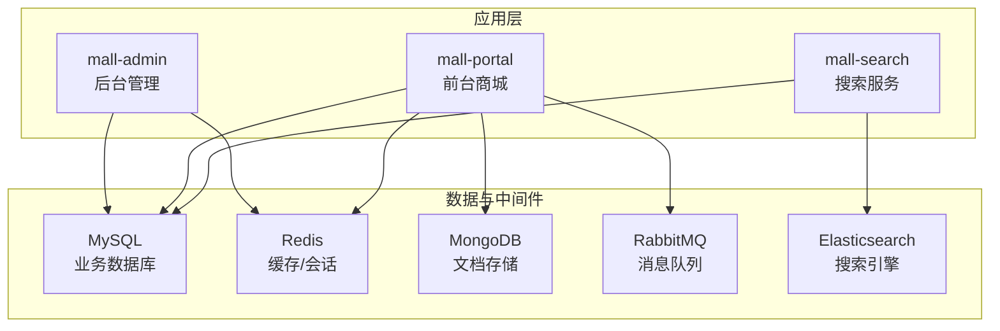
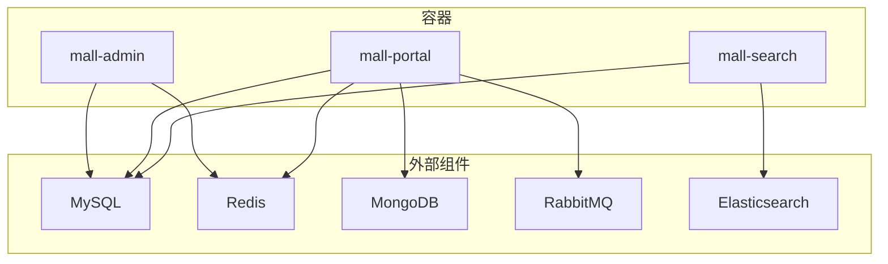
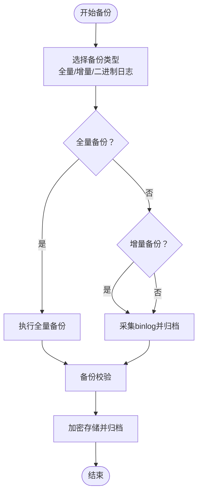
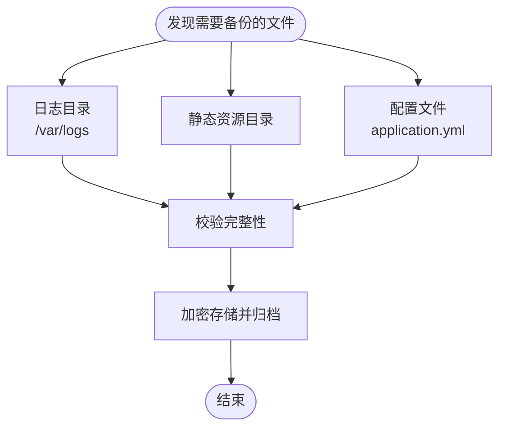
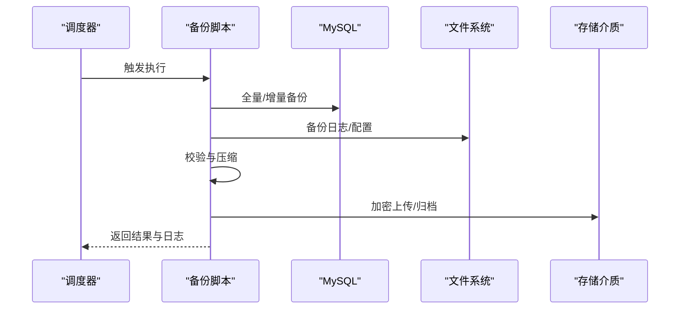
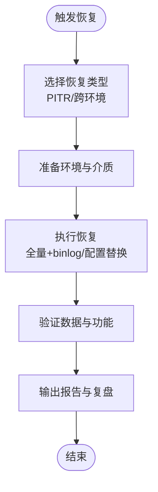
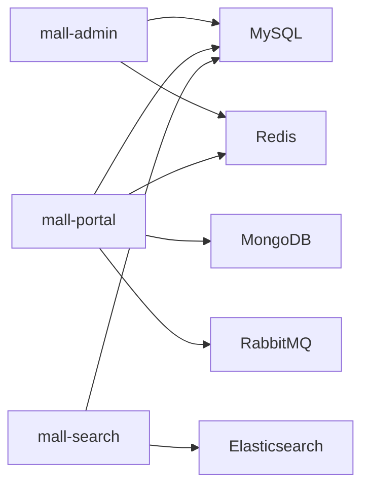

# 备份恢复

<cite>
**本文引用的文件**   
- [README.md](file://README.md)
- [mysql.md](file://document/reference/mysql.md)
- [run.sh](file://document/sh/run.sh)
- [mall-admin.sh](file://document/sh/mall-admin.sh)
- [mall-portal.sh](file://document/sh/mall-portal.sh)
- [mall-search.sh](file://document/sh/mall-search.sh)
- [application.yml（后台）](file://mall-admin/src/main/resources/application.yml)
- [application.yml（前台）](file://mall-portal/src/main/resources/application.yml)
- [application.yml（搜索）](file://mall-search/src/main/resources/application.yml)
- [mall.sql](file://document/sql/mall.sql)
</cite>

## 目录
1. [简介](#简介)
2. [项目结构](#项目结构)
3. [核心组件](#核心组件)
4. [架构总览](#架构总览)
5. [详细组件分析](#详细组件分析)
6. [依赖分析](#依赖分析)
7. [性能考虑](#性能考虑)
8. [故障排查指南](#故障排查指南)
9. [结论](#结论)
10. [附录](#附录)

## 简介
本文件面向Mall项目的备份与恢复，围绕“数据库备份、文件备份、配置备份”三大维度，结合项目现有脚本与配置，给出可落地的备份策略、自动化脚本编写与调度建议、恢复流程与演练方案、灾难恢复目标（RTO/RPO）、以及备份数据安全管理实践。由于仓库未提供现成的备份/恢复脚本，本文以“最佳实践+项目现状映射”的方式，帮助团队建立标准化的备份恢复体系。

## 项目结构
Mall为多模块Spring Boot工程，配合Docker容器运行，主要涉及以下与备份恢复相关的关键点：
- 应用容器化运行，依赖MySQL、Redis、Mongo、RabbitMQ、Elasticsearch等外部组件
- 配置通过application.yml加载，包含数据库连接、对象存储、消息队列等关键参数
- 提供多套运行脚本，便于在不同环境快速拉起服务

**章节来源**
- [README.md: 51-62:51-62](file://README.md#L51-L62)
- [run.sh: 1-28:1-28](file://document/sh/run.sh#L1-L28)
- [mall-admin.sh: 1-16:1-16](file://document/sh/mall-admin.sh#L1-L16)
- [mall-portal.sh: 1-18:1-18](file://document/sh/mall-portal.sh#L1-L18)
- [mall-search.sh: 1-16:1-16](file://document/sh/mall-search.sh#L1-L16)

## 核心组件
- 数据库（MySQL）
  - 项目使用MySQL作为主数据库，容器运行时通过网络连接挂载的MySQL实例
  - 备份重点：全量备份、二进制日志（binlog）备份、增量备份策略
- 缓存（Redis）
  - 作为热点数据缓存，可按需进行快照或持久化策略备份
- 文档存储（MongoDB）
  - 用于部分非结构化数据，需纳入备份范围
- 消息队列（RabbitMQ）
  - 队列与消息持久化，备份时需考虑队列状态与消息一致性
- 搜索引擎（Elasticsearch）
  - 索引数据可通过快照/备份目录的方式进行备份
- 配置与文件
  - application.yml中的敏感信息（如对象存储、数据库连接等）应纳入配置备份
  - 日志目录、静态资源目录等文件需纳入文件备份

**章节来源**
- [application.yml（后台）: 1-66:1-66](file://mall-admin/src/main/resources/application.yml#L1-L66)
- [application.yml（前台）: 1-62:1-62](file://mall-portal/src/main/resources/application.yml#L1-L62)
- [application.yml（搜索）: 1-20:1-20](file://mall-search/src/main/resources/application.yml#L1-L20)
- [run.sh: 10-27:10-27](file://document/sh/run.sh#L10-L27)

## 架构总览
下图展示了Mall在容器化环境下的数据流向与备份关注点：

**图表来源**
- [run.sh: 9-27:9-27](file://document/sh/run.sh#L9-L27)
- [mall-portal.sh: 9-17:9-17](file://document/sh/mall-portal.sh#L9-L17)
- [mall-search.sh: 9-15:9-15](file://document/sh/mall-search.sh#L9-L15)

## 详细组件分析

### 数据库备份策略（MySQL）
- 全量备份
  - 使用逻辑备份（如mysqldump）或物理备份（如Percona XtraBackup），建议结合压缩与校验
  - 备份频率：根据RPO目标设定（如每日全备）
- 增量备份
  - 基于二进制日志（binlog）的增量备份，建议启用binlog并定期归档
  - 结合全备与增量，缩短恢复时间窗口
- 二进制日志备份
  - 定期清理过期binlog，保留满足RPO所需的日志段
  - binlog归档至独立存储，确保离线可用性
- 备份验证
  - 定期抽样恢复演练，验证备份可恢复性与一致性
- 备份加密与访问控制
  - 备份文件加密存储；限制访问权限；对备份介质进行审计

**章节来源**
- [mysql.md: 1-78:1-78](file://document/reference/mysql.md#L1-L78)

### 文件备份
- 日志与静态资源
  - 通过Docker卷挂载的日志目录（如/var/logs）与静态资源目录需纳入文件备份
  - 建议按天/周进行增量备份，保留多版本
- 配置文件
  - application.yml等配置文件属于重要资产，需纳入配置备份
  - 建议区分环境（dev/prod），并进行差异化管理

**章节来源**
- [run.sh: 20-27:20-27](file://document/sh/run.sh#L20-L27)
- [mall-admin.sh: 14-15:14-15](file://document/sh/mall-admin.sh#L14-L15)
- [mall-portal.sh: 16-17:16-17](file://document/sh/mall-portal.sh#L16-L17)
- [mall-search.sh: 14-15:14-15](file://document/sh/mall-search.sh#L14-L15)

### 配置备份
- 关键配置项
  - 数据库连接、对象存储（OSS/MinIO）、消息队列、缓存等
- 管理建议
  - 将敏感配置置于环境变量或密钥管理服务中，避免明文写入配置文件
  - 对配置变更进行版本控制与审批

**章节来源**
- [application.yml（后台）: 54-66:54-66](file://mall-admin/src/main/resources/application.yml#L54-L66)
- [application.yml（前台）: 52-62:52-62](file://mall-portal/src/main/resources/application.yml#L52-L62)
- [application.yml（搜索）: 1-20:1-20](file://mall-search/src/main/resources/application.yml#L1-L20)

### 自动化备份脚本与调度
- 脚本编写要点
  - 统一入口：按“数据库/文件/配置”三类组织脚本
  - 参数化：支持环境、备份目录、压缩、加密、校验等参数
  - 幂等与原子性：同一时间段避免重复执行；失败重试与告警
  - 归档与清理：按保留策略清理过期备份
- 调度策略
  - 全量备份：每日/每周
  - 增量备份：每小时/每15分钟
  - binlog归档：实时或定时推送
  - 周期性恢复演练：月度/季度

**章节来源**
- [mysql.md: 7-8:7-8](file://document/reference/mysql.md#L7-L8)
- [run.sh: 10-27:10-27](file://document/sh/run.sh#L10-L27)

### 数据恢复流程与演练
- 恢复类型
  - 点恢复（Point-in-Time Recovery, PITR）：基于全量+binlog恢复到某一时刻
  - 跨环境迁移：导出目标环境配置，逐环境验证
- 演练方案
  - 制定恢复场景清单（单表、数据库、文件丢失）
  - 定期演练并记录耗时、问题与改进点
- 恢复验证
  - 数据一致性检查、业务功能回归测试

**章节来源**
- [mysql.md: 65-68:65-68](file://document/reference/mysql.md#L65-L68)

### 灾难恢复（RTO/RPO）
- RTO（恢复时间目标）
  - 通过并行恢复、预热资源、自动化脚本降低RTO
- RPO（恢复点目标）
  - 通过高频全量+binlog增量，缩短RPO
- 建议
  - 生产环境RPO≤15分钟，RTO≤2小时
  - 异地容灾与多活架构进一步提升可用性

[本节为通用指导，无需具体文件引用]

### 备份数据安全管理
- 加密存储
  - 备份文件在传输与存储阶段均需加密
- 访问控制
  - 最小权限原则；对备份介质进行访问审计
- 备份验证
  - 定期抽样恢复验证，确保备份可用性
- 审计与合规
  - 记录备份与恢复活动日志，满足合规要求

[本节为通用指导，无需具体文件引用]

## 依赖分析
- 应用与外部组件的耦合
  - mall-admin依赖MySQL与Redis
  - mall-portal依赖MySQL、Redis、MongoDB、RabbitMQ
  - mall-search依赖MySQL与Elasticsearch
- 备份范围映射
  - 数据库：MySQL
  - 文件：日志与静态资源
  - 配置：application.yml

**图表来源**
- [run.sh: 9-27:9-27](file://document/sh/run.sh#L9-L27)
- [mall-portal.sh: 9-17:9-17](file://document/sh/mall-portal.sh#L9-L17)
- [mall-search.sh: 9-15:9-15](file://document/sh/mall-search.sh#L9-L15)

**章节来源**
- [run.sh: 9-27:9-27](file://document/sh/run.sh#L9-L27)
- [mall-admin.sh: 9-15:9-15](file://document/sh/mall-admin.sh#L9-L15)
- [mall-portal.sh: 9-17:9-17](file://document/sh/mall-portal.sh#L9-L17)
- [mall-search.sh: 9-15:9-15](file://document/sh/mall-search.sh#L9-L15)

## 性能考虑
- 备份窗口与业务影响
  - 全量备份尽量安排在低峰时段；增量与binlog归档尽量异步化
- I/O与网络
  - 备份压缩与并发度需平衡；网络传输建议带宽预留
- 存储容量与成本
  - 合理设置保留周期与去重压缩策略

[本节为通用指导，无需具体文件引用]

## 故障排查指南
- 备份失败
  - 检查数据库连接、磁盘空间、权限与网络
  - 查看脚本日志与返回码
- 恢复异常
  - 核对备份介质完整性与版本；确认binlog是否齐全
  - 比照配置文件差异，确保环境一致
- 常见命令参考
  - 登录数据库、查看字符集与时区、权限管理等

**章节来源**
- [mysql.md: 7-78:7-78](file://document/reference/mysql.md#L7-L78)

## 结论
通过将数据库、文件与配置三类备份纳入统一的自动化流程，并结合binlog增量与定期恢复演练，Mall项目可在保证RPO/RTO目标的同时，显著提升数据安全性与业务连续性。建议尽快落地备份脚本与调度，并持续优化恢复流程与监控告警。

## 附录
- 示例SQL脚本位置
  - [mall.sql](file://document/sql/mall.sql)
- Docker运行脚本
  - [run.sh](file://document/sh/run.sh)
  - [mall-admin.sh](file://document/sh/mall-admin.sh)
  - [mall-portal.sh](file://document/sh/mall-portal.sh)
  - [mall-search.sh](file://document/sh/mall-search.sh)
- 应用配置文件
  - [application.yml（后台）](file://mall-admin/src/main/resources/application.yml)
  - [application.yml（前台）](file://mall-portal/src/main/resources/application.yml)
  - [application.yml（搜索）](file://mall-search/src/main/resources/application.yml)