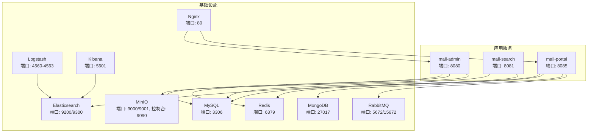
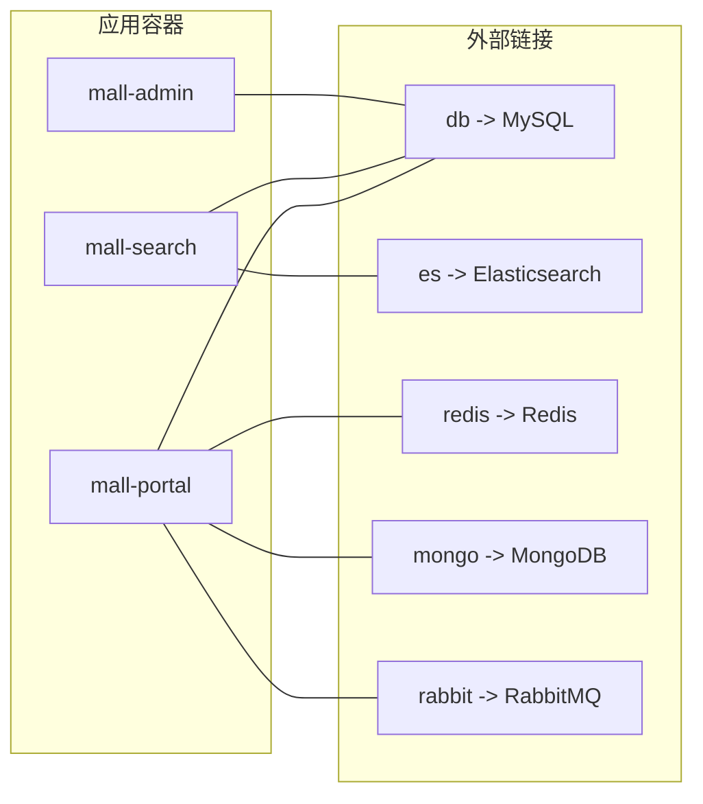
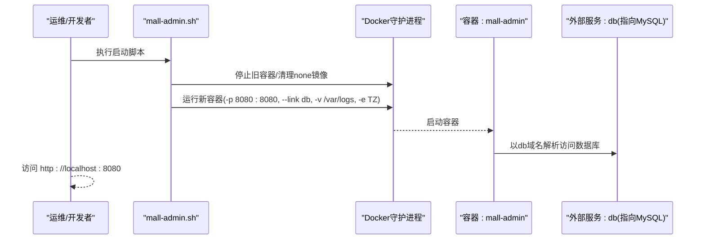
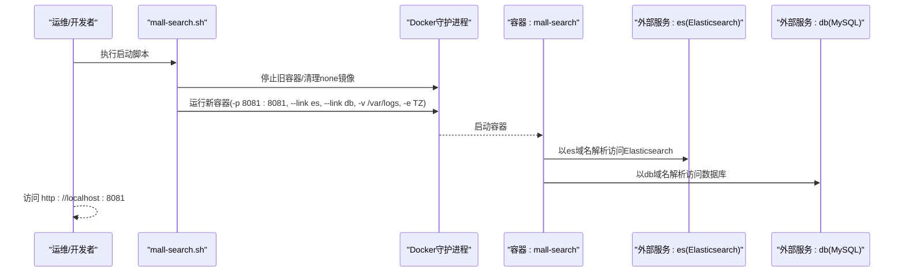
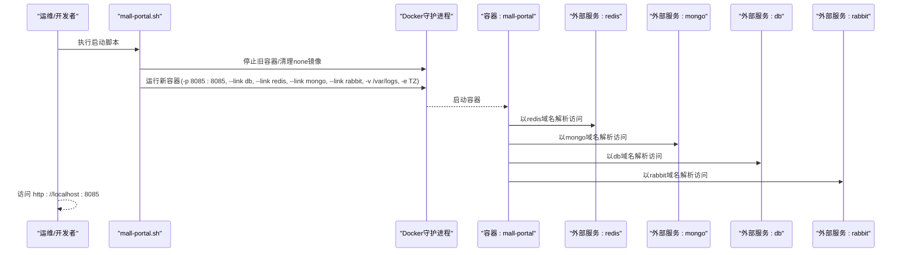
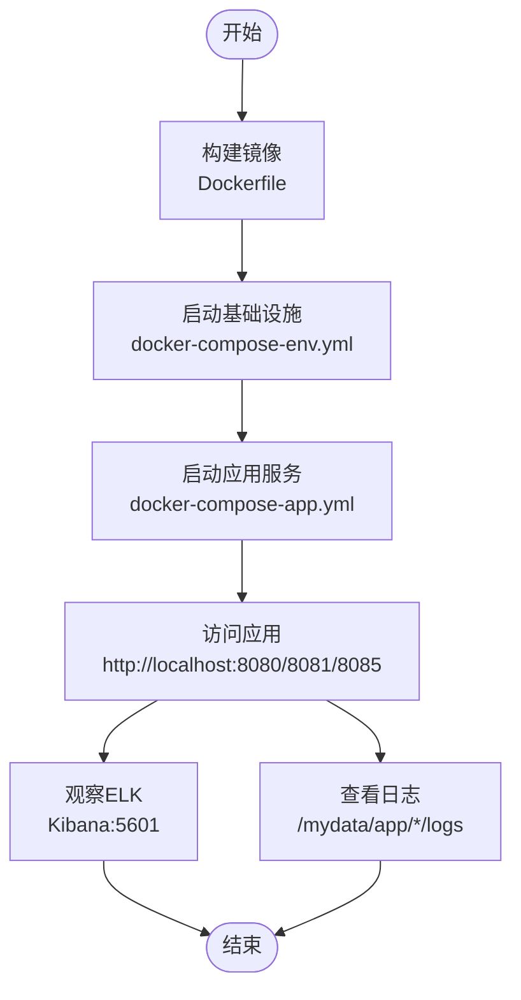
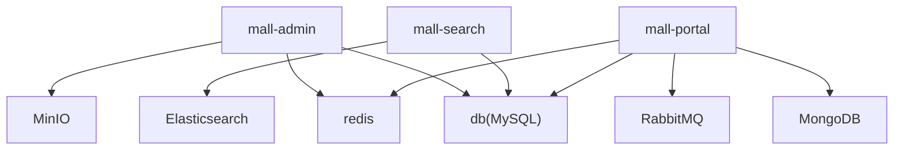

# 容器化部署

<cite>
**本文引用的文件**
- [docker-compose-app.yml](file://document/docker/docker-compose-app.yml)
- [docker-compose-env.yml](file://document/docker/docker-compose-env.yml)
- [Dockerfile](file://document/sh/Dockerfile)
- [mall-admin.sh](file://document/sh/mall-admin.sh)
- [mall-portal.sh](file://document/sh/mall-portal.sh)
- [mall-search.sh](file://document/sh/mall-search.sh)
- [run.sh](file://document/sh/run.sh)
- [nginx.conf](file://document/docker/nginx.conf)
- [logstash.conf](file://document/elk/logstash.conf)
- [application.yml（管理后台）](file://mall-admin/src/main/resources/application.yml)
- [application-prod.yml（管理后台）](file://mall-admin/src/main/resources/application-prod.yml)
- [application.yml（前台门户）](file://mall-portal/src/main/resources/application.yml)
- [application-prod.yml（前台门户）](file://mall-portal/src/main/resources/application-prod.yml)
- [application.yml（搜索）](file://mall-search/src/main/resources/application.yml)
- [application-prod.yml（搜索）](file://mall-search/src/main/resources/application-prod.yml)
- [admin-run.sh](file://admin-run.sh)
</cite>

## 目录
1. [简介](#简介)
2. [项目结构](#项目结构)
3. [核心组件](#核心组件)
4. [架构总览](#架构总览)
5. [详细组件分析](#详细组件分析)
6. [依赖关系分析](#依赖关系分析)
7. [性能与稳定性考虑](#性能与稳定性考虑)
8. [故障排查指南](#故障排查指南)
9. [结论](#结论)
10. [附录](#附录)

## 简介
本文件面向Mall项目的容器化部署，系统性阐述基于Docker Compose的多服务编排方案，覆盖管理后台(mall-admin)、搜索服务(mall-search)、前台门户(mall-portal)三大核心服务的镜像构建、容器网络、数据卷挂载、端口映射、环境变量与外部链接等关键配置，并提供生产与开发两套部署方案，确保部署一致性与可维护性。

## 项目结构
- 应用层：mall-admin、mall-search、mall-portal三模块各自包含独立的Spring Boot配置文件，支持dev/prod双环境。
- 基础设施层：通过docker-compose-env.yml统一编排MySQL、Redis、Elasticsearch、Logstash、Kibana、Mongo、RabbitMQ、Nginx、MinIO等依赖服务。
- 运维脚本：提供单体运行脚本与Compose编排脚本，便于本地开发与生产部署。

图表来源
- [docker-compose-env.yml:1-100](file://document/docker/docker-compose-env.yml#L1-L100)
- [docker-compose-app.yml:1-42](file://document/docker/docker-compose-app.yml#L1-L42)

章节来源
- [docker-compose-env.yml:1-100](file://document/docker/docker-compose-env.yml#L1-L100)
- [docker-compose-app.yml:1-42](file://document/docker/docker-compose-app.yml#L1-L42)

## 核心组件
- 管理后台(mall-admin)
  - 镜像构建：基于OpenJDK 8的自定义镜像，暴露8080端口，入口为Java Jar包启动。
  - 生产配置：通过外部链接访问MySQL与Redis；日志输出至/var/logs；时区设置为Asia/Shanghai。
  - 端口映射：宿主机8080 -> 容器8080。
- 搜索服务(mall-search)
  - 镜像构建：同上，暴露8081端口。
  - 生产配置：通过外部链接访问Elasticsearch与MySQL；日志输出至/var/logs。
  - 端口映射：宿主机8081 -> 容器8081。
- 前台门户(mall-portal)
  - 镜像构建：同上，暴露8085端口。
  - 生产配置：通过外部链接访问MySQL、Redis、Mongo、RabbitMQ；日志输出至/var/logs。
  - 端口映射：宿主机8085 -> 容器8085。

章节来源
- [Dockerfile:1-10](file://document/sh/Dockerfile#L1-L10)
- [mall-admin.sh:1-16](file://document/sh/mall-admin.sh#L1-L16)
- [mall-search.sh:1-16](file://document/sh/mall-search.sh#L1-L16)
- [mall-portal.sh:1-18](file://document/sh/mall-portal.sh#L1-L18)
- [docker-compose-app.yml:1-42](file://document/docker/docker-compose-app.yml#L1-L42)

## 架构总览
- 外部链接与域名映射
  - mall-admin: 通过external_links将mysql解析为db，便于应用以db域名访问数据库。
  - mall-search: 通过external_links将elasticsearch解析为es，mysql解析为db。
  - mall-portal: 通过external_links将redis解析为redis，mongo解析为mongo，mysql解析为db，rabbitmq解析为rabbit。
- 数据卷与时区
  - 所有应用均挂载宿主机日志目录至容器/var/logs，便于集中采集与持久化。
  - 通过挂载/etc/localtime实现时区同步，同时设置环境变量TZ=Asia/Shanghai。
- 网络拓扑
  - 应用容器通过external_links加入同一Docker网络，可直接以别名访问目标服务。
  - 基础设施容器由docker-compose-env.yml统一编排，提供稳定的服务发现与端口映射。

图表来源
- [docker-compose-app.yml:13-41](file://document/docker/docker-compose-app.yml#L13-L41)

章节来源
- [docker-compose-app.yml:1-42](file://document/docker/docker-compose-app.yml#L1-L42)

## 详细组件分析

### 管理后台(mall-admin)容器配置
- 镜像与入口
  - 基于openjdk:8，复制Jar包并以java -jar方式启动。
- 端口与数据卷
  - 映射8080端口；挂载/var/logs与/etc/localtime。
- 外部链接与环境
  - 通过external_links将mysql解析为db；设置TZ=Asia/Shanghai。
- 启动脚本要点
  - 使用--link将mysql解析为db；设置时区与日志卷；以detached模式运行。

图表来源
- [mall-admin.sh:1-16](file://document/sh/mall-admin.sh#L1-L16)
- [docker-compose-app.yml:13-14](file://document/docker/docker-compose-app.yml#L13-L14)

章节来源
- [Dockerfile:1-10](file://document/sh/Dockerfile#L1-L10)
- [mall-admin.sh:1-16](file://document/sh/mall-admin.sh#L1-L16)
- [docker-compose-app.yml:1-42](file://document/docker/docker-compose-app.yml#L1-L42)

### 搜索服务(mall-search)容器配置
- 镜像与入口
  - 基于openjdk:8，暴露8081端口，入口为Java Jar包。
- 端口与数据卷
  - 映射8081端口；挂载/var/logs与/etc/localtime。
- 外部链接与环境
  - 通过external_links将elasticsearch解析为es，mysql解析为db；设置TZ=Asia/Shanghai。
- 启动脚本要点
  - 使用--link将es与db；设置时区与日志卷；detached运行。

图表来源
- [mall-search.sh:1-16](file://document/sh/mall-search.sh#L1-L16)
- [docker-compose-app.yml:25-27](file://document/docker/docker-compose-app.yml#L25-L27)

章节来源
- [Dockerfile:1-10](file://document/sh/Dockerfile#L1-L10)
- [mall-search.sh:1-16](file://document/sh/mall-search.sh#L1-L16)
- [docker-compose-app.yml:1-42](file://document/docker/docker-compose-app.yml#L1-L42)

### 前台门户(mall-portal)容器配置
- 镜像与入口
  - 基于openjdk:8，暴露8085端口，入口为Java Jar包。
- 端口与数据卷
  - 映射8085端口；挂载/var/logs与/etc/localtime。
- 外部链接与环境
  - 通过external_links将redis、mongo、db、rabbit解析为对应服务；设置TZ=Asia/Shanghai。
- 启动脚本要点
  - 使用--link将db、redis、mongo、rabbit；设置时区与日志卷；detached运行。

图表来源
- [mall-portal.sh:1-18](file://document/sh/mall-portal.sh#L1-L18)
- [docker-compose-app.yml:38-41](file://document/docker/docker-compose-app.yml#L38-L41)

章节来源
- [Dockerfile:1-10](file://document/sh/Dockerfile#L1-L10)
- [mall-portal.sh:1-18](file://document/sh/mall-portal.sh#L1-L18)
- [docker-compose-app.yml:1-42](file://document/docker/docker-compose-app.yml#L1-L42)

### Compose编排与生产部署
- 应用编排(docker-compose-app.yml)
  - 三应用服务分别声明镜像、容器名、端口、卷、环境变量与external_links。
  - 日志目录统一挂载到宿主机/mydata/app/{service}/logs。
- 基础设施编排(docker-compose-env.yml)
  - 统一编排MySQL、Redis、Elasticsearch、Logstash、Kibana、Mongo、RabbitMQ、Nginx、MinIO。
  - 关键点：MySQL字符集与时区、Elasticsearch单节点与JVM参数、Logstash监听端口、Kibana访问ES地址、Nginx静态资源与日志卷、MinIO控制台端口映射。
- Nginx与ELK配置
  - Nginx配置文件定义了基础HTTP服务、日志格式与静态资源根目录。
  - Logstash配置定义了四个TCP输入端口，按类型写入Elasticsearch索引，其中record类型进行JSON解析与字段清洗。

图表来源
- [docker-compose-env.yml:1-100](file://document/docker/docker-compose-env.yml#L1-L100)
- [docker-compose-app.yml:1-42](file://document/docker/docker-compose-app.yml#L1-L42)
- [nginx.conf:1-46](file://document/docker/nginx.conf#L1-L46)
- [logstash.conf:1-49](file://document/elk/logstash.conf#L1-L49)

章节来源
- [docker-compose-app.yml:1-42](file://document/docker/docker-compose-app.yml#L1-L42)
- [docker-compose-env.yml:1-100](file://document/docker/docker-compose-env.yml#L1-L100)
- [nginx.conf:1-46](file://document/docker/nginx.conf#L1-L46)
- [logstash.conf:1-49](file://document/elk/logstash.conf#L1-L49)

### 开发与生产环境差异
- 开发环境
  - 应用默认激活dev配置，数据库连接、缓存、消息队列等通常指向本地或内网可达服务。
  - 可通过脚本直接运行容器，便于快速迭代。
- 生产环境
  - 应用激活prod配置，通过external_links以db/es/redis/mongo/rabbit等别名访问基础设施。
  - 日志统一输出到/var/logs，便于ELK采集；时区统一为Asia/Shanghai。
  - 基础设施通过Compose统一编排，端口映射与数据卷挂载明确，便于运维与备份。

章节来源
- [application.yml（管理后台）:1-66](file://mall-admin/src/main/resources/application.yml#L1-L66)
- [application-prod.yml（管理后台）:1-36](file://mall-admin/src/main/resources/application-prod.yml#L1-L36)
- [application.yml（前台门户）:1-62](file://mall-portal/src/main/resources/application.yml#L1-L62)
- [application-prod.yml（前台门户）:1-61](file://mall-portal/src/main/resources/application-prod.yml#L1-L61)
- [application.yml（搜索）:1-20](file://mall-search/src/main/resources/application.yml#L1-L20)
- [application-prod.yml（搜索）:1-30](file://mall-search/src/main/resources/application-prod.yml#L1-L30)

## 依赖关系分析
- 应用对基础设施的依赖
  - mall-admin: MySQL、Redis、MinIO。
  - mall-search: MySQL、Elasticsearch。
  - mall-portal: MySQL、Redis、Mongo、RabbitMQ。
- Compose中的依赖与链接
  - external_links提供跨容器的DNS别名解析，简化应用侧配置。
  - depends_on与links用于ELK链路的启动顺序与服务发现。
- 数据流与卷
  - 应用日志写入/var/logs，由宿主机统一挂载，便于采集与归档。
  - 数据库、缓存、对象存储、消息中间件的数据卷挂载到宿主机，确保持久化与可恢复。

图表来源
- [docker-compose-app.yml:13-41](file://document/docker/docker-compose-app.yml#L13-L41)

章节来源
- [docker-compose-app.yml:1-42](file://document/docker/docker-compose-app.yml#L1-L42)

## 性能与稳定性考虑
- JVM与线程
  - Elasticsearch通过环境变量设置堆大小，建议根据宿主机内存调整以避免OOM。
- 存储与I/O
  - 数据库、缓存、对象存储、日志目录均采用宿主机挂载，需关注磁盘容量与IO性能。
- 网络与延迟
  - external_links解析依赖Docker网络，默认延迟极低；如需跨主机部署，建议使用自定义网络与服务发现。
- 日志与可观测性
  - 应用日志统一输出到/var/logs，结合Logstash/Kibana实现集中采集与可视化。
- 启动顺序
  - ELK链路通过depends_on保证启动顺序，避免应用侧重试逻辑。

[本节为通用指导，无需特定文件引用]

## 故障排查指南
- 容器无法启动
  - 检查端口占用：确认宿主机8080/8081/8085与基础设施端口未被占用。
  - 检查镜像与入口：确认镜像构建成功且入口命令正确。
- 服务间无法通信
  - 检查external_links别名是否与应用配置一致（如db、es、redis、mongo、rabbit）。
  - 确认容器在同一网络，可通过docker exec进入容器测试ping或telnet。
- 日志缺失或权限问题
  - 确认宿主机/mydata/app/*/logs目录存在且具备写权限。
  - 检查应用日志路径配置与容器内/var/logs挂载是否一致。
- 数据库连接失败
  - 校验MySQL字符集与时区配置，确保与应用连接串一致。
  - 确认账号密码与网络连通性。
- 搜索/门户功能异常
  - 校验Elasticsearch/Mongo/RabbitMQ等服务可用性与端口映射。
  - 查看应用日志定位具体错误。

章节来源
- [docker-compose-app.yml:1-42](file://document/docker/docker-compose-app.yml#L1-L42)
- [docker-compose-env.yml:1-100](file://document/docker/docker-compose-env.yml#L1-L100)
- [application-prod.yml（管理后台）:1-36](file://mall-admin/src/main/resources/application-prod.yml#L1-L36)
- [application-prod.yml（前台门户）:1-61](file://mall-portal/src/main/resources/application-prod.yml#L1-L61)
- [application-prod.yml（搜索）:1-30](file://mall-search/src/main/resources/application-prod.yml#L1-L30)

## 结论
通过Compose编排与external_links别名解析，Mall项目实现了管理后台、搜索与前台门户的标准化容器化部署。配合统一的日志目录、时区与时钟同步、以及完善的基础设施编排，既满足开发阶段的快速迭代，也具备生产环境所需的可维护性与可观测性。建议在生产环境中进一步完善网络隔离、健康检查与自动重启策略，并定期备份数据卷与日志目录。

[本节为总结性内容，无需特定文件引用]

## 附录

### A. Compose配置解析要点
- 端口映射
  - mall-admin: 8080 -> 8080
  - mall-search: 8081 -> 8081
  - mall-portal: 8085 -> 8085
  - 基础设施：MySQL 3306、Redis 6379、Elasticsearch 9200/9300、Logstash 4560-4563、Kibana 5601、MongoDB 27017、RabbitMQ 5672/15672、Nginx 80、MinIO 9000/9001+9090
- 环境变量
  - TZ=Asia/Shanghai；Elasticsearch堆大小；Logstash时区；Kibana访问地址等
- 外部链接
  - mall-admin: mysql(db)
  - mall-search: elasticsearch(es), mysql(db)
  - mall-portal: redis, mongo, mysql(db), rabbit(rabbit)

章节来源
- [docker-compose-app.yml:1-42](file://document/docker/docker-compose-app.yml#L1-L42)
- [docker-compose-env.yml:1-100](file://document/docker/docker-compose-env.yml#L1-L100)

### B. 应用配置要点（生产）
- 管理后台
  - 数据源URL使用db别名；Redis使用redis别名；日志路径/var/logs；Logstash主机为logstash
- 前台门户
  - 数据源URL使用db别名；MongoDB使用mongo别名；Redis使用redis别名；RabbitMQ使用rabbit别名；日志路径/var/logs
- 搜索服务
  - 数据源URL使用db别名；Elasticsearch使用es别名；日志路径/var/logs

章节来源
- [application-prod.yml（管理后台）:1-36](file://mall-admin/src/main/resources/application-prod.yml#L1-L36)
- [application-prod.yml（前台门户）:1-61](file://mall-portal/src/main/resources/application-prod.yml#L1-L61)
- [application-prod.yml（搜索）:1-30](file://mall-search/src/main/resources/application-prod.yml#L1-L30)

### C. 启动脚本与部署流程
- 单体脚本
  - mall-admin.sh、mall-search.sh、mall-portal.sh：停止旧容器、清理无名镜像、运行新容器并挂载日志与时区、以db等别名链接依赖
  - run.sh：构建镜像、停止旧容器、删除旧镜像、运行新容器并传入spring.profiles.active=prod
- Compose编排
  - 先启动基础设施(docker-compose-env.yml)，再启动应用(docker-compose-app.yml)
- 开发机直启（非容器）
  - admin-run.sh：使用JDK 17与Maven在本地启动管理后台，便于开发调试

章节来源
- [mall-admin.sh:1-16](file://document/sh/mall-admin.sh#L1-L16)
- [mall-search.sh:1-16](file://document/sh/mall-search.sh#L1-L16)
- [mall-portal.sh:1-18](file://document/sh/mall-portal.sh#L1-L18)
- [run.sh:1-28](file://document/sh/run.sh#L1-L28)
- [admin-run.sh:1-26](file://admin-run.sh#L1-L26)