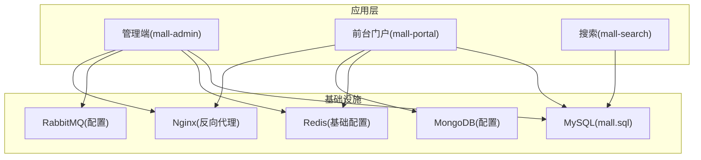
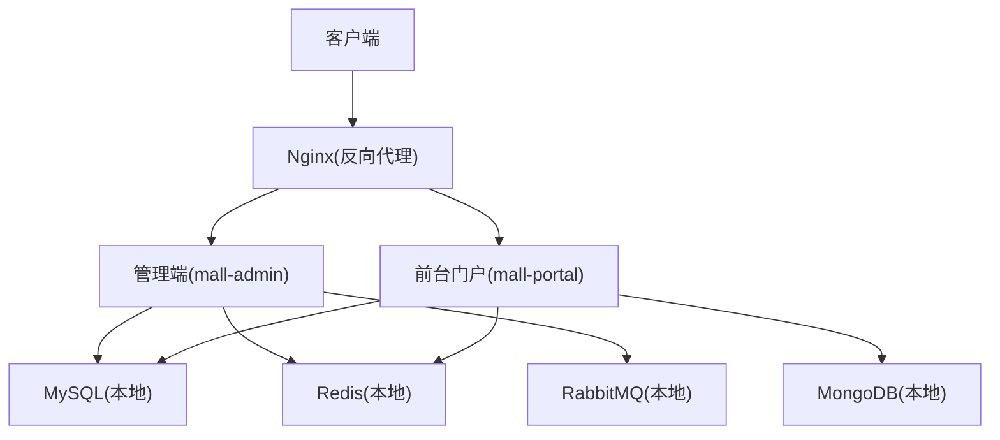
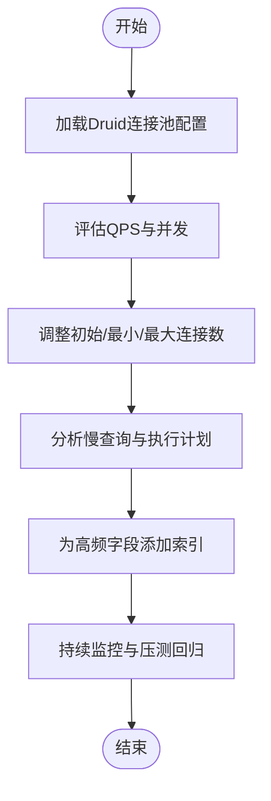
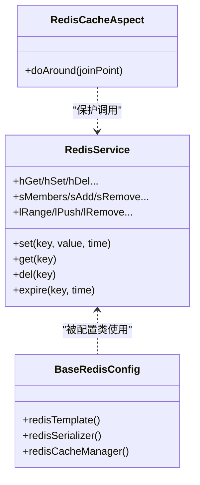
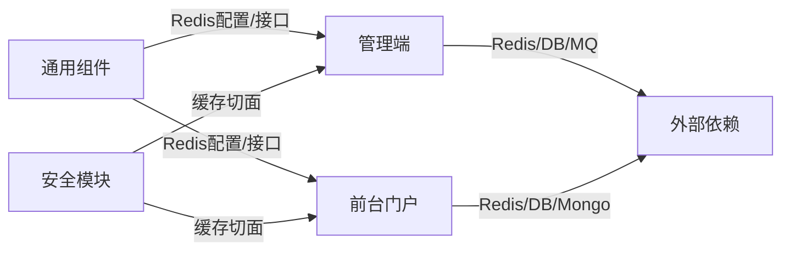

# 性能调优

<cite>
**本文引用的文件**
- [mall-admin/src/main/resources/application.yml](file://mall-admin/src/main/resources/application.yml)
- [mall-portal/src/main/resources/application.yml](file://mall-portal/src/main/resources/application.yml)
- [mall-admin/src/main/resources/application-dev.yml](file://mall-admin/src/main/resources/application-dev.yml)
- [mall-portal/src/main/resources/application-dev.yml](file://mall-portal/src/main/resources/application-dev.yml)
- [mall-admin/src/main/java/com/macro/mall/config/MyBatisConfig.java](file://mall-admin/src/main/java/com/macro/mall/config/MyBatisConfig.java)
- [mall-common/src/main/java/com/macro/mall/common/config/BaseRedisConfig.java](file://mall-common/src/main/java/com/macro/mall/common/config/BaseRedisConfig.java)
- [mall-common/src/main/java/com/macro/mall/common/service/RedisService.java](file://mall-common/src/main/java/com/macro/mall/common/service/RedisService.java)
- [mall-security/src/main/java/com/macro/mall/security/aspect/RedisCacheAspect.java](file://mall-security/src/main/java/com/macro/mall/security/aspect/RedisCacheAspect.java)
- [document/sql/mall.sql](file://document/sql/mall.sql)
- [document/docker/nginx.conf](file://document/docker/nginx.conf)
- [document/reference/mysql.md](file://document/reference/mysql.md)
- [mall-admin/src/main/java/com/macro/mall/MallAdminApplication.java](file://mall-admin/src/main/java/com/macro/mall/MallAdminApplication.java)
- [mall-portal/src/main/java/com/macro/mall/portal/MallPortalApplication.java](file://mall-portal/src/main/java/com/macro/mall/portal/MallPortalApplication.java)
</cite>

## 目录
1. [简介](#简介)
2. [项目结构](#项目结构)
3. [核心组件](#核心组件)
4. [架构总览](#架构总览)
5. [详细组件分析](#详细组件分析)
6. [依赖分析](#依赖分析)
7. [性能考虑](#性能考虑)
8. [故障排查指南](#故障排查指南)
9. [结论](#结论)
10. [附录](#附录)

## 简介
本文件面向Mall项目的性能调优，围绕数据库、缓存、并发与资源进行系统性梳理，并结合仓库现有配置与实现，给出可落地的优化建议与最佳实践。内容涵盖：
- MySQL数据库优化：索引与查询优化、连接池配置
- Redis缓存策略：键空间设计、过期策略、穿透防护与热点治理
- JVM参数调优：堆内存、GC选择与调优要点
- Nginx与Tomcat性能配置：连接数、线程池与缓冲区
- Linux系统级优化：内核参数、文件描述符与网络栈

## 项目结构
Mall采用多模块分层架构，包含管理端、前台门户、搜索、通用组件与安全模块，配合MyBatis、Redis、Druid等组件完成数据访问与缓存。

图表来源
- [mall-admin/src/main/java/com/macro/mall/MallAdminApplication.java:1-16](file://mall-admin/src/main/java/com/macro/mall/MallAdminApplication.java#L1-L16)
- [mall-portal/src/main/java/com/macro/mall/portal/MallPortalApplication.java:1-14](file://mall-portal/src/main/java/com/macro/mall/portal/MallPortalApplication.java#L1-L14)
- [document/sql/mall.sql:1-200](file://document/sql/mall.sql#L1-L200)
- [document/docker/nginx.conf:1-46](file://document/docker/nginx.conf#L1-L46)

章节来源
- [mall-admin/src/main/java/com/macro/mall/MallAdminApplication.java:1-16](file://mall-admin/src/main/java/com/macro/mall/MallAdminApplication.java#L1-L16)
- [mall-portal/src/main/java/com/macro/mall/portal/MallPortalApplication.java:1-14](file://mall-portal/src/main/java/com/macro/mall/portal/MallPortalApplication.java#L1-L14)

## 核心组件
- 数据库访问：MyBatis配置启用事务与Mapper扫描，统一在管理端模块中配置。
- 缓存：基于Spring Data Redis的通用配置，提供JSON序列化、缓存管理器与模板。
- 缓存切面：对带特定注解的缓存方法进行异常隔离，避免Redis故障影响主流程。
- 配置中心：各模块application.yml集中管理数据库、Redis、JWT、安全白名单等。

章节来源
- [mall-admin/src/main/java/com/macro/mall/config/MyBatisConfig.java:1-16](file://mall-admin/src/main/java/com/macro/mall/config/MyBatisConfig.java#L1-L16)
- [mall-common/src/main/java/com/macro/mall/common/config/BaseRedisConfig.java:1-67](file://mall-common/src/main/java/com/macro/mall/common/config/BaseRedisConfig.java#L1-L67)
- [mall-common/src/main/java/com/macro/mall/common/service/RedisService.java:1-182](file://mall-common/src/main/java/com/macro/mall/common/service/RedisService.java#L1-L182)
- [mall-security/src/main/java/com/macro/mall/security/aspect/RedisCacheAspect.java:1-51](file://mall-security/src/main/java/com/macro/mall/security/aspect/RedisCacheAspect.java#L1-L51)
- [mall-admin/src/main/resources/application.yml:1-66](file://mall-admin/src/main/resources/application.yml#L1-L66)
- [mall-portal/src/main/resources/application.yml:1-62](file://mall-portal/src/main/resources/application.yml#L1-L62)

## 架构总览
下图展示Mall在开发环境下的典型部署与交互关系，包括Nginx反向代理、应用与后端服务的连接。

图表来源
- [document/docker/nginx.conf:1-46](file://document/docker/nginx.conf#L1-L46)
- [mall-admin/src/main/resources/application-dev.yml:1-36](file://mall-admin/src/main/resources/application-dev.yml#L1-L36)
- [mall-portal/src/main/resources/application-dev.yml:1-53](file://mall-portal/src/main/resources/application-dev.yml#L1-L53)

## 详细组件分析

### 数据库优化（MySQL）
- 连接池配置
  - 开发环境使用Druid连接池，初始大小、最小空闲与最大活跃数均较小，适合本地开发。
  - 建议生产按QPS与慢查询情况逐步扩容，避免频繁创建/销毁连接。
- 索引与查询
  - 通过SQL脚本了解表结构与字段，结合业务查询条件设计复合索引，减少全表扫描。
  - 对高频过滤字段、连接字段与排序字段建立合适索引。
- 时区与字符集
  - 注意数据库时区与字符集设置，避免跨时区与乱码问题。
- 事务与锁
  - 合理拆分长事务，避免行锁扩大；批量写入使用批处理或批量插入。

图表来源
- [mall-admin/src/main/resources/application-dev.yml:6-14](file://mall-admin/src/main/resources/application-dev.yml#L6-L14)
- [document/sql/mall.sql:1-200](file://document/sql/mall.sql#L1-L200)
- [document/reference/mysql.md:1-78](file://document/reference/mysql.md#L1-L78)

章节来源
- [mall-admin/src/main/resources/application-dev.yml:1-36](file://mall-admin/src/main/resources/application-dev.yml#L1-L36)
- [document/sql/mall.sql:1-200](file://document/sql/mall.sql#L1-L200)
- [document/reference/mysql.md:1-78](file://document/reference/mysql.md#L1-L78)

### 缓存策略（Redis）
- 键空间设计
  - 管理端与门户端分别定义了独立的命名空间与过期时间，便于隔离与清理。
- 序列化与模板
  - 使用JSON序列化，支持复杂对象；提供统一的RedisService接口，覆盖String/Set/List/Hash等常用结构。
- 缓存切面
  - 对缓存服务方法增加环绕通知，非强制异常场景吞掉异常，保证业务可用性。
- 过期策略
  - 常量键设置较短过期时间（如验证码），通用键设置较长过期时间（如用户信息）。
- 穿透防护与热点治理
  - 穿透：对空值设置极短过期时间并携带校验标记；接口层先查缓存再查DB，DB未命中也写入空值兜底。
  - 热点：对热点键设置分布式互斥锁，或引入多级缓存（本地+Redis）；对热点键做分片或前缀打散。
- 内存优化
  - 控制对象序列化体积，避免大对象常驻；定期清理过期键，合理设置淘汰策略。

图表来源
- [mall-common/src/main/java/com/macro/mall/common/service/RedisService.java:1-182](file://mall-common/src/main/java/com/macro/mall/common/service/RedisService.java#L1-L182)
- [mall-common/src/main/java/com/macro/mall/common/config/BaseRedisConfig.java:1-67](file://mall-common/src/main/java/com/macro/mall/common/config/BaseRedisConfig.java#L1-L67)
- [mall-security/src/main/java/com/macro/mall/security/aspect/RedisCacheAspect.java:1-51](file://mall-security/src/main/java/com/macro/mall/security/aspect/RedisCacheAspect.java#L1-L51)

章节来源
- [mall-admin/src/main/resources/application.yml:26-33](file://mall-admin/src/main/resources/application.yml#L26-L33)
- [mall-portal/src/main/resources/application.yml:42-51](file://mall-portal/src/main/resources/application.yml#L42-L51)
- [mall-common/src/main/java/com/macro/mall/common/config/BaseRedisConfig.java:1-67](file://mall-common/src/main/java/com/macro/mall/common/config/BaseRedisConfig.java#L1-L67)
- [mall-common/src/main/java/com/macro/mall/common/service/RedisService.java:1-182](file://mall-common/src/main/java/com/macro/mall/common/service/RedisService.java#L1-L182)
- [mall-security/src/main/java/com/macro/mall/security/aspect/RedisCacheAspect.java:1-51](file://mall-security/src/main/java/com/macro/mall/security/aspect/RedisCacheAspect.java#L1-L51)

### 并发处理与资源调优
- MyBatis与事务
  - 启用事务管理与Mapper扫描，确保数据一致性与SQL映射规范。
- 线程模型
  - 应用线程池由容器管理；数据库连接池与消息队列消费者线程需结合实际负载调优。
- 日志与可观测性
  - 开启调试日志级别以便定位瓶颈，同时注意生产环境避免过度日志带来的I/O开销。

章节来源
- [mall-admin/src/main/java/com/macro/mall/config/MyBatisConfig.java:1-16](file://mall-admin/src/main/java/com/macro/mall/config/MyBatisConfig.java#L1-L16)
- [mall-admin/src/main/resources/application-dev.yml:29-36](file://mall-admin/src/main/resources/application-dev.yml#L29-L36)
- [mall-portal/src/main/resources/application-dev.yml:36-44](file://mall-portal/src/main/resources/application-dev.yml#L36-L44)

### Nginx与Tomcat性能配置
- Nginx
  - 当前配置工作进程数较少、单机连接上限较低，适合开发测试；生产应根据并发与静态资源特性提升worker_processes与worker_connections。
  - 启用sendfile、保持长连接与压缩（视场景开启）以降低CPU与带宽消耗。
- Tomcat
  - 通过application.yml设置端口与线程池参数（如最大线程、队列长度），结合压测结果迭代调优。
  - 合理设置连接器超时、缓冲区大小与HTTP/2开关，平衡吞吐与延迟。

章节来源
- [document/docker/nginx.conf:1-46](file://document/docker/nginx.conf#L1-L46)
- [mall-portal/src/main/resources/application-dev.yml:1-53](file://mall-portal/src/main/resources/application-dev.yml#L1-L53)

### Linux系统级优化
- 内核参数
  - net.core.somaxconn、net.ipv4.tcp_max_syn_backlog、net.core.netdev_max_backlog等决定TCP连接队列容量。
- 文件描述符
  - 提升nofile软/硬限制，避免高并发下句柄耗尽。
- 网络栈
  - 调整TCP拥塞控制算法、启用BBR、关闭不必要的协议栈功能，减少尾延迟。

## 依赖分析
- 组件耦合
  - 管理端与门户端共享通用Redis配置与缓存接口，降低重复实现。
  - 安全模块通过切面隔离缓存异常，增强鲁棒性。
- 外部依赖
  - MySQL、Redis、MongoDB、RabbitMQ、Nginx构成主要外部依赖，需与应用配置协同调优。

图表来源
- [mall-common/src/main/java/com/macro/mall/common/config/BaseRedisConfig.java:1-67](file://mall-common/src/main/java/com/macro/mall/common/config/BaseRedisConfig.java#L1-L67)
- [mall-common/src/main/java/com/macro/mall/common/service/RedisService.java:1-182](file://mall-common/src/main/java/com/macro/mall/common/service/RedisService.java#L1-L182)
- [mall-security/src/main/java/com/macro/mall/security/aspect/RedisCacheAspect.java:1-51](file://mall-security/src/main/java/com/macro/mall/security/aspect/RedisCacheAspect.java#L1-L51)
- [mall-admin/src/main/resources/application-dev.yml:1-36](file://mall-admin/src/main/resources/application-dev.yml#L1-L36)
- [mall-portal/src/main/resources/application-dev.yml:1-53](file://mall-portal/src/main/resources/application-dev.yml#L1-L53)

## 性能考虑
- 数据库
  - 以慢查询为基础，针对性建立索引；控制连接池规模与超时；开启查询日志与执行计划分析。
- 缓存
  - 明确键空间与过期策略；对热点键做互斥与降级；对空值与异常路径做兜底。
- 并发
  - 结合压测逐步放大线程池与连接池；关注GC与阻塞点。
- 中间件
  - Nginx与Tomcat参数与业务特征匹配；消息队列消费速率与生产速率平衡。
- 系统
  - 从内核到网络栈整体优化，避免“木桶效应”。

## 故障排查指南
- 缓存不可用
  - 检查Redis连通性、序列化配置与键空间命名；确认切面异常是否被吞掉。
- 数据库慢查询
  - 分析慢查询日志与执行计划；补充缺失索引；检查连接池是否饱和。
- Nginx高错误率
  - 检查worker_connections与keepalive_timeout；确认后端健康与响应时间。
- GC频繁停顿
  - 观察GC日志，选择合适GC器并调整堆大小；减少大对象与临时对象创建。

章节来源
- [mall-security/src/main/java/com/macro/mall/security/aspect/RedisCacheAspect.java:1-51](file://mall-security/src/main/java/com/macro/mall/security/aspect/RedisCacheAspect.java#L1-L51)
- [mall-admin/src/main/resources/application-dev.yml:1-36](file://mall-admin/src/main/resources/application-dev.yml#L1-L36)
- [mall-portal/src/main/resources/application-dev.yml:1-53](file://mall-portal/src/main/resources/application-dev.yml#L1-L53)

## 结论
Mall的性能优化应以“数据库—缓存—中间件—系统”全链路视角推进。结合现有配置与实现，优先完善索引与连接池、明确缓存键策略与异常隔离、细化Nginx/Tomcat参数，并在Linux层面补齐内核与网络栈优化，最终形成可度量、可回归的调优闭环。

## 附录
- 关键配置参考路径
  - 管理端配置：[mall-admin/src/main/resources/application.yml:1-66](file://mall-admin/src/main/resources/application.yml#L1-L66)
  - 门户端配置：[mall-portal/src/main/resources/application.yml:1-62](file://mall-portal/src/main/resources/application.yml#L1-L62)
  - 开发环境数据库与Redis配置：[mall-admin/src/main/resources/application-dev.yml:1-36](file://mall-admin/src/main/resources/application-dev.yml#L1-L36)、[mall-portal/src/main/resources/application-dev.yml:1-53](file://mall-portal/src/main/resources/application-dev.yml#L1-L53)
  - 缓存基础配置与接口：[BaseRedisConfig.java:1-67](file://mall-common/src/main/java/com/macro/mall/common/config/BaseRedisConfig.java#L1-L67)、[RedisService.java:1-182](file://mall-common/src/main/java/com/macro/mall/common/service/RedisService.java#L1-L182)
  - 缓存切面：[RedisCacheAspect.java:1-51](file://mall-security/src/main/java/com/macro/mall/security/aspect/RedisCacheAspect.java#L1-L51)
  - 数据库脚本与参考命令：[mall.sql:1-200](file://document/sql/mall.sql#L1-L200)、[mysql.md:1-78](file://document/reference/mysql.md#L1-L78)
  - Nginx配置：[nginx.conf:1-46](file://document/docker/nginx.conf#L1-L46)