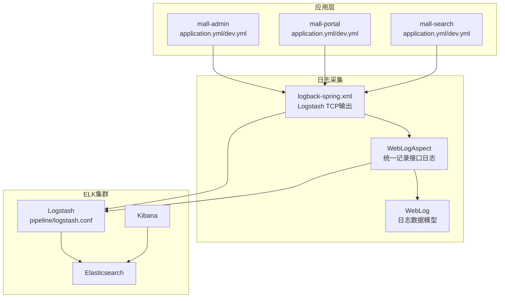
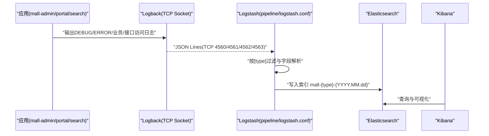
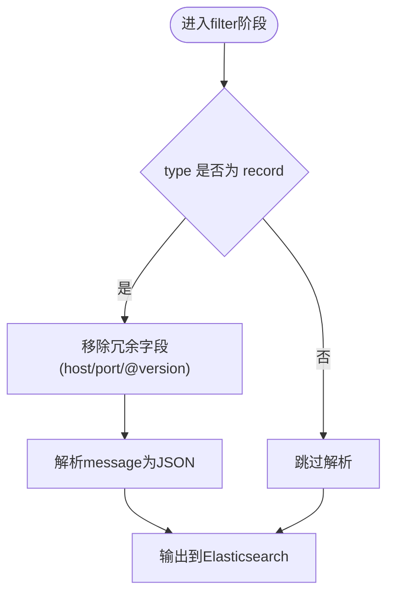
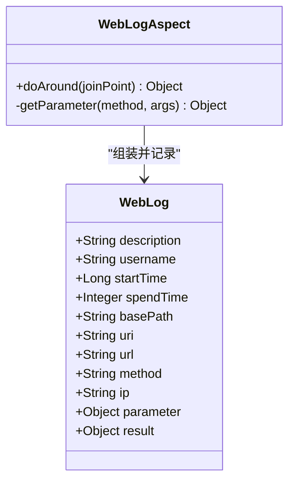
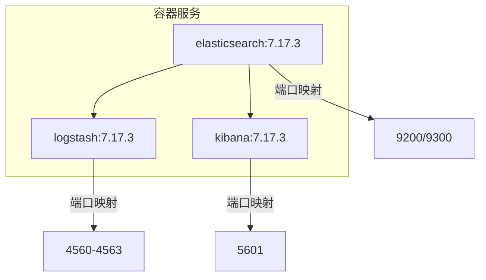
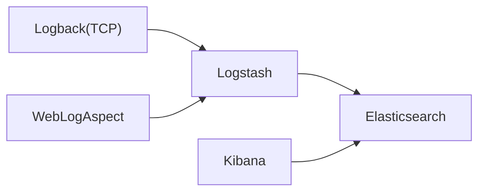

# 监控告警

<cite>
**本文引用的文件**
- [logstash.conf](file://document/elk/logstash.conf)
- [docker-compose-env.yml](file://document/docker/docker-compose-env.yml)
- [docker-compose-app.yml](file://document/docker/docker-compose-app.yml)
- [logback-spring.xml](file://mall-common/src/main/resources/logback-spring.xml)
- [WebLogAspect.java](file://mall-common/src/main/java/com/macro/mall/common/log/WebLogAspect.java)
- [WebLog.java](file://mall-common/src/main/java/com/macro/mall/common/domain/WebLog.java)
- [application.yml（mall-admin）](file://mall-admin/src/main/resources/application.yml)
- [application.yml（mall-portal）](file://mall-portal/src/main/resources/application.yml)
- [application.yml（mall-search）](file://mall-search/src/main/resources/application.yml)
- [application-dev.yml（mall-admin）](file://mall-admin/src/main/resources/application-dev.yml)
- [application-dev.yml（mall-portal）](file://mall-portal/src/main/resources/application-dev.yml)
- [application-dev.yml（mall-search）](file://mall-search/src/main/resources/application-dev.yml)
- [deploy-windows.md](file://document/reference/deploy-windows.md)
- [docker.md](file://document/reference/docker.md)
</cite>

## 目录
1. [简介](#简介)
2. [项目结构](#项目结构)
3. [核心组件](#核心组件)
4. [架构总览](#架构总览)
5. [详细组件分析](#详细组件分析)
6. [依赖关系分析](#依赖关系分析)
7. [性能考虑](#性能考虑)
8. [故障排查指南](#故障排查指南)
9. [结论](#结论)
10. [附录](#附录)

## 简介
本文件面向Mall项目的监控告警体系，围绕ELK（Elasticsearch、Logstash、Kibana）日志收集与分析系统，提供从采集策略、Logstash配置、索引管理、可视化仪表板到告警规则与运维实践的完整方案。文档基于仓库内现有配置与代码进行梳理，帮助开发者与运维人员快速落地日志采集、统一分析与可视化监控。

## 项目结构
围绕监控告警的关键文件分布如下：
- ELK配置与编排
  - Logstash配置：document/elk/logstash.conf
  - 环境编排（含ELK）：document/docker/docker-compose-env.yml
  - 应用编排（应用容器挂载日志目录）：document/docker/docker-compose-app.yml
- 应用侧日志采集
  - Spring Boot日志配置（Logstash TCP输出）：mall-common/src/main/resources/logback-spring.xml
  - Web请求日志切面（统一记录接口访问日志）：mall-common/src/main/java/com/macro/mall/common/log/WebLogAspect.java
  - Web请求日志数据模型：mall-common/src/main/java/com/macro/mall/common/domain/WebLog.java
- 应用配置
  - mall-admin、mall-portal、mall-search 的 application.yml 及开发环境 application-dev.yml

图表来源
- [docker-compose-env.yml:1-100](file://document/docker/docker-compose-env.yml#L1-L100)
- [logstash.conf:1-49](file://document/elk/logstash.conf#L1-L49)
- [logback-spring.xml:1-203](file://mall-common/src/main/resources/logback-spring.xml#L1-L203)
- [WebLogAspect.java:1-126](file://mall-common/src/main/java/com/macro/mall/common/log/WebLogAspect.java#L1-L126)
- [WebLog.java:1-69](file://mall-common/src/main/java/com/macro/mall/common/domain/WebLog.java#L1-L69)

章节来源
- [docker-compose-env.yml:1-100](file://document/docker/docker-compose-env.yml#L1-L100)
- [docker-compose-app.yml:1-42](file://document/docker/docker-compose-app.yml#L1-L42)
- [logstash.conf:1-49](file://document/elk/logstash.conf#L1-L49)
- [logback-spring.xml:1-203](file://mall-common/src/main/resources/logback-spring.xml#L1-L203)
- [WebLogAspect.java:1-126](file://mall-common/src/main/java/com/macro/mall/common/log/WebLogAspect.java#L1-L126)
- [WebLog.java:1-69](file://mall-common/src/main/java/com/macro/mall/common/domain/WebLog.java#L1-L69)

## 核心组件
- 日志采集器（Logstash）
  - 通过TCP端口接收不同类型的JSON日志流，并按类型写入对应索引模板。
  - 类型包括：debug、error、business、record。
- 应用日志配置（Logback + Logstash）
  - 将DEBUG/ERROR日志与业务日志通过Logstash TCP Socket Appender发送至Logstash。
  - 接口访问记录由WebLogAspect统一切面采集并通过Logstash发送。
- Elasticsearch/Kibana
  - Logstash将日志写入Elasticsearch，Kibana用于可视化与仪表板展示。
- 应用编排
  - docker-compose-env.yml定义ELK服务与端口映射。
  - docker-compose-app.yml定义应用容器挂载日志目录，便于后续扩展本地文件采集。

章节来源
- [logstash.conf:1-49](file://document/elk/logstash.conf#L1-L49)
- [logback-spring.xml:63-178](file://mall-common/src/main/resources/logback-spring.xml#L63-L178)
- [WebLogAspect.java:54-89](file://mall-common/src/main/java/com/macro/mall/common/log/WebLogAspect.java#L54-L89)
- [docker-compose-env.yml:41-80](file://document/docker/docker-compose-env.yml#L41-L80)

## 架构总览
下图展示了从应用到ELK的完整链路：应用通过Logback将日志发送至Logstash，Logstash根据类型写入Elasticsearch，Kibana读取索引进行可视化。

图表来源
- [logstash.conf:1-49](file://document/elk/logstash.conf#L1-L49)
- [logback-spring.xml:63-178](file://mall-common/src/main/resources/logback-spring.xml#L63-L178)
- [WebLogAspect.java:54-89](file://mall-common/src/main/java/com/macro/mall/common/log/WebLogAspect.java#L54-L89)

## 详细组件分析

### Logstash配置文件（编写要点与流程）
- 输入（input）
  - 四个TCP输入监听器分别对应四种日志类型：debug、error、business、record。
  - 均使用json_lines codec，确保每行是合法JSON。
- 过滤（filter）
  - 对record类型进行字段清理与JSON解析：移除冗余字段，将message解析为结构化字段。
- 输出（output）
  - 输出到Elasticsearch，索引模板为mall-{type}-{YYYY.MM.dd}，按日期滚动。

图表来源
- [logstash.conf:31-43](file://document/elk/logstash.conf#L31-L43)

章节来源
- [logstash.conf:1-49](file://document/elk/logstash.conf#L1-L49)

### 应用日志采集策略（Spring Boot）
- 日志输出目标
  - DEBUG/ERROR日志同时输出到文件与Logstash TCP Socket。
  - 业务日志通过Logstash TCP Socket输出。
  - 接口访问记录由WebLogAspect统一采集并输出至Logstash。
- 字段规范
  - 统一包含项目标识、服务名、线程、类名、消息体、异常栈等。
  - 接口访问记录包含URL、方法、参数、耗时、描述等。
- 端口与主机
  - 默认通过localhost:4560/4561/4562/4563发送，可通过配置覆盖。

图表来源
- [WebLog.java:12-68](file://mall-common/src/main/java/com/macro/mall/common/domain/WebLog.java#L12-L68)
- [WebLogAspect.java:54-89](file://mall-common/src/main/java/com/macro/mall/common/log/WebLogAspect.java#L54-L89)

章节来源
- [logback-spring.xml:63-178](file://mall-common/src/main/resources/logback-spring.xml#L63-L178)
- [WebLogAspect.java:54-89](file://mall-common/src/main/java/com/macro/mall/common/log/WebLogAspect.java#L54-L89)
- [WebLog.java:12-68](file://mall-common/src/main/java/com/macro/mall/common/domain/WebLog.java#L12-L68)

### ELK集群部署配置（Docker Compose）
- 服务与端口
  - Elasticsearch：9200/9300
  - Logstash：4560-4563（映射到容器端口）
  - Kibana：5601
- 数据卷与插件
  - Elasticsearch插件与数据目录挂载。
  - Logstash配置文件挂载至pipeline目录。
- 依赖顺序
  - Kibana依赖Elasticsearch启动。
  - Logstash依赖Elasticsearch启动。

图表来源
- [docker-compose-env.yml:41-80](file://document/docker/docker-compose-env.yml#L41-L80)

章节来源
- [docker-compose-env.yml:1-100](file://document/docker/docker-compose-env.yml#L1-L100)

### 应用日志采集策略（多源统一）
- Spring Boot应用日志
  - 通过Logback将DEBUG/ERROR/业务/接口访问日志统一发送至Logstash。
- Nginx访问日志
  - 当前仓库未提供Nginx日志采集配置；可在应用编排中挂载Nginx日志目录，后续通过Filebeat或Logstash输入插件进行采集。
- 系统日志
  - 当前仓库未提供系统日志采集配置；可通过Filebeat或Logstash输入插件采集系统日志。

章节来源
- [docker-compose-app.yml:8-35](file://document/docker/docker-compose-app.yml#L8-L35)
- [logback-spring.xml:63-178](file://mall-common/src/main/resources/logback-spring.xml#L63-L178)

### 索引管理与可视化仪表板
- 索引模板
  - Logstash输出索引为mall-{type}-{YYYY.MM.dd}，按日期滚动，便于清理与归档。
- 可视化
  - 在Kibana中创建Index Pattern，建立仪表板与图表，实现错误率、响应时间、资源使用等监控。
- 告警建议
  - 基于Kibana Watcher或外部告警平台（如Alertmanager+Prometheus），结合索引中的字段设置阈值告警。

章节来源
- [logstash.conf:44-49](file://document/elk/logstash.conf#L44-L49)
- [docker-compose-env.yml:70-80](file://document/docker/docker-compose-env.yml#L70-L80)

### 告警规则配置（示例思路）
- 错误率阈值
  - 按日志类型为error的索引计算错误条目占比，设定阈值触发告警。
- 响应时间监控
  - 使用接口访问记录中的耗时字段，对慢请求进行阈值告警。
- 系统资源告警
  - 结合系统日志与应用指标（需补充采集），对CPU、内存、磁盘、连接数等设置阈值。

章节来源
- [WebLogAspect.java:54-89](file://mall-common/src/main/java/com/macro/mall/common/log/WebLogAspect.java#L54-L89)
- [logstash.conf:31-43](file://document/elk/logstash.conf#L31-L43)

## 依赖关系分析
- 应用与日志采集
  - 应用通过Logback将日志发送至Logstash；WebLogAspect负责统一记录接口访问日志。
- ELK服务依赖
  - Logstash依赖Elasticsearch；Kibana依赖Elasticsearch。
- 端口与网络
  - Logstash监听4560-4563；Elasticsearch监听9200/9300；Kibana监听5601。

图表来源
- [logback-spring.xml:63-178](file://mall-common/src/main/resources/logback-spring.xml#L63-L178)
- [WebLogAspect.java:54-89](file://mall-common/src/main/java/com/macro/mall/common/log/WebLogAspect.java#L54-L89)
- [logstash.conf:1-49](file://document/elk/logstash.conf#L1-L49)
- [docker-compose-env.yml:41-80](file://document/docker/docker-compose-env.yml#L41-L80)

章节来源
- [logback-spring.xml:63-178](file://mall-common/src/main/resources/logback-spring.xml#L63-L178)
- [WebLogAspect.java:54-89](file://mall-common/src/main/java/com/macro/mall/common/log/WebLogAspect.java#L54-L89)
- [logstash.conf:1-49](file://document/elk/logstash.conf#L1-L49)
- [docker-compose-env.yml:41-80](file://document/docker/docker-compose-env.yml#L41-L80)

## 性能考虑
- Logback编码与传输
  - 使用JSON编码与TCP Socket传输，减少解析开销；注意网络抖动与丢包场景下的重连与缓冲。
- Logstash处理
  - filter阶段仅对record类型进行JSON解析，避免对其他类型增加不必要的CPU消耗。
- 索引滚动
  - 按日滚动索引，便于冷热分离与清理；建议配合ILM策略进行生命周期管理。
- Kibana查询
  - 限定时间范围与字段，避免大范围扫描导致查询缓慢。

## 故障排查指南
- Logstash无法连接Elasticsearch
  - 检查Elasticsearch容器状态与端口映射；确认Logstash输出hosts配置正确。
- 应用日志未到达Logstash
  - 检查应用配置中的logstash.host与enableInnerLog；确认Logstash端口映射与防火墙放行。
- 索引未生成或Kibana无法发现
  - 确认Logstash输出索引模板与时间格式；在Kibana中重建Index Pattern。
- Windows环境部署参考
  - 参考Windows环境搭建文档，了解各组件安装与插件配置步骤。

章节来源
- [docker-compose-env.yml:41-80](file://document/docker/docker-compose-env.yml#L41-L80)
- [application-dev.yml（mall-admin）:34-36](file://mall-admin/src/main/resources/application-dev.yml#L34-L36)
- [application-dev.yml（mall-portal）:41-43](file://mall-portal/src/main/resources/application-dev.yml#L41-L43)
- [application-dev.yml（mall-search）:27-29](file://mall-search/src/main/resources/application-dev.yml#L27-L29)
- [deploy-windows.md:30-41](file://document/reference/deploy-windows.md#L30-L41)

## 结论
本方案基于仓库现有配置，实现了Spring Boot应用日志的统一采集与ELK集群的快速部署。通过Logstash的类型化输入与过滤，结合Logback的TCP输出与WebLogAspect的统一记录，能够有效支撑错误率、响应时间与系统资源的监控与告警。后续可扩展Nginx与系统日志采集，并完善Kibana仪表板与告警规则，形成完整的运维监控闭环。

## 附录
- Docker常用命令参考
  - 参考文档涵盖镜像、容器、Registry与Compose常用命令，便于本地与CI/CD集成。

章节来源
- [docker.md:1-98](file://document/reference/docker.md#L1-L98)