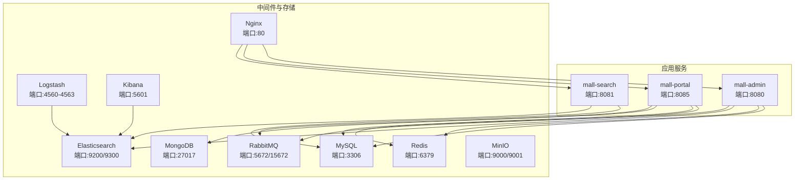
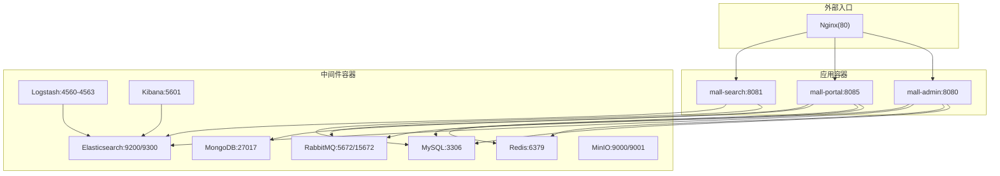
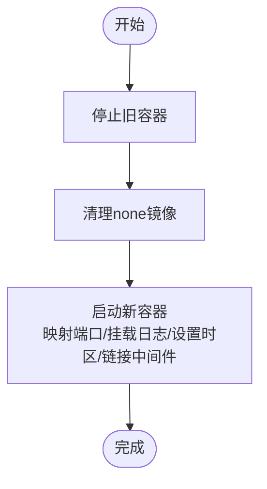
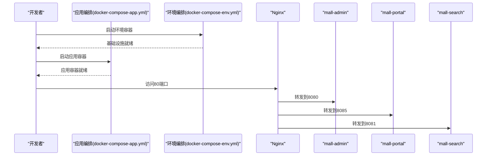
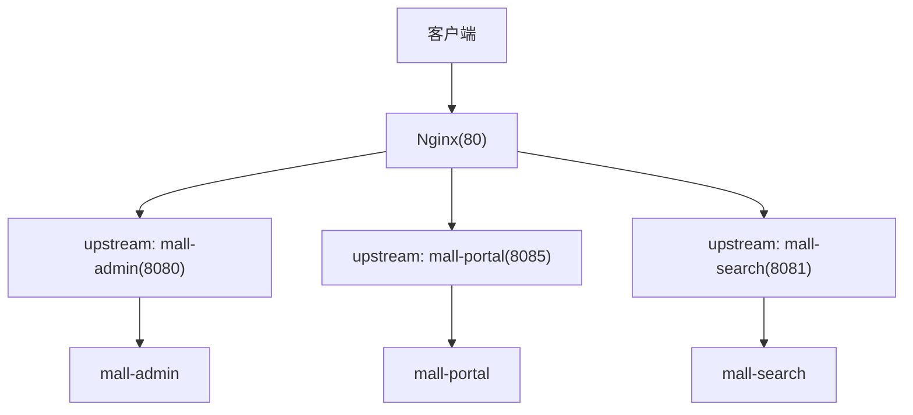
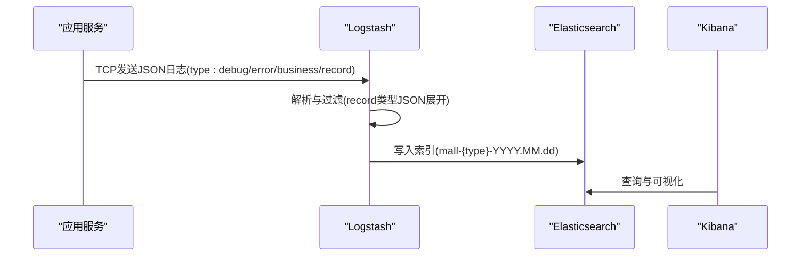
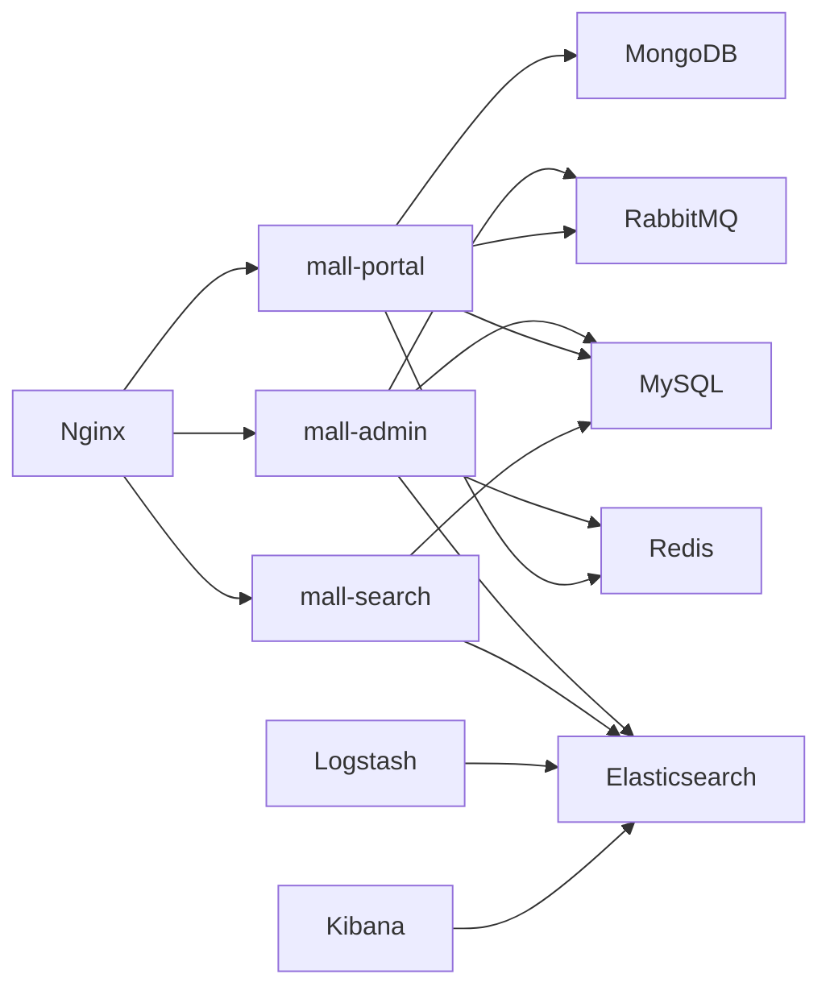

# 部署运维

<cite>
**本文引用的文件**
- [docker-compose-app.yml](file://document/docker/docker-compose-app.yml)
- [docker-compose-env.yml](file://document/docker/docker-compose-env.yml)
- [nginx.conf](file://document/docker/nginx.conf)
- [logstash.conf](file://document/elk/logstash.conf)
- [Dockerfile](file://document/sh/Dockerfile)
- [mall-admin.sh](file://document/sh/mall-admin.sh)
- [mall-portal.sh](file://document/sh/mall-portal.sh)
- [mall-search.sh](file://document/sh/mall-search.sh)
- [application.yml（后台）](file://mall-admin/src/main/resources/application.yml)
- [application.yml（前台）](file://mall-portal/src/main/resources/application.yml)
- [application.yml（搜索）](file://mall-search/src/main/resources/application.yml)
- [mall.sql](file://document/sql/mall.sql)
- [linux.md](file://document/reference/linux.md)
- [deploy-windows.md](file://document/reference/deploy-windows.md)
- [admin-run.sh](file://admin-run.sh)
</cite>

## 目录
1. [简介](#简介)
2. [项目结构](#项目结构)
3. [核心组件](#核心组件)
4. [架构总览](#架构总览)
5. [详细组件分析](#详细组件分析)
6. [依赖分析](#依赖分析)
7. [性能考虑](#性能考虑)
8. [故障排查指南](#故障排查指南)
9. [结论](#结论)
10. [附录](#附录)

## 简介
本文件面向Mall项目的部署与运维，围绕Docker容器化部署、多环境编排、Nginx反向代理与负载均衡、Linux自动化部署（含Jenkins思路）、ELK日志采集与分析、性能调优与故障排查、备份恢复与灾备等维度，提供系统性、可操作的实践指南。文档严格基于仓库现有配置与脚本进行分析与总结，避免臆造信息。

## 项目结构
Mall采用多模块Spring Boot工程，结合Docker Compose进行应用与基础设施统一编排。部署相关的关键位置如下：
- 应用层：mall-admin、mall-portal、mall-search
- 基础设施层：MySQL、Redis、Elasticsearch、Logstash、Kibana、MongoDB、RabbitMQ、MinIO、Nginx
- 配置与脚本：Docker Compose编排、Nginx配置、Logstash管道、Shell脚本、SQL初始化脚本、Linux常用命令手册

图表来源
- [docker-compose-app.yml:1-42](file://document/docker/docker-compose-app.yml#L1-L42)
- [docker-compose-env.yml:1-100](file://document/docker/docker-compose-env.yml#L1-L100)

章节来源
- [docker-compose-app.yml:1-42](file://document/docker/docker-compose-app.yml#L1-L42)
- [docker-compose-env.yml:1-100](file://document/docker/docker-compose-env.yml#L1-L100)

## 核心组件
- 应用服务
  - mall-admin：后台管理服务，默认端口8080，依赖MySQL、Redis、Elasticsearch、RabbitMQ。
  - mall-portal：前台门户服务，默认端口8085，依赖MySQL、Redis、MongoDB、RabbitMQ。
  - mall-search：搜索服务，默认端口8081，依赖MySQL、Elasticsearch。
- 基础设施
  - MySQL 5.7、Redis 7、Elasticsearch 7.17.3、Logstash 7.17.3、Kibana 7.17.3、MongoDB 4、RabbitMQ 3.9.11、MinIO、Nginx 1.22。
- 反向代理与日志
  - Nginx作为入口，承载静态资源与HTTP流量；Logstash负责接收多类日志并写入Elasticsearch，Kibana可视化。

章节来源
- [docker-compose-app.yml:1-42](file://document/docker/docker-compose-app.yml#L1-L42)
- [docker-compose-env.yml:1-100](file://document/docker/docker-compose-env.yml#L1-L100)
- [application.yml（后台）:1-66](file://mall-admin/src/main/resources/application.yml#L1-L66)
- [application.yml（前台）:1-62](file://mall-portal/src/main/resources/application.yml#L1-L62)
- [application.yml（搜索）:1-20](file://mall-search/src/main/resources/application.yml#L1-L20)

## 架构总览
下图展示了容器化部署的整体拓扑与交互关系，包括应用容器、中间件容器以及外部入口Nginx与日志链路。

图表来源
- [docker-compose-app.yml:1-42](file://document/docker/docker-compose-app.yml#L1-L42)
- [docker-compose-env.yml:1-100](file://document/docker/docker-compose-env.yml#L1-L100)

## 详细组件分析

### Docker镜像构建与运行
- 镜像构建
  - 使用基础镜像openjdk:8，将打包好的JAR复制至容器内，暴露应用端口并设置入口命令。
- 单体应用容器运行
  - 提供三个Shell脚本分别停止、清理、启动对应应用容器，并通过link建立服务发现，挂载日志卷，设置时区与本地时间同步。

图表来源
- [Dockerfile:1-10](file://document/sh/Dockerfile#L1-L10)
- [mall-admin.sh:1-16](file://document/sh/mall-admin.sh#L1-L16)
- [mall-portal.sh:1-18](file://document/sh/mall-portal.sh#L1-L18)
- [mall-search.sh:1-16](file://document/sh/mall-search.sh#L1-L16)

章节来源
- [Dockerfile:1-10](file://document/sh/Dockerfile#L1-L10)
- [mall-admin.sh:1-16](file://document/sh/mall-admin.sh#L1-L16)
- [mall-portal.sh:1-18](file://document/sh/mall-portal.sh#L1-L18)
- [mall-search.sh:1-16](file://document/sh/mall-search.sh#L1-L16)

### Docker Compose编排（应用与环境）
- 应用编排（docker-compose-app.yml）
  - 定义mall-admin、mall-search、mall-portal三类应用容器，映射宿主机端口，挂载日志卷，设置时区，使用external_links实现服务别名访问（如db、es、redis、mongo、rabbit）。
- 环境编排（docker-compose-env.yml）
  - 定义MySQL、Redis、Nginx、RabbitMQ、Elasticsearch、Logstash、Kibana、MongoDB、MinIO等基础设施容器，设置持久化目录、端口映射、环境变量（如ES内存、Elasticsearch单节点模式、Logstash时区），并声明依赖顺序（Logstash依赖Elasticsearch）。

图表来源
- [docker-compose-app.yml:1-42](file://document/docker/docker-compose-app.yml#L1-L42)
- [docker-compose-env.yml:1-100](file://document/docker/docker-compose-env.yml#L1-L100)

章节来源
- [docker-compose-app.yml:1-42](file://document/docker/docker-compose-app.yml#L1-L42)
- [docker-compose-env.yml:1-100](file://document/docker/docker-compose-env.yml#L1-L100)

### Nginx反向代理与负载均衡
- 配置要点
  - 监听80端口，提供静态资源根目录与错误页面。
  - 日志格式包含来源IP、请求、状态码、用户代理与X-Forwarded-For。
- 负载均衡建议
  - 在生产环境中，可在Nginx中对mall-admin/mall-portal/mall-search配置upstream与轮询/权重策略，结合健康检查与重试机制提升可用性与吞吐。

图表来源
- [nginx.conf:1-46](file://document/docker/nginx.conf#L1-L46)
- [docker-compose-app.yml:1-42](file://document/docker/docker-compose-app.yml#L1-L42)

章节来源
- [nginx.conf:1-46](file://document/docker/nginx.conf#L1-L46)

### ELK日志收集与分析
- Logstash管道
  - 监听4560-4563端口，按type区分debug、error、business、record四类日志，对record类型进行字段清洗与JSON解析。
  - 输出到Elasticsearch，索引按日分区（mall-{type}-YYYY.MM.dd）。
- Kibana
  - 依赖Elasticsearch，提供可视化界面，便于检索与分析日志。

图表来源
- [logstash.conf:1-49](file://document/elk/logstash.conf#L1-L49)
- [docker-compose-env.yml:54-80](file://document/docker/docker-compose-env.yml#L54-L80)

章节来源
- [logstash.conf:1-49](file://document/elk/logstash.conf#L1-L49)
- [docker-compose-env.yml:54-80](file://document/docker/docker-compose-env.yml#L54-L80)

### Linux自动化部署（含Jenkins思路）
- 常用Linux命令
  - 服务管理（systemctl）、进程查看（ps/top）、网络状态（netstat/ifconfig）、软件安装（rpm/yum）、防火墙（iptables）等。
- Jenkins持续集成与部署思路
  - 代码变更触发流水线：拉取代码、构建镜像（基于Dockerfile）、推送镜像、编排更新（docker-compose up -d）、健康检查、回滚策略。
  - 分环境策略：dev/staging/prod三套compose文件，按环境变量切换配置与镜像标签。
  - 安全与审计：镜像扫描、制品库鉴权、发布审批、变更记录。

章节来源
- [linux.md:1-149](file://document/reference/linux.md#L1-L149)

### 数据库初始化与配置
- 初始化脚本
  - 提供完整的数据库结构与示例数据，包含帮助、专题、优选专区、商品、会员、权限等表。
- 应用配置
  - 后台/前台/搜索模块均配置MyBatis Mapper路径与匹配策略，后台模块额外配置JWT、Redis键空间与过期策略、阿里云OSS参数等。

章节来源
- [mall.sql:1-200](file://document/sql/mall.sql#L1-L200)
- [application.yml（后台）:1-66](file://mall-admin/src/main/resources/application.yml#L1-L66)
- [application.yml（前台）:1-62](file://mall-portal/src/main/resources/application.yml#L1-L62)
- [application.yml（搜索）:1-20](file://mall-search/src/main/resources/application.yml#L1-L20)

## 依赖分析
- 服务耦合
  - mall-admin依赖MySQL、Redis、Elasticsearch、RabbitMQ；mall-portal依赖MySQL、Redis、MongoDB、RabbitMQ；mall-search依赖MySQL、Elasticsearch。
- 编排依赖
  - Logstash依赖Elasticsearch；应用容器通过external_links使用db/es/redis/mongo/rabbit别名访问。
- 外部入口
  - Nginx作为统一入口，转发至各应用容器。

图表来源
- [docker-compose-app.yml:1-42](file://document/docker/docker-compose-app.yml#L1-L42)
- [docker-compose-env.yml:1-100](file://document/docker/docker-compose-env.yml#L1-L100)

章节来源
- [docker-compose-app.yml:1-42](file://document/docker/docker-compose-app.yml#L1-L42)
- [docker-compose-env.yml:1-100](file://document/docker/docker-compose-env.yml#L1-L100)

## 性能考虑
- JVM与容器资源
  - Elasticsearch通过环境变量设置堆内存上限，建议根据宿主机内存合理分配；Nginx工作进程与连接数可根据并发峰值调整。
- 存储与IO
  - MySQL、Redis、Elasticsearch、MongoDB、MinIO均配置持久化目录，建议使用高性能磁盘与合理的IO调度策略。
- 缓存与会话
  - 后台/前台模块配置Redis键空间与过期策略，建议结合热点数据与业务生命周期设计缓存淘汰策略。
- 并发与限流
  - Nginx可引入限流与连接数限制；应用侧结合线程池与异步消息队列（RabbitMQ）削峰填谷。
- 索引与查询
  - Elasticsearch索引按日分区，建议结合业务日志量规划滚动策略与冷热分层。

## 故障排查指南
- 容器与网络
  - 使用systemctl管理服务、netstat查看端口占用、ps/top定位异常进程；通过docker logs查看应用容器日志。
- 数据库问题
  - 检查MySQL容器日志与数据目录挂载；确认初始化脚本执行与字符集设置。
- 搜索与日志
  - 确认Logstash端口开放与管道配置正确；Elasticsearch索引创建与权限；Kibana连通性。
- 缓存与消息
  - Redis键空间与过期策略是否符合预期；RabbitMQ队列与消费者状态。
- 反向代理
  - Nginx访问/错误日志定位转发失败原因；确认upstream与健康检查配置。

章节来源
- [linux.md:1-149](file://document/reference/linux.md#L1-L149)
- [logstash.conf:1-49](file://document/elk/logstash.conf#L1-L49)
- [docker-compose-env.yml:54-80](file://document/docker/docker-compose-env.yml#L54-L80)

## 结论
Mall项目提供了完善的Docker容器化部署与编排方案，结合Nginx反向代理与ELK日志体系，能够支撑多环境的稳定运行。通过规范化的镜像构建、服务编排、日志采集与Linux运维工具，可进一步完善CI/CD流程与监控告警体系，确保系统在高并发场景下的可靠性与可维护性。

## 附录
- 快速启动（基于仓库现有编排）
  - 启动环境容器：docker-compose -f document/docker/docker-compose-env.yml up -d
  - 启动应用容器：docker-compose -f document/docker/docker-compose-app.yml up -d
- Windows环境参考
  - 参考Windows下各组件安装与启动步骤，便于本地联调与对比。

章节来源
- [docker-compose-env.yml:1-100](file://document/docker/docker-compose-env.yml#L1-L100)
- [docker-compose-app.yml:1-42](file://document/docker/docker-compose-app.yml#L1-L42)
- [deploy-windows.md:1-106](file://document/reference/deploy-windows.md#L1-L106)