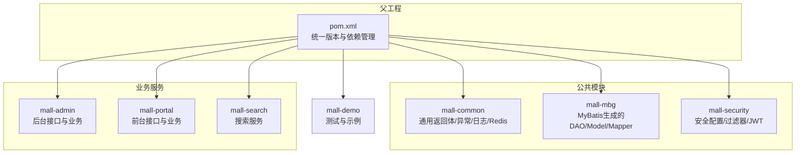
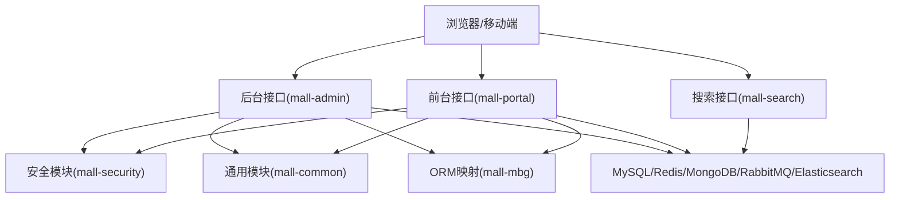
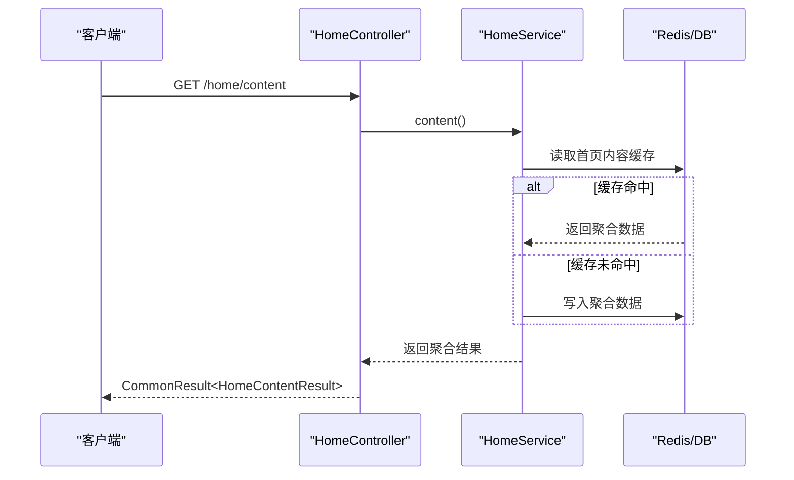
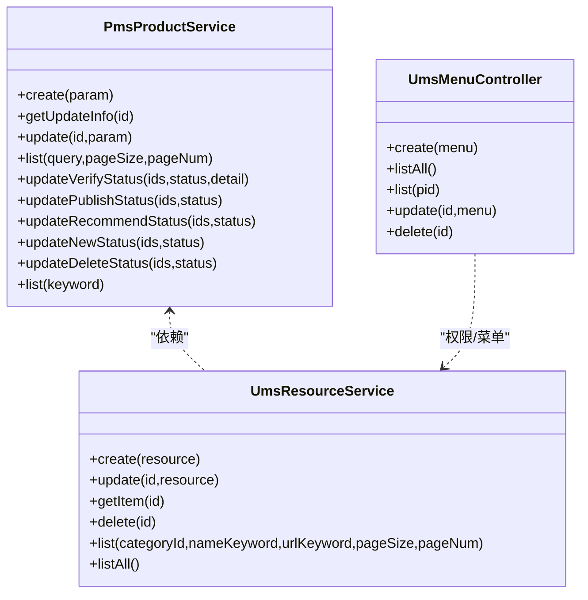
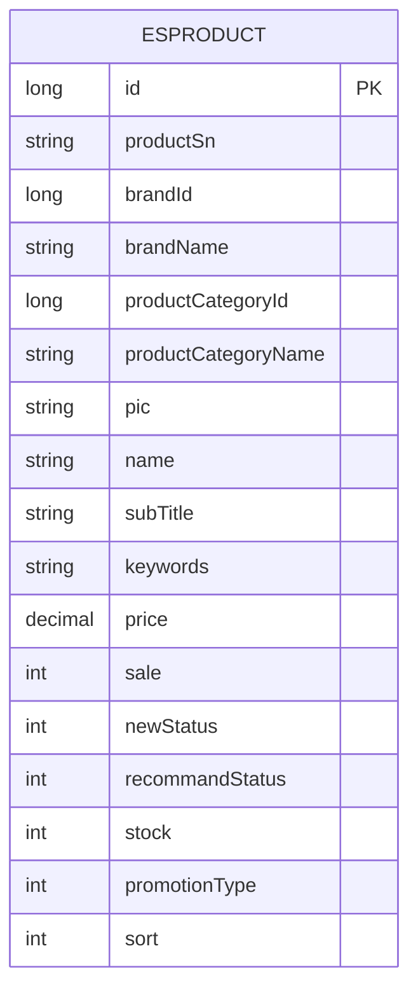
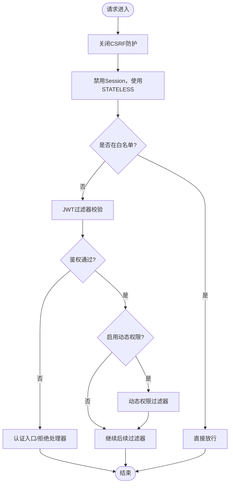
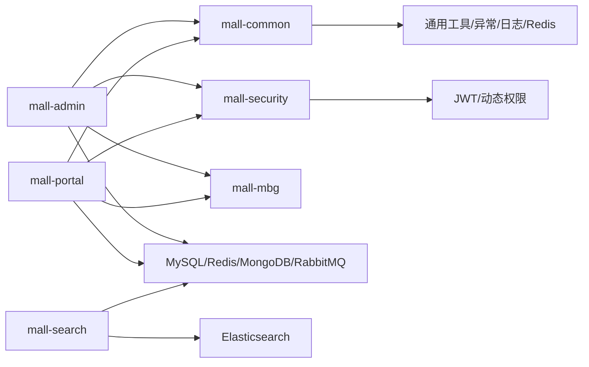

# 项目概述

<cite>
**本文引用的文件**
- [README.md](file://README.md)
- [pom.xml](file://pom.xml)
- [MallAdminApplication.java](file://mall-admin/src/main/java/com/macro/mall/MallAdminApplication.java)
- [MallPortalApplication.java](file://mall-portal/src/main/java/com/macro/mall/portal/MallPortalApplication.java)
- [MallSearchApplication.java](file://mall-search/src/main/java/com/macro/mall/search/MallSearchApplication.java)
- [application.yml（后台）](file://mall-admin/src/main/resources/application.yml)
- [application.yml（前台）](file://mall-portal/src/main/resources/application.yml)
- [application.yml（搜索）](file://mall-search/src/main/resources/application.yml)
- [CommonResult.java](file://mall-common/src/main/java/com/macro/mall/common/api/CommonResult.java)
- [SecurityConfig.java](file://mall-security/src/main/java/com/macro/mall/security/config/SecurityConfig.java)
- [function.md](file://document/reference/function.md)
- [HomeController.java](file://mall-portal/src/main/java/com/macro/mall/portal/controller/HomeController.java)
- [PmsPortalProductService.java](file://mall-portal/src/main/java/com/macro/mall/portal/service/PmsPortalProductService.java)
- [PmsProductService.java](file://mall-admin/src/main/java/com/macro/mall/service/PmsProductService.java)
- [EsProduct.java](file://mall-search/src/main/java/com/macro/mall/search/domain/EsProduct.java)
</cite>

## 目录
1. [引言](#引言)
2. [项目结构](#项目结构)
3. [核心组件](#核心组件)
4. [架构总览](#架构总览)
5. [详细组件分析](#详细组件分析)
6. [依赖分析](#依赖分析)
7. [性能考虑](#性能考虑)
8. [故障排查指南](#故障排查指南)
9. [结论](#结论)
10. [附录](#附录)

## 引言
本项目“Mall”是一套基于当前主流技术栈实现的完整电商系统，包含前台商城系统与后台管理系统两大子系统。系统采用SpringBoot + MyBatis作为后端核心，结合Docker容器化部署，覆盖从首页门户、商品检索、购物车、订单流程到后台商品/订单/会员/促销/运营/内容管理等全链路业务能力。项目提供在线演示地址与配套学习资料，便于开发者快速上手与二次开发。

- 在线演示地址
  - 后台管理系统演示：https://www.macrozheng.com/admin/index.html
  - 前台商城演示（建议切换为手机模式）：https://www.macrozheng.com/app/

- 项目文档与教程：https://www.macrozheng.com

**章节来源**
- [README.md:31-47](file://README.md#L31-L47)

## 项目结构
项目采用多模块聚合工程结构，父工程统一管理版本与依赖，各子模块职责清晰：
- mall-common：通用工具与返回体封装
- mall-mbg：MyBatis Generator生成的数据库映射代码
- mall-security：SpringSecurity安全封装与过滤器
- mall-admin：后台管理系统接口与业务
- mall-portal：前台商城系统接口与业务
- mall-search：基于Elasticsearch的商品搜索服务
- mall-demo：框架搭建时的测试代码

**图表来源**
- [pom.xml:12-20](file://pom.xml#L12-L20)
- [README.md:51-62](file://README.md#L51-L62)

**章节来源**
- [pom.xml:12-20](file://pom.xml#L12-L20)
- [README.md:51-62](file://README.md#L51-L62)

## 核心组件
- 通用返回体与异常处理
  - 通过统一返回体封装，规范前后端交互格式；配合全局异常处理器，统一错误码与提示信息。
- 安全与鉴权
  - 基于SpringSecurity + JWT，无状态鉴权；支持白名单放行与动态权限扩展。
- 配置与启动
  - 各模块独立SpringBoot启动类，按需扫描基础包，结合各自application.yml进行差异化配置。
- 搜索与索引
  - 基于Elasticsearch的全文检索模型，使用IK分词器，支持商品名称、副标题、关键词等字段检索。

**章节来源**
- [CommonResult.java:1-134](file://mall-common/src/main/java/com/macro/mall/common/api/CommonResult.java#L1-L134)
- [SecurityConfig.java:1-70](file://mall-security/src/main/java/com/macro/mall/security/config/SecurityConfig.java#L1-L70)
- [MallAdminApplication.java:1-16](file://mall-admin/src/main/java/com/macro/mall/MallAdminApplication.java#L1-L16)
- [MallPortalApplication.java:1-14](file://mall-portal/src/main/java/com/macro/mall/portal/MallPortalApplication.java#L1-L14)
- [MallSearchApplication.java:1-13](file://mall-search/src/main/java/com/macro/mall/search/MallSearchApplication.java#L1-L13)
- [EsProduct.java:1-52](file://mall-search/src/main/java/com/macro/mall/search/domain/EsProduct.java#L1-L52)

## 架构总览
系统采用前后台分离与多模块协作的架构设计：
- 前台门户（mall-portal）：首页内容、商品检索、购物车、下单、会员中心等
- 后台管理（mall-admin）：商品、订单、会员、促销、运营、内容等管理
- 搜索服务（mall-search）：基于Elasticsearch的商品检索
- 安全与通用（mall-security、mall-common、mall-mbg）：统一安全策略、通用返回体、ORM映射

**图表来源**
- [README.md:116-125](file://README.md#L116-L125)
- [application.yml（后台）:1-66](file://mall-admin/src/main/resources/application.yml#L1-L66)
- [application.yml（前台）:1-62](file://mall-portal/src/main/resources/application.yml#L1-L62)
- [application.yml（搜索）:1-20](file://mall-search/src/main/resources/application.yml#L1-L20)

## 详细组件分析

### 前台门户系统（mall-portal）
- 首页门户
  - 提供首页内容聚合接口，返回广告、品牌、商品、专题等聚合数据。
- 商品管理
  - 支持综合搜索、分类树形结构、商品详情查询等。
- 订单流程
  - 结合JWT鉴权与消息队列（RabbitMQ），支持下单、支付、取消等流程。
- 会员中心
  - 基于Redis缓存验证码、会员信息与订单号等键值。

**图表来源**
- [HomeController.java:27-32](file://mall-portal/src/main/java/com/macro/mall/portal/controller/HomeController.java#L27-L32)

**章节来源**
- [HomeController.java:1-32](file://mall-portal/src/main/java/com/macro/mall/portal/controller/HomeController.java#L1-L32)
- [PmsPortalProductService.java:1-29](file://mall-portal/src/main/java/com/macro/mall/portal/service/PmsPortalProductService.java#L1-L29)
- [application.yml（前台）:41-62](file://mall-portal/src/main/resources/application.yml#L41-L62)

### 后台管理系统（mall-admin）
- 商品管理
  - 支持商品创建、更新、审核、上下架、推荐/新品状态批量变更、删除等。
- 订单管理
  - 支持订单发货、退款、原因管理、设置等。
- 会员与权限
  - 管理员、角色、菜单、资源、权限等RBAC体系。
- 促销与运营
  - 优惠券、限时购、首页广告、品牌、新品、推荐商品、专题等内容运营。
- 内容管理
  - 专题、偏好地区、帮助中心等CMS内容。

**图表来源**
- [PmsProductService.java:1-74](file://mall-admin/src/main/java/com/macro/mall/service/PmsProductService.java#L1-L74)
- [UmsResourceService.java:1-41](file://mall-admin/src/main/java/com/macro/mall/service/UmsResourceService.java#L1-L41)

**章节来源**
- [PmsProductService.java:1-74](file://mall-admin/src/main/java/com/macro/mall/service/PmsProductService.java#L1-L74)
- [function.md:3-27](file://document/reference/function.md#L3-L27)

### 搜索系统（mall-search）
- 搜索模型
  - 基于Elasticsearch的EsProduct模型，使用IK分词器对名称、副标题、关键词进行全文检索。
- 索引设置
  - 单分片单副本，适合演示与轻量生产环境；可根据业务增长调整分片与副本数。

**图表来源**
- [EsProduct.java:21-51](file://mall-search/src/main/java/com/macro/mall/search/domain/EsProduct.java#L21-L51)

**章节来源**
- [EsProduct.java:1-52](file://mall-search/src/main/java/com/macro/mall/search/domain/EsProduct.java#L1-L52)
- [application.yml（搜索）:10-20](file://mall-search/src/main/resources/application.yml#L10-L20)

### 安全与鉴权（mall-security）
- 无状态鉴权
  - 基于JWT的Token机制，禁用Session，支持白名单放行与动态权限过滤。
- 动态权限
  - 支持运行时动态注入权限元数据与过滤器，满足复杂权限场景。

**图表来源**
- [SecurityConfig.java:38-67](file://mall-security/src/main/java/com/macro/mall/security/config/SecurityConfig.java#L38-L67)

**章节来源**
- [SecurityConfig.java:1-70](file://mall-security/src/main/java/com/macro/mall/security/config/SecurityConfig.java#L1-L70)
- [application.yml（后台）:34-52](file://mall-admin/src/main/resources/application.yml#L34-L52)
- [application.yml（前台）:21-40](file://mall-portal/src/main/resources/application.yml#L21-L40)

## 依赖分析
- 技术栈与版本
  - 后端：SpringBoot 3.2 + JDK 17，MyBatis 3.5.10，PageHelper分页，Druid连接池，Hutool工具集，SpringDoc OpenAPI，JWT，Elasticsearch，RabbitMQ，Redis，MongoDB，Nginx，Docker，Jenkins等。
  - 前端与移动端：Vue、Element、uni-app等（详见README中的技术选型表）。
- 模块间耦合
  - mall-admin与mall-portal均依赖mall-common与mall-security，共享统一返回体、安全策略与通用工具；与mall-mbg通过MyBatis映射数据库。
- 外部依赖与集成点
  - 对象存储：阿里云OSS与MinIO双方案配置；日志采集：Logstash/Kibana；容器化：Docker与Docker Compose。

**图表来源**
- [pom.xml:93-194](file://pom.xml#L93-L194)
- [README.md:64-115](file://README.md#L64-L115)

**章节来源**
- [pom.xml:22-55](file://pom.xml#L22-L55)
- [README.md:64-115](file://README.md#L64-L115)

## 性能考虑
- 数据访问层优化
  - 使用PageHelper进行物理分页，避免一次性加载大量数据；结合MyBatis Mapper与实体类，减少不必要的字段传输。
- 缓存策略
  - 前台与后台分别使用Redis缓存管理员/资源列表、验证码、会员信息、订单号等热点数据，降低数据库压力。
- 搜索性能
  - Elasticsearch单分片单副本适合演示环境；生产环境建议根据QPS与数据规模增加分片与副本，合理设置刷新间隔与写入缓冲。
- 安全与鉴权
  - 无状态JWT避免会话存储开销；白名单放行静态资源与监控接口，减少鉴权成本。
- 容器化与部署
  - 使用Docker镜像与Compose简化部署；结合Nginx做静态资源与反向代理，提升并发与稳定性。

**章节来源**
- [application.yml（后台）:26-33](file://mall-admin/src/main/resources/application.yml#L26-L33)
- [application.yml（前台）:42-51](file://mall-portal/src/main/resources/application.yml#L42-L51)
- [EsProduct.java:21-22](file://mall-search/src/main/java/com/macro/mall/search/domain/EsProduct.java#L21-L22)

## 故障排查指南
- 接口返回统一格式
  - 使用通用返回体CommonResult，便于前端与测试工具统一处理成功/失败/未登录/未授权等场景。
- 安全白名单问题
  - 若出现静态资源或Swagger无法访问，检查安全配置中的白名单URL是否包含对应路径。
- JWT鉴权失败
  - 确认请求头携带正确的Authorization头与Bearer前缀；检查密钥、过期时间与签名一致性。
- 搜索无结果
  - 确认Elasticsearch索引已建立且数据已同步；检查IK分词器是否正确安装与配置。
- 后台/前台配置差异
  - 后台与前台的JWT密钥、白名单、Redis键空间不同，注意区分环境配置文件。

**章节来源**
- [CommonResult.java:30-108](file://mall-common/src/main/java/com/macro/mall/common/api/CommonResult.java#L30-L108)
- [SecurityConfig.java:38-67](file://mall-security/src/main/java/com/macro/mall/security/config/SecurityConfig.java#L38-L67)
- [application.yml（后台）:20-66](file://mall-admin/src/main/resources/application.yml#L20-L66)
- [application.yml（前台）:15-62](file://mall-portal/src/main/resources/application.yml#L15-L62)

## 结论
Mall项目以SpringBoot与MyBatis为核心，结合Elasticsearch、RabbitMQ、Redis、MongoDB等中间件，构建了从前台到后台、从接口到数据的完整电商解决方案。通过模块化拆分与统一安全策略，系统具备良好的可维护性与扩展性；配合Docker容器化与文档资料，能够快速落地与迭代。

## 附录
- 在线演示
  - 后台管理系统：https://www.macrozheng.com/admin/index.html
  - 前台商城：https://www.macrozheng.com/app/
- 学习与教程：https://www.macrozheng.com
- 微服务版本（基于Spring Cloud Alibaba）：https://github.com/macrozheng/mall-swarm