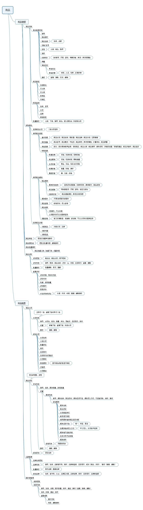

# mall

## 前言

`mall`项目致力于打造一个完整的电商业务系统，包括前台商城系统和后台管理系统，采用现阶段流行技术实现。

## 项目介绍

`mall`项目是一套电商业务系统，包括前台商城系统及后台管理系统，基于SpringBoot+MyBatis实现。
前台商城系统包含用户中心、会员成长、优惠券、积分、互动社区、运营推广、内容推荐、商品展示、订单流程、订单管理、售后及服务等模块。
后台管理系统包括商品、订单、用户、促销、运营、内容、统计、财务、设置、权限等管理系统模块。

### 组织结构

``` lua
mall
├── mall-mbg -- MyBatisGenerator生成的数据库操作代码
├── mall-admin -- 后台商城管理系统
├── mall-search -- 基于Elasticsearch的商品搜索系统
├── mall-portal -- 前台商城系统
└── mall-demo -- 框架搭建时的测试代码
```

### 技术选型

#### 后端技术

技术 | 名称 | 官网
----|----|----
Spring Boot | 容器+MVC框架 | [https://spring.io/projects/spring-boot](https://spring.io/projects/spring-boot)
Spring Security | 认证和授权框架 | [https://spring.io/projects/spring-security](https://spring.io/projects/spring-security)
MyBatis | ORM框架  | [http://www.mybatis.org/mybatis-3/zh/index.html](http://www.mybatis.org/mybatis-3/zh/index.html)
MyBatisGenerator | 数据层代码生成 | [http://www.mybatis.org/generator/index.html](http://www.mybatis.org/generator/index.html)
PageHelper | MyBatis物理分页插件 | [http://git.oschina.net/free/Mybatis_PageHelper](http://git.oschina.net/free/Mybatis_PageHelper)
Swagger-UI | 文档生产工具 | [https://github.com/swagger-api/swagger-ui](https://github.com/swagger-api/swagger-ui)
Hibernator-Validator | 验证框架 | [http://hibernate.org/validator/](http://hibernate.org/validator/)
Elasticsearch | 搜索引擎 | [https://github.com/elastic/elasticsearch](https://github.com/elastic/elasticsearch)
RabbitMq | 消息队列 | [https://www.rabbitmq.com/](https://www.rabbitmq.com/)
Redis | 分布式缓存 | [https://redis.io/](https://redis.io/)
MongoDb | NoSql数据库 | [https://www.mongodb.com/](https://www.mongodb.com/)
Docker | 应用容器引擎 | [https://www.docker.com/](https://www.docker.com/)
Druid | 数据库连接池 | [https://github.com/alibaba/druid](https://github.com/alibaba/druid)
OSS | 对象存储 | [https://github.com/aliyun/aliyun-oss-java-sdk](https://github.com/aliyun/aliyun-oss-java-sdk)
JWT | JTW登录支持 | [https://github.com/jwtk/jjwt](https://github.com/jwtk/jjwt)
LogStash | 日志收集 | [https://github.com/logstash/logstash-logback-encoder](https://github.com/logstash/logstash-logback-encoder)
Lombok | 简化对象封装工具 | [https://github.com/rzwitserloot/lombok](https://github.com/rzwitserloot/lombok)

#### 前端技术

技术 | 名称 | 官网
----|----|----
Vue | 前端框架 | [https://vuejs.org/](https://vuejs.org/)
Vue-router | 路由框架 | [https://router.vuejs.org/](https://router.vuejs.org/)
Vuex | 全局状态管理框架 | [https://vuex.vuejs.org/](https://vuex.vuejs.org/)
Element | 前端UI框架 | [https://element.eleme.io/](https://element.eleme.io/)
Axios | 前端HTTP框架 | [https://github.com/axios/axios](https://github.com/axios/axios)
v-charts | 基于Echarts的图表框架 | [https://v-charts.js.org/](https://v-charts.js.org/)
Js-cookie | cookie管理工具 | [https://github.com/js-cookie/js-cookie](https://github.com/js-cookie/js-cookie)
nprogress | 进度条控件 | [https://github.com/rstacruz/nprogress](https://github.com/rstacruz/nprogress)

#### 架构图
#### 模块介绍

##### 后台管理系统 `mall-admin`

> 商品管理



> 订单管理

> 促销管理

> 内容管理

> 用户管理

##### 前台商城系统 `mall-portal`

## 环境搭建
### 开发工具
### 开发环境