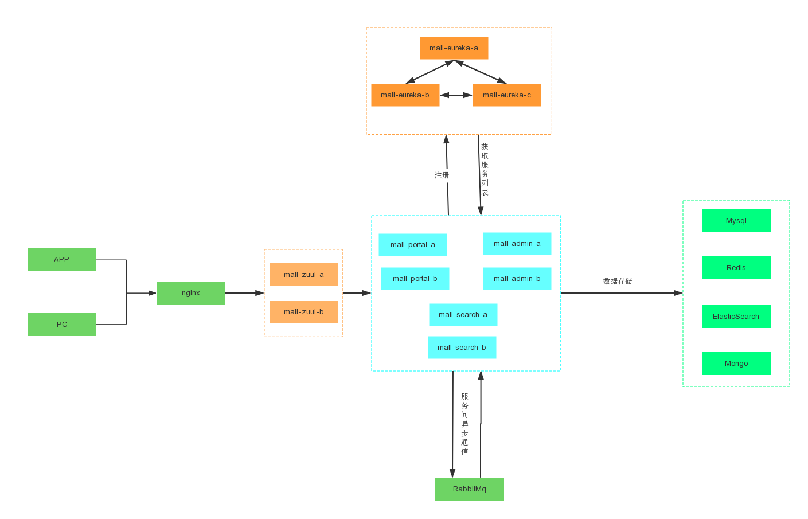
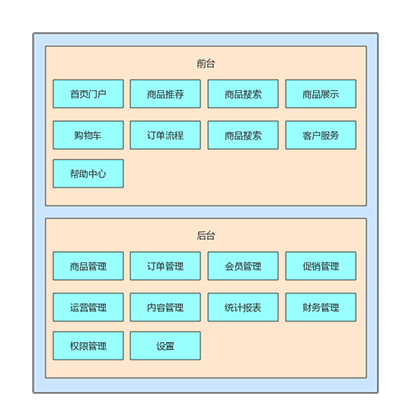
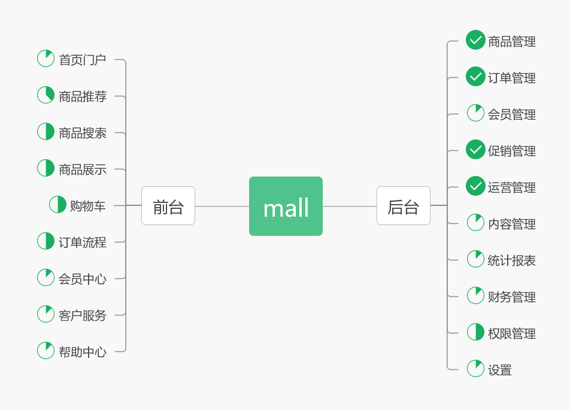

# mall

<p>
  <a href="#公众号"></a>
  <a href="https://github.com/macrozheng/mall-learning"></a>
  <a href="https://github.com/macrozheng/mall-admin-web"></a>
  <a href="http://qm.qq.com/cgi-bin/qm/qr?k=V6xu5c12j9qhnMUNdDRzakNxRKzOxibQ"></a>
  <a href="http://qm.qq.com/cgi-bin/qm/qr?k=M5Edq2TiJL_ShcOEeYjwcmdGmq4zZrd_"></a>
  <a href="https://gitee.com/macrozheng/mall"></a>
</p>

## 前言

`mall`项目致力于打造一个完整的电商系统，采用现阶段流行技术实现。

## 项目文档

- 文档地址：[https://macrozheng.github.io/mall-learning](https://macrozheng.github.io/mall-learning)
- 备用地址：[https://macrozheng.gitee.io/mall-learning](https://macrozheng.gitee.io/mall-learning)

## 特别赞助商

<p align="left">
<a href="https://coding.net/?utm_source=macrozheng&utm_medium=banner&utm_campaign=march2019" target="_blank">
  
 </a>
</p>

## 项目介绍

`mall`项目是一套电商系统，包括前台商城系统及后台管理系统，基于SpringBoot+MyBatis实现。
前台商城系统包含首页门户、商品推荐、商品搜索、商品展示、购物车、订单流程、会员中心、客户服务、帮助中心等模块。
后台管理系统包含商品管理、订单管理、会员管理、促销管理、运营管理、内容管理、统计报表、财务管理、权限管理、设置等模块。

### 项目演示

#### 后台管理系统

前端项目`mall-admin-web`地址：https://github.com/macrozheng/mall-admin-web

项目演示地址： [http://39.98.190.128/index.html](http://39.98.190.128/index.html)  


#### 前台商城系统

前端项目`mall-app-web`地址：敬请期待......

项目演示地址：[http://39.98.190.128/mall-app/mainpage.html](http://39.98.190.128/mall-app/mainpage.html)


### 组织结构

``` lua
mall
├── mall-common -- 工具类及通用代码
├── mall-mbg -- MyBatisGenerator生成的数据库操作代码
├── mall-admin -- 后台商城管理系统接口
├── mall-search -- 基于Elasticsearch的商品搜索系统
├── mall-portal -- 前台商城系统接口
└── mall-demo -- 框架搭建时的测试代码
```

### 技术选型

#### 后端技术

技术 | 说明 | 官网
----|----|----
Spring Boot | 容器+MVC框架 | [https://spring.io/projects/spring-boot](https://spring.io/projects/spring-boot)
Spring Security | 认证和授权框架 | [https://spring.io/projects/spring-security](https://spring.io/projects/spring-security)
MyBatis | ORM框架  | [http://www.mybatis.org/mybatis-3/zh/index.html](http://www.mybatis.org/mybatis-3/zh/index.html)
MyBatisGenerator | 数据层代码生成 | [http://www.mybatis.org/generator/index.html](http://www.mybatis.org/generator/index.html)
PageHelper | MyBatis物理分页插件 | [http://git.oschina.net/free/Mybatis_PageHelper](http://git.oschina.net/free/Mybatis_PageHelper)
Swagger-UI | 文档生产工具 | [https://github.com/swagger-api/swagger-ui](https://github.com/swagger-api/swagger-ui)
Hibernator-Validator | 验证框架 | [http://hibernate.org/validator/](http://hibernate.org/validator/)
Elasticsearch | 搜索引擎 | [https://github.com/elastic/elasticsearch](https://github.com/elastic/elasticsearch)
RabbitMq | 消息队列 | [https://www.rabbitmq.com/](https://www.rabbitmq.com/)
Redis | 分布式缓存 | [https://redis.io/](https://redis.io/)
MongoDb | NoSql数据库 | [https://www.mongodb.com/](https://www.mongodb.com/)
Docker | 应用容器引擎 | [https://www.docker.com/](https://www.docker.com/)
Druid | 数据库连接池 | [https://github.com/alibaba/druid](https://github.com/alibaba/druid)
OSS | 对象存储 | [https://github.com/aliyun/aliyun-oss-java-sdk](https://github.com/aliyun/aliyun-oss-java-sdk)
JWT | JWT登录支持 | [https://github.com/jwtk/jjwt](https://github.com/jwtk/jjwt)
LogStash | 日志收集 | [https://github.com/logstash/logstash-logback-encoder](https://github.com/logstash/logstash-logback-encoder)
Lombok | 简化对象封装工具 | [https://github.com/rzwitserloot/lombok](https://github.com/rzwitserloot/lombok)

#### 前端技术

技术 | 说明 | 官网
----|----|----
Vue | 前端框架 | [https://vuejs.org/](https://vuejs.org/)
Vue-router | 路由框架 | [https://router.vuejs.org/](https://router.vuejs.org/)
Vuex | 全局状态管理框架 | [https://vuex.vuejs.org/](https://vuex.vuejs.org/)
Element | 前端UI框架 | [https://element.eleme.io/](https://element.eleme.io/)
Axios | 前端HTTP框架 | [https://github.com/axios/axios](https://github.com/axios/axios)
v-charts | 基于Echarts的图表框架 | [https://v-charts.js.org/](https://v-charts.js.org/)
Js-cookie | cookie管理工具 | [https://github.com/js-cookie/js-cookie](https://github.com/js-cookie/js-cookie)
nprogress | 进度条控件 | [https://github.com/rstacruz/nprogress](https://github.com/rstacruz/nprogress)

#### 架构图

##### 系统架构图



##### 业务架构图



#### 模块介绍

##### 后台管理系统 `mall-admin`

- 商品管理：[功能结构图-商品.jpg](document/resource/mind_product.jpg)
- 订单管理：[功能结构图-订单.jpg](document/resource/mind_order.jpg)
- 促销管理：[功能结构图-促销.jpg](document/resource/mind_sale.jpg)
- 内容管理：[功能结构图-内容.jpg](document/resource/mind_content.jpg)
- 用户管理：[功能结构图-用户.jpg](document/resource/mind_member.jpg)

##### 前台商城系统 `mall-portal`

[功能结构图-前台.jpg](document/resource/mind_portal.jpg)

#### 开发进度



## 环境搭建

### 开发工具

工具 | 说明 | 官网
----|----|----
IDEA | 开发IDE | https://www.jetbrains.com/idea/download
RedisDesktop | redis客户端连接工具 | https://redisdesktop.com/download
Robomongo | mongo客户端连接工具 | https://robomongo.org/download
SwitchHosts| 本地host管理 | https://oldj.github.io/SwitchHosts/
X-shell | Linux远程连接工具 | http://www.netsarang.com/download/software.html
Navicat | 数据库连接工具 | http://www.formysql.com/xiazai.html
PowerDesigner | 数据库设计工具 | http://powerdesigner.de/
Axure | 原型设计工具 | https://www.axure.com/
MindMaster | 思维导图设计工具 | http://www.edrawsoft.cn/mindmaster
ScreenToGif | gif录制工具 | https://www.screentogif.com/
ProcessOn | 流程图绘制工具 | https://www.processon.com/
PicPick | 图片处理工具 | https://picpick.app/zh/
Snipaste | 屏幕截图工具 | https://www.snipaste.com/

### 开发环境

工具 | 版本号 | 下载
----|----|----
JDK | 1.8 | https://www.oracle.com/technetwork/java/javase/downloads/jdk8-downloads-2133151.html
Mysql | 5.7 | https://www.mysql.com/
Redis | 3.2 | https://redis.io/download
Elasticsearch | 6.2.2 | https://www.elastic.co/downloads
MongoDb | 3.2 | https://www.mongodb.com/download-center
RabbitMq | 3.7.14 | http://www.rabbitmq.com/download.html
nginx | 1.10 | http://nginx.org/en/download.html

### 搭建步骤

> Windows环境部署

- Windows环境搭建请参考：[mall在Windows环境下的部署](https://github.com/macrozheng/mall-learning/blob/master/docs/deploy/mall_deploy_windows.md);
- 注意：只启动mall-admin,仅需安装mysql即可;
- 克隆`mall-admin-web`项目，并导入到IDEA中完成编译[传送门](https://github.com/macrozheng/mall-admin-web);
- `mall-admin-web`项目的安装及部署请参考：[mall前端项目的安装与部署](https://github.com/macrozheng/mall-learning/blob/master/docs/deploy/mall_deploy_web.md);
- ELK日志收集系统的搭建请参考：[SpringBoot应用整合ELK实现日志收集](https://github.com/macrozheng/mall-learning/blob/master/docs/technology/mall_tiny_elk.md)。

> Docker环境部署

- 在VirtualBox或其他环境中安装CenterOs7.6;
- Docker环境的安装请参考：[开发者必备Docker命令](https://github.com/macrozheng/mall-learning/blob/master/docs/reference/docker.md)；
- 本项目Docker镜像构建请参考：[使用Maven插件为SpringBoot应用构建Docker镜像](https://github.com/macrozheng/mall-learning/blob/master/docs/reference/docker_maven.md)；
- 本项目在Docker容器下的部署请参考：[mall在Linux环境下的部署（基于Docker容器）](https://github.com/macrozheng/mall-learning/blob/master/docs/deploy/mall_deploy_docker.md)；
- 本项目使用Docker Compose请参考： [mall在Linux环境下的部署（基于Docker Compose）](https://github.com/macrozheng/mall-learning/blob/master/docs/deploy/mall_deploy_docker_compose.md)。

## 参考资料

- [Spring实战（第4版）](https://book.douban.com/subject/26767354/)
- [Spring Boot实战](https://book.douban.com/subject/26857423/)
- [Spring Cloud微服务实战](https://book.douban.com/subject/27025912/)
- [Spring Cloud与Docker微服务架构实战](https://book.douban.com/subject/27028228/)
- [Spring Data实战](https://book.douban.com/subject/25975186/)
- [MyBatis从入门到精通](https://book.douban.com/subject/27074809/)
- [深入浅出MySQL](https://book.douban.com/subject/25817684/)
- [循序渐进Linux（第2版）](https://book.douban.com/subject/26758194/)
- [Elasticsearch 权威指南](https://www.elastic.co/guide/cn/elasticsearch/guide/current/index.html)
- [Elasticsearch 技术解析与实战](https://book.douban.com/subject/26967826/)
- [MongoDB实战(第二版)](https://book.douban.com/subject/27061123/)
- [Kubernetes权威指南](https://book.douban.com/subject/26902153/)
- [Pro Git](https://git-scm.com/book/zh/v2)

## 公众号

mall项目全套学习教程连载中，**关注公众号**第一时间获取。


## 许可证

[Apache License 2.0](https://github.com/macrozheng/mall/blob/master/LICENSE)

Copyright (c) 2018-2019 macrozheng
