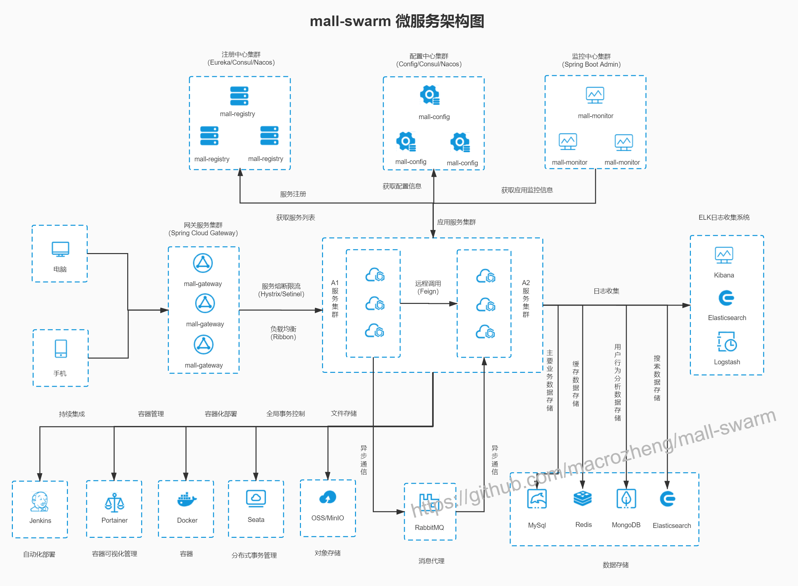

# mall

<p>
  <a href="#公众号"></a>
  <a href="https://github.com/macrozheng/mall-learning"></a>
  <a href="https://github.com/macrozheng/mall-swarm"></a>
  <a href="https://github.com/macrozheng/mall-admin-web"></a>
  <a href="http://qm.qq.com/cgi-bin/qm/qr?k=V6xu5c12j9qhnMUNdDRzakNxRKzOxibQ"></a>
  <a href="#公众号"></a>
  <a href="https://gitee.com/macrozheng/mall"></a>
</p>

## 前言

`mall`项目致力于打造一个完整的电商系统，采用现阶段流行技术实现。

## 项目文档

- 文档地址：[http://www.macrozheng.com](http://www.macrozheng.com)
- 备用地址：[https://macrozheng.github.io/mall-learning](https://macrozheng.github.io/mall-learning)

## 项目介绍

`mall`项目是一套电商系统，包括前台商城系统及后台管理系统，基于SpringBoot+MyBatis实现，采用Docker容器化部署。前台商城系统包含首页门户、商品推荐、商品搜索、商品展示、购物车、订单流程、会员中心、客户服务、帮助中心等模块。后台管理系统包含商品管理、订单管理、会员管理、促销管理、运营管理、内容管理、统计报表、财务管理、权限管理、设置等模块。

### 项目演示

#### 后台管理系统

前端项目`mall-admin-web`地址：https://github.com/macrozheng/mall-admin-web

项目演示地址： [http://www.macrozheng.com/admin/index.html](http://www.macrozheng.com/admin/index.html)  


#### 前台商城系统

前端项目`mall-app-web`地址：敬请期待......

项目演示地址：[http://www.macrozheng.com/app/index.html](http://www.macrozheng.com/app/index.html)


### 组织结构

``` lua
mall
├── mall-common -- 工具类及通用代码
├── mall-mbg -- MyBatisGenerator生成的数据库操作代码
├── mall-security -- SpringSecurity封装公用模块
├── mall-admin -- 后台商城管理系统接口
├── mall-search -- 基于Elasticsearch的商品搜索系统
├── mall-portal -- 前台商城系统接口
└── mall-demo -- 框架搭建时的测试代码
```

### 技术选型

#### 后端技术

| 技术                 | 说明                | 官网                                                 |
| -------------------- | ------------------- | ---------------------------------------------------- |
| SpringBoot           | 容器+MVC框架        | https://spring.io/projects/spring-boot               |
| SpringSecurity       | 认证和授权框架      | https://spring.io/projects/spring-security           |
| MyBatis              | ORM框架             | http://www.mybatis.org/mybatis-3/zh/index.html       |
| MyBatisGenerator     | 数据层代码生成      | http://www.mybatis.org/generator/index.html          |
| PageHelper           | MyBatis物理分页插件 | http://git.oschina.net/free/Mybatis_PageHelper       |
| Swagger-UI           | 文档生产工具        | https://github.com/swagger-api/swagger-ui            |
| Hibernator-Validator | 验证框架            | http://hibernate.org/validator                       |
| Elasticsearch        | 搜索引擎            | https://github.com/elastic/elasticsearch             |
| RabbitMq             | 消息队列            | https://www.rabbitmq.com/                            |
| Redis                | 分布式缓存          | https://redis.io/                                    |
| MongoDb              | NoSql数据库         | https://www.mongodb.com                              |
| Docker               | 应用容器引擎        | https://www.docker.com                               |
| Druid                | 数据库连接池        | https://github.com/alibaba/druid                     |
| OSS                  | 对象存储            | https://github.com/aliyun/aliyun-oss-java-sdk        |
| MinIO                | 对象存储            | https://github.com/minio/minio                       |
| JWT                  | JWT登录支持         | https://github.com/jwtk/jjwt                         |
| LogStash             | 日志收集工具        | https://github.com/logstash/logstash-logback-encoder |
| Lombok               | 简化对象封装工具    | https://github.com/rzwitserloot/lombok               |
| Jenkins              | 自动化部署工具      | https://github.com/jenkinsci/jenkins                 |

#### 前端技术

| 技术       | 说明                  | 官网                                   |
| ---------- | --------------------- | -------------------------------------- |
| Vue        | 前端框架              | https://vuejs.org/                     |
| Vue-router | 路由框架              | https://router.vuejs.org/              |
| Vuex       | 全局状态管理框架      | https://vuex.vuejs.org/                |
| Element    | 前端UI框架            | https://element.eleme.io               |
| Axios      | 前端HTTP框架          | https://github.com/axios/axios         |
| v-charts   | 基于Echarts的图表框架 | https://v-charts.js.org/               |
| Js-cookie  | cookie管理工具        | https://github.com/js-cookie/js-cookie |
| nprogress  | 进度条控件            | https://github.com/rstacruz/nprogress  |

#### 架构图

##### 系统架构图



##### 业务架构图


#### 模块介绍

##### 后台管理系统 `mall-admin`

- 商品管理：[功能结构图-商品.jpg](document/resource/mind_product.jpg)
- 订单管理：[功能结构图-订单.jpg](document/resource/mind_order.jpg)
- 促销管理：[功能结构图-促销.jpg](document/resource/mind_sale.jpg)
- 内容管理：[功能结构图-内容.jpg](document/resource/mind_content.jpg)
- 用户管理：[功能结构图-用户.jpg](document/resource/mind_member.jpg)

##### 前台商城系统 `mall-portal`

[功能结构图-前台.jpg](document/resource/mind_portal.jpg)

#### 开发进度


## 环境搭建

### 开发工具

| 工具          | 说明                | 官网                                            |
| ------------- | ------------------- | ----------------------------------------------- |
| IDEA          | 开发IDE             | https://www.jetbrains.com/idea/download         |
| RedisDesktop  | redis客户端连接工具 | https://redisdesktop.com/download               |
| Robomongo     | mongo客户端连接工具 | https://robomongo.org/download                  |
| SwitchHosts   | 本地host管理        | https://oldj.github.io/SwitchHosts/             |
| X-shell       | Linux远程连接工具   | http://www.netsarang.com/download/software.html |
| Navicat       | 数据库连接工具      | http://www.formysql.com/xiazai.html             |
| PowerDesigner | 数据库设计工具      | http://powerdesigner.de/                        |
| Axure         | 原型设计工具        | https://www.axure.com/                          |
| MindMaster    | 思维导图设计工具    | http://www.edrawsoft.cn/mindmaster              |
| ScreenToGif   | gif录制工具         | https://www.screentogif.com/                    |
| ProcessOn     | 流程图绘制工具      | https://www.processon.com/                      |
| PicPick       | 图片处理工具        | https://picpick.app/zh/                         |
| Snipaste      | 屏幕截图工具        | https://www.snipaste.com/                       |
| Postman       | API接口调试工具      | https://www.postman.com/                        |
| Typora        | Markdown编辑器      | https://typora.io/                              |

### 开发环境

| 工具          | 版本号 | 下载                                                         |
| ------------- | ------ | ------------------------------------------------------------ |
| JDK           | 1.8    | https://www.oracle.com/technetwork/java/javase/downloads/jdk8-downloads-2133151.html |
| Mysql         | 5.7    | https://www.mysql.com/                                       |
| Redis         | 3.2    | https://redis.io/download                                    |
| Elasticsearch | 6.2.2  | https://www.elastic.co/downloads                             |
| MongoDb       | 3.2    | https://www.mongodb.com/download-center                      |
| RabbitMq      | 3.7.14 | http://www.rabbitmq.com/download.html                        |
| Nginx         | 1.10   | http://nginx.org/en/download.html                            |

### 搭建步骤

> Windows环境部署

- Windows环境搭建请参考：[mall在Windows环境下的部署](http://www.macrozheng.com/#/deploy/mall_deploy_windows);
- 注意：只启动mall-admin,仅需安装mysql即可;
- 克隆`mall-admin-web`项目，并导入到IDEA中完成编译：[前端项目地址](https://github.com/macrozheng/mall-admin-web);
- `mall-admin-web`项目的安装及部署请参考：[mall前端项目的安装与部署](http://www.macrozheng.com/#/deploy/mall_deploy_web);
- ELK日志收集系统的搭建请参考：[SpringBoot应用整合ELK实现日志收集](http://www.macrozheng.com/#/technology/mall_tiny_elk);
- 使用MinIO存储文件请参考：[前后端分离项目，如何优雅实现文件存储](http://www.macrozheng.com/#/technology/minio_use);
- 读写分离解决方案请参考：[你还在代码里做读写分离么，试试这个中间件吧](http://www.macrozheng.com/#/reference/gaea)。

> Docker环境部署

- 使用虚拟机安装CentOS7.6请参考：[虚拟机安装及使用Linux，看这一篇就够了](http://www.macrozheng.com/#/reference/linux_install);
- Docker环境的安装请参考：[开发者必备Docker命令](http://www.macrozheng.com/#/reference/docker);
- 本项目Docker镜像构建请参考：[使用Maven插件为SpringBoot应用构建Docker镜像](http://www.macrozheng.com/#/reference/docker_maven);
- 本项目在Docker容器下的部署请参考：[mall在Linux环境下的部署（基于Docker容器）](http://www.macrozheng.com/#/deploy/mall_deploy_docker);
- 本项目使用Docker Compose请参考： [mall在Linux环境下的部署（基于Docker Compose）](http://www.macrozheng.com/#/deploy/mall_deploy_docker_compose);
- 本项目在Linux下的自动化部署请参考：[mall在Linux环境下的自动化部署（基于Jenkins）](http://www.macrozheng.com/#/deploy/mall_deploy_jenkins)。

## 公众号

mall项目全套学习教程连载中，关注公众号「**macrozheng**」第一时间获取。

加微信群交流，公众号后台回复「**加群**」即可。


## 许可证

[Apache License 2.0](https://github.com/macrozheng/mall/blob/master/LICENSE)

Copyright (c) 2018-2020 macrozheng
