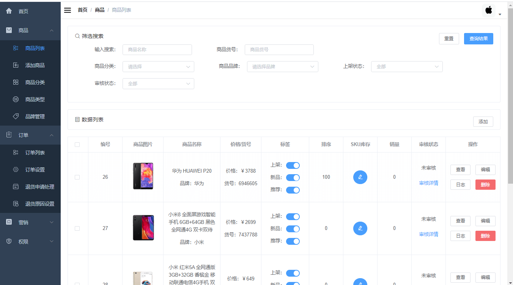
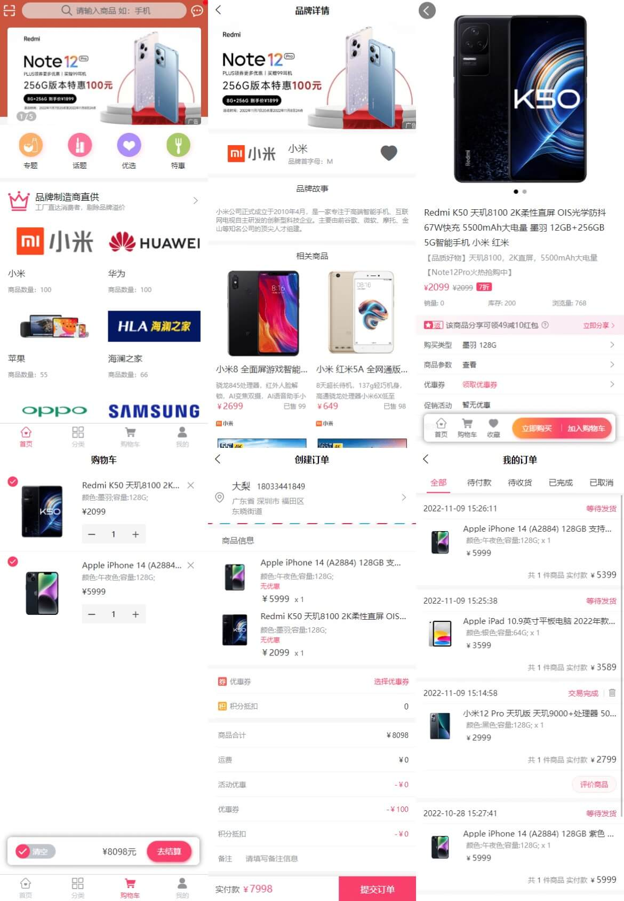
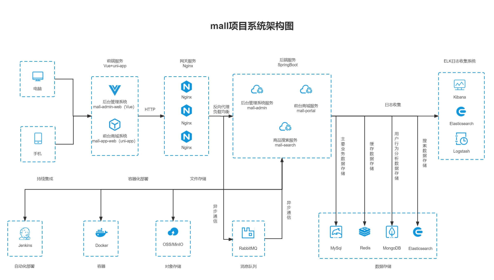
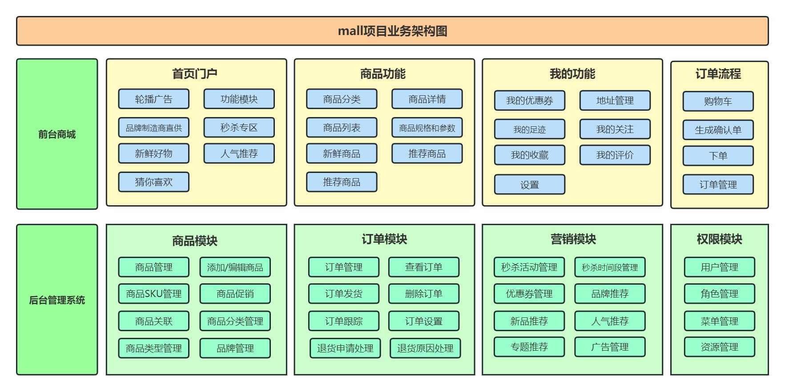

# mall

English | [中文](./README.md)

<p>
  <a href="#official-account"></a>
  <a href="#official-account"></a>
  <a href="https://github.com/macrozheng/mall-learning"></a>
  <a href="https://github.com/macrozheng/mall-swarm"></a>
  <a href="https://github.com/macrozheng/mall-admin-web"></a>
  <a href="https://github.com/macrozheng/mall-app-web"></a>
  <a href="https://gitee.com/macrozheng/mall"></a>
</p>

## Quick Links

> 1. **Quick Experience**: [Online Demo](https://www.macrozheng.com/admin/index.html)
> 2. **Complete Learning Tutorial**: [mall Learning Guide](https://www.macrozheng.com)
> 3. **Video Tutorial (Latest)**: [mall Video Tutorials](https://www.macrozheng.com/mall/foreword/mall_video.html)
> 4. **Microservices Version**: Spring Cloud Alibaba based project: [mall-swarm](https://github.com/macrozheng/mall-swarm)
> 5. **Branch Notes**: `master` branch uses Spring Boot 2.7 + JDK 8, `dev-v3` branch uses Spring Boot 3.2 + JDK 17

## Introduction

The `mall` project is dedicated to building a complete e-commerce system using mainstream technologies.

## Documentation

Documentation: [https://www.macrozheng.com](https://www.macrozheng.com)

## Project Overview

`mall` is a comprehensive e-commerce system including a frontend mall and backend management system, implemented with SpringBoot+MyBatis and deployed using Docker containers. The frontend mall includes home portal, product recommendations, product search, product display, shopping cart, order process, member center, customer service, and help center modules. The backend management system includes product management, order management, member management, promotion management, operations management, content management, statistical reports, financial management, permission management, and settings modules.

### Project Demo

#### Backend Management System

Frontend project `mall-admin-web`: https://github.com/macrozheng/mall-admin-web

Demo URL: [https://www.macrozheng.com/admin/index.html](https://www.macrozheng.com/admin/index.html)



#### Frontend Mall System

Frontend project `mall-app-web`: https://github.com/macrozheng/mall-app-web

Demo URL (Switch browser to mobile mode for better experience): [https://www.macrozheng.com/app/](https://www.macrozheng.com/app/)



### Project Structure

```lua
mall
├── mall-common -- Utility classes and common code
├── mall-mbg -- MyBatisGenerator generated database operation code
├── mall-security -- SpringSecurity common security module
├── mall-admin -- Backend mall management system API
├── mall-search -- Elasticsearch-based product search system
├── mall-portal -- Frontend mall system API
└── mall-demo -- Test code from framework setup
```

### Technology Stack

#### Backend Technologies

| Technology           | Description                      | Official Website                                |
| -------------------- | -------------------------------- | ----------------------------------------------- |
| SpringBoot           | Web application framework        | https://spring.io/projects/spring-boot          |
| SpringSecurity       | Authentication and authorization | https://spring.io/projects/spring-security      |
| MyBatis              | ORM framework                    | http://www.mybatis.org/mybatis-3/zh/index.html  |
| MyBatisGenerator     | Data layer code generator        | http://www.mybatis.org/generator/index.html     |
| Elasticsearch        | Search engine                    | https://github.com/elastic/elasticsearch        |
| RabbitMQ             | Message queue                    | https://www.rabbitmq.com/                       |
| Redis                | In-memory data store             | https://redis.io/                               |
| MongoDB              | NoSQL database                   | https://www.mongodb.com                         |
| LogStash             | Log collection tool              | https://github.com/elastic/logstash             |
| Kibana               | Log visualization tool           | https://github.com/elastic/kibana               |
| Nginx                | Static resource server           | https://www.nginx.com/                          |
| Docker               | Application container engine     | https://www.docker.com                          |
| Jenkins              | Automated deployment tool        | https://github.com/jenkinsci/jenkins            |
| Druid                | Database connection pool         | https://github.com/alibaba/druid                |
| OSS                  | Object storage                   | https://github.com/aliyun/aliyun-oss-java-sdk   |
| MinIO                | Object storage                   | https://github.com/minio/minio                  |
| JWT                  | JWT login support                | https://github.com/jwtk/jjwt                    |
| Lombok               | Java language enhancement        | https://github.com/rzwitserloot/lombok          |
| Hutool               | Java utility library             | https://github.com/looly/hutool                 |
| PageHelper           | MyBatis pagination plugin        | http://git.oschina.net/free/Mybatis_PageHelper  |
| Swagger-UI           | API documentation tool           | https://github.com/swagger-api/swagger-ui       |
| Hibernator-Validator | Validation framework             | http://hibernate.org/validator                  |

#### Frontend Technologies

| Technology | Description                    | Official Website                        |
| ---------- | ------------------------------ | --------------------------------------- |
| Vue        | Frontend framework             | https://vuejs.org/                      |
| Vue-router | Routing framework              | https://router.vuejs.org/               |
| Vuex       | Global state management        | https://vuex.vuejs.org/                 |
| Element    | Frontend UI framework          | https://element.eleme.io                |
| Axios      | Frontend HTTP framework        | https://github.com/axios/axios          |
| v-charts   | Echarts-based chart framework  | https://v-charts.js.org/                |
| Js-cookie  | Cookie management tool         | https://github.com/js-cookie/js-cookie  |
| nprogress  | Progress bar control           | https://github.com/rstacruz/nprogress   |

#### Mobile Technologies

| Technology   | Description              | Official Website                         |
| ------------ | ------------------------ | ---------------------------------------- |
| Vue          | Core frontend framework  | https://vuejs.org                        |
| Vuex         | Global state management  | https://vuex.vuejs.org                   |
| uni-app      | Mobile frontend framework| https://uniapp.dcloud.io                 |
| mix-mall     | E-commerce template      | https://ext.dcloud.net.cn/plugin?id=200  |
| luch-request | HTTP request framework   | https://github.com/lei-mu/luch-request   |

#### Architecture Diagrams

##### System Architecture



##### Business Architecture



#### Module Introduction

##### Backend Management System `mall-admin`

- Product Management: [Function Structure - Product](document/resource/mind_product.jpg)
- Order Management: [Function Structure - Order](document/resource/mind_order.jpg)
- Promotion Management: [Function Structure - Promotion](document/resource/mind_sale.jpg)
- Content Management: [Function Structure - Content](document/resource/mind_content.jpg)
- User Management: [Function Structure - User](document/resource/mind_member.jpg)

##### Frontend Mall System `mall-portal`

[Function Structure - Frontend](document/resource/mind_portal.jpg)

#### Development Progress


## Environment Setup

### Development Tools

| Tool          | Description                | Official Website                                          |
| ------------- | -------------------------- | --------------------------------------------------------- |
| IDEA          | Development IDE            | https://www.jetbrains.com/idea/download                   |
| RedisDesktop  | Redis client tool          | https://github.com/qishibo/AnotherRedisDesktopManager     |
| Robomongo     | MongoDB client tool        | https://robomongo.org/download                            |
| SwitchHosts   | Local host management      | https://oldj.github.io/SwitchHosts/                       |
| X-shell       | Linux remote connect tool  | http://www.netsarang.com/download/software.html           |
| Navicat       | Database connection tool   | http://www.formysql.com/xiazai.html                       |
| PowerDesigner | Database design tool       | http://powerdesigner.de/                                  |
| Axure         | Prototype design tool      | https://www.axure.com/                                    |
| MindMaster    | Mind mapping tool          | http://www.edrawsoft.cn/mindmaster                        |
| ScreenToGif   | GIF recording tool         | https://www.screentogif.com/                              |
| ProcessOn     | Flowchart tool             | https://www.processon.com/                                |
| PicPick       | Image processing tool      | https://picpick.app/zh/                                   |
| Snipaste      | Screenshot tool            | https://www.snipaste.com/                                 |
| Postman       | API debugging tool         | https://www.postman.com/                                  |
| Typora        | Markdown editor            | https://typora.io/                                        |

### Development Environment

| Tool          | Version | Download                                                                                              |
| ------------- | ------- | ----------------------------------------------------------------------------------------------------- |
| JDK           | 1.8     | https://www.oracle.com/technetwork/java/javase/downloads/jdk8-downloads-2133151.html                  |
| MySQL         | 5.7     | https://www.mysql.com/                                                                                |
| Redis         | 7.0     | https://redis.io/download                                                                             |
| MongoDB       | 5.0     | https://www.mongodb.com/download-center                                                               |
| RabbitMQ      | 3.10.5  | http://www.rabbitmq.com/download.html                                                                 |
| Nginx         | 1.22    | http://nginx.org/en/download.html                                                                     |
| Elasticsearch | 7.17.3  | https://www.elastic.co/downloads/elasticsearch                                                        |
| Logstash      | 7.17.3  | https://www.elastic.co/cn/downloads/logstash                                                          |
| Kibana        | 7.17.3  | https://www.elastic.co/cn/downloads/kibana                                                            |

### Setup Steps

> Windows Environment Deployment

- For Windows environment setup, refer to: [mall Backend Development Environment Setup](https://www.macrozheng.com/mall/start/mall_deploy_windows.html)
- Note: If only starting the `mall-admin` module, only MySQL and Redis need to be installed
- Clone the `mall-admin-web` project and import to IDEA to complete compilation: [Frontend Project](https://github.com/macrozheng/mall-admin-web)
- For `mall-admin-web` installation and deployment, refer to: [mall Frontend Environment Setup](https://www.macrozheng.com/mall/start/mall_deploy_web.html)

> Docker Environment Deployment

- For CentOS 7.6 installation using virtual machine, refer to: [Virtual Machine Installation and Linux Usage Guide](https://www.macrozheng.com/mall/deploy/linux_install.html)
- For Docker image building of this project, refer to: [Building Docker Images for SpringBoot Using Maven Plugin](https://www.macrozheng.com/project/maven_docker_fabric8.html)
- For Docker container deployment of this project, refer to: [mall Deployment on Linux (Docker Based)](https://www.macrozheng.com/mall/deploy/mall_deploy_docker.html)
- For Docker Compose usage, refer to: [mall Deployment on Linux (Docker Compose Based)](https://www.macrozheng.com/mall/deploy/mall_deploy_docker_compose.html)
- For automated deployment on Linux, refer to: [mall Automated Deployment on Linux (Jenkins Based)](https://www.macrozheng.com/mall/deploy/mall_deploy_jenkins.html)

## Official Account

Join WeChat group for discussions. Follow the official account「**macrozheng**」and reply「**加群**」(Join Group).


## License

[Apache License 2.0](https://github.com/macrozheng/mall/blob/master/LICENSE)

Copyright (c) 2018-2025 macrozheng
